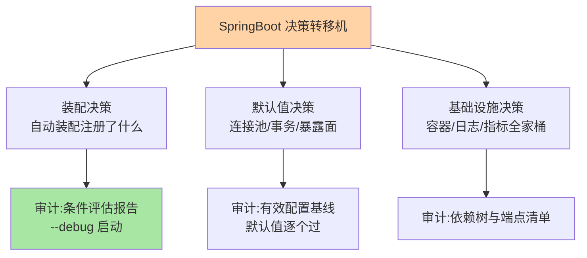
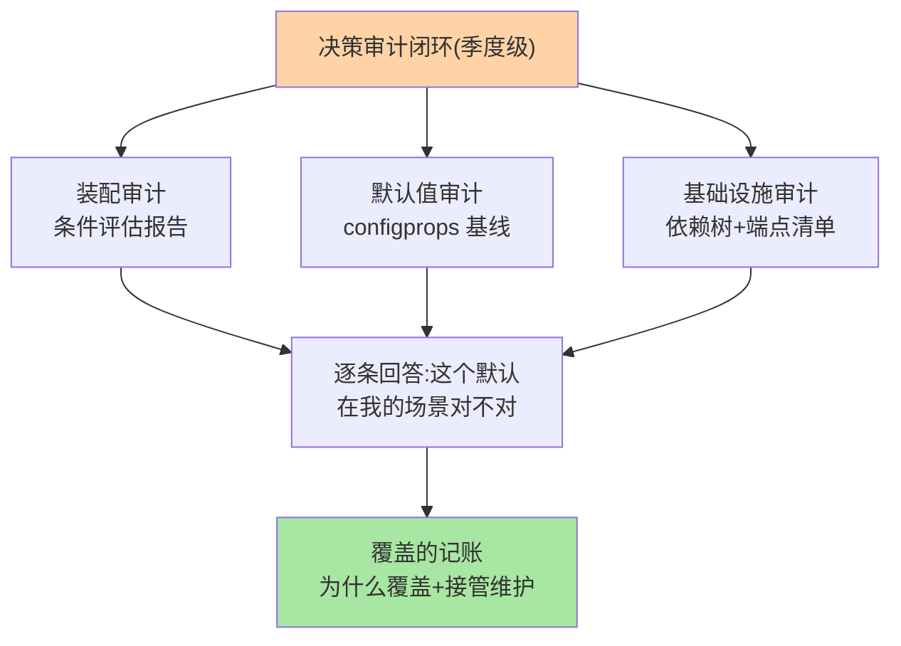
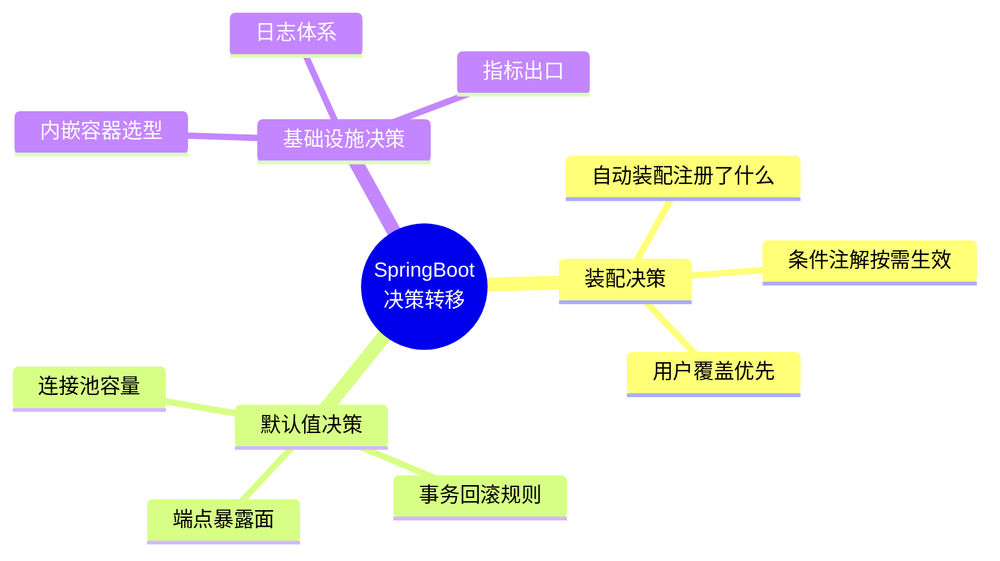
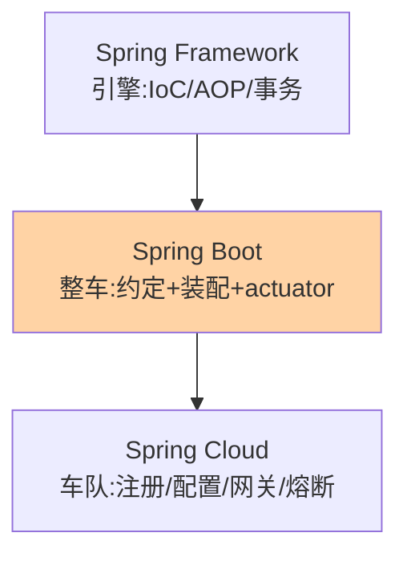
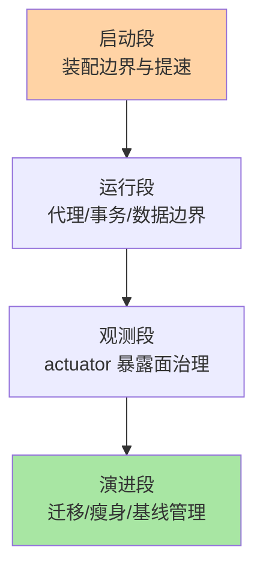
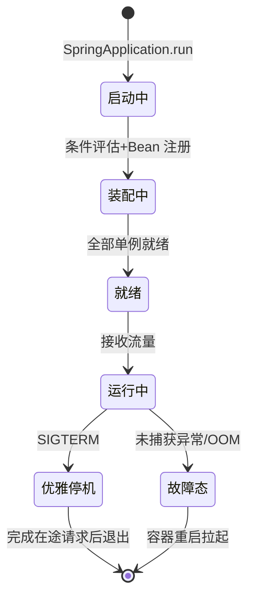

# SpringBoot 整合层本质：它是一台决策转移机，生产化就是决策审计

> 入门层给了用法、特性层给了机制、专题层给了实战——但三层都没回答一个只有把它们拼起来才能看见的问题：**自从你引入 SpringBoot，有多少技术决策不再由你做了？** 这篇就是回答这个问题的：SpringBoot 的本质是一台**决策转移机**，生产化的本质是对这批被转移的决策做**系统性审计**。

## 一句话摘要

SpringBoot 把三类技术决策从开发者转移到框架：**装配决策**（自动装配替你注册了哪些 Bean）、**默认值决策**（连接池 10 个、受检异常不回滚、actuator 暴露面——每个默认都是框架替你做的选择）、**基础设施决策**（内嵌容器/日志体系/指标出口——替你选好了全家桶）。生产事故的相当一部分，根因不是「你做错了决定」，而是「**你不知道框架替你做了决定，而那个决定在你的场景下是错的**」。生产化 = 对三类被转移决策做系统性审计：条件评估报告查装配、有效配置基线查默认值、依赖树查基础设施——审计后逐个回答「这个默认在我的场景下对不对」。

## 🎯 本文核心

**核心一句话：SpringBoot 用「决策转移」换开发效率，生产化的本质是「决策审计」——三类被转移的决策（装配/默认值/基础设施）各有审计手段（条件评估报告/有效配置基线/依赖树），每个被审计出的「错误默认」都要付覆盖代价（接管后续维护），覆盖与不覆盖都是显式决策——没有第三种「不管它」的正确形态。**

机制链：决策转移（三类）→ 盲区如何变成事故（三个案例）→ 审计手段（三把尺）→ 覆盖的代价记账 → 版本演进中的决策漂移。全文一句话可重构：「SpringBoot 先借走你的决定，生产化是把它连本带利要回来」。

## 前置阅读

- 特性层：深入理解 IoC 容器（装配机制）、自动装配与启动流程（条件装配源码）
- 专题层：数据与事务深度（默认值语义案例）、生产排障深度（盲区故障形态）

## 一、三次盲区事故：三类被转移决策的失效形态

**事故一（装配盲区）**：某服务引入了一个第三方 starter，没人读过它的自动装配类——它悄悄注册了一个全局异常处理器，**吞掉了团队自己定义的异常处理**（@ConditionalOnMissingBean 没生效，因为加载顺序）。线上错误页面形态变了三天才发现。**盲区类别：不知道框架注册了什么**。

**事故二（默认值盲区）**：大促压测接口大量超时。排查两小时发现 Hikari 连接池 `maximumPoolSize` 用的是默认值 **10**——日常流量够用，大促峰值连接排队。「默认值能跑」的惯性让没人打开过配置文档。**盲区类别：不知道默认值是多少、为什么是这个数**。

**事故三（语义盲区）**：资金操作的 Service 抛受检异常，**事务提交了**——团队以为「抛异常 = 回滚」。这是默认值决策里最隐蔽的一类：**默认值的语义**（回滚规则）不审计，账本平不了（特性层事务篇的完整机制在此收束）。

三次事故的共同结构：**决策被转移 → 转移过程无人告知 → 场景不适配 → 事故**。审计的意义就是把「无人告知」变成「有账可查」。



## 二、三类决策的审计手段（照做能跑）

**审计一：装配决策——条件评估报告**。启动加 `--debug`，SpringBoot 输出 CONDITIONS EVALUATION REPORT：每个自动装配类「匹配了/没匹配」及原因。**验证动作**：上线前跑一次，核对「有没有不认识的装配生效」「自己定义的 Bean 有没有被覆盖预期外的」——事故一的解药就是这份报告。

**审计二：默认值决策——有效配置基线**。`/actuator/configprops`（或启动时打印有效配置）列出全部生效配置——审计三问逐个过：**连接池多大？超时多少？暴露了哪些端点？事务回滚规则是什么？** 每个答案标注「默认 or 我们改的 + 为什么」——这份基线同时是升级迁移的对照物（升级后 diff 一遍，决策漂移立现）。

**审计三：基础设施决策——依赖树与端点清单**。`mvn dependency:tree` 看全家桶引了什么（传递依赖常带惊喜）；`/actuator` 端点列表确认暴露面（heapdump/env 类端点生产关闭，管理端口独立网段）——当时某团队 actuator 全开且公网可达，heapdump 被拖走带出数据源密码，复盘把「端点白名单 + 管理口隔离」写进上线检查单。

## 三、覆盖的代价：每个 override 都是接管

审计发现错误默认后要覆盖（自定义 Bean / 显式配置），**覆盖的隐藏代价要记账**：框架升级时你的覆盖可能失效（内部 API 变化）、文档不再完全适用（你偏离了被测路径）、团队新人要额外学习「我们和默认不一样的地方」。**覆盖的纪律**：每个覆盖写一行「为什么覆盖 + 引入了什么风险」——没有这句话的覆盖，半年后没人知道它是深思熟虑还是历史遗留。

## 四、质疑者追问链：决策转移的边界三层

**质疑**：自动装配「悄悄」做了这么多决定，这设计合理吗？出了问题算谁的？

**追问一层：为什么自动装配是条件化的，而不是全量注册让用户手动关？** 条件注解（@ConditionalOnClass/@ConditionalOnMissingBean）把「关闭」变成「不出现」——全量注册的世界里每个 starter 都是一堆必须手动关的开关；条件化让「不需要的能力」根本不出现（设计思想：**用条件计算替代人工开关**——约定优于配置的机制落点）。

**再追问：用户覆盖为什么能优先于自动装配？** 装配次序的设计——用户 @Bean 先处理，@ConditionalOnMissingBean 看到已存在即让位——**「用户意图 > 约定默认」的优先级写进了装配次序**。排障抓手：怀疑装配没生效，先查「自己的定义是否意外破坏了条件」。

**再深一层：谁为盲区负责——框架文档还是使用者审计？** 边界契约：框架负责「可审计」（提供报告/端点/文档），使用者负责「去审计」——**审计责任在使用者**，这不是框架甩锅，而是「只有你的场景能判定默认对不对」。事故一里的 starter 没有义务知道你的异常处理器存在；你有义务跑一次条件报告。



量级分档下的决策重心迁移：**10 万 QPS 单体**——审计重点在数据源/事务默认值（连接池容量与事务语义是主要矛盾）；**百万到千万级微服务集群**——装配与基础设施决策的权重上升（starter 纪律/端点治理/多服务一致性）；**亿级归档与跨域**——演进决策主导（jakarta/AOT/多活），运行期默认值的审计退居次位。同一套审计框架，不同量级下各段的权重不同。

## 五、横向对比：三个生态位与一个反方案

| 维度 | Spring Framework | Spring Boot | Spring Cloud |
|---|---|---|---|
| 回答的问题 | 对象怎么组织（IoC/AOP） | 应用怎么生产就绪 | 服务间怎么协作 |
| 转移的决策量 | 中（装配模式） | **大（装配+默认+全家桶）** | 大（分布式组件选型） |
| 决策审计工具 | 容器报告 | actuator + 条件报告 | 组件自身监控 |

**反方案：自研脚手架替代 SpringBoot**——自研 = 决策不转移（全部自己做），换完全可控；代价是把 Boot 已解决的「装配正确性/默认值合理性」重新解决一遍。**决策判据**：除非有平台化诉求（多团队统一技术底座），自研脚手架是负优化——Boot 的决策转移质量经过海量生产验证，接管它之前先接管它的测试成本。

## 步骤级操作：一次决策审计的完整规程（前置/命令/验证/回退）

**前置条件**：服务可本地/预发启动；actuator 已接入；决策基线表已建（首次审计时为空表，边审边建）。

```text
Step 1 装配审计
      命令: java -jar app.jar --debug > startup.log
      验证: CONDITIONS EVALUATION REPORT 逐条核对——有没有不认识的自动装配生效
Step 2 默认值审计
      命令: 访问 /actuator/configprops 导出有效配置
      验证: 连接池容量/超时/事务回滚规则/端点暴露面——逐条标注「默认 or 已改 + 为什么」
Step 3 基础设施审计
      命令: mvn dependency:tree
      验证: 全家桶清单与预期一致,无传递依赖惊喜
Step 4 覆盖与记账
      操作: 对「错误默认」逐个覆盖,每个覆盖在决策基线表记「偏离点+原因+版本」
回退: 配置级覆盖改回默认值重启即回退;代码级覆盖走 git revert
```

## 决策转移全景：三类被转移决策的思维导图



## 三层能力栈：框架/整车/车队调度



## 四段生产化决策：每段一个取舍



## 服务生命周期状态图：Boot 应用的运行时形态



生产化的启动段对应「启动中→装配中→就绪」三个状态；运行段的「故障态」由 Actuator health 探针暴露；优雅停机的「等待在途请求完成」是 graceful shutdown 的核心语义——状态图就是生产化四段的状态投影。

## 六、跨周期视角：决策转移在深化

- **jakarta 迁移（Boot 3）**：javax → jakarta 包名大迁徙——转移的决策本身随版本漂移（依赖矩阵兼容性是迁移的真实成本，越晚迁依赖债越大）
- **AOT/原生镜像**：运行时条件计算被构建期预计算取代——「决策转移」从运行时演进到构建期（反射点显式注册），审计工具随之从运行时指标转向构建期报告
- **虚拟线程**（JDK 21）：线程稀缺时代的默认假设（池容量/ThreadLocal 绑定）被重写——Boot 的并发相关默认值在版本演进中持续更新，**「默认值审计」从此是版本级动作而不是一次性动作**

## 七、demo 验证点（照做能跑）

1. **条件评估报告**：启动加 `--debug` → 日志出现 CONDITIONS EVALUATION REPORT，核对「匹配/未匹配」清单——常见报错：报告太长找不到目标，用 `grep` 过滤自己的 starter 名
2. **有效配置基线**：访问 `/actuator/configprops`（需暴露该端点），导出后与人工维护的「决策基线表」diff——差异即决策漂移
3. **覆盖生效验证**：自定义 Bean 覆盖 starter 默认后，启动日志确认「你的 Bean 被使用」而非双 Bean 冲突（常见报错：`The bean 'xxx' could not be registered`——同名校验拦截，说明覆盖姿势不对）

## 八、你们可能会问

**Q1：决策审计做一次够吗？**
不够——每次升 Boot 版本、每加一个 starter、每个大促前都该重跑审计：决策转移是持续的（新版本带新默认），审计是版本级动作不是一次性动作。

**Q2：审计发现「不知道的决策」但没有事故，要不要处理？**
要——「不知道的决策」就是下一个事故的候选：要么补文档（登记为已知默认），要么覆盖（显式决策），要么加监控（观测它的行为）——三个动作必选其一，禁止「知道了但不动」。

**Q3：能不能要求框架「不要替我做决定」？**
能但要付代价：全部显式配置 = 回到裸 Spring 时代（装配成本自己扛）——Boot 的价值主张就是替你做「大概率正确」的决定。生产化的真话是：**审计比拒绝更划算**。

## 九、自测三问

1. 三类被转移的决策是什么？各配什么审计手段？
2. 「覆盖的代价」指什么？为什么每个覆盖要写「为什么覆盖」？
3. 「谁为盲区负责」的边界契约是什么？为什么说审计责任在使用者？

## 开放问题

- AI 辅助配置审计（自动读条件报告、比对新版本决策漂移、生成覆盖建议）在云产品中萌芽——「审计」这个动作本身可能被工具接管，人的角色收敛到「业务适配性判断」
- 决策转移的**可解释性**：框架能否为每个默认值输出「设计动机链接」，让审计从「数值比对」升级为「语义比对」——这是框架文档工程的长期方向

## 🎯 核心带走

- **核心一句话**：SpringBoot = 决策转移机，生产化 = 决策审计——三类被转移决策（装配/默认值/基础设施）用三把尺（条件报告/配置基线/依赖树）逐个过，每个覆盖写「为什么」，审计是版本级动作
- **机制链**：三类转移 → 盲区事故结构 → 三把审计尺 → 覆盖记账 → 版本级重审
- **失效点/边界**：starter 盲引、默认值无基线、覆盖无记录、升级无 diff——四个「知道了但没动」的形态
- **整合收束**：L1 语言地基 → L2 容器与代理机制 → L3 工程实战 → L4 决策审计——四层是一条「从语法到生产」的完整链路，跨层排障按问题归属选层

## 💡 实战提示

- 💡 新服务上线检查单把「默认值过一遍」固化：连接池/事务/actuator/日志/线程池——每个默认值问一句「在保护什么、我的场景对不对」。
- 💡 starter 引入前跑 `--debug` 看条件评估——知道谁配了什么，才谈得上覆盖与排障。
- 💡 升级用基线管理：有效配置 + 核心接口基线留存，升级前后 diff——回归风险数据化。
- 💡 团队维护「决策基线表」：每个偏离默认的配置一行「偏离点 + 原因 + 引入版本」——这张表就是团队的架构记忆。

## 📌 数据与事实声明

- 写于 2026-09-11；SpringBoot 3.x 特性（条件评估报告/actuator/configprops/graceful shutdown）以 Spring 官方文档与 release notes 公开口径为准；Hikari 默认 maximumPoolSize=10 为 HikariCP 公开默认配置
- 事故叙事为业内高频升级/安全事件的匿名化模式复述，非特定公司事件
- 免责：版本节奏与迁移路径以官方发布说明为准

## 📚 参考资料

| 类型 | 标题 | 来源 |
|---|---|---|
| 官方文档 | Spring Boot Reference（Auto-configuration / Actuator / Externalized Configuration） | docs.spring.io/spring-boot |
| 官方博客 | Spring Boot 3 迁移指南（jakarta/AOT） | github.com/spring-projects/spring-boot/wiki |
| 关联系列 | 特性层四系列 / 专题层三系列 | 本仓库同目录 |
| 系列导航 | SpringBoot 系列目录 | `docs/backend/java/ecosystem/spring-boot/index.md` |
