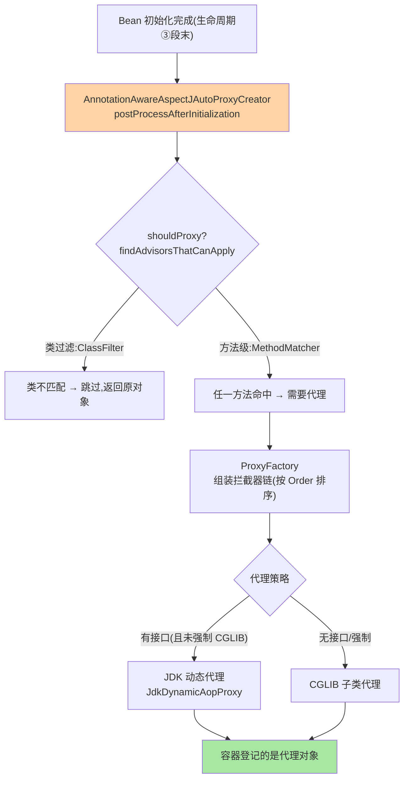

# 代理创建与切点匹配源码：从注解切面到代理对象

> @Aspect 一标、@Around 一写，方法就被拦截了——中间发生了什么？这条链路是「**自动代理创建器在生命周期尾段扫描每个 Bean → 切点匹配 → 选中代理策略 → 织入拦截器链**」。这篇以 Framework 7.0 源码走读这条链，把「为什么自调用不生效」这类经典问题钉在机制层。

> **本文核心**：AOP 落地三件——**AnnotationAwareAspectJAutoProxyCreator**（自动代理创建器，本质是 BeanPostProcessor，挂在生命周期③段末尾）、**切点匹配**（Pointcut 表达式求值：ClassFilter + MethodMatcher 两级过滤）、**代理策略**（JDK 动态代理 vs CGLIB：有接口且未强制 CGLIB 用 JDK，否则 CGLIB；Boot 默认 proxyTargetClass=true 即 CGLIB 优先）。**机制链**：Bean 初始化完成 → postProcessAfterInitialization → shouldSkip/可以代理判定 → 切点匹配（AspectJ 表达式解析缓存）→ ProxyFactory 创建代理（JdkDynamicAopProxy / ObjenesisCglibAopProxy）→ 拦截器链（Advice 链）织入 → 容器拿到的是代理。

## 一句话摘要

AOP 的运行时本质是「**给匹配的 Bean 换一个代理对象**」：容器 refresh 尾段（doCreateBean ③ 的 BPP 后置，互指 IoC 篇 2），自动代理创建器对**每个刚完成初始化的 Bean** 问一句「有切面匹配它吗」——匹配则用 ProxyFactory 造代理替换原始对象放进容器。两个工程高价值机制点：**切点匹配的两级过滤**（类过滤先行——类都不匹配直接跳过，方法匹配才有机会执行，性能分层的典型设计）；**拦截器链的组装**（多个切面命中同一方法时按 Order 排成链，环绕通知的嵌套结构在此时定型）。**自调用失效的机制根源**：代理只拦截「外部经代理的调用」——`this.doSomething()` 走的是原始对象内部调用（不经代理），拦截器链根本没机会执行——这是代理模式的固有边界，不是 Spring 的 Bug。

## 一、边界：入门层讲过什么，本文讲什么

| 内容 | 入门层（篇 7） | 本文 |
|---|---|---|
| 切面/切点/通知的概念与 @Around 用法 | ✅ 讲过 | 不重复 |
| 自动代理创建器与挂载时机 | 未讲 | **本文核心一** |
| 切点匹配与拦截器链组装源码 | 未讲 | **本文核心二** |
| JDK/CGLIB 决策与自调用失效机制 | 提了一句 | **本文核心三** |

## 二、代理创建链路全景



**Boot 的默认口径**：`spring.aop.proxy-target-class=true`（Boot 2.x 起默认）——**默认 CGLIB**（即使有接口也代理子类）——原因：只代理接口会导致「注入具体类型失败」（JDK 代理只实现接口、不是子类实例）——默认值的选择史是「行为可预期压倒理论优雅」的工程案例。

拦截器链的嵌套执行模型：


## 三、切点匹配与拦截器链：两个深钻点

**切点匹配的性能分层**：`execution(* com.x.service.*.*(..))` 的求值先过 ClassFilter（包名模式对类名，快）再过 MethodMatcher（逐方法）；静态切点（不随运行时变）结果可缓存——AspectJExpressionPointcut 的匹配结果缓存在 advisedBeans 映射——**「每个 Bean 创建时匹配一次，不是每次调用匹配」**（调用量级无匹配开销，AOP 运行时成本在链执行不在匹配）。

**拦截器链的组装**：一条 MethodInterceptor 链（@Around → MethodInterceptor、@Before → 前置位、@After → 后置位），多切面按 @Order 排序（数值小先执行、环绕外层）；调用时代理把链包成 `ReflectiveMethodInvocation.proceed()` 的递归结构——**环绕通知的「嵌套语义」在链组装时定型**（@Order 决定谁包谁）。执行时序：`代理方法入口 → 链[0].invoke → … proceed() → 目标方法 → 逐层返回`——理解 proceed 的递归模型是写出正确环绕通知的前提。

## 四、源码关键路径（Framework 7.0 口径）

```text
AbstractAutoProxyCreator.postProcessAfterInitialization()
 └─ wrapIfNecessary(bean, name, cacheKey)
     ├─ findEligibleAdvisors(beanClass, name)
     │   ├─ findCandidateAdvisors()        // @Aspect 类解析为 Advisor(BeanFactoryAspectJAdvisorsBuilder,带缓存)
     │   ├─ findAdvisorsThatCanApply()      // AopUtils.canApply → ClassFilter/MethodMatcher 两级
     │   └─ sort + ExtendAdvisors           // @Order 排序 + ExposeInvocationInterceptor 头部
     └─ createProxy(beanClass, advisors)
         └─ ProxyFactory.getProxy(classLoader)
             ├─ JDK: JdkDynamicAopProxy(实现 InvocationHandler)
             └─ CGLIB: ObjenesisCglibAopProxy(DynamicAdvisedInterceptor 回调)
调用期:
JdkDynamicAopProxy.invoke()
 └─ ReflectiveMethodInvocation(method, chain).proceed()   // 递归走链
```

## 五、典型场景

- **自调用不生效**：`methodA()` 内调 `this.methodB()`，B 上的 @Around 不执行——机制如上；解法：注入自身代理（@Lazy 自注入）/ AopContext.currentProxy()（开 exposeProxy）/ 把方法拆到另一个 Bean（正解）
- **@Transactional 与自定义切面的顺序**：两者都是拦截器链上的节点（事务也是 Advisor），@Order 决定嵌套序——「事务在日志切面内还是外」影响事务内日志的可见性，排障时看两边 @Order
- **代理对象的类型判断**：`instanceof 具体类` 在 CGLIB 下 true、JDK 下 false——反射/类型工具统一走 `AopUtils.getTargetClass()` / `AopProxyUtils.ultimateTargetClass`

## 业内惯例

- **环绕通知必须保证 proceed() 被调用**（除非刻意阻断）——忘了调 proceed 是切面事故第一名（业务方法静默不执行）
- **切面命名带序号语义**（@Order(1) 日志最外层、事务次之……）——链序是隐式契约，团队统一顺序模板（日志 > 事务 > 业务切面）写进规范
- **切点表达式用注解锚点**（@annotation(com.x.Log)）优于 execution 包路径——重构挪包不破切面，匹配语义更稳
- **3.x/4.x 视角**：AOP 机制跨版本高度稳定（7.0 延续 CGLIB 与 JDK 双轨 + 默认 CGLIB）；演进看点是 GraalVM native 下动态代理的限制（CGLIB 子类生成受限 → AOT 期织入的形态变化）

## 六、常见误区

- **「AOP 拦截所有调用」**：只拦截「经代理的外部调用」——自调用、final 方法（CGLIB 无法覆写）、static 方法都不经代理——**代理边界 = AOP 边界**
- **以为切点匹配发生在每次调用**：匹配在 Bean 创建时一次（缓存）——「切面拖慢调用」的担忧对象错了，运行时成本是链执行（每层通知的逻辑本身）
- **@Around 里改参数/改返回值的透明性**：改了返回值类型与声明不符 → ClassCastException 在调用方爆炸——切面的修改要对调用方透明（类型契约不破）
- **在切面里做重业务逻辑**：切面横切在所有匹配方法上——重逻辑（远程调用/大批量计算）进切面等于给整条链路加固定开销，横切逻辑保持「轻」

## 七、与相邻机制的关系

- 本系列篇 2《@Transactional 事务代理源码》：事务是「AOP 的第一应用」——拦截器链上的具体节点在那篇拆
- 《深入理解IoC容器》系列篇 2：代理生成挂在 doCreateBean ③ 段（本篇是挂载点的内部展开）
- tips 互指：入门层篇 7 的使用层；异步 @Async 的代理失效与自调用同根因（互指入门层篇 19）

## 你们可能会问

**Q1：JDK 动态代理和 CGLIB 怎么选？**
Boot 默认 CGLIB（可预期性）；显式需要 JDK 代理（代理只需要接口能力、目标类 final 无法子类化）设 proxyTargetClass=false——决策轴是「需要具体类型语义吗」，不是性能（两者量级差异已不显著）。

**Q2：一个 Bean 被多个切面命中，代理只有一个吗？**
一个代理、一条链——多切面合并进同一拦截器链（按 Order）——不会「代理套代理」（Spring 的合并设计）；「套娃代理」是多重代理机制误用（如自己再 ProxyFactory 包一层）的产物。

**Q3：@Aspect 注解的类本身是 Bean 吗？**
是——@Aspect 类需要被容器管理（@Component 或自动装配注册），切面解析器从容器里找 Advisor Bean——「切面没生效」排查第一步：切面类注册了吗（互指 IoC 篇 1 的图纸来源）。

## 八、自测三问

1. 自动代理创建器挂在生命周期哪一段？对每个 Bean 做什么判定？
2. 切点匹配的两级过滤与缓存时机？运行时成本在哪？
3. 自调用失效的机制根源与三种解法？

## 开放问题

- Instrumentation 织入（Agent 形态，绕过代理限制拦截自调用/final）与 Spring 代理模型的边界——代理 AOP 的「调用边界」在未来是否被字节码增强补齐，是 AOP 形态的潜在变数。
- Native image 下 CGLIB 受限迫使 AOT 织入，「运行时动态代理 vs 构建期静态织入」的双轨权衡与启动/AOT 系列同源。

## 📎 核心带走

- **核心一句话**：AOP = 生命周期尾段的代理替换（BPP 后置）+ 两级切点匹配（类过滤先行、结果缓存）+ 拦截器链（Order 定嵌套）——代理边界 = AOP 边界
- **机制链**：Bean 初始化完成 → 自动代理创建器 → Advisor 匹配（类/方法两级）→ ProxyFactory 组链 → JDK/CGLIB 代理替换入容器 → 调用走 proceed 递归链
- **失效点/边界**：自调用/final/static 不经代理；proceed 忘调则业务静默；链序是隐式契约要规范

## 💡 实战提示

- 💡 切面没生效排查三连：切面类注册了吗 → 切点表达式对吗（debug canApply）→ 是不是自调用
- 💡 团队统一切面顺序模板（日志最外/事务其次）并写进 wiki——链序事故的预防针
- 💡 决策口径：横切逻辑轻重——轻逻辑（日志/计时/埋点）进切面，重逻辑（校验调用外部）进显式服务
- 💡 代理模式与调用方的取舍：代理拦截带来透明增强也带来边界（自调用/final）——理解边界后「拆方法」常优于「绕代理」

## 📌 数据与事实声明

- 写于 2026-09-10，源码主线 Spring Framework 7.0.9（gh 实测）；AOP 机制跨 3.x/4.x 稳定，Boot 默认 CGLIB 口径自 2.x 延续
- 免责：源码细节以 GitHub 当前主线为准

## 📚 参考资料

| 类型 | 标题 | 来源 |
|---|---|---|
| 官方源码 | spring-framework（AbstractAutoProxyCreator / JdkDynamicAopProxy / CglibAopProxy） | github.com/spring-projects/spring-framework |
| 官方文档 | Spring Framework Docs（Core → AOP） | docs.spring.io |
| 关联系列 | 本系列篇 2 / IoC 容器系列篇 2 | 本目录 |
