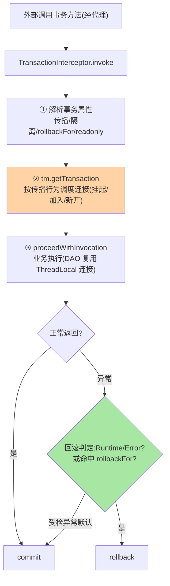
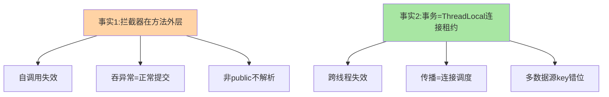

# @Transactional 事务代理源码：拦截器、传播行为与回滚判定

> @Transactional 是 AOP 的第一应用：**事务拦截器截住方法 → 按「传播行为 + 隔离级别」获取连接开事务 → 放行业务 → 按异常判定提交或回滚**。这篇拆事务代理的完整机制，把「事务失效八大场景」从背诵清单还原成可推演的源码事实。

> **本文核心**：TransactionInterceptor 的四步——**① 解析属性**（AnnotationTransactionAttributeSource：传播/隔离/回滚规则/超时/只读）→ **② 开事务**（PlatformTransactionManager.getTransaction：按传播行为决定「新开/加入/挂起当前」）→ **③ 放行业务**（invocation.proceedWithInvocation）→ **④ 判定收尾**（completeTransactionAfterThrowing：RuntimeException/Error 回滚、受检异常默认提交，rollbackFor 可改）。**机制链**：代理调用 → 拦截器 → 事务管理器（连接与 DataSource 绑定在 ThreadLocal 的 TransactionSynchronizationManager）→ 业务 → 提交/回滚。

## 一句话摘要

事务机制的两个地基：**连接的 ThreadLocal 绑定**（TransactionSynchronizationManager 把「当前线程的活动连接」存 ThreadLocal——同一事务内的多次 DAO 调用复用同一连接，这是「同一事务」的物理实现；也是「跨线程事务失效」的机制根源）；**传播行为的实现位置**（在 getTransaction 的入口分支——REQUIRED 当前有事务就加入、REQUIRES_NEW 挂起当前并新开、NESTED 用保存点——传播行为不是数据库概念，是 **Spring 拦截器层的连接调度策略**）。**回滚判定的默认语义**：`RuntimeException` 与 `Error` 回滚、受检异常提交（EJB 时代的历史约定）——rollbackFor 显式覆盖。两大地基在手，失效场景全部可推演。

## 一、边界：入门层讲过什么，本文讲什么

| 内容 | 入门层（篇 14） | 本文 |
|---|---|---|
| @Transactional 用法与传播行为表 | ✅ 讲过 | 不重复 |
| 事务失效现象清单 | 提了高频几条 | **本文核心一**（源码级还原） |
| 拦截器四步与 ThreadLocal 绑定 | 未讲 | **本文核心二** |
| 传播行为的实现机制 | 未讲 | **本文核心三** |

## 二、事务拦截器四步全景



**连接绑定深挖**：开事务时 DataSource→Connection 映射存入 ThreadLocal（TransactionSynchronizationManager.bindResource）——方法内所有 MyBatis/JdbcTemplate 操作从 ThreadLocal 取**同一连接**（这是「一个事务」的物理载体）；事务结束解绑。**三个直接推论**：① 子线程/线程池里的 DAO 拿不到绑定连接（跨线程事务不共享，各自独立事务）；② 挂起（REQUIRES_NEW）= 暂存当前绑定再绑新的（两套连接并存）；③ 事务上下文是「连接的租约管理」，ConnectionHolder 的引用计数决定嵌套方法的真实行为。

两个机制事实的失效覆盖图：



## 三、传播行为的实现：连接调度策略

| 传播行为 | getTransaction 的分支行为 | 连接语义 |
|---|---|---|
| REQUIRED（默认） | 有事务加入，无则新开 | 复用 ThreadLocal 连接 |
| REQUIRES_NEW | 挂起当前，新开连接 | 新连接独立提交/回滚 |
| NESTED | 当前事务内建保存点 | 同连接 + savepoint 局部回滚 |
| SUPPORTS/MANDATORY/NEVER | 不主动开，按「有无事务」校验 | 语义约束型 |
| NOT_SUPPORTED | 挂起当前，无事务执行 | 业务裸跑 |

**推演示例**：方法 A（REQUIRED）调方法 B（REQUIRES_NEW）——B 挂起 A 的连接、开新连接：B 回滚不影响 A、A 回滚不影响已提交的 B（「独立事务」的物理来源）；若 B 是 NESTED——同连接建保存点：B 回滚到保存点、A 可继续（同连接的局部回滚）。**传播行为的一切行为差异都是连接调度的差异**——记行为不如记连接模型。

## 四、源码关键路径（Framework 7.0 口径）

```text
TransactionInterceptor.invoke()
 └─ TransactionAspectSupport.invokeWithinTransaction()
     ├─ createTransactionIfNecessary()
     │   └─ AnnotationTransactionAttributeSource.getTransactionAttribute  // @Transactional 解析(带缓存)
     │   └─ PlatformTransactionManager.getTransaction(tpb)               // 传播分支(见上表)
     │       └─ DataSourceTransactionManager.doBegin()
     │           └─ TransactionSynchronizationManager.bindResource(dataSource, connHolder)  // ThreadLocal
     ├─ invocation.proceedWithInvocation()                               // ③ 业务
     ├─ commitTransactionAfterReturning(txInfo)                          // 正常 → commit
     └─ completeTransactionAfterThrowing(txInfo, ex)
         └─ rollbackOn(ex)   // DefaultTransactionAttribute: RuntimeException|Error → true
                            // 受检异常 → false(提交!)  rollbackFor 覆盖判定
自动装配侧: TransactionAutoConfiguration(imports 候选,互指装配系列篇2)
 → 注册 TransactionInterceptor 到代理链(互指本系列篇1:链上带 Order)
```

## 五、典型场景：失效八大场景的源码还原

| 失效场景 | 源码级原因 |
|---|---|
| 自调用（this.methodB()） | 不经代理 → 拦截器根本不执行（互指篇 1 代理边界） |
| 方法非 public | 默认属性源只解析 public 方法（NonPublicAnnotation 不生效——proxyTransactionMethods 的可见性规则） |
| 异常被 try-catch 吞 | 拦截器看到的是「正常返回」→ commit——拦截器在**方法外层**，内部吞异常它无感知 |
| 受检异常默认提交 | rollbackOn 对受检异常返回 false——不配 rollbackFor = 声明「受检异常可提交」 |
| 跨线程 | ThreadLocal 绑定不跨线程——子线程 DAO 用新连接独立事务 |
| 传播误用（内层 REQUIRED 吞外层回滚意图） | 同一物理事务——任何节点标记 rollback-only，整体回滚（UnexpectedRollbackException 的来源） |
| 数据库引擎不支持（MyISAM） | commit 是空操作——事务语义由存储引擎最终保证 |
| 多数据源路由错误 | 绑定 key 是 DataSource 实例——动态数据源切换后 key 对不上，事务管理器操作了另一套连接 |

**一条主线**：八大场景全部回到「拦截器在方法外层（自调用/吞异常）」或「事务 = ThreadLocal 连接租约（跨线程/传播/多数据源）」两个机制事实——**理解两个事实 > 背八条清单**。

## 业内惯例

- **rollbackFor = Exception.class 写成默认**：默认受检异常提交的行为与多数业务直觉相反——显式声明回滚范围是团队规范的高频条目（历史约定的坑用规范填）
- **事务方法保持短小**：事务内是「持连接状态」（互指 MySQL 锁与连接池系列——长事务拖垮连接池与锁竞争）——RPC/大计算移出事务方法，事务只包数据一致性边界
- **REQUIRES_NEW 慎用**：独立事务 = 第二个连接 = 并发下连接池翻倍压力 + 死锁概率上升——「日志独立事务」类需求先评估连接池容量
- **3.x/4.x 视角**：事务抽象（PlatformTransactionManager/拦截器机制）跨版本极稳定；演进在「响应式事务」（ReactiveTransactionManager，响应式栈的连接绑定换成 Reactor Context——ThreadLocal 模型的响应式对应物）

## 六、常见误区

- **「@Transactional 标了就有事务」**：需要「经代理的外部调用 + 属性解析成功 + 事务管理器正确装配」三连成立——失效场景不是 Spring 不稳，是三个前提各自可破
- **「NESTED = REQUIRES_NEW」**：NESTED 同连接保存点（外层可继续）、REQUIRES_NEW 独立连接（完全隔离）——「局部回滚」与「独立事务」是两个语义
- **rollback-only 异常当 Bug 报**：内层事务标了 rollback-only、外层「正常」提交时抛 UnexpectedRollbackException——这是机制在正确报告「事务已被标记回滚」，修的是内层为什么标（异常被吞），不是异常本身
- **响应式代码套 @Transactional**：WebFlux/Reactor 栈要 ReactiveTransactionalManager 与事务性操作符——ThreadLocal 绑定在响应式异步流里失效（模型不匹配，不是版本问题）

## 七、与相邻机制的关系

- 本系列篇 1：事务拦截器是拦截器链上的一环（本篇是那个节点的内部）
- 《深入理解IoC容器》系列篇 2：代理生成挂载点（事务 Bean 何时被代理化）
- tips 互指：MySQL 系列的锁/隔离机制（事务语义的存储侧）与专题层《事务失效排查手册》（本篇的业务化收束）

## 你们可能会问

**Q1：事务管理器怎么选型？**
按数据访问技术——JdbcTemplate/MyBatis 用 DataSourceTransactionManager、JPA 用 JpaTransactionManager（自动装配按 classpath 定，ConditionEvaluationReport 可查，互指装配系列）——多技术混用（JPA + JdbcTemplate）要 JpaTransactionManager 一统（它兼容 DataSource 级操作）。

**Q2：@Transactional 能标类吗？**
能（类级 = 全 public 方法生效）+ 方法级覆盖类级——类级标注方便但粒度粗（只读查询也进事务链），高频查询类建议方法级精确标注。

**Q3：编程式事务什么时候用？**
事务边界需要运行时决定（部分代码在事务内/外的分支逻辑）——TransactionTemplate 比「拆方法绕自调用」更干净——注解声明式覆盖 90%，编程式补动态边界的 10%。

## 八、自测三问

1. 拦截器四步与「两个机制事实」（方法外层 + ThreadLocal 租约）？
2. 五种传播行为的连接调度差异？REQUIRES_NEW 与 NESTED 的本质区别？
3. 从两个机制事实推演「自调用/吞异常/跨线程」为什么失效？

## 开放问题

- 事务边界的声明式表达还在扩展（函数式事务边界、测试事务的可组合声明）——「注解 + 代理」的形态在响应式与 native 双向挤压下持续演化。
- 跨数据源/跨服务的分布式事务（互指 MySQL 分库分表篇 3 与分布式事务系列）与本篇的本地事务边界如何编排（本地事务 + 事件最终一致的组合）是工程常态，机制归属清晰即不冲突。

## 📎 核心带走

- **核心一句话**：@Transactional = 事务拦截器（方法外层）+ ThreadLocal 连接租约（同一事务的物理载体）+ 传播行为的连接调度——两个机制事实推演全部失效场景
- **机制链**：代理调用 → 属性解析 → 传播分支调度连接（绑定 ThreadLocal） → 业务复用连接 → 异常判定（Runtime 回滚/受检默认提交） → commit/rollback
- **失效点/边界**：自调用不经代理；吞异常=正常返回；跨线程无租约；REQUIRES_NEW 双连接有代价

## 💡 实战提示

- 💡 rollbackFor = Exception.class 进团队规范默认模板——受检异常默认提交是历史约定不是业务直觉
- 💡 事务方法只包数据一致性边界：RPC/大计算移出去，连接池和锁会感谢你
- 💡 决策口径：REQUIRES_NEW vs NESTED——要「完全独立」用前者（付双连接代价），要「局部回滚」用后者（同连接保存点）
- 💡 声明式便利与显式可控的权衡：注解事务让边界一目了然但隐式生效条件多——失效场景的排查成本是便利性的隐含对价，规范模板能压低它

## 📌 数据与事实声明

- 写于 2026-09-10，源码主线 Spring Framework 7.0.9（gh 实测）；事务抽象跨 3.x/4.x 稳定，响应式事务为并行演进线
- 「受检异常默认提交」为 EJB 历史约定的官方文档口径
- 免责：源码细节以 GitHub 当前主线为准

## 📚 参考资料

| 类型 | 标题 | 来源 |
|---|---|---|
| 官方源码 | spring-framework（TransactionInterceptor / DataSourceTransactionManager / TransactionSynchronizationManager） | github.com/spring-projects/spring-framework |
| 官方文档 | Spring Framework Docs（Data Access → Transaction Management） | docs.spring.io |
| 关联系列 | 本系列篇 1 / MySQL 事务系列（存储侧互指） | docs/data/mysql/ |
