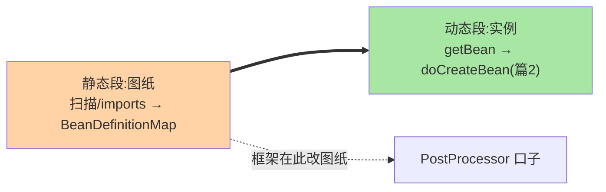

# BeanFactory 体系与 Bean 定义加载：从容器的数据结构说起

> IoC 容器不是黑盒，是「**一张 BeanDefinition 注册表 + 一套按需创建的工厂体系**」。这篇从 BeanFactory 接口层级下到 DefaultListableBeanFactory 的数据结构，讲清 Bean 定义从注解/imports 到注册表的全链路——这是理解生命周期（篇 2）与循环依赖的地基。

> **本文核心**：容器 = **BeanDefinition（静态描述）+ singletonObjects（运行时实例）的分离结构**，BeanFactory 接口族按能力分层（Listable/AutowireCapable/Hierarchical），实现只有一个真正主角 DefaultListableBeanFactory。**机制链**：注解扫描（ClassPathScanningCandidateComponentProvider）→ 解析为 AnnotatedBeanDefinition（class 元数据 + 作用域 + 注入点）→ 注册进 BeanDefinitionRegistry（name→definition 映射表）→ 后续按需 getBean 实例化（篇 2）。

## 一句话摘要

「Bean 定义先于 Bean 存在」是 IoC 的核心架构：**BeanDefinition 是类的元数据快照**（类名、作用域、构造参数、@Autowired 注入点、lazy 等标记——容器据此「照图纸造对象」），**注册表是全部图纸的索引**；BeanFactory 体系按能力递增分层（BeanFactory 最小读取 → Listable 可枚举 → AutowireCapable 可注入 → Hierarchical 有父子），**ApplicationContext 是「BeanFactory + 事件 + 资源 + 国际化」的超级门面**（装饰器关系而非继承）。理解这个结构后：@Component 与 @Bean 的本质（殊途同归——都产出 BeanDefinition）、父子容器（ MVC 子容器与根容器，Spring 与 Boot 的容器形态差异）、getBean 的查找路径（先本容器后父容器）全部可推演。

## 一、边界：入门层讲过什么，本文讲什么

| 内容 | 入门层（篇 3/4） | 本文 |
|---|---|---|
| IoC/DI 的概念与 @Component/@Bean 用法 | ✅ 讲过 | 不重复 |
| BeanFactory 与 ApplicationContext 的关系 | 提了一句 | **本文核心一** |
| BeanDefinition 的结构与来源 | 未讲 | **本文核心二** |
| 扫描与注册的源码链路 | 未讲 | **本文核心三** |

## 二、容器体系：接口分层与唯一主角

```mermaid
flowchart TD
    BF["BeanFactory<br/>最小能力:getBean 按名取"] --> LIS["ListableBeanFactory<br/>可枚举:按类型查全部"]
    BF --> HIE["HierarchicalBeanFactory<br/>父子层级:本容器没有问父亲"]
    LIS --> ACW["AutowireCapableBeanFactory<br/>可注入:创建+装配+初始化"]
    ACW --> DLB["DefaultListableBeanFactory<br/>★唯一主角实现:注册表在这里"]
    ACW -.->.|门面组合| APP["ApplicationContext<br/>= BeanFactory + 事件/资源/环境"]
    style DLB fill:#ffd3a5
    style APP fill:#a8e6a3
```

**ApplicationContext 与 BeanFactory 的关系是组合（门面）不是替代**——所有容器能力最终落到内部的 DefaultListableBeanFactory（getBean 的真正实现者）。**父子容器的语义**：子容器 getBean 找不到时向上问父容器（ Hierarchical 的 getParentBeanFactory 链）——经典 MVC 双容器（根容器装 Service、Servlet 子容器装 Controller）与 Boot 单容器形态的差异由此而来（Boot 默认单容器，父子语义多用于早期 XML 时代与部分框架集成——**容器形态是架构演进的选择，不是能力差异**）。

## 三、BeanDefinition：图纸的数据结构

一条 BeanDefinition 的关键字段（RootBeanDefinition/AnnotatedGenericBeanDefinition 等实现族）：

| 字段 | 承载信息 | 来源示例 |
|---|---|---|
| beanClass | 类元数据 | @Component 扫描 / @Bean 返回类型 |
| scope | singleton/prototype/… | @Scope |
| lazyInit | 是否懒加载 | @Lazy |
| primary / dependsOn | 优先级 / 前置依赖 | @Primary / @DependsOn |
| autowireMode | 注入模式（按类型/名） | @Autowired 解析上下文 |
| constructorArgumentValues | 构造参数 | XML/编程式定义 |

**两个高价值认知**：① **@Component 与 @Bean 的殊途同归**——扫描把 @Component 类解析为 AnnotatedBeanDefinition，@Bean 方法解析为 ConfigurationClassBeanDefinition（beanClass 指向工厂方法）——**图纸形态不同、下游实例化机制同一**（这也是为什么两者可互相注入、混用无障碍）；② **注册表是可编程操纵的**——BeanFactoryPostProcessor 在实例化前拿到注册表改图纸（这正是 MyBatis @MapperScan 这类框架的集成原理：扫描接口、手工注册 BeanDefinition 把接口变成可注入的代理 Bean）——**框架集成的标准姿势就是「往注册表里塞图纸」**。

## 四、源码关键路径（Framework 7.0 口径）

```text
扫描链路（@ComponentScan 触发）:
ClassPathBeanDefinitionScanner.scan()
 └─ doScan(basePackages)
     └─ findCandidateComponents()                    // ClassPathScanningCandidateComponentProvider
         ├─ 路径模式 → Resource[]（classpath 扫描,ASM 读元数据不加载类）
         └─ isCandidateComponent(metadata)            // @Component 派生注解过滤(@Service 等元注解)
     → AnnotatedGenericBeanDefinition(metadata)
     → registerBeanDefinition(definitionHolder)       // → beanDefinitionMap

注册表结构（DefaultListableBeanFactory）:
beanDefinitionMap: Map<name, BeanDefinition>           // 图纸索引
beanDefinitionNames: List<name>                        // 注册序(决定默认实例化顺序)
allowBeanDefinitionOverriding                         // 同名覆盖开关(Boot 默认关,冲突即报错)

@bean 方法链路: ConfigurationClassBeanDefinitionReader.loadBeanDefinitions()
（互指本系列《自动装配》篇 2:配置类解析是图纸的另一大来源）
```

**扫描用 ASM 读字节码元数据而非加载类**（性能：扫描期不触发类加载与静态块）——「@Component 的类静态块没执行却报了扫描错」这类现象的机制解释。

「图纸 → 实例」的两段式全景：



## 五、典型场景

- **框架集成（往注册表塞图纸）**：MyBatis 的 MapperScan（接口无实现类——扫描后注册 FactoryBean 产代理）、Dubbo 的 @Reference（消费端接口注册为代理 Bean）——看懂「BeanDefinition 可以指向 FactoryBean」就看懂了大半框架集成原理
- **同名 Bean 冲突排查**：Boot 默认禁止覆盖（allowBeanDefinitionOverriding=false）——同名即启动失败，报错信息含两个来源定位；解法是改名/条件装配二选一（而不是开覆盖开关）
- **按类型注入的查找成本**：getBeansOfType 要枚举图纸比对类型——巨量 Bean 的应用此操作有成本（缓存缓解），提示「按类型批量注入别放在高频路径」

## 业内惯例

- **业务代码用注解，框架集成用编程式注册**：@Component/@Bean 服务业务；BeanDefinitionRegistryPostProcessor 服务框架——两种图纸来源各归其位（机制边界即工程边界）
- **同名 Bean 按冲突处理**：覆盖开关（allowBeanDefinitionOverriding）保持默认关闭——静默覆盖的 Bean 行为漂移是排查噩梦，显式冲突是好防线
- **3.x/4.x 视角**：容器核心结构（注册表 + DefaultListableBeanFactory）自 Framework 2.x 稳定至今，7.0 无结构性变化——**IoC 数据结构知识的跨版本保值度极高**，投资一次长期受用

## 六、常见误区

- **「ApplicationContext 是另一个容器」**：它是 BeanFactory 的门面（组合关系），真正干活的始终是内部的 DefaultListableBeanFactory——「换上下文类型」换的是门面能力（Web/非 Web/响应式），不是核心容器
- **「接口不能是 Bean」**：BeanDefinition 的 beanClass 可以指向 FactoryBean——接口经工厂Bean变成代理实例（Mapper/FeignClient 全此原理）——「Bean = 类的实例」是入门认知，「Bean = 图纸的产物」是机制认知
- **扫描越多越好**：basePackages 全量扫（扫 com 而不是精确包）拖慢启动且容易扫进别人的类——扫描范围精确到包是规范
- **以为 @DependsOn 管初始化顺序**：它只声明「先创建」的依赖关系（构建顺序），初始化逻辑顺序（@PostConstruct 内部语义）不归它管——顺序问题的完整机制要结合生命周期（篇 2）

## 七、与相邻机制的关系

- 本系列篇 2《Bean 生命周期与三级缓存》：注册表就绪后 getBean → doCreateBean 的完整链路在那篇
- 《深入理解自动装配与启动流程》：imports 候选怎么变成图纸（本篇注册表的另一入口）
- tips 互指：@MapperScan 的集成细节在 mybatis-plus 生态系列展开

## 你们可能会问

**Q1：为什么 Spring 不直接反射类而要中间加一层 BeanDefinition？**
解耦「描述」与「创建」——图纸可以被后处理器修改（框架集成的口子）、可以延迟到需要时创建（懒加载）、可以不指向类本身（FactoryBean/工厂方法）——直接反射没有这些变化空间，**中间层就是扩展点**。

**Q2：getBean(name) 和 getBean(Class) 的查找差异？**
按名 O(1)（Map 直查）；按类型要枚举比对（有缓存但首次贵）——注入大量按类型查询的场景（批量 getBeansOfType）留意成本。

**Q3：父子容器在现代 Boot 应用还有用吗？**
默认单容器足够；父子语义在「同名 Bean 隔离」（测试上下文、脚本引擎隔离域）与部分遗留集成中仍有出场——认知模型保留，日常使用频率低。

## 八、自测三问

1. BeanFactory 接口族的分层能力与唯一主角实现？
2. BeanDefinition 的关键字段？@Component 与 @Bean 的图纸差异？
3. 框架集成为什么走「往注册表塞图纸」（MapperScan 原理复述）？

## 开放问题

- Bean 定义的构建期固化（AOT：注册表在 build 时生成代码而非运行时扫描）正在改变「扫描」的形态——运行时反射装配与构建期静态装配的双轨并存是 7.x 时代的容器演进主线。
- Valhalla（值类型）对 Bean 实例化机制的潜在影响（值对象不可变性与容器单例语义的张力）是远期观察项。

## 📎 核心带走

- **核心一句话**：IoC 容器 = BeanDefinition 注册表（图纸）+ 按需实例化工厂（DefaultListableBeanFactory 单主角），ApplicationContext 是门面
- **机制链**：注解扫描（ASM 元数据）→ BeanDefinition 产出 → 注册表登记（name→definition）→ 框架集成经 PostProcessor 改图纸 → 按需 getBean
- **失效点/边界**：接口经 FactoryBean 可成 Bean；同名默认冲突不覆盖；@DependsOn 只管构建序不管初始化语义

## 💡 实战提示

- 💡 看框架集成源码先找它的 BeanDefinitionRegistryPostProcessor——集成原理都在塞图纸处
- 💡 启动报同名 Bean 别开覆盖开关，按报错定位两个来源二选一处理
- 💡 决策口径：图纸操纵（PostProcessor）只用于框架级横切，业务差异用条件装配表达
- 💡 静态描述与运行实例分离的取舍：多一层间接多一分灵活也多一分理解成本——IoC 的这层抽象换来的是框架集成能力，值


## 量级分档视角

10 万 QPS 以内的请求量，框架层的拦截/解析开销可忽略；千万级以上需要关注 DispatcherServlet 的 handler mapping 耗时与拦截器链长度对 P99 的影响。

## 📌 数据与事实声明

- 写于 2026-09-10，源码主线 Spring Framework 7.0.9（gh 实测）；容器核心结构跨 3.x/4.x 稳定，差异已标注
- 免责：源码细节以 GitHub 当前主线为准

## 📚 参考资料

| 类型 | 标题 | 来源 |
|---|---|---|
| 官方源码 | spring-framework（DefaultListableBeanFactory / ClassPathBeanDefinitionScanner） | github.com/spring-projects/spring-framework |
| 官方文档 | Spring Framework Docs（Core → IoC Container） | docs.spring.io |
| 关联系列 | 本系列篇 2 / 自动装配系列 | 本目录 |
