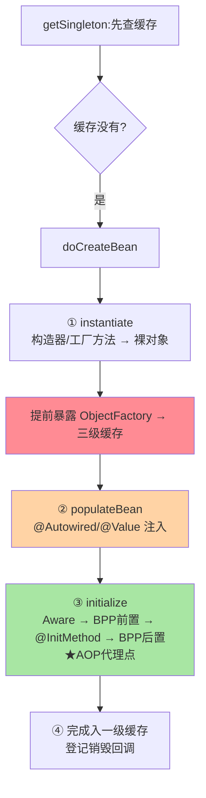

# Bean 生命周期与三级缓存源码：doCreateBean 全流程与循环依赖解析

> 「Bean 怎么从图纸变成对象、循环依赖为什么能解、@Autowired 的注入发生在哪一毫秒」——答案全在 `doCreateBean` 这一个方法里。这篇以 Framework 7.0 源码为主线，把生命周期的扩展点链与三级缓存的协作机制拆透。

> **本文核心**：doCreateBean 四段式——**① instantiate（实例化：构造器/工厂方法产裸对象）→ ② populateBean（属性填充：@Autowired 注入发生地）→ ③ initialize（初始化：Aware 回调 → BeanPostProcessor 前置 → @InitMethod → 后置）→ ④ 注册与销毁回调登记**。三级缓存（singletonObjects 成品 / earlySingletonObjects 半成品 / singletonFactories 工厂）解**构造完成、注入未完成的循环引用**。**机制链**：getSingleton（先查缓存）→ doCreateBean 四段 → 提前暴露工厂（三级）→ 完成后升级入一级缓存。

## 一句话摘要

生命周期的核心认知：**「实例化」与「初始化」分离**（new 出来 ≠ 可用，中间隔着注入与初始化回调）——扩展点各就其位：@PostConstruct 在 initialize 段（BeanPostProcessor 触发）、@Autowired 在 populate 段（AutowiredAnnotationBeanPostProcessor 执行）、AOP 代理通常在「初始化后」（AnnotationAwareAspectJAutoProxyCreator 的 postProcessAfterInitialization，互指 AOP 系列）。**三级缓存解循环依赖的本质**：A 创建中暴露「半成品工厂」→ B 注入 A 时从工厂拿早期引用 → B 完成 → A 继续——**用「提前暴露 + 事后补完」打破鸡生蛋僵局**；解不了的是「构造器循环依赖」（连半成品都拿不出）与 prototype 循环（无缓存可借）。

## 一、边界：入门层讲过什么，本文讲什么

| 内容 | 入门层（篇 3/5） | 本文 |
|---|---|---|
| Bean 生命周期概念与 @PostConstruct 用法 | ✅ 讲过 | 不重复 |
| 循环依赖的现象与开关 | ✅ 讲过 | 不重复 |
| doCreateBean 四段式与扩展点挂载序 | 未讲 | **本文核心一** |
| 三级缓存的协作与边界（哪些解不了） | 未讲 | **本文核心二** |
| 生命周期扩展点的选型 | 未讲 | **本文核心三** |

## 二、doCreateBean 四段式与扩展点挂载



**扩展点挂载序**（背下这张时序就掌握了 90% 的生命周期面试与排障）：InstantiationAwareBeanPostProcessor（实例化前后，可短路替换对象）→ MergedBeanDefinitionPostProcessor（收集注入点元数据）→ populate 段的 @Autowired/@Resource → Aware 族（BeanNameAware/ApplicationContextAware）→ BeanPostProcessor.postProcessBeforeInitialization（@PostConstruct 由 CommonAnnotationBeanPostProcessor 在此触发）→ afterPropertiesSet/自定义 initMethod → **postProcessAfterInitialization（AOP 代理在此生成，返回的可能是代理而非原对象）**。**注入的最终对象 ≠ 原对象**（AOP 场景）——这是三级缓存要存「工厂」而非「对象」的深层原因（工厂可以决定给早期引用还是给代理）。

## 三、三级缓存：协作机制与边界

| 缓存 | 存什么 | 语义 |
|---|---|---|
| 一级 singletonObjects | 成品单例 | 完整可用 |
| 二级 earlySingletonObjects | 半成品（工厂执行一次后的早期引用） | 隔离三级工厂的重复执行 |
| 三级 singletonFactories | ObjectFactory（lambda） | 按需决定早期形态（含代理） |

**循环依赖解析全流程**（A 依赖 B、B 依赖 A）：


**解不了的边界**（高频认知题）：**构造器循环依赖**——注入发生在构造参数里，① 还没完成无从暴露工厂（解法：@Lazy 注入代理延迟解析/Setter 重构）；**prototype 循环**——无缓存机制（prototype 不缓存生命周期，解法同上）；**@Async 等早期代理与最终代理不一致**——工厂只能执行一次（二级缓存防重复），两类后处理器都要代理时出现「早期引用与最终 Bean 不一致」——Spring 对此直接报错（BeanCurrentlyInCreationException 变体或 BeanNotOfRequiredType）——**「不要在循环依赖链上叠多类代理」是工程红线**。

## 四、源码关键路径（Framework 7.0 口径）

```text
AbstractBeanFactory.doGetBean()
 └─ DefaultSingletonBeanRegistry.getSingleton(beanName, factory)
     ├─ getSingleton(name)          // 一二三级依次查+升级
     └─ singletonFactory.getObject() // 三级工厂执行(getEarlyBeanReference)
         → AbstractAutowireCapableBeanFactory.doCreateBean()
             ├─ createBeanInstance()   // ① 构造(简单/构造器注入判定)
             ├─ addSingletonFactory()  // 提前暴露(smartInstantiationAware 检查)
             ├─ populateBean()         // ② InstantiationAwareBPP.postProcessProperties
             │                         //   → AutowiredAnnotationBPP 注入元数据执行
             └─ initializeBean()       // ③ invokeAwareMethods → applyBPPBefore
                                       //   → initMethod → applyBPPAfter(AOP)
             → addSingleton()          // ④ 入一级,清二三級
```

阅读建议：打断点走一次「无循环依赖的普通 Bean」再走一次「A/B 循环」——对照 getSingleton 的缓存路径差异，三级缓存的动机自己会浮现（**看两次比背十遍有效**）。

## 五、典型场景

- **@Autowired 为 null / 注入时机异常**：注入点在 ② populate——静态字段/自 new 的对象不走容器生命周期，注入永远不发生（「容器外对象」是注入失效第一根因）
- **循环依赖解法选型**：默认（单例 + Setter/字段注入）自动解；构造器循环用 @Lazy 打断（注入的是代理，首次使用才解析）；架构正解是**消除循环**（互指入门层篇 5 的设计层讨论——机制能解 ≠ 设计该有）
- **拿到代理而非原始类**：AOP Bean 注入进来的天然是代理——反射取字段/类型判断要考虑代理形态（`AopUtils.getTargetClass`）——生命周期序决定的必然结果而非 Bug

## 业内惯例

- **初始化逻辑的挂载顺位**：构造器只做字段赋值 → @PostConstruct 做轻校验 → afterPropertiesSet/initMethod 做重初始化 → ApplicationRunner 做依赖容器的启动动作——重活后置是启动性能与失败定位的共同纪律
- **循环依赖不靠机制兜底而是靠架构评审**：allow-circular-references 开关默认关闭（Boot 2.6+ 起默认禁）——新代码出现循环依赖在 CI/评审阶段拦（演进视角：从「机制自动解」到「默认禁用」是设计态度的代际转变）
- ** Aware 接口按需用**：ApplicationContextAware 是「拿容器」的后门——框架/基建用，业务代码注入依赖即可，直接持容器是反模式（隐式依赖 + 测试困难）

## 六、常见误区

- **「三级缓存就是为了性能」**：一级就能解循环依赖（直接存半成品引用）——三级的设计目标是**让早期引用的形态决策延迟到真正被需要时**（是否代理、代理一次）——语义正确性设计而非性能优化
- **「@PostConstruct 在构造器前」**：时序是构造器 → 注入 → @PostConstruct——「注入的依赖在 @PostConstruct 里一定可用、在构造器里一定不可用（除构造器注入）」是排障铁律
- **开 allow-circular-references 解决报错**：解锁的是机制兜底，掩盖的是设计问题——存量遗留可临时开，新代码出现即评审（机制开关 ≠ 设计许可）
- **以为 Bean 销毁会自动级联**：销毁回调（@PreDestroy/disposableBean）只对容器关闭时的单例——手动 deregister 或原型 Bean 的清理要自己管生命周期尾巴

## 七、与相邻机制的关系

- 本系列篇 1：注册表与图纸（本篇是「图纸 → 实例」的下半程）
- 《深入理解AOP与代理》系列：③ 段 BPP 后置的代理生成在那篇展开（本篇给挂载点）
- tips 互指：入门层篇 5（循环依赖的现象层）——本篇是其源码底座，机制同源不重写

## 你们可能会问

**Q1：为什么 @Lazy 能解构造器循环依赖？**
@Lazy 注入的是「目标代理」——构造时只造代理（不解析目标），首次调用才 getBean 真实对象——**把「立即需要」推迟成「用时需要」**，僵局自然打开（与 ObjectProvider 的机制同族）。

**Q2：Spring Boot 4 还支持循环依赖吗？**
机制在（单例+字段/Setter 注入照解），默认开关关闭（2.6+ 的态度延续至 4.x）——「能解」与「默认允许」是两回事，版本演进的是态度不是机制。

**Q3：BeanPostProcessor 与 BeanFactoryPostProcessor 的区别一句话？**
作用对象不同——BFPP 改图纸（BeanDefinition，实例化前）、BPP 改产品（Bean 实例，实例化后）——「图纸 vs 产品」对应本系列篇 1 与本篇的分界。

## 八、自测三问

1. doCreateBean 四段式与各扩展点的挂载位置？
2. 三级缓存各自存什么？工厂为什么只能执行一次？
3. 构造器循环与 prototype 循环为什么解不了？@Lazy 的机制？

## 开放问题

- 构造器注入的倡导（不可变对象 + 显式依赖）与循环依赖天然互斥——「循环依赖消失」的路线不是靠机制而是靠构造器注入的普及，容器的三级缓存在未来可能只是遗留兼容层。
- AOT 形态下生命周期在构建期定格（无运行时后处理器链），扩展点的「运行时弹性」与「构建期确定性」的双轨边界在持续划定。

## 📎 核心带走

- **核心一句话**：doCreateBean 四段（实例化→注入→初始化→完成）+ 三级缓存（成品/半成品/工厂）提前暴露——扩展点各就各位、循环依赖「能解的有条件、该解的靠设计」
- **机制链**：getSingleton 查缓存 → 实例化 + 暴露工厂 → populate 注入 → initialize 回调链（AOP 在最后）→ 入一级缓存
- **失效点/边界**：容器外对象无注入；构造器/prototype 循环无解（@Lazy 打断）；多类代理叠加循环链会报错

## 💡 实战提示

- 💡 排注入问题先问「这个对象是容器管的吗」——静态/new 的对象不在生命周期里
- 💡 生命周期时序图贴团队 wiki：构造器→注入→@PostConstruct 的可用依赖递增是排障第一参照
- 💡 决策口径：循环依赖解法序——先重构消除 > @Lazy 打断 > 开机制开关（遗留）——成本与设计债同向递增
- 💡 机制兜底与设计治理的权衡：三级缓存证明「能解」，默认禁用证明「不该依赖」——两者并不矛盾，这正是框架演进的成熟表达

## 📌 数据与事实声明

- 写于 2026-09-10，源码主线 Spring Framework 7.0.9（gh 实测）；三级缓存结构跨 3.x/4.x 稳定，默认禁循环的口径自 Boot 2.6 延续
- 免责：源码细节以 GitHub 当前主线为准

## 📚 参考资料

| 类型 | 标题 | 来源 |
|---|---|---|
| 官方源码 | spring-framework（AbstractAutowireCapableBeanFactory / DefaultSingletonBeanRegistry） | github.com/spring-projects/spring-framework |
| 官方文档 | Spring Framework Docs（Core → IoC → Bean Lifecycle） | docs.spring.io |
| 关联系列 | 本系列篇 1 / AOP 与代理系列 | 本目录 |
