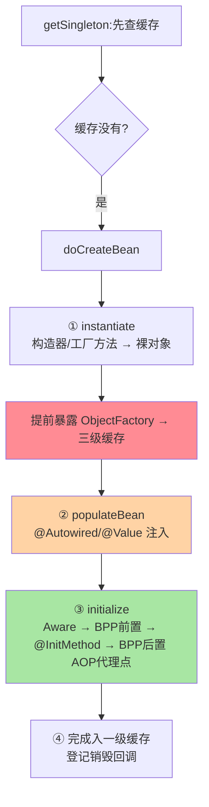
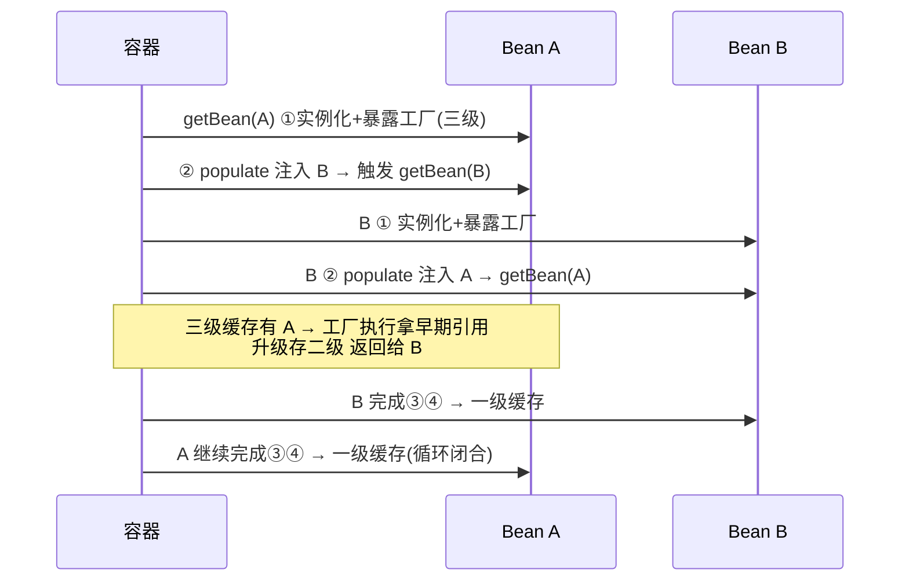
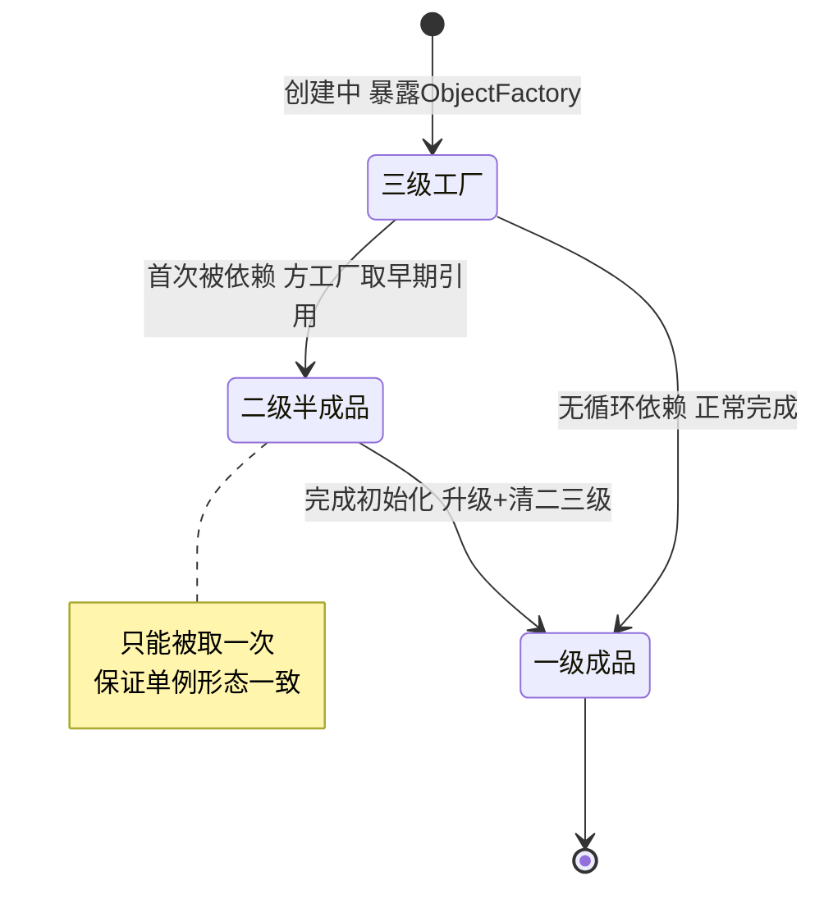

# Bean 生命周期与三级缓存源码：doCreateBean 全流程与循环依赖解析

> 「Bean 怎么从图纸变成对象、循环依赖为什么能解、@Autowired 的注入发生在哪一毫秒」——答案全在 `doCreateBean` 这一个方法里。这篇以 Framework 7.0 源码为主线，把生命周期的扩展点链与三级缓存的协作机制拆透，并回答三个更深的质疑：**为什么是三级不是两级？代理为什么不提前生成？Spring 为什么直到 2.6 才默认禁循环依赖？**

> **本文核心**：doCreateBean 四段式——**① instantiate（实例化：构造器/工厂方法产裸对象）→ ② populateBean（属性填充：@Autowired 注入发生地）→ ③ initialize（初始化：Aware 回调 → BPP 前置 → @InitMethod → 后置）→ ④ 注册与销毁回调登记**。三级缓存（singletonObjects 成品 / earlySingletonObjects 半成品 / singletonFactories 工厂）解**构造完成、注入未完成的循环引用**。**机制链**：getSingleton（先查缓存）→ doCreateBean 四段 → 提前暴露工厂（三级）→ 完成后升级入一级缓存。

## 一句话摘要

生命周期的核心认知：**「实例化」与「初始化」分离**（new 出来 ≠ 可用，中间隔着注入与初始化回调）——扩展点各就其位：@PostConstruct 在 initialize 段、@Autowired 在 populate 段、AOP 代理通常在「初始化后」。**三级缓存解循环依赖的本质**：A 创建中暴露「半成品工厂」→ B 注入 A 时从工厂拿早期引用 → B 完成 → A 继续——用「提前暴露 + 事后补完」打破僵局；解不了的是「构造器循环依赖」（连半成品都拿不出）与 prototype 循环（无缓存可借）。

## 🎯 本文核心

**核心一句话：三级缓存的设计思想 = 「把早期引用的形态决策延迟到真正被需要时」——工厂存的是「怎么拿半成品」而不是「半成品本身」，是否生成代理、代理生成几次，都由这条延迟机制保证；生命周期的四段式则是「扩展点各就各位」的时序骨架。**

机制链：getSingleton（一二三级依次查+升级）→ doCreateBean 四段 → 提前暴露 ObjectFactory → populate 注入 → initialize 回调链（AOP 在最后）→ 升级入一级缓存。

## 一、doCreateBean 四段式与扩展点挂载



**扩展点挂载序**（背下这张时序就掌握了 90% 的生命周期排障）：InstantiationAwareBeanPostProcessor（实例化前后，可短路替换对象）→ MergedBeanDefinitionPostProcessor（收集注入点元数据）→ populate 段的 @Autowired/@Resource → Aware 族 → BeanPostProcessor.postProcessBeforeInitialization（@PostConstruct 在此触发）→ afterPropertiesSet/自定义 initMethod → **postProcessAfterInitialization（AOP 代理在此生成，返回的可能是代理而非原对象）**。**注入的最终对象 ≠ 原对象**（AOP 场景）——这是三级缓存要存「工厂」而非「对象」的深层原因（工厂可以决定给早期引用还是给代理）。

## 二、质疑者追问链：三级缓存的三层为什么

**质疑**：循环依赖用「半成品引用」一层缓存就能解——先 new 好放进去，谁的依赖先要就给引用。为什么 Spring 要搞三级？

**追问一层：两级缓存真的不够吗？** 够，如果不考虑 AOP——一级存成品、二级存半成品引用，循环依赖照样解。**真正的问题在代理**：如果 A 被 AOP 增强，注入给 B 的应该是代理而不是裸对象。代理的生成时机在生命周期设计上是「初始化后」，但循环依赖要求「实例化后就给引用」——**两个时机冲突了**。

**再追问：那把代理生成统一提前到实例化之后，不就没冲突了？** 技术可行，但被设计拒绝——**设计哲学**：AOP 代理生成是初始化后置处理器的职责（AnnotationAwareAspectJAutoProxyCreator 与其他上百个 BPP 走同一条链），把某个场景的代理提前，等于在生命周期主链之外开一条特殊路径——扩展点的时序契约被破坏，所有 BPP 的执行顺序假设全部失效。Spring 的取舍：**不做特例，把「是否需要提前给代理」封装成三级缓存里的 ObjectFactory**——工厂在「真的有人来要早期引用」时才执行，执行时问一次代理处理器「要不要现在生成代理」——决策被延迟到必要的最小时刻（设计思想：延迟决策 + 职责保守在原链路）。

**再深一层：为什么这个工厂只能执行一次（二级缓存存在的意义）？** 如果工厂被执行两次且两次返回不同对象（理论上代理可能不一致），B 拿到的 A 和容器最终的 A 就是两个对象——**单例语义被撕开**。二级缓存的语义是「工厂的产物缓存一次，之后都给同一份」——它是「半成品的单例性保证」，不是可有可无的优化。

**第三层质疑：既然机制能解，Spring 为什么在 Boot 2.6 默认禁止循环依赖？** 这是**设计态度的代际演进**：机制能解 ≠ 循环依赖该存在——循环依赖通常意味着职责边界混乱（A 与 B 互相纠缠），机制兜底反而掩盖设计问题。默认禁止 = 把设计问题推回设计阶段解决（@Lazy 打断或重构），遗留场景显式开开关。**机制能力与默认态度分离**，是成熟框架的标志。

## 三、循环依赖解析时序：A 与 B 的完整对话




## 二点五、三级缓存分层图：三个稳定点的状态机



三个缓存是同一个 Bean 的**三个生命周期稳定点**：工厂期（未定形态）、半成品期（已定引用）、成品期（最终形态）——状态只能单向前进，任何回退都是框架 bug。

## 三、反方案分析：为什么不换一种彻底的做法

**反方案一：全字段注入 + 容器统一解循环。** 字段注入让循环依赖「天然可解」（先造裸对象再互相塞），代价是**不可变对象消失、依赖关系隐式化、测试必须起容器**——构造器注入倡导（不可变 + 显式依赖）与循环依赖天然互斥，Spring 生态选择推动构造器注入而不是强化字段注入的循环解法——**方向性取舍：宁可循环依赖暴露设计问题，不养一个掩盖问题的注入习惯**。

**反方案二：用 AspectJ 编译期/加载期织入，彻底绕开运行时代理。** 织入后没有「代理 vs 原对象」的时序问题，循环依赖的代理矛盾消失——代价是编译链改造（编译期织入）或 agent 附加（加载期织入）、调试体验变化、生态兼容面收窄。AspectJ 的能力远强于 Spring AOP，但**部署复杂度让 Spring AOP 的动态代理成为默认**——能力与复杂度的权衡贯穿 Spring 的每个选型。

**反方案三：@Lazy 全局打断所有循环。** @Lazy 注入的是「目标代理」（首次使用才解析），打断僵局有效——但全局滥用 = 所有依赖都变懒加载，故障从启动期推迟到运行期首次调用（排查难度陡增）。@Lazy 的正确定位：**精准打断某个已评审的循环**，不是循环依赖的通用赦免。

## 四、事故推演：@Async 叠加循环依赖的代理不一致

**当时**：某服务启动报 `BeanCurrentlyInCreationException` 变体，开发在循环链上又给其中一个 Bean 加了 @Async——启动直接失败：`BeanNotOfRequiredTypeException`，提示 Bean XxxService 应为某类但实际是另一类。**排查**：容器里 A 的早期引用（工厂产出的）与最终 Bean（@Async 又包了一层代理）类型不一致——两类后处理器都要代理时，三级缓存的「工厂执行一次」与「最终形态再变」撞车。**修复**：拆解循环（引入中间 Bean）+ @Async 的 Bean 移出循环链。**复盘沉淀**：**「不要在循环依赖链上叠多类代理」是工程红线**——三级缓存能保证单代理的一致性，保证不了多代理叠加的形态冲突。这类问题的机制根源在生命周期时序，靠重启和重试永远修不好。

## 五、源码关键路径（Framework 7.0 口径）

```text
AbstractBeanFactory.doGetBean()
 └─ DefaultSingletonBeanRegistry.getSingleton(beanName, factory)
     ├─ getSingleton(name)          // 一二三级依次查+升级
     └─ singletonFactory.getObject() // 三级工厂执行(getEarlyBeanReference)
         → AbstractAutowireCapableBeanFactory.doCreateBean()
             ├─ createBeanInstance()   // ① 构造(简单/构造器注入判定)
             ├─ addSingletonFactory()  // 提前暴露(smartInstantiationAware 检查)
             ├─ populateBean()         // ② InstantiationAwareBPP.postProcessProperties
             │                         //   → AutowiredAnnotationBPP 注入元数据执行
             └─ initializeBean()       // ③ invokeAwareMethods → applyBPPBefore
                                       //   → initMethod → applyBPPAfter(AOP)
             → addSingleton()          // ④ 入一级,清二三级
```

阅读建议：打断点走一次「无循环依赖的普通 Bean」再走一次「A/B 循环」——对照 getSingleton 的缓存路径差异，三级缓存的动机自己会浮现（**看两次比背十遍有效**）。

## 六、典型场景

- **@Autowired 为 null / 注入时机异常**：注入点在 populate 段——静态字段/自 new 的对象不走容器生命周期，注入永远不发生（「容器外对象」是注入失效第一根因）
- **循环依赖解法选型**：默认（单例 + Setter/字段注入）自动解；构造器循环用 @Lazy 打断（注入的是代理，首次使用才解析）；架构正解是**消除循环**（互指入门层篇 5——机制能解 ≠ 设计该有）
- **拿到代理而非原始类**：AOP Bean 注入进来的天然是代理——反射取字段/类型判断要考虑代理形态（`AopUtils.getTargetClass`）

## 业内惯例

- **初始化逻辑的挂载顺位**：构造器只做字段赋值 → @PostConstruct 做轻校验 → afterPropertiesSet/initMethod 做重初始化 → ApplicationRunner 做依赖容器的启动动作——重活后置是启动性能与失败定位的共同纪律
- **循环依赖靠架构评审不靠机制兜底**：allow-circular-references 默认关闭（Boot 2.6+）——新代码出现循环依赖在 CI/评审阶段拦（设计态度的代际转变）
- **Aware 接口按需用**：ApplicationContextAware 是「拿容器」的后门——框架/基建用，业务代码注入依赖即可，直接持容器是反模式（隐式依赖 + 测试困难）

## 量级分档视角：循环依赖在不同量级下的形态

10 万 QPS 单体应用：循环依赖靠三级缓存自动解，启动即可用，几乎没有感知；百万到千万级微服务集群：循环依赖从「启动问题」升级为「架构问题」——跨服务的循环依赖（A 调 B、B 调 A）不再是容器能解的范畴，需要架构层拆解（引入中间服务/事件驱动解耦）；亿级数据与超大规模集群：Boot 2.6+ 默认禁循环依赖成为治理基线，任何存量循环在升级时被强制清零——**量级每上一档，对「机制兜底」的容忍度就降一级**。

## 七、常见误区
## 七、常见误区

- **「三级缓存就是为了性能」**：一级就能解循环依赖（直接存半成品引用）——三级的设计目标是**让早期引用的形态决策延迟到真正被需要时**（是否代理、代理一次）——语义正确性设计而非性能优化
- **「@PostConstruct 在构造器前」**：时序是构造器 → 注入 → @PostConstruct——「注入的依赖在 @PostConstruct 里一定可用、在构造器里一定不可用（除构造器注入）」是排障铁律
- **开 allow-circular-references 解决报错**：解锁的是机制兜底，掩盖的是设计问题——存量遗留可临时开，新代码出现即评审（机制开关 ≠ 设计许可）
- **以为 Bean 销毁会自动级联**：销毁回调只对容器关闭时的单例——手动 deregister 或原型 Bean 的清理要自己管生命周期尾巴

## 你们可能会问

**Q1：为什么 @Lazy 能解构造器循环依赖？**
@Lazy 注入的是「目标代理」——构造时只造代理（不解析目标），首次调用才 getBean 真实对象——**把「立即需要」推迟成「用时需要」**，僵局自然打开（与 ObjectProvider 机制同族）。

**Q2：Spring Boot 4 还支持循环依赖吗？**
机制在（单例+字段/Setter 注入照解），默认开关关闭（2.6+ 的态度延续至 4.x）——「能解」与「默认允许」是两回事，版本演进的是态度不是机制。

**Q3：BeanPostProcessor 与 BeanFactoryPostProcessor 的区别一句话？**
作用对象不同——BFPP 改图纸（BeanDefinition，实例化前）、BPP 改产品（Bean 实例，实例化后）——「图纸 vs 产品」对应本系列篇 1 与本篇的分界。

## 八、自测三问

1. doCreateBean 四段式与各扩展点的挂载位置？
2. 三级缓存各自存什么？工厂为什么只能执行一次？
3. 构造器循环与 prototype 循环为什么解不了？@Lazy 的机制？

## 开放问题

- 构造器注入的倡导（不可变对象 + 显式依赖）与循环依赖天然互斥——「循环依赖消失」的路线不是靠机制而是靠构造器注入的普及，容器的三级缓存在未来可能只是遗留兼容层。
- AOT 形态下生命周期在构建期定格（无运行时后处理器链），扩展点的「运行时弹性」与「构建期确定性」的双轨边界在持续划定。

## 🎯 核心带走

- **核心一句话**：doCreateBean 四段（实例化→注入→初始化→完成）+ 三级缓存（成品/半成品/工厂）提前暴露——设计思想是「早期引用形态决策延迟」，机制能解的有条件、该解的靠设计
- **机制链**：getSingleton 查缓存 → 实例化 + 暴露工厂 → populate 注入 → initialize 回调链（AOP 在最后）→ 入一级缓存
- **失效点/边界**：容器外对象无注入；构造器/prototype 循环无解（@Lazy 打断）；多类代理叠加循环链会报错

## 💡 实战提示

- 💡 排注入问题先问「这个对象是容器管的吗」——静态/new 的对象不在生命周期里
- 💡 生命周期时序图贴团队 wiki：构造器→注入→@PostConstruct 的可用依赖递增是排障第一参照
- 💡 决策口径：循环依赖解法序——先重构消除 > @Lazy 打断 > 开机制开关（遗留）——成本与设计债同向递增
- 💡 机制兜底与设计治理的权衡：三级缓存证明「能解」，默认禁用证明「不该依赖」——两者并不矛盾，这正是框架演进的成熟表达

## 📌 数据与事实声明

- 写于 2026-09-11（升级重写），源码主线 Spring Framework 7.0.9（gh 实测）；三级缓存结构跨 3.x/4.x 稳定，默认禁循环的口径自 Boot 2.6 延续
- 免责：源码细节以 GitHub 当前主线为准

## 📚 参考资料

| 类型 | 标题 | 来源 |
|---|---|---|
| 官方源码 | spring-framework（AbstractAutowireCapableBeanFactory / DefaultSingletonBeanRegistry） | github.com/spring-projects/spring-framework |
| 官方文档 | Spring Framework Docs（Core → IoC → Bean Lifecycle） | docs.spring.io |
| 关联系列 | 本系列篇 1 / AOP 与代理系列 | 本目录 |
