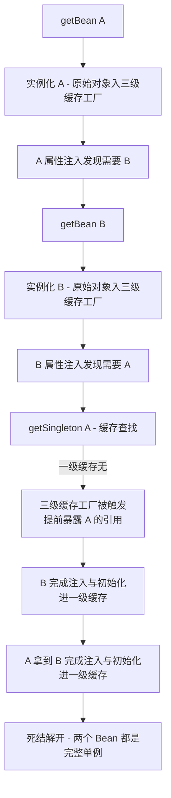
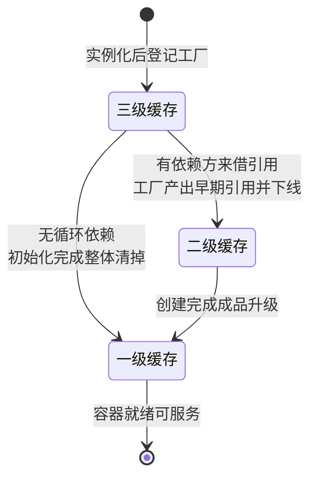
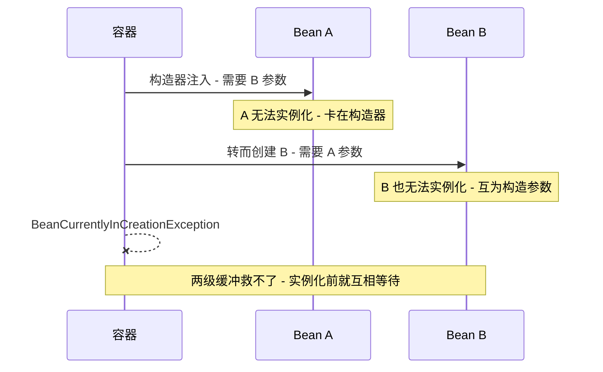

# 循环依赖与三级缓存：提前暴露、构造器死结与设计坏味道

> A 依赖 B，B 又依赖 A——容器怎么把这两个「互相等待」的 Bean 建出来？Spring 的答案是一组缓存加一个「提前暴露引用」的时机窗口。但这个机制的能力边界比大多数人以为的窄：它救不了构造器注入，它和 AOP 代理有一段必须用第三级缓存才能讲圆的设计，而且它本身被官方文档视为应该避免的形态。本篇把机制、边界和价值判断一次讲透。

## 一句话摘要

三级缓存解决的是**「字段/setter 注入的单例循环依赖」**：实例化与属性注入两阶段分离，让「已实例化但未装配完」的早期引用可以先借出去打破互等；第三级缓存存的不是对象而是 ObjectFactory，它把「要不要生成代理」的决策推迟到真正被别人依赖的那一刻。构造器注入无解，因为依赖发生在实例化之前，「先 new 再借」的窗口根本不存在。循环依赖能被解决不等于应该被使用——它掩盖的分层问题迟早以更贵的方式回来。

## 🎯 本文核心

**核心一句话：循环依赖的可用解法全部来自「把实例化和装配拆成两个阶段」这一个前提——三级缓存是这个前提在单例 + AOP 代理条件下的完整实现；构造器注入破坏前提所以无解，prototype 作用域破坏前提所以无解，Spring Boot 2.6+ 默认禁止则是官方对这个「能做但不该做」机制的口径收敛。**

机制链（本篇结构挂这条链上）：两个 Bean 的互等死结 → 三级缓存的查找与降级路径 → ObjectFactory 与代理的联动 → 构造器注入为什么是死结 → 什么情况下循环依赖依然是坏味道 → 实践纪律与参数。

## 一、死结是怎么形成的：两阶段才是破局点

先看没有缓存时的死结。创建 A 的流程是：实例化（调构造器拿到原始对象）→ 属性注入（发现需要 B）→ 初始化（回调、代理包装）。走到属性注入时去创建 B，B 的属性注入又需要 A——而 A 还在「半成品」状态，没进单例池，getBean(A) 会再次触发 A 的创建流程，死锁在互相等待里。

破局点在于一个观察：**刚实例化完的 A，虽然属性还没填、代理还没包，但它的内存身份已经确定**——对字段注入场景，把这个原始引用先借给 B，B 拿到的引用和最终单例池里的是同一个对象，等 A 装配完，B 手里那个「半成品引用」自动就是成品。**提前暴露的合法性来自「引用不变、状态后续补齐」**，这就是整个机制的地基。



## 二、三级缓存的源码关键路径

机制全在 `DefaultSingletonBeanRegistry` 的三个 Map 和 `getSingleton` 的降级查找里：

```java
// 三个缓存各司其职
private final Map<String, Object> singletonObjects;        // 一级: 成品单例
private final Map<String, Object> earlySingletonObjects;   // 二级: 提前暴露的早期引用(已加工)
private final Map<String, ObjectFactory<?>> singletonFactories; // 三级: 能产出早期引用的工厂

// getSingleton 的降级查找路径
protected Object getSingleton(String beanName, boolean allowEarlyReference) {
    Object singletonObject = this.singletonObjects.get(beanName);      // 1. 先查成品
    if (singletonObject == null && isSingletonCurrentlyInCreation(beanName)) {
        singletonObject = this.earlySingletonObjects.get(beanName);    // 2. 再查早期引用
        if (singletonObject == null && allowEarlyReference) {
            synchronized (this.singletonObjects) {
                // 双检后 3. 最后查工厂, 拿到后升级到二级缓存, 工厂下线
                ObjectFactory<?> singletonFactory = this.singletonFactories.get(beanName);
                if (singletonFactory != null) {
                    singletonObject = singletonFactory.getObject();
                    this.earlySingletonObjects.put(beanName, singletonObject);
                    this.singletonFactories.remove(beanName);
                }
            }
        }
    }
    return singletonObject;
}
```

配套的写入侧在 `doCreateBean`：实例化完成后，只要单例且允许循环引用，就把工厂放进三级缓存（`addSingletonFactory(beanName, () -> getEarlyBeanReference(beanName, mbd, bean))`）；属性注入需要的依赖照常走 getBean 触发对方创建；初始化完成后 `addSingleton` 把成品升入一级缓存、清掉二三级。追问一层：**二级缓存里的「已加工」是什么意思？** 它存的可能是原始引用，也可能是提前做好的代理——取决于工厂被触发时 `getEarlyBeanReference` 的判断（该 Bean 是否需要代理）。追问再一层：**为什么要「工厂升级到二级、工厂下线」而不是每次都问工厂？** 因为工厂可能每次返回不同对象（尤其涉及代理创建时），同一轮创建里必须保证所有依赖方拿到**同一个**早期引用——二级缓存就是「本次创建周期内唯一性」的保证。

一个 Bean 在缓存间的流转状态可以画成一条单向升级链：



## 三、为什么必须是三级：与 AOP 代理的联动

这是整个设计里最精妙也最常被追问的一环。追问链从这里展开：**如果没有 AOP，两级缓存完全够用**——实例化后直接把原始引用放二级缓存，循环依赖照解。多出来的第三级全是为代理服务。

关键矛盾：代理的正常生成时机在**初始化之后**（`BeanPostProcessor` 的 post-process 阶段，此时属性已注入、回调已执行，代理包住的是完整品）。但循环依赖要求「实例化后立刻能借出引用」。如果借出的是原始引用，而后续初始化阶段容器又生成了代理——**B 手里是原始对象，单例池里是代理，同一个 Bean 名下两个身份，AOP 织入直接失效**。

第三级缓存的解法是**把「要不要代理、提前代理」的决策封装进工厂**：只有真的发生「别人在装配期来借引用」，工厂才被触发，`getEarlyBeanReference` 判断这个 Bean 是否需要代理、需要就提前创建代理并把代理放进二级缓存，后续初始化阶段检测到「已有早期引用」就不再重复生成代理。没有循环依赖时，工厂安静地待在三级缓存里直到 Bean 完成创建被整体清掉——**代理的生成时机保持原样**。一句话：第三级缓存用「延迟决策」同时保住了两个约束——**不发生循环依赖时代理时机不变；发生循环依赖时全局只有一个身份**。

**事故叙事一（公开讨论过的经典形态，业内认知）**：同一个 Bean 被两个入口触发创建（主线程 getBean 与某个 BeanPostProcessor 的异步预检），三方缓存还未同步的极小窗口内重复触发工厂，产生两个代理，运行期表现为某次调用切面逻辑丢失、事务不生效。排查时 Bean 明明配置了事务注解，方法调用却像「裸奔」——最后对比 Bean 实际类型与代理类型才定位到重复创建。这类问题的共同教训：**早期引用的唯一性是机制的红线，任何绕过 getSingleton 直取缓存的 hack 都在赌窗口**。

## 四、构造器注入为什么无解

构造器注入的依赖发生在**参数列表**里——创建 A 必须先拿到 B，而拿 B 的前提是 B 完成创建。时序上，「实例化」这一步本身就是依赖点，容器连「先把 A 的原始对象 new 出来」都做不到：没有 B 就调不了 A 的构造器，没有 A 就调不了 B 的构造器，纯粹的鸡蛋互生。提前暴露机制的整个前提是「**先 new 出来再借**」，构造器注入把这个前提拆了，所以无论加几级缓存都无解。

 prototype 作用域同理：三级缓存只为单例服务（缓存语义就是「一个名字一个对象」），prototype 每次 getBean 都是新对象，缓存无从谈起，容器检测到 prototype 之间的循环依赖会直接抛 `BeanCurrentlyInCreationException`。追问：**@Lazy 为什么能解构造器循环依赖？** 它不解决「同时创建」而是推迟依赖——注入的只是一个延迟解析的占位代理，首次真正调用方法时才去 getBean，此时对方早已创建完成。**@Lazy 是用「调用点延迟」换「创建期解耦」，代价是依赖关系从启动期暴露推迟到运行期暴露**。



## 五、能解决不等于该用：循环依赖与设计坏味道

机制讲完，价值判断必须跟上。追问到底层：**循环依赖是 Spring 的「功能」还是「容错」？** 官方文档的历史口径一直把循环依赖列为应避免的形态，Spring Boot 2.6 起更是**默认禁止**启动（需要显式开启允许开关才能使用，公开口径）。为什么官方口径趋严？因为循环依赖不是机制问题，是**设计信号**：

- **职责边界模糊**：A 需要 B、B 又需要 A，通常说明两个类共享了一段没被抽出来的职责——各自持有对方才能工作，是「你中有我」的耦合，抽公共协作对象或引入中间事件即可解耦。
- **初始化顺序不确定性**：循环中的 Bean 谁先完成装配依赖创建路径，`@PostConstruct` 里如果依赖对方「已完成」的状态，循环依赖场景下读到半成品的风险真实存在——机制保证引用一致，不保证「你看到的状态是完整的」。
- **与代理、事件的交互变脆**：第三节的事故形态就是例证——机制为了兼容代理已经付出了第三级缓存的复杂度，使用方再叠加 @Async、@Transactional 后，问题定位成本陡增。
- **测试与演进成本**：互相依赖的 Bean 无法独立实例化做单元测试；演进时改其中一个的构造签名会牵连另一个，重构半径莫名翻倍。

什么时候可以容忍：遗留系统过渡期（配合 `@Lazy` 做临时解耦并登记技术债）、第三方扩展互相引用的胶水层。明确推荐的处理顺序：**先尝试重构抽协作对象 → 抽不动用 setter 单向化 → 再不行 @Lazy 过渡并记债 → 永远不要为了「能启动」去开全局允许开关**。

## 六、业内惯例与生产实践

生产中的惯例收敛为三条：**新代码默认按「循环依赖即构建失败」对待**（对齐 Spring Boot 2.6+ 的默认口径，把设计问题拦在启动期而不是运行期）；**存量系统升级前先跑一轮启动验证**——升级 Boot 版本时循环依赖从「警告」变「异常」是最常见的启动失败原因之一，公开升级指南都有专门条目；**确实需要开关的场景，用白名单式局部配置而不是全局放开**，让「允许循环」成为显式登记的例外而不是默认姿势。

**事故叙事二（公开复盘常见形态）**：某模块化改造项目把两个服务的公共逻辑下沉成共享模块，两个模块的核心类互相注入对方的 Facade，在旧版本容器上一直能启动。升级 Boot 后启动直接失败，团队第一反应是配置 `allow-circular-references=true` 让系统先跑起来；两周后一次功能迭代触碰了这对互相依赖的类，`@PostConstruct` 里读到了对方未初始化完的配置项，线上表现为该模块全部请求 500。复盘结论：**当初的开关把一个设计问题的爆炸时间从启动期推迟到了运行期，代价翻了十倍**。

| 方案 | 拦截时机 | 代价 | 推荐度 |
|---|---|---|---|
| 重构抽协作对象 | 设计期 | 一次重构成本 | 高（治本） |
| setter 单向注入 | 设计期 | 小改依赖方向 | 高 |
| `@Lazy` 延迟解析 | 运行期首次调用 | 依赖问题推迟暴露 | 中（过渡手段） |
| 全局允许循环依赖开关 | 无拦截 | 爆炸推迟到运行期 | 低（仅过渡期登记使用） |

## 七、参数级配置清单

与循环依赖相关的关键配置（默认值为 Spring Framework / Spring Boot 公开口径）：

| 配置项 | 默认值 | 分档推荐 | 为什么 |
|---|---|---|---|
| `spring.main.allow-circular-references` | `false`（Boot 2.6+）/ 旧版等价于 true | 保持默认 false；存量迁移确需过渡时局部开启并登记 | 默认禁止把设计问题拦在启动期；全局开启等于关闭这道设计闸门 |
| `@Lazy` 注入 | 无（需显式标注） | 仅用于过渡期与确有延迟语义的场景 | 延迟解析把问题推迟到运行期，滥用会让依赖图失真 |
| 三级缓存行为（`allowRawInjectionDespiteWrapping`） | `false` | 保持默认；改 true 会导致检测到提前注入不报错 | 默认值保证「原始引用被提前注入且后续生成代理」这种不一致被尽早暴露 |
| prototype 循环依赖 | 无解（抛异常） | 出现即重构，无参数可救 | 作用域语义决定缓存机制不适用，这是能力边界不是配置问题 |

## 八、什么时候这样理解 / 什么时候不必深究

**值得按本篇深度理解**：负责基础设施/框架升级/启动性能的工程师、维护大存量系统的团队、需要给团队定「循环依赖治理口径」的人——这些场景里机制细节（第三级缓存与代理的联动、构造器死结）直接决定排障和决策质量。**不必深究**：日常写业务 Bean、依赖关系本来就单向清晰——记住两条纪律就够：依赖尽量构造器单向注入；出现循环依赖先当设计问题处理而不是当配置问题处理。判断口诀：**循环依赖是「信号」不是「故障」，修信号源（设计），而不是关警报器（开关）**。

按规模分档的量级思考在这里同样成立，只是量纲从请求量换成了容器规模：**单体小应用（百级 Bean）**循环依赖一眼可见，重构成本低，直接当设计问题修；**大单体应用（千级到万级 Bean 的上下文）**循环链藏在模块边界之间，启动失败时排查半径大，必须靠依赖图工具先看见再动手，允许开关在此仅作迁移过渡；**平台化/多上下文部署（十万级日启动次数的流水线 + 每个上下文万级 Bean）**循环依赖的治理要点从「修」变成「防」——依赖方向进代码评审清单、构建期依赖图门禁拦截新增循环，因为这一档里一次运行期爆炸的定位成本已经远超构建期拦截的投入。一句话：量级越大，治理动作越要前移，从运行期修、到启动期拦、再到构建期防。

## 💡 实战提示

💡 实战提示一：升级 Spring Boot 前，全局搜索 `@Autowired` 字段注入和 setter 注入的互相引用对——2.6+ 的默认禁止会让它们在启动期集体暴露；提前在测试环境用新版本拉起全部上下文，是成本最低的扫雷方式。

💡 实战提示二：遇到「事务/切面莫名不生效」且该 Bean 处于循环依赖链上，先对比 `applicationContext.getBean()` 的实际类型与预期代理类型——类型不一致指向早期引用与代理的双身份问题，比反复检查注解写法快得多。

💡 实战提示三：给团队立一条演进纪律——`allow-circular-references` 若必须开启，配置旁必须注释登记原因、范围与清理期限；没有登记的开关，半年后没人记得它掩盖着哪对耦合，而那对耦合就是下一次线上问题的埋点。

## Trade-off：机制的代价账本

- **提前暴露 vs 严格时序**：三级缓存换来了循环依赖的可用性，代价是「Bean 有一个未完成态可以被引用」的窗口存在——所有参与方（缓存查找、代理决策、初始化回调）都要为这个窗口保持纪律。严格时序的容器（构造器注入为主流的思路）则干脆放弃这个窗口，把循环依赖变成即刻失败。
- **延迟决策 vs 实现复杂度**：ObjectFactory 用一层间接把代理时机问题解得很优雅，但三级降级查找、同步块、缓存升降级让这段源码的理解成本显著高于「两个 Map」。这是框架设计里典型的「用实现复杂度换使用方零感知」——理解它一次，受益的是所有不用关心它的业务代码。
- **兼容旧版 vs 口径收紧**：旧版默认允许循环依赖是历史兼容的选择，2.6+ 默认禁止是设计健康度的选择；升级成本由使用者承担，换来的是设计问题更早暴露。这个取舍官方已经做完了，实践者要做的是别把开关当解药。

## 你们可能会问

**Q1：只用二级缓存（早期引用表）能不能工作？** 不带 AOP 的场景完全可以。加第三级是为了「代理决策延迟到必要时」——没有循环依赖时代理生成时机完全不变，有循环依赖时提前做代理且全局唯一。二级方案要么让所有 Bean 一律提前代理（无谓地改变时机），要么在代理场景下产生双身份，都不如工厂方案干净。

**Q2：为什么说 @Lazy 不是修复而是延迟？** 它注入的是「首次调用时才解析」的占位代理，启动期确实不报错了，但依赖关系本身还在——真正的解析发生在第一次方法调用，如果那时对方创建失败，错误从启动期转移到了运行期。它是给「暂时解不开的耦合」争取时间，不是解耦本身。

**Q3：为什么不干脆所有 Bean 都走提前代理，统一时机？** 提前代理意味着代理包住的是「属性未注入的半成品」，所有经由代理的调用都要等装配完成，横切逻辑（事务、日志）可能在半成品状态被触发；而且强制提前代理剥夺了框架在初始化后才决定代理方式的自由。保持默认时机 + 必要时才提前，是复杂度最低的方案。

**Q4：循环依赖和 Bean 的初始化回调有什么隐性交互？** `@PostConstruct` 执行时机在属性注入之后——循环依赖场景下，A 的回调执行时 B 可能刚拿到 A 的早期引用还没初始化完，A 在回调里调用 B 的方法就在读「装配中」的状态。机制只承诺引用一致，不承诺时序完整，回调里依赖对方「完全就绪」的写法在循环链上是赌运气。

## 留一个开放问题

循环依赖的「设计坏味道判定」目前靠人审——能不能给构建期加一个依赖图分析，把「允许循环开启的范围、循环链长度、涉及 Bean 的变更频率」做成耦合度指标，让技术债可量化、可排序、可在评审里被看见？这个方向值得结合代码扫描工具验证一次。

## 🎯 核心带走

**循环依赖的解法 = 两阶段创建（先实例化再装配）+ 早期引用 + 延迟代理决策**；构造器注入和 prototype 破坏两阶段前提，所以无解。三句话复述：第三级缓存存的是工厂不是对象，为了代理时机与唯一性双赢；@Lazy 是运行期延迟不是解耦；Boot 2.6+ 默认禁止是官方对「能做不该做」的口径收敛。失效边界记两条：绕过 getSingleton 直取缓存是在赌同步窗口；`@PostConstruct` 在循环链上读对方状态是在赌装配时序。价值判断一句话：**循环依赖是设计信号，修设计，别关闸门**。

## 📌 数据与事实声明

- 三个缓存 Map、`getSingleton` 降级查找、`addSingletonFactory`/`getEarlyBeanReference` 等机制描述来自 Spring Framework 公开源码（`org.springframework.beans.factory.support` 包）与官方 API 文档；代码为简化示意，非逐行源码。
- 「Spring Boot 2.6 起默认禁止循环依赖、需显式开启」为公开发布说明口径；`allow-circular-references`、`allowRawInjectionDespiteWrapping` 的默认值以所用版本官方文档为准。
- 文中事故形态为公开讨论与复盘常见形态的匿名化归纳，非特定项目内部数据。

## 📚 参考资料

| 资料 | 说明 |
|---|---|
| [Spring Framework 源码 - DefaultSingletonBeanRegistry](https://github.com/spring-projects/spring-framework) | 三级缓存与getSingleton权威实现 |
| [Spring Framework Reference - Bean 作用域与依赖](https://docs.spring.io/spring-framework/reference/core/beans/dependencies/factory-collaborators.html) | 官方对循环依赖的口径与建议 |
| [Spring Boot 2.6 Release Notes](https://github.com/spring-projects/spring-boot/wiki/Spring-Boot-2.6-Release-Notes) | 默认禁止循环依赖的变更说明 |
| [Spring Framework API - AbstractAutowireCapableBeanFactory](https://docs.spring.io/spring-framework/docs/current/javadoc-api/) | doCreateBean 与提前引用暴露 |
| [Spring Boot Reference - Application Properties](https://docs.spring.io/spring-boot/appendix/application-properties/index.html) | allow-circular-references 参数口径 |
