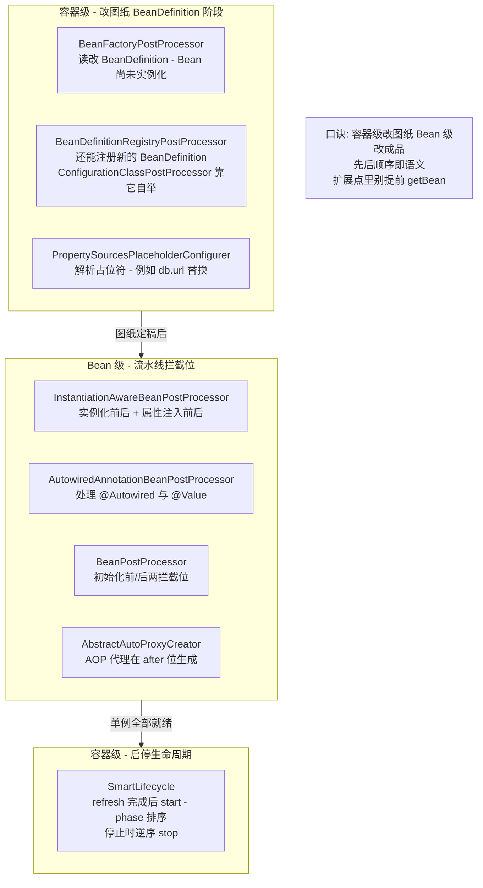
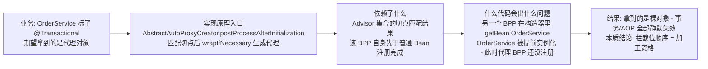
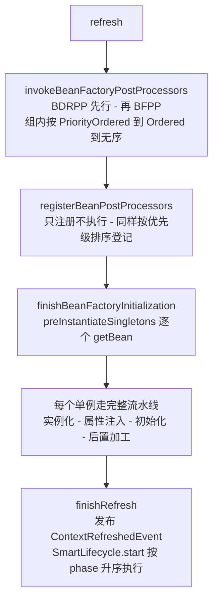
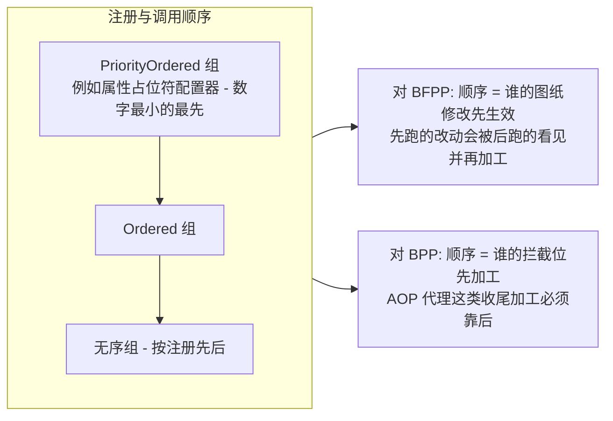
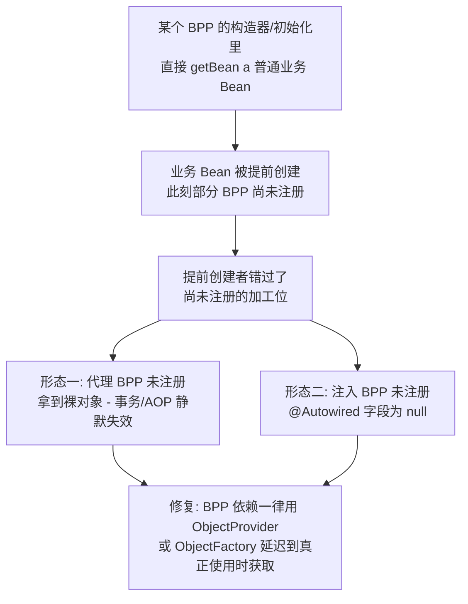

# BeanPostProcessor 与扩展点全景：触发时机图、顺序控制与真实事例

> `@Autowired`、`@Value`、`@PostConstruct`、AOP 代理、占位符解析——这些「理所当然」的能力，全部由一小撮扩展点实现。Spring 的设计思想是把自身功能的九成建立在自己的扩展点上：改图纸的 BeanFactoryPostProcessor、加工成品的 BeanPostProcessor、管启动停止的 SmartLifecycle。本篇给出一张完整的触发时机图、顺序控制规则，以及扩展点误用引发代理缺失的经典事故形态。

## 一句话摘要

Spring 扩展点的本质是**「把容器流水线的每个固定阶段都留出一个拦截位」**：容器级扩展点（BeanFactoryPostProcessor）在 Bean 还没实例化时修改「图纸」（BeanDefinition）；Bean 级扩展点（BeanPostProcessor 家族）在实例化、属性注入、初始化的前后加工「半成品与成品」；SmartLifecycle 则管容器 refresh 之后的启动与停止。**顺序即语义**——扩展点按 PriorityOrdered → Ordered → 无序被调用，谁先注册谁先跑，错误顺序最典型的代价是提前实例化的 Bean 错过部分加工位（如代理缺失）。

## 🎯 本文核心

**核心一句话：Spring 容器是「流水线 + 一排标准拦截位」的架构——扩展点不是附加品而是 Spring 自己的功能实现方式（@Autowired 靠 InstantiationAwareBeanPostProcessor、AOP 代理靠 postProcessAfterInitialization、占位符靠 BFPP）；理解扩展点只需记住两张图：容器 refresh 的阶段图与单个 Bean 创建的流水线图，每个拦截位挂谁、按什么顺序挂，全部可从图上推出来。**

机制链（本篇结构挂这条链上）：两级扩展点的职责分野 → refresh 源码关键路径 → 单 Bean 流水线上的拦截位 → 初始化三连的精确顺序 → 顺序控制规则与提前实例化陷阱 → 真实事例形态与量级分档策略。

## 一图看懂：Spring 扩展点全景

## 一、两级扩展点：改图纸与改成品

扩展点家族看着庞杂，职责分野只有一条线：**Bean 还没出生时改的是图纸（BeanDefinition），出生过程中改的是实体（Bean 实例）**。

| 扩展点 | 工作对象 | 触发时机 | 代表实现 |
|---|---|---|---|
| BeanFactoryPostProcessor | BeanDefinition（图纸） | 单例实例化之前，一次性 | PropertySourcesPlaceholderConfigurer |
| BeanDefinitionRegistryPostProcessor | 注册表（图纸柜） | BFPP 之前，可注册新定义 | ConfigurationClassPostProcessor（@Bean/@ComponentScan 落地） |
| InstantiationAwareBeanPostProcessor | Bean 实例 | 实例化前后、属性注入前后 | AutowiredAnnotationBeanPostProcessor（@Autowired） |
| BeanPostProcessor | Bean 实例 | 初始化方法前/后 | AbstractAutoProxyCreator（AOP 代理） |
| SmartLifecycle | 容器 | refresh 完成后 start / close 前 stop | 消息监听容器（公开口径） |

用一个具体例子把「容器级」讲实：配置里的 `${db.url}` 是怎么变成真实连接串的？`PropertySourcesPlaceholderConfigurer`（一个 BFPP）在所有 Bean 实例化之前，遍历每个 BeanDefinition 的属性值，把占位符从 Environment 解析后**直接改写在图纸**上——后续实例化拿到的已经是解析完的字符串。如果把它放进 Bean 级扩展点做，每个 Bean 都要在注入后再改一遍字段，且改不动 `@Value` 已注入的原始类型——**「改图纸」必须发生在实例化之前，这是职责分野的结构必然，不是风格偏好**。

### BeanPostProcessor 的组件四要素：以 AOP 代理位为例

这张图就是本篇最重要的原理：**普通 Bean 的加工由「当时已注册的 BPP 集合」负责，BPP 自己也是 Bean**——于是「BPP 依赖普通 Bean」会让后者在加工体系不完整时被提前实例化，拿到什么全凭当时注册到哪一步。这不是偶发 Bug，是流水线结构的固有性质。

## 二、refresh 源码关键路径：扩展点挂载的全景时刻表

容器启动的方法级路径（公开源码口径，`AbstractApplicationContext#refresh`）：

三个阶段各有一个高频误解，在这里钉死。**误解一**：「BPP 在启动早期就干活」——实际 `registerBeanPostProcessors` 只登记，真正的加工发生在每个普通 Bean 创建时；**误解二**：「BFPP 每次获取 Bean 都会跑」——它整个容器生命周期只跑一次，改图纸的机会只有一次；**误解三**：「ContextRefreshedEvent 与 SmartLifecycle 等价」——事件是「广播一条消息」，SmartLifecycle 是「带 phase 排序的启停契约」，需要 stop 语义或严格的先后启动顺序时，事件给不了。

### 单 Bean 流水线：拦截位逐个看

初始化三连的精确顺序（公开文档口径）值得单独背下来：**`@PostConstruct` → `InitializingBean.afterPropertiesSet` → 自定义 init-method**。追问一层：为什么是这个顺序？再深一层看——`@PostConstruct` 是标准注解驱动（最早、最「声明式」），`afterPropertiesSet` 是 Spring 接口驱动（属性注入完成后校验状态的地方），init-method 是配置驱动（把初始化代码与 Spring API 解耦）。三者是「注解 > 接口 > 配置」的声明强度排序，越具体的越先执行——这是顺序背后可推理的设计取舍，不需要死记。

## 三、顺序控制：PriorityOrdered、Ordered 与提前实例化陷阱

扩展点的调用顺序规则一句话：**PriorityOrdered 全部先于 Ordered，Ordered 先于无序；同组内按 `getOrder()` 升序（值越小越先）**。这个规则对 BFPP 的分组执行与 BPP 的注册排序同时生效：

提前实例化陷阱是这套规则下的头号事故源，画出完整因果链：

排查复盘视角看一次典型事故形态：某服务上线后部分 Bean 的 `@Transactional` 不生效，但同一个类的其他实例行为正常、本地无法复现。第一轮排查对着重看注解与代理配置，一无所获；第二轮在启动日志里发现该 Bean 的创建时间早于代理基础设施 Bean 的注册日志，进而定位到一个自定义 BPP 在构造器里 `getBean` 了它做参数校验——提前实例化导致代理位没赶上。复盘修复是依赖全部改走 `ObjectProvider`，并把「BPP/ BFPP 构造器与初始化回调中禁止 getBean 普通业务 Bean」写进规范。这类问题的排查心法一句话：**行为在「部分实例正常部分异常」之间摇摆时，先查创建顺序，再查加工配置**。

## 四、真实事例形态：扩展点能做什么、别人怎么做

- **配置侧（BFPP）**：占位符统一解析是教科书事例；工程中另一类形态是「动态改图纸」——启动时根据配置裁剪或替换 BeanDefinition（如按开关去掉某模块的 Bean 注册），以及自研配置中心在图纸层统一改写属性默认值。
- **注入侧（InstantiationAwareBPP）**：`@Autowired` 之外，自研框架普遍在此位实现「标注了某业务注解的字段自动注入客户端桩」，与 Spring 注入机制同构复用。
- **代理与增强侧（BPP after）**：AOP 代理之外，常见形态是方法埋点包装、接口幂等键校验包装——拿到成品 Bean 后判断是否需要包一层。
- **启停侧（SmartLifecycle）**：缓存预热、连接池提前建连、消息监听容器启动（公开口径：主流消息客户端的监听容器都实现了 Lifecycle 体系）。「启动期重活」放 SmartLifecycle.start 而不是 Bean 初始化回调，理由是 start 阶段单例已全部就绪且 phase 可编排先后——预热依赖「所有 Bean 就绪」这个前提，放初始化回调里必然踩到依赖未就绪。

## 五、不同量级的思考：架构约束驱动解法

### 十万级：业务工程的现成钩子策略

这一档的核心问题是**「选对现成的钩子」，而不是「自定义扩展点体系」**。约束来源是业务工程的扩展需求几乎总能被 `@PostConstruct`、`@Value`、事件监听覆盖，自定义 BPP 的维护成本大于收益。这一档用「现成注解驱动」的思考方式：初始化逻辑放 `@PostConstruct`（注意它执行时属性已注入完成），配置解析交给占位符体系；自下而上看，这一档的问题多是把初始化写错位置（如静态块里访问注入字段）；触发升级的信号是出现「要拦截多个 Bean 的统一行为」，注解钩子开始不够用。

### 千万级：多模块与 starter 的顺序治理

这一档的核心问题是**「跨模块的扩展点顺序成为契约」，而不是「每个模块内部写对」**。约束来源是多个 starter 各带扩展点后，注册顺序由装配路径共同决定，谁先加工决定了行为组合（例如「先加密包装还是先审计包装」是业务语义差异）。这一档切换成「模块契约驱动」的思考方式：显式声明 `getOrder()` 并写入模块文档，集成测试覆盖「扩展点组合后的最终行为」；自下而上看，这一档的故障多是「单模块正确、组合后语义漂移」；触发升级的信号是扩展点数量上到两位数、或出现跨模块的先后依赖。

### 亿级：平台内核的扩展点体系与审计

这一档的核心问题是**「扩展点本身成为平台的编程模型」，而不是「用 Spring 的扩展点解决问题」**。约束来源是平台型产品要把「第三方能力接入」变成受控流程：自定义扩展点接口、隔离加载、顺序审计、失效降级都要体系化——Spring 原生扩展点退化为内核的底层机制。这一档用「内核预算驱动」的思考方式：每个注册进平台的扩展点有生命周期审计（谁注册、何时销毁）、启动耗时预算（扩展点拖慢启动是平台事故）、行为回放验证；自下而上看，治理对象从「代码」变成「扩展点集合的拓扑」；触发升级的信号是插件互踩、启动时间随插件数线性劣化。

跨档回看：这一档的核心问题是所有档位同构的——**「扩展点的顺序与时机本身就是架构契约」**；量级演进的只是契约的粒度：从「一个工程内的注解选择」，演进到「跨模块的顺序协议」，再到「平台的编程模型」。

## 六、业内惯例与生产实践

- **BPP 的依赖一律 `ObjectProvider`**：把「拿依赖」推迟到方法调用时，从结构上消灭提前实例化——这是 Spring 官方文档反复强调的惯例（公开口径），也是本次事故复盘的核心修复。
- **重活放 SmartLifecycle，轻活放 @PostConstruct**：启动期需要网络/大资源准备的动作放 start 阶段（可 phase 编排、可 stop 回收），字段校验与轻量初始化放 `@PostConstruct`——两者混用是启动卡顿的常见来源（业内认知）。
- **BFPP 里不做重 IO**：它阻塞整个容器的图纸定稿；配置读取交给 Environment/配置中心客户端的异步机制，BFPP 只做内存内的定义改写。
- **一次真实的排查叙事**：启动日志里出现「某 Bean 的 @Value 注入了占位符原文」。复盘发现团队自研的 BFPP 抢在了 `PropertySourcesPlaceholderConfigurer` 之前执行，把含占位符的图纸先固化成了 Bean 实例——顺序问题第一次以「值不对」而非「行为不对」的形式出现。修复后把「自定义 BFPP 的 order 必须晚于占位符处理器」写进脚手架默认配置。

## 七、追问链：打破砂锅问到底

**追问一：为什么 AOP 代理不单独设一个「代理阶段」，而是复用 BeanPostProcessor 的 after 位？** 再深一层：如果每种加工都设专属阶段，流水线会随功能增长不断改结构；复用统一的拦截位，任何新加工能力（代理、埋点、包装）都是「注册一个 BPP」——这是 Spring 自举设计的底层哲学：**框架功能下沉为扩展点实现，内核只提供流水线**。ConfigurationClassPostProcessor 处理 `@Configuration`、AutowiredAnnotationBeanPostProcessor 处理 `@Autowired`，同一逻辑反复印证。

**追问二：为什么不用 ApplicationListener 替代 SmartLifecycle 做启动编排？** 再深一层：事件是「通知语义」，收到即自由行动，没有先后契约也没有停止回调；SmartLifecycle 是「启停语义」——phase 决定 start 顺序、stop 逆序执行、`isAutoStartup` 决定是否跟随容器。需要编排能力时，通知模型表达不了依赖关系，这是两个机制的语义分界，不是能力强弱问题。

**追问三：`@PostConstruct` 里做重活到底会怎样？打破砂锅**：它执行时该 Bean 属性已注入，但**其他 Bean 可能还没创建**——重活若依赖「容器里某组件已就绪」，就在赌创建顺序；重活耗时则直接计入单例预实例化阶段，表现为启动整体变慢且无法与别的 Bean 并行。正解是把「依赖多数 Bean 就绪的重活」上移到 SmartLifecycle.start，把初始化回调留给「只依赖自身注入字段」的逻辑。

## 💡 实战提示

💡 **自定义 BPP 的依赖注入只用 ObjectProvider**：构造器与初始化回调里出现 `getBean(业务Bean)` 一律视为缺陷——它会改变对方 Bean 的创建时机与加工完整性，且故障形态（代理缺失/null 注入）离根因很远。

💡 **给扩展点加「执行足迹」日志**：自定义 BFPP/BPP 在方法入口打一行 debug 日志（含 order 值），排查顺序问题时这条日志就是时间线，成本极低收益极高。

💡 **启动顺序问题先看创建日志再改代码**：Spring 启动日志按创建顺序输出 Bean 名单，「谁的创建时间早于谁的注册时间」直接回答了「谁错过了谁的加工」——先取证再修复，避免盲改 order。

💡 **启动耗时治理从扩展点下手**：preInstantiateSingletons 阶段的耗时大头常是某个 BFPP 的同步 IO 或某个 Bean 初始化回调里的远程调用；火焰图 + 启动日志对齐，能快速把「卡在哪个扩展点」钉住（业内认知）。

## Trade-off：扩展点能力与代价账本

| 扩展点 | 买到 | 代价 | 适用 |
|---|---|---|---|
| BeanFactoryPostProcessor | 改图纸：定义级批量修改 | 阻塞图纸定稿；只能操作元数据 | 占位符/定义裁剪/批量改属性 |
| BeanPostProcessor 家族 | 加工每个成品实例 | 顺序敏感；提前实例化风险 | 注入、代理、包装类加工 |
| @PostConstruct | 最轻量的单 Bean 初始化 | 无编排能力、时机固定 | 自身状态初始化 |
| SmartLifecycle | start/stop 全生命周期 + phase 编排 | 实现成本高于回调 | 预热、监听容器、启停依赖 |

取舍的核心：**越上层的扩展点买到越完整的容器语义，也承担越多的顺序责任**——按「需要的容器语义强度」选层，别为小事上重型机制。

## 什么时候用得上这份知识 / 什么时候不必

**值得深究**：排查「注入为 null / 代理缺失 / 启动顺序错乱」（时机图与提前实例化链直接可用）；开发 starter 与内部框架（扩展点是唯一正道）；治理启动耗时与平台插件体系（顺序审计直接可用）。**不必深究**：普通业务代码里纠结「@PostConstruct 与 afterPropertiesSet 谁先」之外的组合细节——记住三连顺序一个结论就够日常使用；把精力放在「不提前 getBean、重活上移」两条纪律上收益更高。明确推荐：脚手架层固化「ObjectProvider 依赖 + 扩展点足迹日志 + order 声明」三项默认，顺序类事故可以消灭大半。

## 你们可能会问

**Q1：BeanPostProcessor 能拦截自己吗？** 能注册但不能加工自己——它的注册阶段早于普通 Bean，而它自身的创建发生在注册流程里，谁给它加工取决于当时已注册的其他 BPP。这也是「BPP 之间避免互相依赖」的原因：依赖环会让加工顺序不可推理。

**Q2：ContextRefreshedEvent 能收到多次吗？** 层次化容器（父子容器）场景下，子容器 refresh 完成会发布、父容器完成也发布，监听器可能被多次触发；SmartLifecycle.start 同理会随各容器分别调用。做「全局只执行一次」的初始化时要用幂等保护或判断容器身份（业内常见坑，公开口径）。

**Q3：怎么给自研 starter 的扩展点确定 order？** 先查它必须晚于谁（占位符处理、MyBatis mapper 扫描这类基础设施有公认顺序），再查谁可能依赖它；把结论写成常量与文档，靠「跑一次看日志」定 order 的做法会把顺序契约埋进运气里。

**Q4：AOT/Native 镜像下扩展点还有效吗？** 有效但受约束：运行时动态注册与反射类加工的能力被裁剪，扩展点需要在构建期可推导（公开口径，Spring AOT 文档）。这正是「扩展点动态性 vs 预编译确定性」这条演进主线的现实约束。

## 留一个开放问题

Spring 的扩展点体系建立在「运行时反射 + 动态代理」的动态性上，而 AOT/Native 把天平推向「构建期确定性」——扩展点的拦截能力与预编译的推导能力如何长期共存？如果未来「启动期加工」逐步移到「构建期完成」，BeanPostProcessor 的语义会不会分化成「构建期扩展点」与「运行期扩展点」两层？这个问题决定下一代容器编程模型的形态，值得跟踪 Spring AOT 的演进。

## 5W 速记卡

| 维度 | 要点 |
|---|---|
| What | 扩展点 = 流水线上的标准拦截位：容器级改图纸、Bean 级改成品、SmartLifecycle 管启停 |
| Why | Spring 自举设计：框架功能下沉为扩展点实现，内核只保留流水线 |
| When | BFPP 一次性（实例化前）；BPP 随每个 Bean 创建执行；SmartLifecycle 在 refresh 完成后 |
| Where | refresh 源码路径：invokeBeanFactoryPostProcessors → registerBeanPostProcessors → preInstantiateSingletons |
| How | 顺序规则 PriorityOrdered > Ordered > 无序；依赖用 ObjectProvider 消灭提前实例化 |

## 自测三问

1. `@Autowired`、`@PostConstruct`、AOP 代理分别由哪个扩展点实现、挂在流水线哪个位？
2. BPP 构造器里 `getBean` 一个业务 Bean 会引发什么连锁后果？为什么 ObjectProvider 能根治？
3. `@PostConstruct` → `afterPropertiesSet` → init-method 的顺序背后是什么设计取舍？为什么重活不该放第一层？

## 🎯 核心带走

**Spring 扩展点的全景就是两张图：refresh 的容器阶段图（BFPP 改图纸 → BPP 注册 → 单例流水线 → SmartLifecycle 启动）与单 Bean 的流水线图（实例化 → 属性注入 → Aware → 初始化三连 → 代理加工）。Spring 自己的 @Autowired、@PostConstruct、AOP 全是扩展点的租户——理解了「拦截位 + 顺序即语义」就理解了容器的扩展模型。头号陷阱是扩展点提前 getBean 让业务 Bean 错过加工位（代理缺失/null 注入），根治靠 ObjectProvider；顺序治理靠 PriorityOrdered/Ordered 显式声明与足迹日志。选型口诀：改图纸用 BFPP，加工成品用 BPP，重活启停用 SmartLifecycle，自身初始化用 @PostConstruct。**

## 📌 数据与事实声明

- refresh 流程、Bean 生命周期回调顺序、扩展点调用顺序规则：依据 Spring Framework 官方文档与公开源码口径，类名与方法名随版本演进可能调整，以目标版本为准。
- 「框架功能由扩展点实现」的表述基于 Spring 公开源码中 ConfigurationClassPostProcessor、AutowiredAnnotationBeanPostProcessor、AbstractAutoProxyCreator 等公开实现；启动耗时与事故频率类结论为业内认知。
- 事故叙事已匿名化与形态抽象，不指向任何真实公司、系统或数据；示例中的类名与注解均为公开教学示例。

## 📚 参考资料

| 资料 | 说明 |
|---|---|
| Spring Framework 官方文档（IoC 容器与 Bean 生命周期章节） | 回调顺序与扩展点契约的权威口径 |
| spring-framework 源码（GitHub 公开仓库） | AbstractApplicationContext#refresh 与 AbstractAutowireCapableBeanFactory 的源码级参考 |
| Spring Boot 官方文档（Spring AOT 与 Native 章节） | 预编译对扩展点动态性约束的公开说明 |
| 《Spring 源码深度解析》类公开技术书籍 | 容器启动与扩展点源码走读的系统性中文材料 |
| Spring 官方博客与工程实践公开分享 | SmartLifecycle 与启动编排的工程惯例 |
