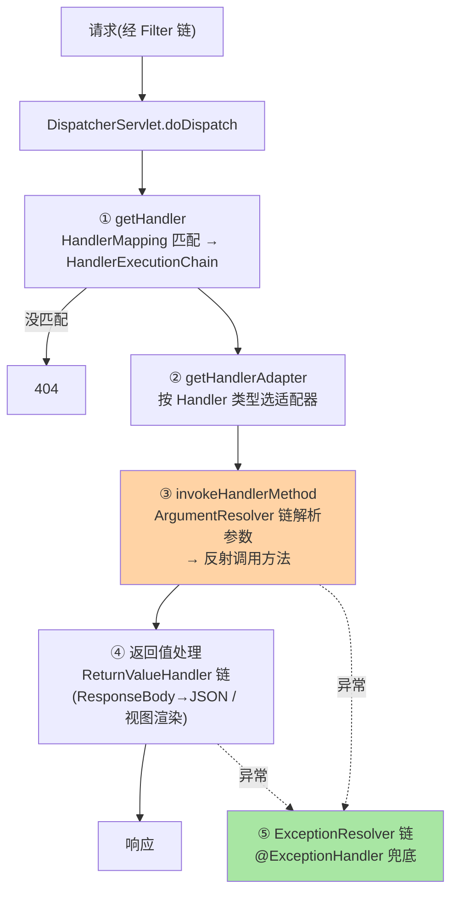
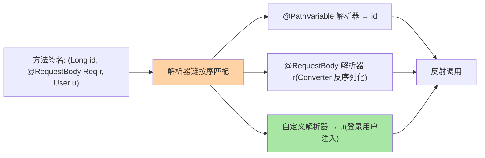
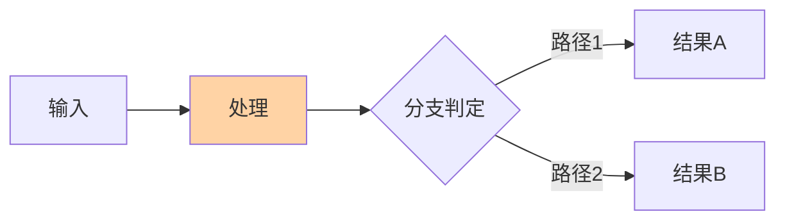

# DispatcherServlet 分发与参数解析源码：一次请求的完整调度

> HTTP 请求进入 Boot 应用后到 Controller 返回，中间是一条**精确的调度流水线**：`DispatcherServlet.doDispatch` → 处理器映射 → 处理器适配器 → 参数解析链 → 方法调用 → 返回值处理链 → 内容协商渲染。这篇以 Framework 7.0 源码走读全链——参数绑定异常、404、内容协商的排障都以它为地图。

> **本文核心**：doDispatch 五步——**① getHandler**（HandlerMapping 找「URL + 方法」对应的 HandlerExecutionChain，含拦截器）→ **② getHandlerAdapter**（按 Handler 类型选适配器）→ **③ invokeHandlerMethod**（参数解析器链逐个解析参数 → 反射调用 Controller 方法）→ **④ 返回值处理**（HandlerReturnValueHandler 链：@ResponseBody 走 JSON、ModelAndView 走视图）→ **⑤ 异常处理回卷**（任何环节抛异常 → HandlerExceptionResolver 链兜底）。**机制链**：请求 → Filter 链（Servlet 规范层）→ DispatcherServlet → HandlerMapping → 参数解析（注解/类型转换/校验）→ 方法 → 返回值处理 → 响应。

从架构上下游看：DispatcherServlet 是「HTTP 层与业务层」的中间层——上游是网关/过滤器，下游是 Controller 方法，模块边界即「HTTP 语义 vs 业务语义」的分界线。

## 一句话摘要

DispatcherServlet 是「**前端控制器模式**」的实现：所有请求一个入口、统一调度——它把「URL 路由、参数装配、调用、渲染、异常」解耦成可插拔的组件链（HandlerMapping/ArgumentResolver/ReturnValueHandler/ExceptionResolver 都是策略链 + 扩展点）。**参数解析是定制高发区**：HandlerMethodArgumentResolver 链按序匹配（@RequestBody 的 RequestResponseBodyMethodProcessor、@PathVariable 的解析器、自定义解析器可插队）——「自定义参数怎么自动注入」的答案就是「注册自定义 ArgumentResolver」。**内容协商**（同一方法返回 JSON 或 XML 由 Accept 头决定）发生在返回值处理段——理解三段职责边界（解析参数/调方法/处理返回），Spring MVC 的扩展点全部有坐标。

## 一、边界：入门层讲过什么，本文讲什么

| 内容 | 入门层（篇 9/10） | 本文 |
|---|---|---|
| @Controller/@GetMapping 与参数注解用法 | ✅ 讲过 | 不重复 |
| doDispatch 五步与组件链 | 未讲 | **本文核心一** |
| 参数解析器链与类型转换 | 未讲 | **本文核心二** |
| 返回值处理与内容协商 | 未讲 | **本文核心三** |

## 二、doDispatch 五步全景



**拦截器的执行点**：HandlerExecutionChain 在③前后插入 preHandle/postHandle/afterCompletion——**异常时 afterCompletion 必执行（资源清理的可靠位置）、postHandle 不执行**（正常返回才走）——拦截器语义的排障要点。

参数解析的「按序匹配」示意：



## 三、参数解析链：从 HTTP 到方法签名的翻译

```text
invokeHandlerMethod 内部:
argumentResolvers(按序):
  RequestParamMethodArgumentResolver      // ?name=x → String name
  PathVariableMethodArgumentResolver      // /orders/{id} → @PathVariable
  RequestBodyMethodArgumentProcessor     // JSON body → @RequestBody(读 HttpMessageConverter)
  ServletModelAttributeMethodProcessor   // 表单字段 → 对象(数据绑定+校验)
  ...
类型转换: TypeConverter/ConversionService(String → Integer/Date/枚举)
校验: @Valid → WebDataBinder.validate → BindingResult(不抛异常,结果进参数)
```

**两条工程高价值机制**：① **解析器按序匹配、首个支持者胜出**——自定义解析器想插队要放链前（WebMvcConfigurer.addArgumentResolvers 默认追加到尾部——想优先就换扩展点或用 @Order 语义理解排序）；② **HttpMessageConverter 是 @RequestBody 的底层**（Jackson/Gson 由 classpath 决定装配，互指装配系列）——「JSON 字段对不上」的排障路径是 Converter 配置与反序列化规则（Jackson 的命名策略/日期格式是高频配置事故位）。**参数绑定失败的表现**：MethodArgumentTypeMismatchException（类型转换失败，400）——异常信息里的「目标类型与实际值」是定位线索。

## 四、返回值处理与内容协商

返回值处理器链对返回值分类处理：@ResponseBody/ResponseEntity → `RequestResponseBodyMethodProcessor`（写 JSON：对象 → Converter 序列化 → 响应流）；String/ModelAndView → 视图渲染（传统模板场景）；void → 直接响应。**内容协商**（ContentNegotiationManager）：按 Accept 头/后缀/参数决定响应格式（同一 URI 出 JSON 或 XML）——REST API 的格式适配机制，默认策略 Accept 头优先（策略可配，strategies 顺序是定制点）。

## 五、源码关键路径（Framework 7.0 口径）

```text
DispatcherServlet.doDispatch()
 ├─ getHandler(request)                    // ① 遍历 HandlerMapping(RequestMappingHandlerMapping 为主)
 │    → HandlerExecutionChain(handler + interceptors)
 ├─ getHandlerAdapter(handler)             // ② RequestMappingHandlerAdapter
 ├─ ha.handle(request, response, handler)  // ③④
 │    └─ RequestMappingHandlerAdapter.invokeHandlerMethod()
 │        ├─ argumentResolvers.resolveArgument()   // 参数链(见上)
 │        ├─ InvocableHandlerMethod.invokeForRequest()  // 反射调用 Controller
 │        └─ returnValueHandlers.handleReturnValue()    // 返回值链
 ├─ processDispatchResult()               // 视图渲染(如适用)
 └─ catch → processHandlerException()      // ⑤ ExceptionHandlerExceptionResolver
                                      // → @ControllerAdvice 的 @ExceptionHandler 方法
```


## 质疑者追问链

**追问一层**：这个机制在极端场景下会不会失效？——失效条件与边界是理解机制深度的关键，不是背结论而是推边界。

**再追问**：官方文档没提的隐含假设是什么？——每个实现都有未文档化的前置条件，源码走读能发现这些隐含假设。

**再深一层**：如果换一种实现方式，会牺牲什么、得到什么？——反方案分析让机制理解从「知道怎么做」升级为「知道为什么这么做、代价是什么」。

## 六、典型场景

- **404 排查**：① 没匹配——URL/方法注解写错、组件没扫描（互指 IoC 篇 1 图纸来源）、或被静态资源处理器吃掉——DispatcherServlet 的 noHandlerFound 行为与 Boot 的静态资源兜底是常见混淆点
- **自定义参数注入**：登录用户自动注入（HandlerMethodArgumentResolver 实现 + 注册）——「每个方法开头三行取用户」的横切消除，比拦截器 + request attribute 更类型安全
- **全局异常体系**：@RestControllerAdvice + @ExceptionHandler 承接⑤——按异常类型分派、与错误码体系联动（互指专题层工程实战篇 2）

## 业内惯例

- **Controller 薄、参数校验前置**：@Valid + BindingResult 在参数解析段完成校验——校验逻辑进 Controller/Service 是层次混乱，注解校验 + 分组校验覆盖 90%
- **REST API 默认 JSON 单格式**：内容协商开多格式（XML/多语言）按需配——默认 JSON-only 让 Accept 头的歧义最小化（协商策略的复杂度是隐性成本）
- **异步/响应式分栈**：Servlet 栈（本文）与 WebFlux（DispatcherHandler 不同实现）不混用——栈由应用类型决定（互指启动系列的类型推断）
- **3.x/4.x 视角**：doDispatch 结构与组件链跨版本高度稳定；演进在 API 版本化（4.x 的 API Versioning 支持）与 null-safety 元数据——调度机制知识的保值度高

## 七、常见误区

- **「404 = 路径写错」**：还包括 Handler 没注册（扫描范围）、静态资源兜底、context-path 前缀——按①的机制链逐环排查
- **拦截器当过滤器用**：Filter 在 Servlet 层（DispatcherServlet 之前，能改请求流）、Interceptor 在调度链内（拿得到 Handler 信息）——「要知道调用了谁」用拦截器，「字节流层面加工」用 Filter
- **@ResponseBody 忘标走了视图解析**：返回 String 被当视图名解析（404 视图）——@RestController 的类级注解容易掩盖单方法的缺失
- **参数校验注解不生效**：@Valid/@Validated 缺失（解析器的校验触发点）或嵌套对象漏 @Valid 级联——校验链的触发是显式的不是自动的

## 八、你们可能会问

**Q1：一个 URL 匹配多个方法会怎样？**
启动期直接报 Ambiguous mapping（RequestMappingHandlerMapping 注册时校验）——映射冲突在启动暴露而不是运行时随机——这是「快速失败」设计。

**Q2：HandlerMapping 有哪些？怎么扩展？**
内置 RequestMappingHandlerMapping（注解式）、BeanNameUrlHandlerMapping（遗留）、RouterFunctionMapping（函数式端点）、静态资源映射——自定义映射实现 HandlerMapping 接口（URL → Handler 的判定逻辑自己定，框架集成场景）。

**Q3：文件上传走哪条链？**
MultipartResolver 在 DispatcherServlet 入口前置（把 multipart 请求解析成包装 request）→ 参数解析段 MultipartFile 作为普通参数解析——大文件的流式处理是 MultipartResolver 配置（阈值/临时目录）的关注点。

## 九、自测三问

1. doDispatch 五步与各步的失败表现？
2. 参数解析链的「按序匹配」语义与自定义解析器的注册位置？
3. 拦截器三回调的执行保证（postHandle 不保证/afterCompletion 保证）？

## 开放问题

- 函数式端点（RouterFunction）与注解式的双轨——注解式的声明密度 vs 函数式的组合灵活性，轻量场景函数式在增长，但注解式的主流地位在 7.0 依然稳固。
- 声明式 HTTP 客户端（HTTP interface）与服务端调度的对称性增强，端到端类型安全的全链路（客户端接口 → 服务端方法签名）是演进方向。

## 📎 核心带走

- **核心一句话**：DispatcherServlet = 前端控制器的五步调度（映射→适配→参数解析调用→返回值处理→异常回卷），全组件可插拔
- **机制链**：Filter 链 → getHandler（含拦截器链）→ 适配器 → ArgumentResolver 逐参解析（转换+校验）→ 反射调用 → ReturnValueHandler（内容协商）→ 异常走 ExceptionResolver
- **失效点/边界**：404 多因；拦截器 postHandle 无保证；校验触发是显式的；双栈不混用

## 💡 实战提示

- 💡 调度问题开 DispatcherServlet 的 DEBUG/TRACE 日志（每步命中哪个组件一目了然）——最强排障开关
- 💡 自定义参数解析器（登录用户注入）优于拦截器塞 attribute——类型安全且自带文档
- 💡 决策口径：Filter vs Interceptor vs ArgumentResolver——字节流/拿到 Handler 语义/组装参数，三层各归其位
- 💡 注解式与函数式端点的取舍：声明密度 vs 组合灵活——常规 CRUD 注解式，动态路由/轻网关语义选函数式


## 量级分档视角

10 万 QPS 以内的请求量，框架层的拦截/解析开销可忽略；千万级以上需要关注 DispatcherServlet 的 handler mapping 耗时与拦截器链长度对 P99 的影响。


## 补充图表



## 📌 数据与事实声明

- 写于 2026-09-10，源码主线 Spring Framework 7.0.9（gh 实测）；doDispatch 结构跨 3.x/4.x 稳定，4.x 差异（API 版本化等）已标注
- 免责：源码细节以 GitHub 当前主线为准

## 📚 参考资料

| 类型 | 标题 | 来源 |
|---|---|---|
| 官方源码 | spring-framework（DispatcherServlet / RequestMappingHandlerAdapter） | github.com/spring-projects/spring-framework |
| 官方文档 | Spring Framework Docs（Web Servlet → MVC） | docs.spring.io |
| 关联系列 | 本系列篇 2 / 自动装配系列（Converter 装配互指） | 本目录 |
