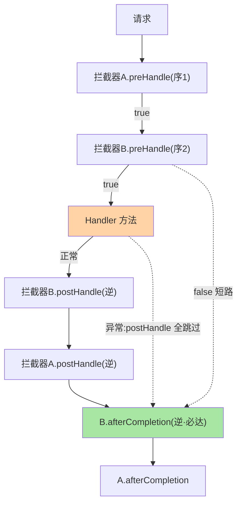
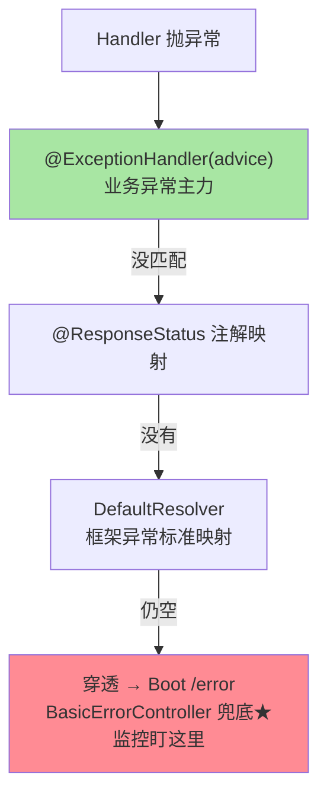
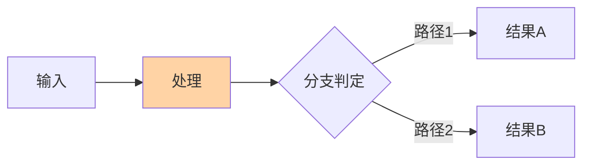

# 拦截器与异常处理源码：调度链上的治理位

> 拦截器（Interceptor）与全局异常处理（@ControllerAdvice）是 Web 层治理的两大挂载位——一个截获正常流转的请求做横切，一个兜住全链异常做收口。这篇拆两者的源码机制、执行保证与选型边界，是篇 1 调度链的「治理位」深钻。

> **本文核心**：拦截器三回调的**执行保证矩阵**（preHandle 按序、任一 false 短路；postHandle 仅正常路径、**逆序**；afterCompletion **必执行**（含异常路径）、逆序——资源清理只能放它）；异常处理链（HandlerExceptionResolver 链按序尝试，ExceptionHandlerExceptionResolver 把 @ControllerAdvice 的 @ExceptionHandler 方法做成「按异常类型分派的处理器」，**找不到兜底 resolver 则异常穿透给容器**）。**机制链**：请求 → 拦截器 preHandle（序）→ Handler → postHandle（逆序·正常）→ 渲染 → afterCompletion（逆序·必达）；异常任意环节 → DispatcherServlet 捕获 → Resolver 链 → @ExceptionHandler 方法（自身的参数解析/返回值处理复用调度链）。

从架构上下游看：拦截器链是「过滤器层与 Controller 层」的中间地带——上游 Filter 管协议层（编码/CORS），下游 Controller 管业务层（参数/返回值），模块边界即「HTTP 语义 vs 业务语义」的分界线。

## 一句话摘要

两个治理位的设计语义：**拦截器 = 「Handler 前后的横切钩子」**（与 Filter 的边界：拿到 HandlerMethod 元信息、能感知 MVC 语义——做接口级鉴权/审计/耗时统计的最佳位置）；**@ControllerAdvice = 「异常的集中分派中心」**（按异常类型匹配方法，方法本身走完整的参数解析与返回值处理——所以 @ExceptionHandler 里能注入 HttpServletRequest、能返回 ResponseEntity——**它是一个「特殊 Controller」**）。**执行保证矩阵**是拦截器正确使用的性命线：preHandle 返回 false 短路后续（含后续拦截器）但**已通过拦截器的 afterCompletion 照常执行**——「清理逻辑放 afterCompletion 而非 postHandle」的机制依据。

## 一、边界：入门层讲过什么，本文讲什么

| 内容 | 入门层（篇 11/12） | 本文 |
|---|---|---|
| 拦截器注册与 @ControllerAdvice 用法 | ✅ 讲过 | 不重复 |
| 三回调的执行保证矩阵 | 提了顺序 | **本文核心一**（源码级） |
| 异常解析器链与穿透机制 | 未讲 | **本文核心二** |
| 异常处理的分层设计（错误码/日志/兜底） | 未讲 | **本文核心三** |

## 二、拦截器执行保证矩阵



**矩阵速记**：preHandle 正序可短路；postHandle 逆序仅正常；afterCompletion 逆序**必达**（对「已通过 preHandle 的拦截器」）。**源码依据**（DispatcherServlet.doDispatch 的 finally 段触发 triggerAfterCompletion）——**资源清理、ThreadLocal 回收（traceId 等）只放 afterCompletion**，放 postHandle 的实现都埋着异常路径的泄漏雷。

异常的三层兜底漏斗：



## 三、异常处理链：分派与穿透

```text
processHandlerException()
 └─ HandlerExceptionResolver 链(按序):
     ExceptionHandlerExceptionResolver   // @ControllerAdvice/@ExceptionHandler(主力)
     ResponseStatusExceptionResolver     // @ResponseStatus 注解映射状态码
     DefaultHandlerExceptionResolver     // 框架异常标准映射(参数绑定→400 等)
     → 返回 ModelAndView(空=没处理,给下一个)
     → 链走完仍空 → 异常穿透 → 容器错误页/error 机制(Boot 的 BasicErrorController 兜底)
@ExceptionHandler 方法自身: 复用调度链(参数解析+返回值处理)
 → 能注入 request/能返回 ResponseEntity → "特殊 Controller"
```

**穿透机制的价值认知**：异常处理是**分层兜底**——业务异常（自定义体系）@ExceptionHandler 接住转错误响应；框架异常（参数绑定等）DefaultResolver 标准映射；**都漏掉的**进 Boot 的 /error（BasicErrorController——生产上它返回的白标页/通用 JSON 就是「漏网异常」的信号，监控要盯它）。**@ControllerAdvice 的作用域**：basePackages/classes 限定生效范围——多团队共享网关型应用里做「各管各的异常」。

## 四、源码关键路径（Framework 7.0 口径）

```text
拦截器执行(AbstractHandlerMapping.getHandler → HandlerExecutionChain):
 applyPreHandle()      // 正序,任一 false → triggerAfterCompletion(已通过的) 后中断
 applyPostHandle()     // 逆序,仅正常返回路径
 triggerAfterCompletion() // 逆序,preHandle 通过者必调用(doDispatch 的 finally 语义)
异常处理(见上链) + Boot 兜底:
 DispatcherServlet → error → ErrorController(BasicErrorController)
   // spring.mvc.throw-exception-if-no-handler-found 与 Boot 错误页机制是相邻配置位
```

## 五、典型场景

- **接口级鉴权/审计**：拦截器 preHandle 拿 HandlerMethod（方法上的自定义注解可读——「只拦截标注 @RequireLogin 的接口」按注解判定），比 Filter 的无差别拦截精准
- **异常体系分层落地**：业务异常（BizException + 错误码枚举）→ @ExceptionHandler(BizException) 统一转响应；参数异常 → 框架标准映射 + advice 微调文案；未知异常 → 兜底 advice 记日志返「系统繁忙」+ 告警——三层各就各位（互指专题层工程实战篇 2 的错误码体系）
- **traceId 全链路**：Filter 开链路（最早进入）→ MDC 注入 → 拦截器/业务读 MDC → afterCompletion 清理（或在 Filter 的 finally）——「Filter 进、Filter 出清」是更对称的写法（互指生产排障篇 3）

## 业内惯例

- **清理逻辑放 afterCompletion 或 Filter finally**——postHandle 放清理是潜伏雷（异常路径不执行）
- **未知异常兜底必须带日志与告警**——兜底 advice 只返「系统繁忙」不记日志 = 把事故静默化（日志 stackTrace + 告警指标是底线配置）
- **拦截器保持无状态**——拦截器是单例，成员变量即并发 bug——状态放 request attribute 或 ThreadLocal（配对清理）
- **3.x/4.x 视角**：拦截器/异常处理机制跨版本稳定；ProblemDetail（RFC 7807 错误响应标准，6.x 引入）是错误响应的标准化演进——新项目优先 ProblemDetail 而非自定义错误体


## 质疑者追问链

**追问一层**：这个机制在极端场景下会不会失效？——失效条件与边界是理解机制深度的关键，不是背结论而是推边界。

**再追问**：官方文档没提的隐含假设是什么？——每个实现都有未文档化的前置条件，源码走读能发现这些隐含假设。

**再深一层**：如果换一种实现方式，会牺牲什么、得到什么？——反方案分析让机制理解从「知道怎么做」升级为「知道为什么这么做、代价是什么」。

## 六、常见误区

- **postHandle 里改响应体**：@ResponseBody 的响应在 Handler 返回后已由ReturnValueHandler 写出（postHandle 时 JSON 已序列化）——改响应体的正确位是 ResponseBodyAdvice（针对 @ResponseBody 的加工钩子），不是 postHandle
- **异常处理里吞栈**：@ExceptionHandler 只转错误响应不留 log.error(ex)——排障时「线上报错但无栈」的根源；异常处理的第一行永远是记日志
- **拦截器里做重活**：每个请求都过的链——拦截器里的远程调用（鉴权查服务）是延迟放大器，本地缓存/令牌本地校验是标配
- **以为 @ControllerAdvice 能接 Filter 异常**：advice 在 DispatcherServlet 调度链内——Filter 抛的异常（DispatcherServlet 之前）它接不到——Filter 异常要么 Filter 内处理要么进容器 error 机制

## 七、你们可能会问

**Q1：拦截器和 Filter 怎么分工？**
时间轴：Filter（DispatcherServlet 前，字节流/编解码/全量无差别）→ 拦截器（调度链内，懂 Handler 语义/接口级）→ ArgumentResolver（参数级）——「无差别横切用 Filter、懂接口语义用拦截器、组装参数用解析器」三层递进（互指篇 1 的三层口径）。

**Q2：全局异常处理后响应码怎么定？**
业务异常按错误码体系映射（BizException 携带 code → advice 转换）；系统异常 500 + 通用文案；参数异常 400——响应码语义进团队规范（互指工程实战篇 2），ProblemDetail 是标准载体。

**Q3：异步请求（DeferredResult/SseEmitter）的拦截器行为？**
preHandle 正常走；postHandle/afterCompletion 在**初始请求线程结束时**触发（异步完成是另一段生命周期 AsyncHandlerInterceptor 的 afterConcurrentHandlingStarted）——异步场景的拦截器语义要看专门的异步回调，不能套同步矩阵。

## 八、自测三问

1. 三回调的执行保证矩阵？清理逻辑为什么只能放 afterCompletion？
2. 异常解析器链的三级与穿透兜底（/error 机制）？
3. @ExceptionHandler 为什么是「特殊 Controller」？

## 开放问题

- 错误响应的标准化（ProblemDetail/RFC 7807）普及后，自定义错误体的迁移成本与生态兼容是各团队的现实权衡——标准 vs 定制的边界在收敛。
- 拦截器/过滤器/切面的治理位统一建模（一份横切逻辑该放哪的决策树标准化）值得团队级沉淀，目前多靠经验口口相传。

## 📎 核心带走

- **核心一句话**：拦截器（三回调保证矩阵：pre 可短路/post 仅正常/after 必达）+ @ControllerAdvice（异常集中分派的特殊 Controller）是 Web 调度链上的两大治理位
- **机制链**：preHandle 正序 → Handler → postHandle 逆序（正常）→ afterCompletion 逆序（必达）；异常 → Resolver 链（advice → status 注解 → 默认）→ 穿透进 /error 兜底
- **失效点/边界**：postHandle 改不了已写出的响应体；advice 接不到 Filter 异常；拦截器必须无状态

## 💡 实战提示

- 💡 团队 wiki 放一张「三回调保证矩阵 + 三层横切分工（Filter/拦截器/解析器）」图——横切位错放是高频评审修正项
- 💡 兜底 advice 模板：log.error(带栈) + 告警指标 + 通用响应——三件缺一即静默化
- 💡 决策口径：新项目错误响应直接用 ProblemDetail（RFC 7807）——标准协议省下自造错误体的长期维护
- 💡 横切位三层分工的取舍：越靠外（Filter）越通用越不懂业务、越靠内（解析器）越懂语义越窄——横切逻辑放「能胜任的最内层」


## 量级分档视角

10 万 QPS 以内的请求量，框架层的拦截/解析开销可忽略；千万级以上需要关注 DispatcherServlet 的 handler mapping 耗时与拦截器链长度对 P99 的影响。


## 补充图表



## 📌 数据与事实声明

- 写于 2026-09-10，源码主线 Spring Framework 7.0.9（gh 实测）；机制跨 3.x/4.x 稳定，ProblemDetail 为 6.x+ 标准演进
- 免责：源码细节以 GitHub 当前主线为准

## 📚 参考资料

| 类型 | 标题 | 来源 |
|---|---|---|
| 官方源码 | spring-framework（HandlerExecutionChain / ExceptionHandlerExceptionResolver） | github.com/spring-projects/spring-framework |
| 官方文档 | Spring Framework Docs（Web MVC → Controllers/Exception） | docs.spring.io |
| 公开标准 | RFC 7807/9457 Problem Details | ietf.org |
| 关联系列 | 本系列篇 1 / 专题层工程实战篇 2 | 本目录 |
