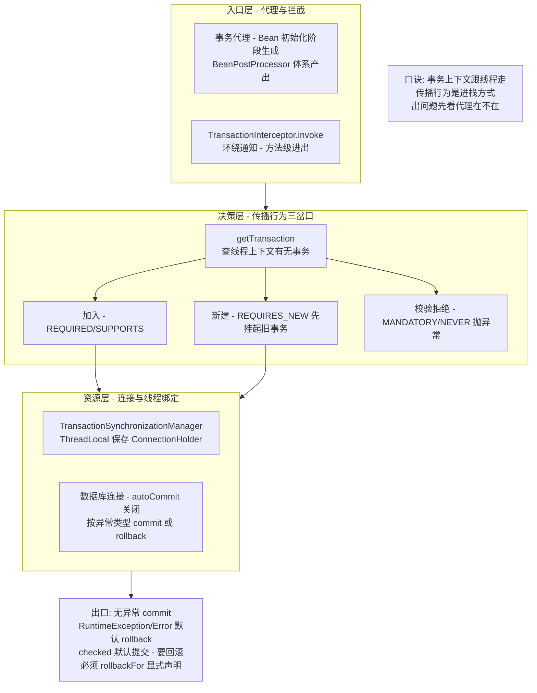
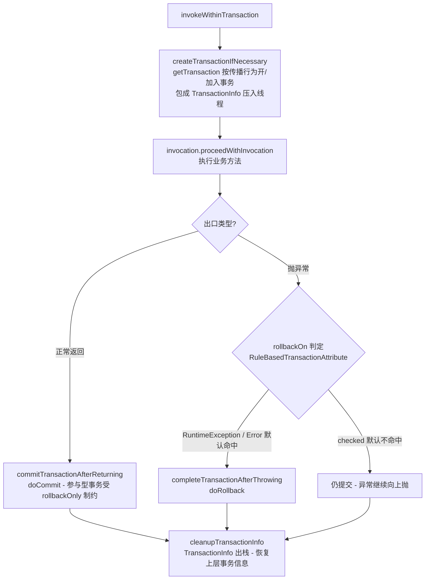
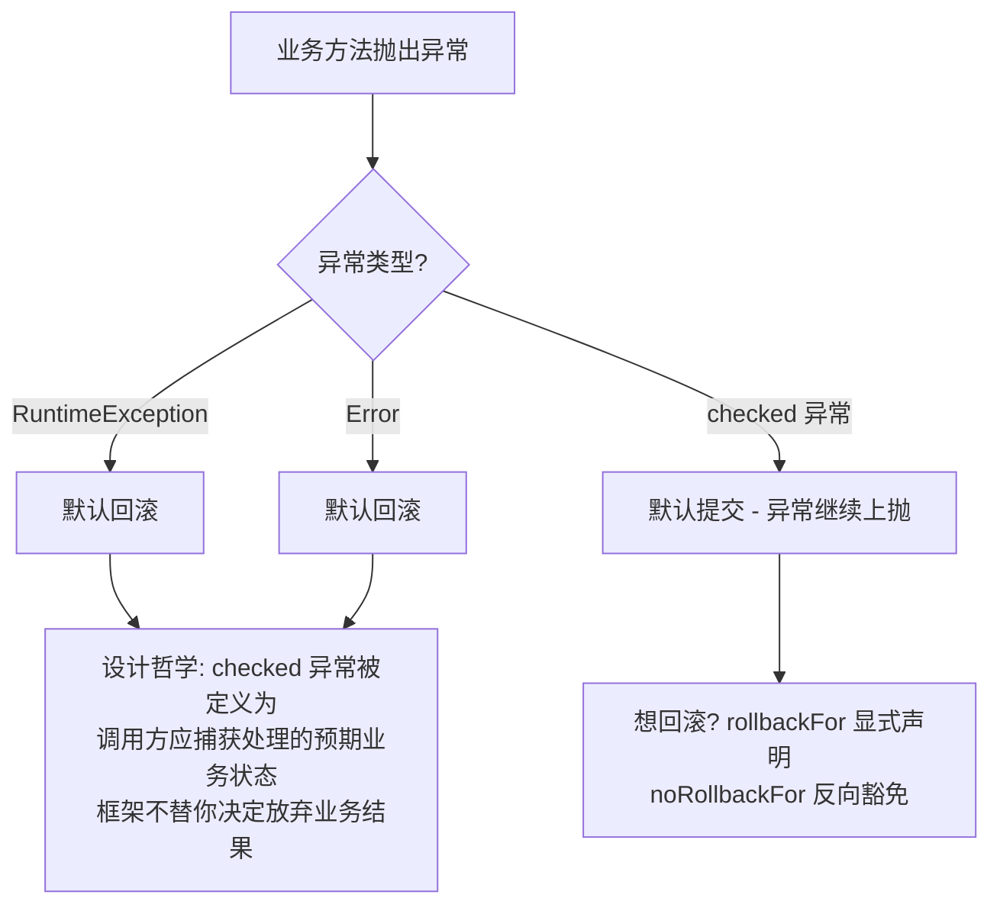
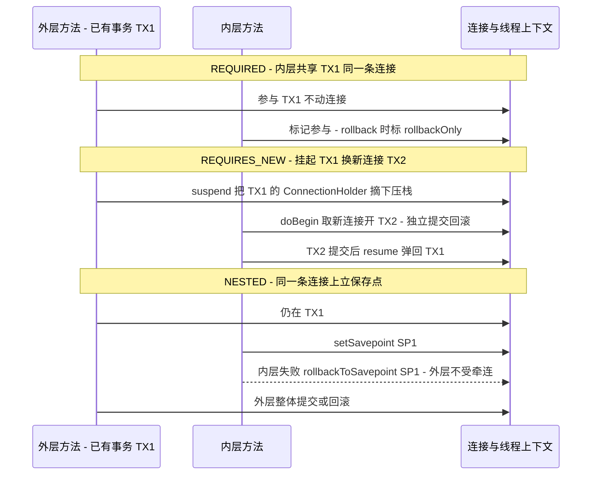
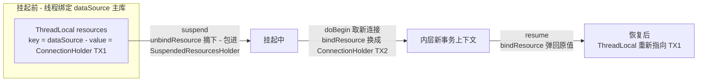
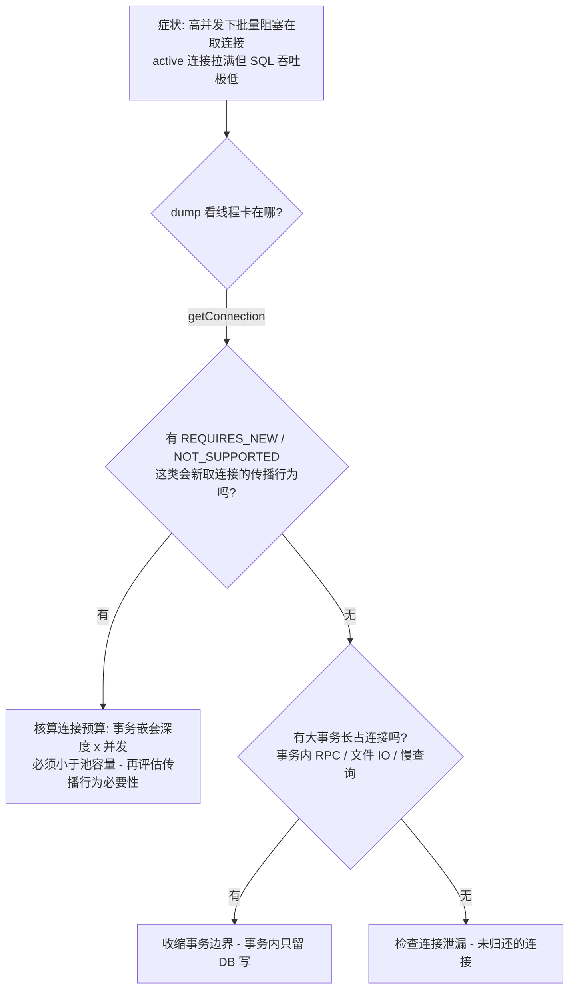

# 事务拦截器与传播行为实现：TransactionInterceptor 全流程与 ThreadLocal 栈

> `@Transactional` 加上就生效了吗？七种传播行为在源码里到底是几个 if 分支？挂起与恢复为什么天然「只认同一线程」？本篇从代理创建一路穿透到 `TransactionInterceptor.invoke` 与 `TransactionSynchronizationManager` 的 ThreadLocal 栈，把声明式事务的机制、边界与三种经典事故形态一次讲透。

## 一句话摘要

声明式事务的本质是**「一个环绕通知 + 一组线程绑定的事务上下文」**：事务代理在方法入口创建或加入事务（传播行为就是这里的分支逻辑），把数据库连接挂到当前线程的 ThreadLocal 上，出口按异常类型决定提交或回滚。传播行为的七种选择在源码里收敛为三个动作——**加入、新建、校验拒绝**；挂起/恢复则是「把当前连接从 ThreadLocal 摘下来压进栈、回来再弹回」，这个机制同时解释了它的一切边界：不跨线程、不跨代理、内层标脏外层必炸。

## 🎯 本文核心

**核心一句话：Spring 事务的全部行为都能从一个结构推导出来——「事务上下文是线程私有的栈，方法粒度进出栈」；传播行为是进栈方式的枚举，挂起恢复是栈的压弹，自调用失效是因为根本没走到代理这个入口，REQUIRES_NEW 连接耗尽是因为栈里每一层都独立持有连接。**

机制链（本篇结构挂这条链上）：代理从哪来（BeanPostProcessor 阶段）→ TransactionInterceptor.invoke 全流程 → 传播行为七种的源码分支 → 挂起/恢复与 ThreadLocal 栈 → 三种经典事故形态 → 事务边界与量级分档策略。

## 一图看懂：声明式事务的完整链路

## 一、代理从哪来：拦截链的装配路径

`@Transactional` 生效的第一前提是「这个 Bean 是代理」。Spring Boot 的装配路径（公开源码口径）：自动配置 `TransactionAutoConfiguration` 引入 `ProxyTransactionManagementConfiguration`，注册三类基础设施——切点信息源 `AnnotationTransactionAttributeSource`（负责识别方法/类上的 `@Transactional` 并解析属性）、事务拦截器 `TransactionInterceptor`、以及 `InfrastructureAdvisorAutoProxyCreator`——它本质是一个 **BeanPostProcessor**，在每个 Bean 初始化完成后检查「是否有方法匹配事务切点」，命中就生成代理（JDK 动态代理或 CGLIB）。

这条装配路径直接推出三条使用边界：**自调用不走代理**（`this.method()` 没经过代理对象，拦截器根本不介入）；**非 public 方法不拦截**（多数代理形态下属性源解析不到注解）；**final 方法 CGLIB 拦不住**（无法覆写）。理解「机制装配在哪一层」，边界就不需要背——从结构里自己长出来。

## 二、TransactionInterceptor.invoke 全流程

拦截器的源码关键路径（方法级穿透，公开源码口径）：`TransactionInterceptor.invoke` → 父类 `TransactionAspectSupport.invokeWithinTransaction`，主干只有三段：

两个容易漏看的细节。其一，**`TransactionInfo` 是压栈的**：多层事务方法嵌套时，每层方法入口把「我的事务状态」压进线程私有栈，出口弹出并恢复上一层——这就是「内层方法返回后，外层事务还在」的实现基础。其二，**参与型事务的提交是「礼让」的**：内层以 REQUIRED 加入外层事务后，`doCommit` 检查 `rollbackOnly` 标记，一旦内层标脏，外层提交时会转回滚并抛 `UnexpectedRollbackException`——这个异常不是 Bug，是框架在报告「你内层想回滚，但外层还在提交，两者矛盾，我按回滚处理了」。

### rollbackOn 的默认规则：为什么 checked 异常不回滚

追问一层：**为什么默认规则对 checked 这么「冷漠」？** 设计哲学上，受检异常的语义是「预期之内的业务状态」（余额不足、参数非法），调用方应当处理并决定是否保留已有写入；运行时异常的语义是「预期之外，状态不可信」。框架把这个语义区分翻译成了回滚默认值——**它不是偷懒，是把「异常语义决定事务语义」的判断交还给声明者**，代价是每个 `@Transactional` 都应当显式写 `rollbackFor`，把决策从「默认」升级为「声明」。

## 三、传播行为七种：源码里的三个动作

七种传播行为全部收敛在 `AbstractPlatformTransactionManager.getTransaction` 与其私有方法 `handleExistingTransaction` 的分支里（公开源码口径）。按「当前有没有事务」分两个平面：

| 传播行为 | 无当前事务时 | 有当前事务时 | 源码动作 |
|---|---|---|---|
| REQUIRED（默认） | 新开事务 | 加入当前事务 | participate，共享连接 |
| REQUIRES_NEW | 新开事务 | **挂起当前，开全新事务** | suspend → doBegin 新连接 |
| NESTED | 新开事务 | 建立保存点，嵌套执行 | `Connection.setSavepoint` |
| SUPPORTS | 非事务执行 | 加入当前事务 | participate |
| NOT_SUPPORTED | 非事务执行 | **挂起当前，无事务执行** | suspend → 裸跑 |
| MANDATORY | 抛 IllegalTransactionStateException | 加入当前事务 | 校验分支 |
| NEVER | 非事务执行 | 抛 IllegalTransactionStateException | 校验分支 |

三个动作里值得展开的是「新建」与「嵌套」的差异。REQUIRED 与 REQUIRES_NEW、NESTED 在无事务时完全一样（都 doBegin），**分化的全部逻辑发生在「已有事务」这个分支里**：

追问一层：**NESTED 与 REQUIRES_NEW 都是「内层独立回滚」，差别到底在哪？** 再深一层：REQUIRES_NEW 是**两个物理事务**（两条连接，外层回滚不影响已提交的内层）；NESTED 是**一个物理事务里的保存点**（一条连接，内层的独立只到回滚为止，外层回滚会连带内层一起滚——因为它们最终是同一个提交）。资源管理器不支持保存点时（如部分 JTA 场景，公开口径），NESTED 会退化为同步执行。这层原理差异直接决定选择：内层结果要「先锁定」用 REQUIRES_NEW，内层只是「外层的一步可撤销操作」用 NESTED——但后者依赖具体资源管理器能力，跨资源不可移植，这也是它在工程中出场率低的底层原因。

## 四、挂起与恢复：TransactionSynchronizationManager 的 ThreadLocal 栈

`DataSourceTransactionManager` 的事务上下文不存对象字段，全部存在 `TransactionSynchronizationManager` 的一组 **ThreadLocal** 里（公开源码口径）：核心是 `resources`（`Map<DataSource, ConnectionHolder>`——每个数据源对应一个「当前连接持有者」），外加事务名称、只读标志、隔离级别、同步回调集合等若干线程绑定变量。挂起/恢复就是这个线程绑定结构的「摘下」与「装回」：

这张图解释了声明式事务的几乎所有边界，机制只有一句话：**事务上下文 = 线程私有栈，进出方法就是进出栈**。因此——跨线程必失效（新线程的 ThreadLocal 是空的，事务边界不会跟着 `@Async` 或 `CompletableFuture` 走）；同一方法内两次并行操作不共享事务；挂起不是「冻结」而是「暂存到调用栈帧里」——被挂起的外层连接一直被占用着，这是下一个事故形态的伏笔。

## 五、业内惯例与三种经典事故形态

业内惯例里，声明式事务的团队规范通常收敛为四条（业内认知）：rollbackFor 显式声明、事务方法内禁外部 IO、同类自调用列入评审必拦、写事务设 timeout 上限。这四条各自对应一种高频事故形态，逐一看：

**形态一：自调用导致事务失效。** 业务同对象内 `methodA` 调 `this.methodB()`，`methodB` 上的 `@Transactional` 不生效——调用没经过代理，拦截器根本没进来。排查形态：日志与断点显示 `TransactionInterceptor` 从未介入，抛异常后数据已落库。复盘修复选项（按推荐度）：拆出独立 Bean、自注入代理对象、或改用编程式事务。复盘规范：**新代码评审时凡「同类内调用标注了事务的方法」一律列为必拦项**。

**形态二：REQUIRES_NEW 耗尽连接池。** 外层事务持有 1 条连接，内层 REQUIRES_NEW 又从池里取第 2 条；并发上升时，池里连接被所有「外层」占满，每个「内层」都在等连接，而持有者都在等内层完成——互相等待成环。排查形态：线程 dump 里大批工作线程阻塞在 `getConnection`，连接池监控显示 active 拉满但 SQL 极少（业内认知里这是 REQUIRES_NEW 的教科书式症状）。复盘修复：评估传播行为是否必须 REQUIRES_NEW、缩小外层事务边界、为关键路径做「连接预算」核算（每层事务深度 × 并发 ≤ 池容量）。

**形态三：checked 异常不回滚造成半提交。** 方法抛出业务受检异常，默认规则不回滚，前置写入留在库里。排查形态：异常日志与库内数据对不上的工单。复盘修复：`@Transactional(rollbackFor = Exception.class)` 显式声明——把回滚决策从「框架默认」升级为「代码声明」，这也是业内最常见的团队硬规范（业内认知）。

## 六、源码关键路径与配置清单

| 配置项 | 默认值 | 说明与建议 |
|---|---|---|
| `propagation` | `Propagation.REQUIRED` | 先想清楚「要不要独立提交」，七种里工程常用只有三四种 |
| `rollbackFor` | RuntimeException + Error | 建议显式写 `Exception.class`，让决策可见 |
| `isolation` | `DEFAULT`（跟随数据库） | 隔离级别提升有并发代价，先确认问题真在隔离级别 |
| `timeout` | 依赖底层默认 | 大事务治理的第一道闸，给写事务设上限 |
| `readOnly` | false | 是提示性优化（驱动/持久层可利用），不是安全开关 |

方法级穿透的读源码路线（公开源码口径）：`TransactionInterceptor#invoke` → `TransactionAspectSupport#invokeWithinTransaction` → `AbstractPlatformTransactionManager#getTransaction`（传播行为主分支）→ `handleExistingTransaction`（已有事务的分化）→ `DataSourceTransactionManager#doBegin/doCommit/doRollback`（资源层）→ `TransactionSynchronizationManager#suspend/resume` 与 `#bindResource/#unbindResource`（线程绑定层）。顺着这条链读一遍，`@Transactional` 的所有行为都能落到具体方法上，不再需要背规则。

## 七、不同量级的思考：架构约束驱动解法

### 十万级：单体与常规业务的默认姿势

这一档的核心问题是**「用对 REQUIRED 与 rollbackFor」，而不是「穷举七种传播行为」**。约束来源是单库单连接池下事务上下文的复杂度很低，绝大多数写操作 REQUIRED 一把梭就正确。这一档用「语义声明驱动」的思考方式：每个 `@Transactional` 都显式写 rollbackFor，事务方法保持短小、只含 DB 写；自下而上看，这一档的事故几乎全是自调用与 checked 异常两个形态；触发升级的信号是出现「多数据源」「内层要独立提交」这类需求，传播行为开始被认真选择。

### 千万级：高频写路径的事务边界治理

这一档的核心问题是**「事务的宽度决定吞吐」，而不是「传播行为选哪个更高级」**。约束来源是连接是同步资源：事务每长一秒，连接占用与锁持有同步放大，REQUIRES_NEW 的连接预算问题在这个档位集中爆发。这一档切换成「边界宽度驱动」的思考方式：事务内只留必要的 DB 写（RPC、消息、文件移出事务外，靠补偿或事务后回调），给每个写事务配 timeout，嵌套深度与并发规模做预算核算；自下而上看，治理动作是「把事务变窄」而不是「把传播行为变花」；触发升级的信号是单库连接池成为瓶颈、或跨库一致性需求出现。

### 亿级：跨服务与最终一致的架构演进

这一档的核心问题是**「强一致事务的边界在哪里终止」**。约束来源是跨服务的数据库连接无法共用，本地事务的 ThreadLocal 模型在服务边界处自然失效——继续堆传播行为是错配，解法上移到架构层：事务消息、Saga 补偿、TCC 等最终一致模式接管跨服务部分，本地事务退守单服务边界。这一档用「一致性架构驱动」的思考方式：自下而上看，Spring 事务从「解决方案」退化为「局部正确性积木」，决策重心移到「边界切在哪、补偿怎么设计」；触发升级的信号是多服务共同完成一个业务动作、且中间状态可被外部观察到。

跨档回看：这一档的核心问题是所有档位同构的——**让「一致性的物理边界」与「业务语义的边界」对齐**；量级演进的只是边界从「方法」扩大到「服务」，对齐的机制从传播行为演进到补偿协议。

## 八、追问链：打破砂锅问到底

**追问一：`UnexpectedRollbackException` 为什么被设计成「抛出来」而不是「悄悄回滚」？** 再深一层：内层参与型事务标了 `rollbackOnly`，外层却以为自己在正常提交——这个矛盾意味着**调用方的成功假设已经不成立**。悄悄回滚会让外层业务「以为成功实则回滚」，错误静默传导；抛出来是把矛盾暴露给有能力处理它的一层（通常意味着传播行为或异常处理的设计要改）。这是「快速失败」哲学在事务层的设计落地。

**追问二：为什么事务上下文不用一个全局管理器存对象字段，非要绑在 ThreadLocal 上？** 再深一层：Spring 的事务 API（`TransactionStatus`、回调）要在框架任意深处都能拿到「当前事务」，传参侵入所有签名；ThreadLocal 用「线程即隐式上下文」的设计免掉了贯穿传参——代价就是线程模型被锁死：换线程即失联。这是「上下文传递」问题在 Java 里「ThreadLocal 方案 vs 显式上下文参数方案」的经典取舍，虚拟线程与结构化并发正在重新审视这个底层选择。

**追问三：事务里发消息为什么是反模式，发出去又能怎样？** 打破砂锅：消息发出去了，事务却可能回滚——消息没有回滚按钮，接收方拿着「数据库里不存在的事实」继续走，错误跨服务扩散。工程正解是把「发消息」与「本地事务」绑成一个原子单元：本地消息表（同一事务里落一条待发记录）或事务消息，靠对账兜底——顺序永远是「先让本地事实落库，再让外部世界知道」。

## 💡 实战提示

💡 **`@Transactional` 只放在「会被代理调用」的方法上**：同类自调用、非 public 方法、final 方法都可能静默失效；评审口诀——「事务注解的目标方法，必须是别的外部对象经代理调进来的」。

💡 **rollbackFor 显式声明是零成本保险**：默认规则对受检异常不回滚是机制口径不是疏漏，显式写 `rollbackFor = Exception.class` 把决策摆到台面，避免「异常抛了、提交也提了」的半提交形态。

💡 **给 REQUIRES_NEW 做连接预算**：每次使用它前算一笔账——事务嵌套深度 × 目标并发 ≤ 连接池容量；算不平就收缩外层事务或换传播行为，不要赌并发上不来。

💡 **事务内禁 RPC、禁消息、禁文件 IO**：这些边界纪律比任何传播行为技巧都保值；需要「提交后做事」用 `TransactionSynchronization` 的 afterCommit 回调，而不是把外部调用塞进事务里。

## Trade-off：声明式与编程式的取舍账本

| 方案 | 买到 | 代价 | 适用 |
|---|---|---|---|
| `@Transactional` 声明式 | 零侵入、边界一目了然 | 代理规则（自调用/可见性）暗坑；边界易放大 | 绝大多数业务方法 |
| `TransactionTemplate` 编程式 | 边界精确到行、无代理依赖 | 模板代码多、侵入业务 | 同类内多段小事务、复杂回滚逻辑 |
| NESTED 保存点 | 内层可独立回滚且不换连接 | 依赖资源管理器 savepoint 能力 | 同连接内「可撤销步骤」 |
| REQUIRES_NEW | 物理独立提交 | 双连接占用、外层结果与内层无关联 | 日志流水、审计类「必须先锁定」写入 |

取舍的核心：**声明式买的是「边界可读」，编程式买的是「边界精确」**——大范围用声明式保持一致性风格，零碎小边界用编程式保精确，两种手段不冲突。

## 什么时候用得上这份知识 / 什么时候不必

**值得深究**：排查「事务没生效」类工单（自调用/代理/异常类型三件套直接可用）；设计需要独立提交或嵌套回滚的写入路径（传播行为分支与连接预算直接可用）；治理大事务与连接池瓶颈（边界宽度策略直接可用）。**不必深究**：为普通单表写操作纠结传播行为——REQUIRED + 显式 rollbackFor 就是正确答案；把精力放在「事务内只留 DB 写」的纪律上收益高得多。明确推荐：团队统一「rollbackFor 显式声明 + 事务方法禁外部 IO + 同类自调用必拦」三条硬规范，覆盖事务事故的高频八成（业内认知）。

## 你们可能会问

**Q1：内层 REQUIRED 回滚后，外层捕获了异常继续提交，会发生什么？** 外层提交时检查到 `rollbackOnly` 标记，转回滚并抛 `UnexpectedRollbackException`。想「内层失败、外层继续」就该用 NESTED（保存点回滚）或把内层拆成独立事务并明确后果——捕获异常不等于撤销了内层的标脏。

**Q2：`@Transactional` 加在接口上有效吗？** JDK 动态代理形态下属性源能从接口解析，但 Spring 官方口径建议注解放实现类的 public 方法上——CGLIB 代理与多数工程实践下接口注解不可靠。跟着「注解贴实现」的惯例走，少一种变量。

**Q3：事务方法内部新起线程操作数据库，会加入事务吗？** 不会。事务上下文在 ThreadLocal 里，新线程拿到的是空上下文，会走无事务连接。跨线程协作要么把工作拆回同线程事务内完成，要么显式放弃同事务保证、用补偿设计兜底。

**Q4：readOnly = true 能防止写操作吗？** 不能。它是给驱动与持久层的优化提示（如关闭脏检查、驱动侧只读优化），不是权限开关；真正的写保护靠数据库账号权限。把它当性能提示用，别当安全机制用。

## 留一个开放问题

声明式事务的上下文载体是「线程」，而虚拟线程与结构化并发正在改写「上下文跟着线程走」的默认假设——作用域值（Scoped Value）等新机制能否承载事务上下文、跨线程事务边界的语义如何重定义？这个演进会直接影响 Spring 事务模型下一代的底层设计，值得跟踪相关公开讨论。

## 5W 速记卡

| 维度 | 要点 |
|---|---|
| What | 声明式事务 = 环绕通知 + 线程绑定的事务上下文栈 |
| Why | ThreadLocal 上下文换来「任意深度隐式取事务」，代价是锁死线程模型 |
| When | 传播行为只在「已有事务」时分化：加入 / 挂起新建 / 保存点 / 校验拒绝 |
| Where | TransactionInterceptor.invoke → getTransaction → doBegin/doCommit；上下文在 TransactionSynchronizationManager |
| How | 事故排查三件套：代理在不在 / 异常类型回不回滚 / 连接预算算不算 |

## 自测三问

1. 同类内 `this.methodB()` 调用带 `@Transactional` 的 `methodB`，事务为什么不生效？给三种修复路径。
2. REQUIRES_NEW 与 NESTED 都能「内层独立回滚」，物理机制差异是什么？外层回滚时两者分别怎样？
3. 内层参与型事务把 `rollbackOnly` 标脏后，外层提交时会发生什么？这个异常为什么是「善意的」？

## 🎯 核心带走

**声明式事务的全部行为都从「线程私有的上下文栈」推导：代理是入口（自调用绕过即失效），传播行为是进栈方式的枚举（加入/挂起新建/保存点/校验拒绝），挂起恢复是栈的压弹（所以不跨线程），REQUIRES_NEW 的连接耗尽是栈每层独立持连接的必然代价。异常语义决定事务语义——RuntimeException/Error 默认回滚、checked 默认提交，rollbackFor 显式声明是把决策权收回来。治理口诀：先看代理在不在，再对异常类型，最后算连接预算；事务内只留 DB 写，跨服务交给最终一致。**

## 📌 数据与事实声明

- TransactionInterceptor、AbstractPlatformTransactionManager、TransactionSynchronizationManager 的流程与分支：依据 Spring Framework 公开源码与官方文档口径，方法名与行为随版本演进可能微调，以目标版本源码为准。
- 传播行为语义、rollbackOn 默认规则、readOnly 的提示性定位：Spring 官方文档公开口径；连接池耗尽症状与团队规范类结论为业内认知。
- 事故叙事已匿名化与形态抽象，不指向任何真实公司、系统或数据；连接池容量、并发规模等数字均为示例值，非实测数据。

## 📚 参考资料

| 资料 | 说明 |
|---|---|
| Spring Framework 官方文档（Transaction Management 章节） | 传播行为语义与回滚规则的权威口径 |
| spring-framework / spring-boot 源码（OpenJDK/GitHub 公开仓库） | TransactionInterceptor 与事务管理器的源码级参考 |
| 《Spring 源码深度解析》类公开技术书籍 | 事务模块源码走读的系统性中文材料 |
| Spring Boot 自动配置源码（TransactionAutoConfiguration） | 代理与拦截器装配路径的公开参考 |
| Pattern-Oriented Software Architecture / Saga 模式公开资料 | 跨服务最终一致模式的演进背景 |
