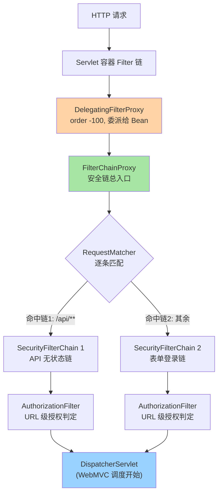
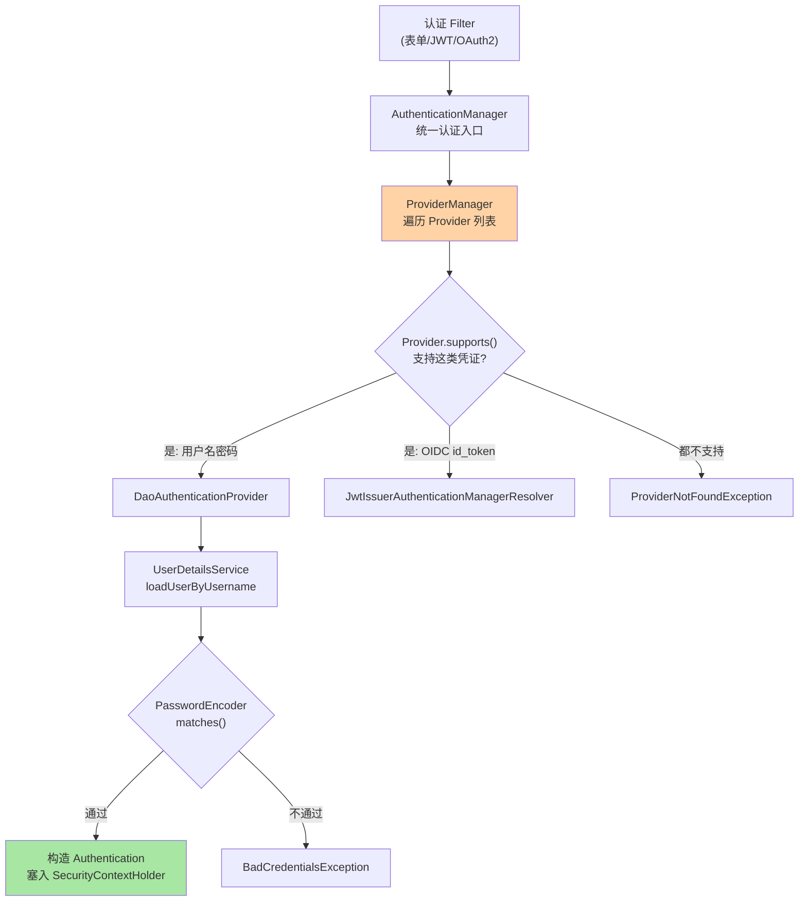
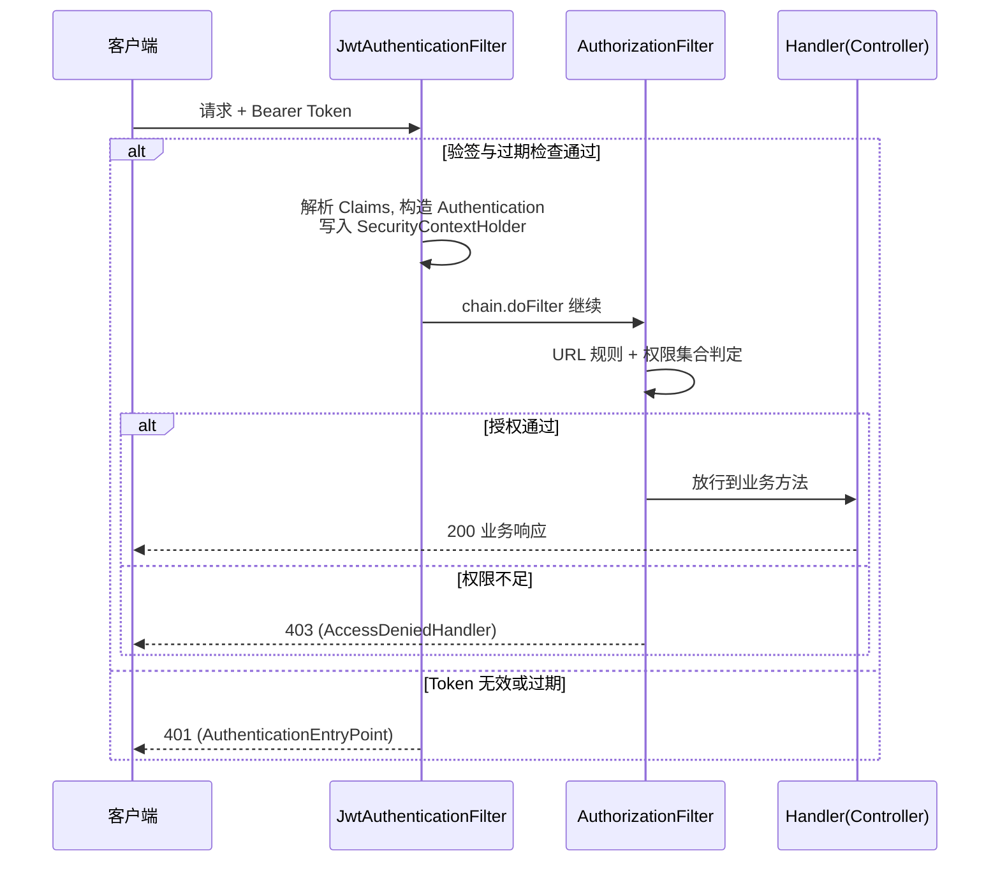

# Spring Security 整合与过滤链：认证、授权与自定义 JwtFilter 的机制边界

> 一句话摘要：Spring Security 的本质是一条**嵌入 Servlet 过滤器链的安全过滤链**——`DelegatingFilterProxy` 把控制权交给 `FilterChainProxy`，按 `RequestMatcher` 挑出一条 `SecurityFilterChain` 顺序执行十几个安全过滤器，认证（你是谁）与授权（你能干什么）分别由 `AuthenticationManager` 体系与 `AuthorizationFilter`/方法级注解承担。理解「过滤链的位置」就理解了它与 WebMVC 的异常边界，理解「上下文的 ThreadLocal 语义」就理解了自定义 JwtFilter 与线程池的全部坑。

## 🎯 本文核心

**核心机制一句话**：Spring Security = 「容器过滤器链里的一个代理入口 + 若干条按 URL 匹配的安全过滤器链」，认证是往 `SecurityContextHolder`（ThreadLocal）里塞 `Authentication`，授权是在请求到达业务方法前对 `Authentication` 做判定。

**机制链**：请求 → 容器 Filter 链 → `DelegatingFilterProxy`（Spring Boot 注册，order = -100）→ `FilterChainProxy` → 按 `RequestMatcher` 匹配一条 `SecurityFilterChain` → 逐个执行链内 Filter（CSRF → 认证 Filter → `ExceptionTranslationFilter` → `AuthorizationFilter`）→ `DispatcherServlet` → 拦截器 → Controller；方法级鉴权则发生在 Controller 方法调用切的 AOP 拦截上。**四个坐标**：过滤链位置（与 WebMVC 的关系）、认证 vs 授权的分工、自定义 JwtFilter 的插入点、方法级鉴权与 URL 级鉴权的边界。

从架构上下游看：安全过滤链是「容器层与 WebMVC 层」之间的横切边界——上游是网络与容器，下游是 DispatcherServlet 调度链，模块边界即「所有请求必须先过安全语义，才轮得到路由语义」。

## 一句话摘要

Spring Security 在 Boot 应用里只占容器过滤器链的一个入口，但它把「认证、授权、上下文管理、异常翻译」拆成了一条可插拔的过滤器流水线。**认证（Authentication）回答「你是谁」**：产出 `Authentication` 对象放进 `SecurityContextHolder`；**授权（Authorization）回答「你能不能」**：URL 级由链尾的 `AuthorizationFilter` 判定，方法级由 `@PreAuthorize` 等 AOP 拦截判定。自定义 JwtFilter 的本质是「在认证段插一个自己实现认证逻辑的过滤器」，与 WebMVC 的关系是「发生在 DispatcherServlet 之前，所以 `@ControllerAdvice` 看不到安全异常」。这四个机制坐标定了，Spring Security 的所有配置项都有位置可放。

## 一、边界：入门层讲过什么，本文讲什么

| 内容 | 入门层（篇 11 过滤器拦截器） | 本文 |
|---|---|---|
| Filter/Interceptor 的概念与区别 | ✅ 讲过 | 只作引子，不重复 |
| Security 过滤链的完整机制与位置 | 未讲 | **本文核心一** |
| 认证与授权的引擎分工 | 未讲 | **本文核心二** |
| 自定义 JwtFilter 与上下文传播 | 未讲 | **本文核心三** |
| 方法级鉴权与 URL 级的边界 | 未讲 | **本文核心四** |

## 二、Security 过滤链的位置：它和 WebMVC 是什么关系

Boot 引入 `spring-boot-starter-security` 后，自动配置做两件事：① 注册一个 `SecurityFilterChain` Bean（6.x 起取代被移除的 `WebSecurityConfigurerAdapter`）；② 通过 `DelegatingFilterProxy` 把它挂进容器过滤器链，order 为 -100——排在几乎所有业务 Filter 之前。



这张图给出三个推论，每一个都是排查 401/403 的地图：

1. **Security 在 DispatcherServlet 之前**。安全异常（`AuthenticationException`/`AccessDeniedException`）发生在 WebMVC 调度启动之前，`@ControllerAdvice` 的 `@ExceptionHandler` 天然看不到认证失败——由链内的 `ExceptionTranslationFilter` 翻译成 401/403 响应。想自定义 401 响应体，配置 `AuthenticationEntryPoint`，不是写全局异常处理器。
2. **先命中先服务**。`FilterChainProxy` 按声明顺序找第一条匹配的 `SecurityFilterChain`，命中后其余链全部跳过——所以「把窄匹配的链放前面」是铁律，一条 `/api/**` 的宽松链放在最前会让后面的精细化链永远失效。
3. **业务 Filter 的位置自由度极小**。order 小于 -100 的自定义 Filter 才能在 Security 之前执行，多数场景你并不想要这个位置——「在 Security 前面动请求体」通常意味着绕过了安全语义。

**业内认知**：一条默认的 `SecurityFilterChain` 内置十几个过滤器，从 `DisableEncodeUrlFilter`、`CsrfFilter` 到链尾的 `AuthorizationFilter` 顺序固定，这个顺序就是「认证先于授权」的设计落地——`SecurityContextHolderFilter`（6.x 取代旧名 `SecurityContextPersistenceFilter`）在很靠前的位置恢复上下文，`AuthorizationFilter` 在链尾做判定。

## 三、认证 vs 授权：两套引擎的分工

### 3.1 认证引擎：产出 Authentication 并放入上下文

```text
认证调用链:
  认证 Filter(如表单/自定义 JwtFilter)
   └─ AuthenticationManager (接口)
       └─ ProviderManager (默认实现, 持有一组 Provider)
           └─ AuthenticationProvider 逐个尝试 supports(authentication)
               └─ DaoAuthenticationProvider (用户名密码场景)
                   ├─ UserDetailsService.loadUserByUsername()  → UserDetails
                   └─ PasswordEncoder.matches()                → 密码核对
  成功 → SecurityContextHolder.getContext().setAuthentication(...)
```

`SecurityContextHolder` 默认是 `MODE_THREADLOCAL` 策略——上下文绑定在**当前线程**上。这个设计是理解后续所有问题的钥匙：为什么拦截器里能拿到登录用户（同一个线程）、为什么 `@Async` 方法里拿不到（换了线程）、为什么线程池复用可能串号（复用了带残留上下文的线程）。



这套「入口统一、Provider 分发」的设计思想与 WebMVC 的处理器适配器同构：Filter 只管把凭证交给 `AuthenticationManager`，具体怎么核对的策略由 Provider 决定——新增一种认证方式（如企业内 SSO 对接）就是注册一个新 Provider，不改链上任何既有组件。理解这一点，「Spring Security 难配」的感觉会消失大半：所有配置项都是往这条流水线的某个坐标上挂策略。

上下文的传播细则值得单列：**同线程直读**（Controller/Service/拦截器）、**换线程必须显式传播**（`@Async` 用框架的上下文装饰器包装，或任务提交时手动复制 `Authentication`）、**请求出口必须清理**（防止线程池残留）。三条规则覆盖了 Spring Security 上下文的全部生命周期，线程串号与「异步方法里拿不到用户」两类问题都在这张地图上。

### 3.2 授权引擎：两种粒度、一条原则

**URL 级**：`http.authorizeHttpRequests(...)` 在 6.x 由 `AuthorizationFilter`（链尾）执行，判定依据是请求匹配规则 + 当前 `Authentication` 的权限集合。
**方法级**：`@EnableMethodSecurity` 启用后，`@PreAuthorize`/`@PostAuthorize` 走 AOP 方法拦截（6.x 底层统一为 `AuthorizationManager`，取代旧的 `AccessDecisionManager` 投票模型），SpEL 里可以直接引用方法参数做资源级判定，例如 `@PreAuthorize("#req.owner == authentication.name")`。

两者的关系是**纵深防御而非二选一**：URL 级守住「面」（哪组接口需要什么角色），方法级守住「点」（这条数据是不是你的）。业内惯例是两层都开——只靠 URL 级的团队，几乎都吃过「新接口忘配规则默认放行」或「规则粒度太粗」的亏。

## 四、自定义 JwtFilter：插入点与上下文语义

前后端分离场景的标准做法：自定义一个 `JwtAuthenticationFilter extends OncePerRequestFilter`，在认证段解析 token、构造 `Authentication`、塞进上下文。

```java
public class JwtAuthenticationFilter extends OncePerRequestFilter {
    private final JwtCodec codec; // 解析与验签封装

    @Override
    protected void doFilterInternal(HttpServletRequest req,
                                    HttpServletResponse res,
                                    FilterChain chain) throws Exception {
        String token = resolveToken(req); // 通常取 Authorization: Bearer xxx
        if (token != null) {
            Claims claims = codec.parse(token); // 验签失败抛出, 由异常翻译层兜底
            var authorities = toAuthorities(claims.get("roles"));
            var auth = new UsernamePasswordAuthenticationToken(
                    claims.getSubject(), null, authorities);
            SecurityContextHolder.getContext().setAuthentication(auth);
        }
        try {
            chain.doFilter(req, res); // 继续往下游传
        } finally {
            SecurityContextHolder.clearContext(); // 关键: 防止线程池残留
        }
    }
}
```

注册位置用 DSL 表达插入点：`http.addFilterBefore(jwtFilter, UsernamePasswordAuthenticationFilter.class)`——「放在表单认证 Filter 之前」是业内惯例位置，语义上是「token 认证先尝试，没有 token 再看别的认证方式」。配套 `SessionCreationPolicy.STATELESS`（不落会话）与关闭 CSRF（token 不受浏览器自动携带 cookie 的 CSRF 攻击面影响）。

**为什么要 finally 清理**：容器线程来自线程池，处理完请求后线程归还复用。如果认证 Filter 设置了上下文却不在出口清理，下一次复用该线程的请求可能读到上一次的登录态——这是安全漏洞而不只是脏数据。`SecurityContextHolderFilter` 在 6.x 已经把「请求结束时清理」做进了框架，但**自定义 Filter 里主动清理仍是防御惯例**：你的 Filter 可能注册在多条链上，链的出口语义并不总是可控。

## 五、源码/关键路径：一次请求的安全链走读

以 Security 6.x 主线为口径，关键路径如下：

```text
容器 FilterChain
 └─ DelegatingFilterProxy.doFilter()          // 把 Servlet Filter 调用委派给 Spring Bean
     └─ FilterChainProxy.doFilterInternal()   // 持有 List<SecurityFilterChain>
         ├─ 遍历 chains, RequestMatcher.matches(request) 命中第一条
         └─ VirtualFilterChain 按序执行链内 Filter
             ├─ SecurityContextHolderFilter    // 从 SecurityContextRepository 恢复上下文
             ├─ CsrfFilter                     // 有状态场景校验 token, 无状态链常关闭
             ├─ 自定义 JwtAuthenticationFilter  // addFilterBefore 插入点
             ├─ ExceptionTranslationFilter     // 捕获后续 Filter 抛出的安全异常并翻译
             └─ AuthorizationFilter            // URL 级授权, 不通过 → AccessDeniedHandler
                  └─ chain.doFilter → DispatcherServlet.doDispatch()  // 进入 WebMVC
方法级路径:
  @EnableMethodSecurity → 方法 AOP 拦截 → AuthorizationManager.check()
   → 拒绝抛 AccessDeniedException → 先经 DispatcherServlet 异常解析器
   → 未被 @ExceptionHandler 处理则继续上抛 → ExceptionTranslationFilter 兜底 403
```

最后两行是最容易被误读的边界：**方法级注解抛出的 `AccessDeniedException` 会先经过 DispatcherServlet 的异常解析器**（它发生在 Handler 调用切面上），如果你注册了处理 `AccessDeniedException` 的 `@ExceptionHandler`，它确实会生效；而**过滤链阶段抛出的安全异常永远不会进 `@ControllerAdvice`**。同一个异常类、两种处理路径，取决于它被抛出的位置——这是「过滤链位置」决定的，不是注解语义决定的。

无状态 JWT 请求的正常与异常两条路径，用时序图收拢：



这张图与「过滤链位置」共同构成排障地图：401 一定发生在 Filter 段（左侧分支），403 一定发生在授权判定（中部分支），业务异常才走 500 路径——响应码本身就是定位信息。从演进视角看，这套链式结构从 Servlet 规范时代延续至今，位置语义从未变过，变的只是链内过滤器的名字与配置风格，这也是安全机制知识的保值期远长于配置风格知识的原因。

## 六、质疑者追问链

**追问一层：为什么上下文要设计成 ThreadLocal，而不是把用户信息当参数逐层传？**——因为身份是横切关注点，业务方法签名若被迫携带 `User` 参数，三层以上的调用链都会被污染；ThreadLocal 让「需要的人主动取」，签名保持干净。代价是隐式依赖：上下文的存活范围与线程绑定，任何「换线程」的动作都会断链，框架只能靠装饰器（如 `DelegatingSecurityContextExecutor`）补回来。

**再追问：那 `MODE_INHERITABLETHREADLOCAL`（子线程继承上下文）为什么默认不开？**——反直觉的真相是：继承发生在 `Thread` 对象创建时，而线程池的线程是**提前创建、反复复用**的，继承语义在线程池里完全失真——要么拿到创建时刻的陈旧上下文，要么带着上一个任务的残留。业内认知：池化场景一律用显式的上下文装饰器，不用可继承策略。

**打破砂锅：方法级鉴权这么灵活，为什么不选它替代 URL 级，统一在方法上做？**——反方案分析：方法级是「白名单」思路，没标注解的方法默认不设防，新增接口漏标即裸奔；URL 级是「黑名单/默认拒绝」思路，`anyRequest().authenticated()` 保证面级别兜底。打破砂锅问到底：安全边界的第一原则是默认拒绝，所以 URL 级兜底不可省，方法级做资源级细化——两者是纵深关系，不是替代关系。这个设计思想的来源可以追溯到「secure by default」（默认安全）原则：框架的默认值必须是最安全的状态，使用者显式放弃安全才变得不安全，而不是相反。

## 七、什么时候用与不用：明确推荐

| 场景 | 推荐 | 理由 |
|---|---|---|
| 传统多页应用、内部系统 | 默认表单登录 + 会话 | 框架零成本，CSRF 保留默认开启 |
| 前后端分离 / 多端 | JWT + 自定义认证 Filter + 无状态链 | 服务端不存会话，横向扩容无粘滞 |
| 微服务边界 | 网关终结认证 + 内网传播身份标识 | 各服务重复验签是浪费，边界收敛 |
| 数据 owner 校验、行级权限 | 方法级 `@PreAuthorize` + SpEL | URL 表达不了的资源级语义 |
| 复杂联邦身份 | 接入 OIDC 资源服务器支持 | 自研 token 协议是反模式 |

明确推荐：**拿不准时选「URL 级默认拒绝 + 方法级细化」**，这是代价最低、兜底最强的组合。

## 八、典型场景与事故复盘

**事故一：链顺序错误导致全站 401 循环。**某团队的多模块工程里，两条 `SecurityFilterChain` 都以宽匹配规则声明（一条 `/api/**` 无状态、一条默认表单链），声明顺序颠倒后所有 API 请求命中了表单链，前端拿到的是 302 跳登录页而不是 401。排查路径：先怀疑 token 签名，验签工具确认无误；打开 `org.springframework.security` 的 DEBUG 日志后，日志明确打印了命中的过滤器链及其过滤器列表，一眼定位到命中的是错误的链。复盘结论：多条链必须「窄匹配在前、兜底链在后」，并把「命中哪条链」的日志写进排障手册第一步。

**事故二：线程池残留上下文导致权限串号。**某系统在 `@Async` 方法里读取当前用户做审计，偶发出现 A 用户操作记到 B 用户名下。排查初期怀疑前端传参错乱，排查了三天无果；后复盘发现任务线程池线程复用时，上一个任务显式设置过上下文而未清理，下一个任务读到了残留值。修复：统一用上下文装饰器包装任务提交（`DelegatingSecurityContextRunnable` 类语义），并在代码评审里把「显式 set 必须配 finally clear」定为红线。生产环境的隐式线程状态，任何「偶发」「串数据」类问题都值得先查 ThreadLocal 生命周期。

## 九、Trade-off 与代价分析

**JWT vs 会话**：JWT 让服务端无状态、扩容简单，代价是**吊销难**——签出去的 token 在过期前始终有效，想做「立即踢人」必须引入黑名单存储（黑名单查询又把无状态性拆掉一角）。取舍的是「扩展性」与「即时管控力」。短 TTL + refresh token 是常见折中：TTL 压到分钟级，吊销延迟的上限就是 TTL。

**自定义 JwtFilter vs 网关统一认证**：各服务自己验签保留了服务自治与本地授权能力，代价是 N 个服务维护 N 份公钥与解析代码；网关统一认证把验签收敛到一处，代价是内网服务之间需要额外的身份传播机制（如内部签名头），且网关成为单点强依赖。业内惯例是折中：网关终结外部认证，内网用轻量身份头传递，边缘服务仍可本地校验做纵深。

## 十、不同量级的思考：架构约束驱动解法

- **十万级（接口 QPS 十万以内）**：约束来源是单机 CPU——验签是纯计算（HMAC 亚毫秒、RSA 毫秒级，业内认知）。这一档的核心问题是**验签开销有没有被算清**，而不是急着上缓存；思考方式是压测驱动：先测出单实例认证吞吐，再谈优化。
- **百万级（QPS 向百万逼近）**：约束来源是热路径上每一跳网络往返都会被放大。这一档的核心问题是**公钥（JWK）获取与黑名单查询在不在热路径上**，而不是换更快的算法；思考方式是缓存驱动——JWKS 本地缓存按 `kid` 复用、密钥轮换用缓存过期兜底、吊销状态前置布隆过滤器。
- **千万级（QPS 千万档、实例数上万）**：约束来源是分布式系统的故障注入面——任何一次远端取钥、一次远程吊销查询都可能成为级联超时的引爆点。这一档的核心问题是**认证决策的确定性**，而不是单点极限性能；思考方式是架构驱动——密钥与吊销状态前推到实例本地，接受秒级陈旧换取链路确定性。

三个档位背后是同一条设计哲学：认证是请求的入口门卫，门卫逻辑必须比它保护的逻辑更简单、更确定——复杂度放进授权与业务，不放进门卫。

## 十一、业内惯例

- **DEBUG 日志先行**：排障第一步开 `org.springframework.security=DEBUG`，日志会打印命中链、过滤器顺序与授权判定，比读代码快。
- **`anyRequest().authenticated()` 兜底**：显式放行白名单，其余默认拒绝——默认放行（`permitAll` 兜底）是高危反模式。
- **密码编码器用自适应哈希**：bcrypt/argon2 类，盐值内嵌、代价因子可调；MD5/SHA-256 直接存密码是业内公认事故源。
- **上下文传播用框架设施**：`@Async` 配上下文装饰器、测试用框架提供的安全测试支持，避免手写 ThreadLocal 复制。
- **安全配置的演进策略**：升级大版本先看官方迁移指南再改配置——安全组件的类名与默认值随版本演进变化较大，凭记忆迁移是事故源。
- **版本锚点**：6.x 为当前主线（`SecurityFilterChain` Bean 风格、`AuthorizationFilter`、`@EnableMethodSecurity`），5.x 的旧类名（`WebSecurityConfigurerAdapter`、`authorizeRequests`）在社区资料里仍大量出现，迁移时以官方迁移指南为准。

## 十二、常见误区

- **「401 了就去查 `@ExceptionHandler`」**：认证异常根本不进 WebMVC 异常体系，正确位置是 `AuthenticationEntryPoint`。
- **「JWT 放 localStorage 和 cookie 一样安全」**：存储位置决定 XSS/CSRF 暴露面，属前端安全专题，但选型时必须一起评估。
- **「方法级注解加了就生效」**：需要 `@EnableMethodSecurity`，且注解在自调用（类内部 this 调用）路径上不经过代理——AOP 边界问题，与事务失效同源。
- **「把 JWT Filter 加进容器 Filter 注册」**：用 `@Component` 注册 Filter 会把它同时挂到容器过滤器链上，等于脱离 Security 链的执行语义，重复执行且顺序失控——只用 DSL 注册。

## 十三、你们可能会问

**Q1：JwtFilter 里验签失败应该抛异常还是放空上下文往下走？**
推荐抛出认证异常交给 `ExceptionTranslationFilter` 统一翻译（401 + 规范响应体）；「吞掉异常放空上下文」会让请求带着匿名身份继续跑，真正的失败原因被掩盖到授权环节，排障更难。

**Q2：为什么拦截器里能拿到登录用户，但更早的 Filter 里不行？**
Filter 阶段上下文可能尚未建立（`SecurityContextHolderFilter` 在你的自定义 Filter 之后时）。拦截器运行在 DispatcherServlet 调度内，此时认证 Filter 已执行完毕、上下文已就绪——本质还是执行顺序问题。

**Q3：方法级鉴权的 SpEL 里能调用自定义 Bean 吗？**
可以。把判定逻辑封装成 Bean 方法（如 `@PreAuthorize("@perm.isOwner(#id)")`），是业内惯例做法——比把复杂逻辑硬写进表达式更可测试、可复用，权限语义收敛在一个类里便于审计。

## 十四、自测三问

1. Security 过滤链挂在哪、何时命中哪条链、异常为什么进不了 `@ControllerAdvice`？
2. 认证与授权分别由哪些引擎承担，URL 级与方法级的关系是什么？
3. `SecurityContextHolder` 的 ThreadLocal 语义在异步与线程池场景下的两个坑是什么？

## 开放问题

- 无状态 token 与「即时吊销」的矛盾尚无银弹：短 TTL + refresh 是主流折中，但服务端会话化的回归（如集中式 token 状态存储）在强管控场景抬头，两条路线的成本分界值得持续观察。
- 服务网格/网关侧认证能力增强后，「应用内安全链」的职责边界会继续上移，Spring Security 在服务间信任传递上的抽象仍在演进。

## 💡 实战提示

- 💡 排障从「命中链与过滤器顺序」日志开始（`org.springframework.security` DEBUG），90% 的 401/403 问题在这一步现形，不要先去怀疑 token。
- 💡 自定义 Filter 的注册只用 Security DSL（`addFilterBefore`），不要再加 `@Component` 让容器重复注册——重复注册是配置事故高发点。
- 💡 显式 set 上下文必须配 finally clear：线程池残留上下文是权限串号事故的直接来源，评审当成硬红线。
- 💡 「默认拒绝」写法（`anyRequest().authenticated()`）比「逐个拦截」安全得多：新增接口的安全默认值决定了一个团队的权限底线。
- 💡 401/403 的响应体定制走 `AuthenticationEntryPoint`/`AccessDeniedHandler`，与业务错误码体系统一收口，不要让前端从两种异常形态里猜。

## 🎯 核心带走

- **核心一句话**：Spring Security = 容器过滤器链里的 `FilterChainProxy` + 按 URL 匹配的 `SecurityFilterChain`；认证产出 `Authentication` 进 ThreadLocal 上下文，授权在链尾与方法切面两处判定。
- **机制链**：容器链 → DelegatingFilterProxy → FilterChainProxy（匹配一条链）→ 上下文恢复 → CSRF/认证 Filter（自定义 JwtFilter 插入点）→ ExceptionTranslation → AuthorizationFilter → DispatcherServlet；方法级鉴权在 AOP 切面。
- **失效点/边界**：安全异常不进 `@ControllerAdvice`（过滤链阶段）；方法注解自调用失效；线程池上下文残留会串号；多条链窄匹配必须在前。

## 📌 数据与事实声明

写于 2026-09-18，版本锚点：Spring Security 6.x 主线（`SecurityFilterChain`、`AuthorizationFilter`、`@EnableMethodSecurity` 口径），Boot 3.x 自动配置；过滤器链构成、默认 order（-100）与类名为官方文档与源码公开内容。文中量级数字（验签耗时、QPS 分档）为业内认知的教学归纳，非实测基准；事故案例为多来源实践信息的脱敏复合描述，不指向任何特定公司。具体行为以官方文档为准。

## 📚 参考资料

| 类型 | 标题 | 来源 |
|---|---|---|
| 官方文档 | Spring Security Architecture（过滤链与认证模型） | docs.spring.io/spring-security |
| 官方文档 | Servlet authentication architecture / Authorization | docs.spring.io/spring-security |
| 官方源码 | spring-security（FilterChainProxy / AuthorizationFilter） | github.com/spring-projects/spring-security |
| 关联阅读 | 本系列篇 2（AOT 与原生镜像）；IoC 系列（代理与自调用失效） | 本仓库同目录 |
