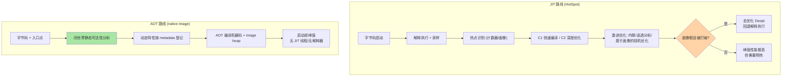
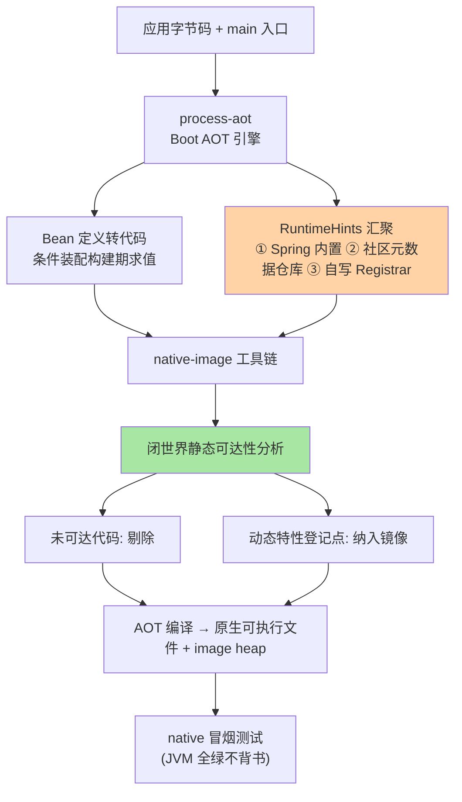
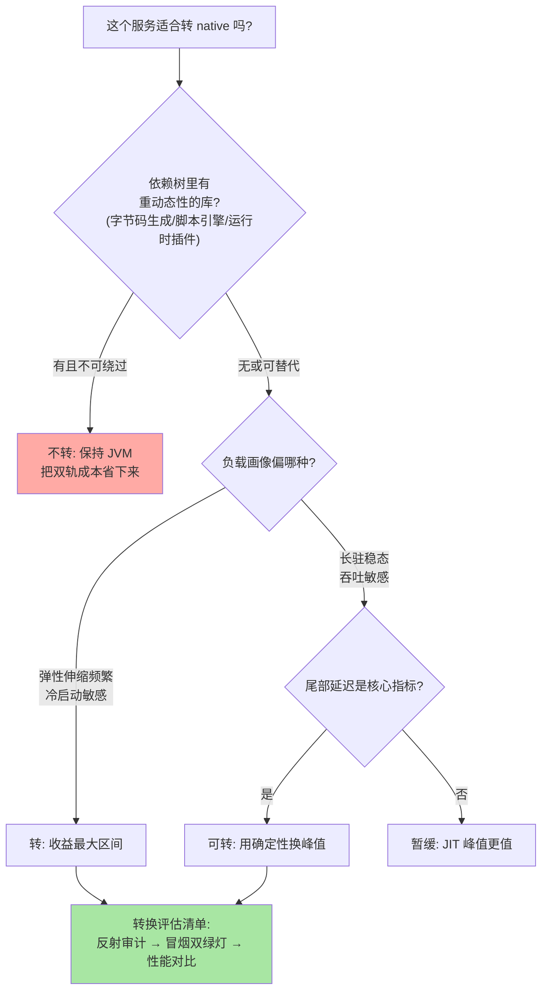

# AOT 与 GraalVM 原生镜像：Spring Boot 3.x 的静态化编译与达标代价

> 一句话摘要：AOT 与 JIT 的本质差异是「**决策时点**」——JIT 在运行时一边跑一边按热点画像做带撤销权的激进优化，AOT（GraalVM native image）在构建时基于「闭世界假设」做一次性的静态可达性分析，把「程序可能用到什么」在编译期全部定死。这个差异解释了原生镜像的一切约束：反射、动态代理、资源加载这些「运行时才决定」的能力必须提前登记；也解释了它的全部收益：启动毫秒级、无预热、内存占用低。

## 🎯 本文核心

**核心机制一句话**：native image 把 Java 程序在构建期编译成自包含的原生可执行文件——静态分析从入口点出发找出全部可达代码，把运行时不确定性（类加载、解释执行、JIT 编译）整体消灭，代价是「运行时动态性」必须提前声明。

**机制链**：`main` 入口 → 静态可达性分析（闭世界）→ 未被引用的代码剔除 → 反射/代理/资源/SPI 按 metadata 登记进镜像 → AOT 编译为目标机器码 + 快照式 image heap → 运行时无类加载器、无 JIT、无解释器。Spring Boot 3.x 在这条链前面加了自己的 AOT 引擎：构建期把 Bean 定义转成代码（`BeanRegistrationAotProcessor`）+ 生成 GraalVM 所需的 `RuntimeHints` 登记，让框架的动态性在构建期「静态化」。四个坐标：AOT 与 JIT 的本质差异、native 的动态性约束清单、Boot 3.x AOT 引擎的工作位置、达标代价与适用场景的判断。

从架构上下游看：AOT 引擎横跨「构建期与运行期」两层——上游是字节码与框架元数据，下游是原生可执行文件与 image heap，模块边界即「所有运行时才见到的行为，必须前移到构建期声明」。

## 一句话摘要

JIT 路线押注「运行时信息最全，优化可以更准」，AOT 路线押注「构建期定死一切，运行时零不确定性」。native image 的约束清单（反射要登记、CGLIB 子类代理受限、资源要声明、运行时不可加载新类、Java 序列化基本不可用）全部从「闭世界假设」一条根上长出来；收益（启动几十毫秒、内存降到 JVM 的几分之一、无 JIT 线程与预热抖动，业内认知量级）同样从这条根上长出来。Spring Boot 3.x 的角色是把「框架自身的动态性」翻译成 GraalVM 能理解的静态描述——所以达标的关键从来不是「能不能编过」，而是**整个依赖树里所有库的动态性都被登记了吗**。

## 一、边界：入门层讲过什么，本文讲什么

| 内容 | 入门层（篇 23 部署与容器化） | 本文 |
|---|---|---|
| 容器化部署、镜像瘦身 | ✅ 讲过 | 不重复 |
| JIT 与 AOT 的编译模型差异 | 未讲 | **本文核心一** |
| native 的动态性约束与登记 | 未讲 | **本文核心二** |
| Boot 3.x AOT 引擎与构建流程 | 未讲 | **本文核心三** |
| 达标代价与场景判断 | 未讲 | **本文核心四** |

## 二、AOT 与 JIT 的本质差异：决策时点决定一切



两条路线的工程差异全部能从图上推出来：

- **性能曲线形状不同**：JIT 是「低开高走」——冷启动慢、预热后峰值高，因为画像驱动的投机优化（如单实现类的方法调用直接内联）在长运行场景能超过静态编译；AOT 是「平开平走」——第一个请求就是稳定性能，没有预热抖动，代价是放弃画像带来的超线性优化。
- **资源占用模型不同**：JVM 常驻需要元空间、JIT 编译器线程、解释器与全部类元数据；native 镜像只含可达代码与快照堆，RSS 常降到 JVM 的几分之一（业内认知量级），这对高密度容器部署是降维优势。
- **确定性不同**：JIT 的行为依赖运行时的负载画像，同一程序不同负载的编译决策不同；AOT 的行为在构建期就完全确定——这是排障视角上「可复现性」的根本差异，也是 AOT 设计哲学的核心：**用运行时的灵活性换构建期的确定性**。

Java 官方的 Project Leyden 演进方向（分阶段提前计算，业内公开口径）说明「全动态 JIT」与「全静态 AOT」之间是一条谱系而非二选一——Boot 3.x 的 AOT 引擎本质上就是在 JVM 路线上也吃到了一部分「提前计算」的红利（CDS 类似思路）。

## 三、native 的动态性约束：一张清单走天下

闭世界假设之下，「运行时才知道」的能力逐一受限：

| 动态能力 | native 下的状态 | 登记方式 |
|---|---|---|
| 反射 `Class.forName`/字段方法访问 | 需提前登记目标类与成员 | reflect-config / `@RegisterReflection` / `RuntimeHints` |
| 运行时加载新类 | **不可用**——镜像类集合编译期定死 | 无解，重新构建 |
| JDK 动态代理（接口） | 需登记接口列表 | proxy-config / hints |
| CGLIB 子类代理 | 受限——需要可子类化的类型与可达构造器 | Boot AOT 尽量转接口代理或生成代码 |
| 资源/配置文件加载 | 需登记资源路径或模式 | resource-config / hints |
| `META-INF/services` SPI | 需登记服务实现 | native-image 自动处理部分，其余登记 |
| Java 原生序列化 | 基本不可用 | 换显式序列化（JSON/Protobuf） |
| 修改 final 字段 / `Unsafe` 深度玩法 | 受限或不可用 | 依赖库需适配 |
| 动态语言/字节码生成库 | 运行时生成码不可执行 | 换 AOT 友好实现或构建期生成 |

追踪链的关键结论：**约束不在你的代码，而在依赖树的叶子上**。你的业务代码可能零反射，但 Jackson 反序列化靠反射、旧版 ORM 靠字节码增强、SPI 靠 services 文件——任何一环漏登记，编译都成功、运行才爆炸。这就是 native 调试成本的结构性来源：**错误从构建期错误变成运行期错误**。

## 四、Spring Boot 3.x AOT 引擎：框架静态化的翻译层

Boot 3.x 的贡献不是发明 AOT，而是把框架的动态性翻译成静态描述：

```text
构建期 (mvn -Pnative native:compile 或 bootBuildImage):
 1. process-aot: 对 ApplicationContext 做 AOT 处理
    ├─ Bean 定义转代码: @Bean 方法/条件装配结果在构建期求值并生成代码
    ├─ RuntimeHints 收集: 各模块/ starter 声明需要的反射/代理/资源/序列化
    └─ 生成 GraalVM 配置: reflect-config.json / proxy-config.json / resource-config.json
 2. native-image 工具链: 静态分析 → 剔除死码 → 编译 → 原生可执行文件
运行期:
 3. AOT 处理过的容器直接以代码形态启动 Bean 定义, 跳过条件求值与 classpath 扫描
```

整条流水线用图收拢，注意「hints 从哪来」的三个汇聚点：



三个值得追问的实现细节：

三个值得追问的实现细节：

1. **条件装配在构建期求值**意味着「按运行时环境动态决定 Bean」的空间变小了——profile 之类的构建期已知条件没问题，依赖运行时外部状态的Conditions 需要重新设计。这是 Spring 官方文档明确提示的行为差异（公开口径）。
2. **第三方库的 hints 从哪来**：优先级是「库自带 hints（Spring 家族已内置）→ 第三方元数据仓库（社区维护的可达性元数据）→ 自己写 `RuntimeHintsRegistrar`」。第三层是自己动手的位置。
3. **测试策略必须换**：JVM 下的单测验证不了 native 行为，达标线是「native 测试」（GraalVM 的测试支持在原生镜像内跑测试）或至少一套冒烟测试跑在原生产物上——JVM 全绿不等于 native 能跑，这个认知差是团队踩坑的第一来源。

## 五、源码/关键路径：一个反射调用在两条路线上的旅程

```text
JVM 路线:
  clazz.getDeclaredField("name")
   └─ 运行时查 Class 元数据(元空间) → 反射访问器首次调用走 JNI
      → 膨胀为字节码版 GeneratedFieldAccessor → JIT 继续优化
  特点: 类没加载? 现场加载 classpath。没见过? 运行时见。

native 路线:
  clazz.getDeclaredField("name")
   └─ 构建期已把该 Field 记入 reflect 元数据(可达性分析 + 登记)
      → 镜像内字段元数据是构建期快照
  特点: 构建期没登记 → 运行时抛 NoSuchFieldException/ClassNotFoundException
  关键差异: 「找得到吗」的裁决权从 classpath 移到了构建期的 metadata 集合
```

再看构建产物的结构差异：JVM 产物 = 胖 JAR + JDK；native 产物 = 单个可执行文件（含 image heap 与机器码）。容器的镜像差异是直接推论：基础层从 JDK 换成 distroless/scratch 级别，攻击面与体积同步缩小——安全收益常被低估，值得在选型时一起算。理解这条旅程的底层机制后就有了通用排障直觉：任何「JVM 下正常、native 下异常」的差异，都优先怀疑「运行时动态行为在构建期没被登记」——机制层面的根因通常只有这一类。

## 六、什么时候用与不用：明确推荐

| 场景 | 推荐 | 理由 |
|---|---|---|
| Serverless / 按需弹性 | **推荐 native** | 冷启动几十毫秒，按启停计费模型最优 |
| CLI 工具 / 边车 / 网关类小服务 | **推荐 native** | 启动快 + 单文件分发 + 低内存 |
| 高密度部署（同硬件塞更多实例） | **推荐 native** | RSS 低数倍，密度即成本 |
| 长驻重业务 + 反射重生态（旧 ORM/规则引擎） | **不推荐** | 适配成本高，JIT 峰值性能更优 |
| 强依赖运行时动态性的平台型产品 | **不推荐** | SPI/插件/脚本引擎生态与闭世界冲突 |
| 团队无 native 经验且交付压力大 | **先 JVM + 转换评估** | 双轨并行，别让主线交付背实验风险 |

明确推荐：**新 written 的无状态小服务与边缘负载优先尝试 native；核心长驻业务保持 JVM，用「转换评估清单」（依赖树反射审计 → native 冒烟测试 → 性能对比）决定是否迁移。**

判断流程图（从上往下，第一个命中的答案决定结论）：



这张决策图的设计思想与安全篇的「默认拒绝」同源：**默认留在成熟路线（JVM），显式论证后才进入新路线**——迁移的举证责任在收益方，而不是让存量系统自证不需要迁移。

## 七、质疑者追问链

**追问一层：JIT 预热后峰值更高，那 AOT 的性能是不是全面更差？**——单看长运行热循环确实常是 JIT 占优（画像驱动内联的去优化自由度更大）；但请求延迟的**方差**视角 AOT 全面占优：没有 JIT 编译线程抢占、没有去优化抖动、没有解释执行段，尾延迟从第一个请求就稳定。所以问题不是「谁更快」而是「你在优化均值还是尾部」。

**再追问：既然 Boot 帮忙登记了 hints，为什么还会运行时炸？**——因为 Boot 只能登记**它知道的**：Spring 家族与主流生态内置 hints，第三方库的动态行为要么靠官方适配、要么靠社区元数据仓库、要么靠你自己写 registrar。链路上任何一个「框架不知道的反射」都是漏洞——所以 native 达标的工程本质是**依赖树可达性审计**，不是构建配置调优。

**打破砂锅：为什么不选「JVM 预热 + 流量回放」或 CRaC 这类替代方案，非要在构建期把一切定死？**——反方案分析：预热回放只能覆盖被回放的路径，画像没见过的分支照样冷；CRaC（检查点/恢复）启动确实快，但依赖内核特性与全链路文件句柄/网络连接的可恢复性，跨环境迁移检查点的工程约束不小。打破砂锅问到底：三者的取舍点是「动态性保留多少」——预热保留全部动态性但确定性最差，CRaC 居中，AOT 确定性最强但动态性归零。按业务对「确定性」的出价来选，而不是按启动速度排序。

## 八、典型场景与事故复盘

**事故一：反射漏登记，运行时 NoSuchFieldException。**某服务转 native 后 JVM 全部单测通过，上线冒烟时列表接口 500，日志报 DTO 字段找不到。排查思路：构建日志无任何告警（静态分析只管可达性，不管「你反射的是否已登记」）；定位到该 DTO 由一个未适配 native 的三方 SDK 内部反射构造，第三方元数据仓库里恰好没有这个版本。修复：自己写 `RuntimeHintsRegistrar` 登记该 DTO。复盘动作：把「native 冒烟测试必须覆盖全部接口路径」写入流水线门禁，并约定升级三方库时先查其 native 兼容声明。生产环境的教训一句话：**native 的编译成功不等于运行可用，可达性登记以运行时验证为准。**

**事故二：SPI 文件缺失，驱动加载失败。**另一团队的原生镜像在容器里连不上数据库，报驱动类不存在。排查发现该 JDBC 驱动通过 `META-INF/services` 注册，构建期静态分析没把服务实现标记为可达（驱动类在代码里无直接引用）。修复：resource 与 reflect hints 补登记后恢复。复盘结论：SPI 与反射属于同一类「间接引用」，审计清单里应作为一个专项；此后团队的转换评估清单固定含一项「grep 全部 `ServiceLoader.load` 调用点」。两次事故的共同根因相同：**把 JVM 的「运行时动态」当成了理所当然**——这正是闭世界假设要重新谈判的部分。

## 九、Trade-off 与代价分析

**构建时间与资源成本**：native 编译是分钟级、内存密集（多 GB，业内认知量级）的过程，对比 JVM 打包的秒级。取舍的是「CI 时间与构建资源」换「运行时启动与内存」。缓解思路：native 构建只在发布流水线触发，日常开发与测试走 JVM——双轨是业内惯例而非妥协。

**峰值性能让渡 vs 尾部稳定**：对吞吐敏感的长运行服务，JIT 峰值优势真实存在；对延迟敏感、弹性伸缩频繁的服务，AOT 的无预热稳定尾部更值钱。取舍的是「平均性能上限」与「全时段确定性」。

**生态兼容的长期负债**：选 native = 把「依赖树所有库持续适配 native」作为长期承诺。某个关键依赖宣布不再适配 native 的那天，就是迁移回 JVM 的开始——这个风险要写进选型文档，而不是出问题后才想起。

## 十、不同量级的思考：架构约束驱动解法

- **十万级（日请求十万档的小服务）**：约束来源是成本敏感与弹性频率——实例少、请求不密集。这一档的核心问题是**冷启动与首次请求体验**，而不是吞吐峰值；思考方式是密度驱动：单实例内存每降一半，同样预算的实例数翻倍。
- **百万级（QPS 百万档的平台服务）**：约束来源是弹性伸缩时的扩容速度与流量爬坡。这一档的核心问题是**新实例从启动到可服务的间隔**，而不是单实例稳态性能；思考方式是曲线驱动：扩容曲线能否跟上流量曲线，决定大促时刻的超卖比。
- **千万级（QPS 千万档、集群上万实例）**：约束来源是集群全局的调度与镜像分发带宽。这一档的核心问题是**镜像体积与实例密度的乘积**，而不是单个实例的内存占用；思考方式是全局驱动：native 镜像小 + RSS 低在大集群是二阶收益，分发带宽与调度密度同时受益。

## 十一、业内惯例

- **双轨开发**：日常 JVM（秒级反馈），发布流水线出 native 产物（分钟级）——两条轨用同一套代码与 hints。
- **转换评估先行**：迁移前做依赖树审计（反射/代理/SPI/字节码生成四类扫描），产出「可转 / 需适配 / 不可转」三档结论，不可转项主导决策。
- **hints 集中管理**：自定义 `RuntimeHintsRegistrar` 统一注册、统一测试，散落在业务代码里的零星登记是维护事故源。
- **native 冒烟测试进门禁**：JVM 测试全绿 + 原生产物冒烟全绿，双绿灯才允许发布——只信前者必然复现「运行时才发现」类事故。
- **版本锚点**：本文以 Spring Boot 3.x + GraalVM 当前主线为口径（公开口径）；GraalVM 的原生测试、调试支持随版本演进较快，具体能力以官方发布说明为准。

## 十二、常见误区

- **「native 编译过了就是兼容」**：静态可达性分析不校验动态登记的完整性，运行期验证不可省。
- **「AOT 就是启动快，别的没差」**：内存密度、攻击面、无预热尾延迟、单文件分发都是独立收益，漏算会导致选型偏保守。
- **「把所有服务都转 native」**：动态性重的平台型服务转不动，硬转的适配成本远超收益——按服务画像分批。
- **「hints 写一次就一劳永逸」**：依赖升级可能引入新反射点，hints 与依赖版本绑定，升级即复审。

## 十三、你们可能会问

**Q1：Boot 3.x 的 AOT 处理在普通 JVM 部署下也生效吗？**
生效。`process-aot` 产出的代码化 Bean 定义与 hints 在 JVM 部署下同样可用（配合 CDS 可缩短 JVM 启动）——AOT 引擎是独立能力，native 只是它的最大受益方。

**Q2：怎么定位「哪段反射没登记」？**
两条路：运行期异常栈（`ClassNotFoundException`/`NoSuchMethodException` 直接指向目标类）；构建期开 native-image 的观测选项，让分析器报告动态特性访问点。业内惯例是两者结合：构建期列清单、运行期冒烟验证。

**Q3：Jackson 这类反射大户在 native 下怎么就work了？**
Spring Boot 对 Jackson 内置了 hints（登记常用反序列化目标的反射可达性），配合 `@RegisterReflectionForBinding` 显式登记业务 DTO；更彻底的做法是构建期生成序列化代码的方案（如 AOT 友好的序列化库），把运行时反射彻底替换成静态代码。

## 十四、自测三问

1. AOT 与 JIT 在「决策时点、性能曲线、确定性」三个维度的差异是什么？
2. 闭世界假设派生出的动态性约束清单有哪些？各自的登记方式？
3. native 达标的工程本质是什么？双绿灯门禁指什么？

## 开放问题

- 「静态化谱系」仍在演进：JVM 侧的提前计算分层、native 侧的动态能力逐步补齐，两端相向而行后中间地带（如可更新镜像、受限动态加载）的形态值得跟踪。
- 序列化与字节码生成的 AOT 化正在改变部分生态库的底层实现方式，「库为 native 而设计」可能成为下一个阶段的默认，而不是适配项。

## 💡 实战提示

- 💡 迁移评估从依赖树扫描开始：反射/动态代理/SPI/字节码生成四类点列出清单，比直接试编译快得多——不可转项决定结局。
- 💡 native 冒烟测试覆盖全部接口路径再上线，「JVM 全绿」对 native 行为零背书。
- 💡 自定义 hints 统一收口到一个 `RuntimeHintsRegistrar`（或少数几个），并在升级依赖时复审——散落登记必成事故源。
- 💡 双轨流程：JVM 开发秒级反馈，流水线发布原生产物——把分钟级编译挡在发布段，别让它拖垮日常迭代。
- 💡 选型文档里写清「峰值换尾部」的取舍与依赖生态的长期承诺，避免一年后被动回迁。

## 🎯 核心带走

- **核心一句话**：AOT 用「构建期闭世界 + 可达性分析」换掉「运行时 JIT + 类加载」，native 的一切约束与收益都从这一个交换推导。
- **机制链**：入口静态分析 → 动态特性按 hints 登记 → 编译机器码 + image heap → 运行时零类加载零 JIT；Boot 3.x AOT 引擎在构建期把 Bean 定义与框架动态性翻译成静态代码与登记文件。
- **失效点/边界**：未登记的反射/代理/SPI 构建期不报错、运行期才炸；运行时加载新类不可用；条件装配改为构建期求值；峰值性能让渡给确定性。

## 📌 数据与事实声明

写于 2026-09-18，口径锚点：Spring Boot 3.x AOT 引擎与 GraalVM native image 当前主线（公开口径）；闭世界假设、可达性分析、RuntimeHints、条件装配构建期求值为官方文档与源码公开内容。启动毫秒级、内存降至几分之一、构建分钟级与内存多 GB 等为业内认知的量级归纳，非实测基准；事故案例为多来源实践信息的脱敏复合描述，不指向任何特定公司。具体行为以官方文档为准。

## 📚 参考资料

| 类型 | 标题 | 来源 |
|---|---|---|
| 官方文档 | GraalVM Native Image（可达性分析/动态特性） | graalvm.org/latest/reference-manual/native-image |
| 官方文档 | Spring Boot 3.x AOT（Packaging Efficient/AOT 处理） | docs.spring.io/spring-boot |
| 官方仓库 | spring-aot 代码与 RuntimeHints 机制 | github.com/spring-projects/spring-framework |
| 社区 | GraalVM 可达性元数据仓库 | github.com/oracle/graalvm-reachability-metadata |
| 关联阅读 | 本系列篇 1（安全过滤链）；容器化入门（镜像瘦身） | 本仓库 docs/devops/docker |
