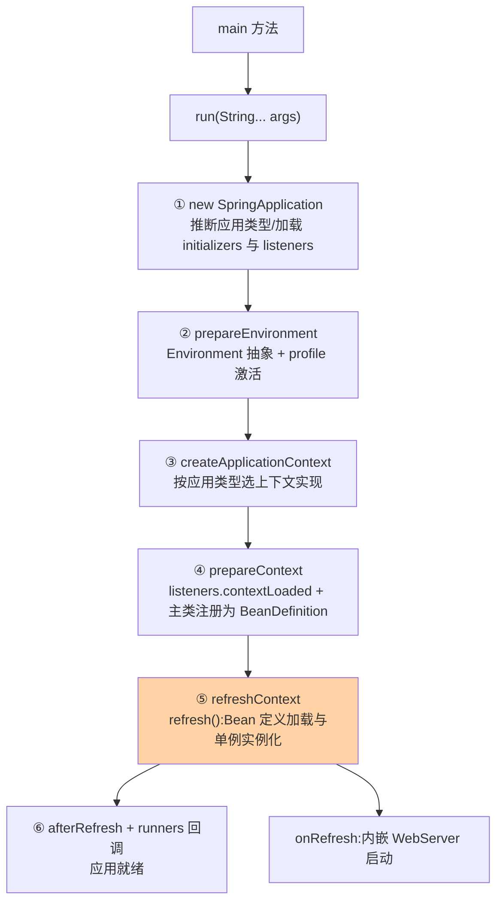
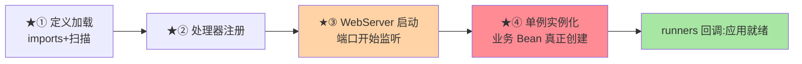

# SpringApplication.run() 启动流程源码走读：从一个 main 到容器就绪

> `SpringApplication.run(App.class, args)` 一行进去，背后是「应用上下文创建 → 环境准备 → Bean 定义加载 → 容器刷新 → 应用就绪」的完整流水线。这篇以 Boot 4.1 / Framework 7.0 源码为主线，把启动的每个阶段拆到可对账的粒度——启动慢排查、启动失败定位、扩展点选型，都以这条链路为地图。

> **本文核心**：run() 是一条**六阶段流水线**（实例化 SpringApplication → 环境准备 → 上下文创建 → prepareContext → refresh 核心 → 就绪回调），核心在 **refresh() 的 13 个步骤**（IoC 容器的真正引擎）。**机制链**：run() → configureIgnoreBeanInfo/环境 Abstraction → createApplicationContext → prepareContext（listeners + beanDefinitionLoader）→ refreshContext（invokeBeanFactoryPostProcessors 加载 Bean 定义 → onRefresh 启动内嵌 WebServer → finishBeanFactoryInitialization 实例化单例）→ runners 回调。

从架构上下游看：启动流程是「配置层与容器层」的桥梁——上游传入 Environment/Profile，下游产出可用的 ApplicationContext，模块边界即「配置语义 vs Bean 语义」的分界线。

## 一句话摘要

启动的本质是「**把应用从静态描述（类 + 配置）变成运行时对象图（容器内活着的 Bean）**」：SpringApplication 承担流程编排（推论出应用类型 SERVLET/REACTIVE/NONE 决定上下文类型），环境阶段产出 `Environment`（配置的统一抽象），refresh 阶段完成 Bean 定义的发现与解析（ConfigurationClassPostProcessor 扫描 @Configuration 与自动装配文件）和单例实例化，最后内嵌 Tomcat（或 Jetty/Undertow）在 `onRefresh` 中启动、ApplicationRunner/CommandLineRunner 在容器就绪后回调。**读懂这条链，启动类的一切行为（banner、profile、延迟初始化、启动失败）都可定位到具体阶段**。

## 一、边界：入门层讲过什么，本文讲什么

| 内容 | 入门层（篇 2/6） | 本文 |
|---|---|---|
| starter 与 @SpringBootApplication 的用法 | ✅ 讲过 | 不重复 |
| 自动装配的配置方式 | ✅ 讲过 | 篇 2 展开（imports 加载源码） |
| run() 的阶段划分与源码链路 | 未讲 | **本文核心一** |
| refresh 的步骤与 Bean 实例化时机 | 未讲 | **本文核心二** |
| 启动扩展点的挂载位置 | 未讲 | **本文核心三** |

## 二、run() 六阶段：源码主线

以 Boot 4.1 的 `SpringApplication.run` 源码结构为主线（方法名跨版本稳定，4.x 与 3.5 行为差异文中标注）：



**阶段①的关键推断**：`WebApplicationType.deduceFromClasspath()`——类路径有 servlet 相关类则 SERVLET（AnnotationConfigServletWebServerApplicationContext）、有 DispatcherHandler 则 REACTIVE、都没有则 NONE——**「应用的形态由类路径决定」**，这就是为什么引一个 starter 就能改变应用类型（机制穿透到依赖推断）。**阶段②**：`ConfigDataEnvironmentPostProcessor` 加载 application.yml/properties 与 profile 变体——外部化配置的统一入口（互指入门层篇 17/18）。**阶段④**：主类（@SpringBootApplication 标注类）被注册为 BeanDefinition——它是后续配置类解析的起点。

## 三、refresh()：13 步里的三个关键节点

`AbstractApplicationContext.refresh()` 是 Framework 的核心引擎（7.0 与 6.x 步骤一致，模板方法模式）：

```text
obtainFreshBeanFactory        → BeanFactory 就绪
invokeBeanFactoryPostProcessors ★① 后置处理器:ConfigurationClassPostProcessor
                                在这里扫描 @Component/@Configuration/@Import
                                + 加载 AutoConfiguration.imports(自动装配,篇2)
registerBeanPostProcessors    ★② 注册 @Autowired/@Validated 等处理器
onRefresh                     ★③ WebServer 创建与启动(ServletWebServerApplicationContext)
finishBeanFactoryInitialization ★④ 实例化全部非延迟单例(getBean 逐个触发)
```

**★① 是 Bean 定义的来源**（扫描 + 自动装配都在这步落地）、**★④ 是 Bean 实例化的时刻**（单例对象在容器刷新尾段才真正创建——「启动慢的大头通常在 ④」）、**★③ 是端口开始监听的时刻**（WebServer 在 Bean 实例化之前已启动，所以「端口通了但接口 404」常见原因是 Handler 还没建好或路径没注册——启动时序问题的排查直觉）。

## 四、源码关键路径（Boot 4.1 / Framework 7.0 口径）

```text
SpringApplication.run
 ├─ new SpringApplication(primarySource)
 │   └─ WebApplicationType.deduceFromClasspath()          // 应用类型推断
 ├─ prepareEnvironment()
 │   └─ ConfigDataEnvironmentPostProcessor                 // application.yml + profile
 ├─ createApplicationContext()                              // by 应用类型
 ├─ prepareContext()
 │   └─ load(context, sources) → AnnotatedBeanDefinitionReader // 主类注册
 └─ refreshContext()
     └─ AbstractApplicationContext.refresh()
         ├─ invokeBeanFactoryPostProcessors()
         │   └─ ConfigurationClassPostProcessor.processConfigBeanDefinitions()
         │       // @ComponentScan 解析 → @Import → @Bean 方法 → 自动装配 imports
         ├─ onRefresh()  → ServletWebServerApplicationContext.createWebServer()
         └─ finishBeanFactoryInitialization()
             └─ DefaultListableBeanFactory.preInstantiateSingletons()
                 └─ getBean() → doCreateBean()               // 互指 IoC 系列篇 2
```

阅读建议：拿一个最小 Boot 应用打断点走两遍——第一遍只看「阶段推进」（每阶段耗时一目了然），第二遍钻进 `ConfigurationClassPostProcessor` 看 Bean 定义怎么从注解堆出来。**启动源码的阅读收益 = 一张阶段地图 + 两个深钻点**，不需要每行都读。

refresh 四节点的时序对照（谁先谁后决定排查直觉）：



## 五、典型场景

- **启动慢排查**：按六阶段分段打点（SpringApplication 有 startup 日志与 ApplicationStartup 探针，Boot 3+ 的 BufferingApplicationStartup 可量化各阶段耗时）——大头几乎总在「⑤ finishBeanFactoryInitialization」（重 Bean 构造、数据源预热）或「② 环境准备」（配置中心网络抖动）
- **启动失败定位**：按失败阶段归类——② 阶段失败多是配置问题（yml 语法/配置中心连不上）、⑤ 的 ★① 失败多是 Bean 定义冲突、★④ 失败是某个 Bean 构造异常（NoSuchBeanDefinition/循环依赖，互指 IoC 系列篇 2）
- **扩展点选型**：想改配置 → EnvironmentPostProcessor（② 后）；想在 Bean 定义加载前动手 → BeanFactoryPostProcessor（★①）；想在实例化后拿到容器 → ApplicationRunner（⑥）——**扩展点的选型先问「我要干预哪个阶段」**

## 业内惯例

- **构造器里别做重活**：Bean 构造在 ★④ 串行执行，构造器里的远程调用/大批量加载直接线性拖慢启动——重初始化挪 `@PostConstruct` 之后的异步或 ApplicationRunner（演进视角：Boot 2.2+ 的 `spring.main.lazy-initialization` 与 4.x 的启动优化都在压缩 ★④ 的耗时）
- **ApplicationStartup 量化先行**：启动优化先开探针拿数据（哪阶段慢、哪个 Bean 慢），不靠感觉调
- **main 方法保持极简**：只留 run() 一行——main 里的自定义逻辑绕过 SpringApplication 生命周期（listeners/探针全失效），业内规范是「扩展交给生命周期钩子」
- **3.x 视角对照**：Boot 3.5 与 4.1 的 run() 阶段结构一致；4.x 差异集中在模块化（starter 重组）与基准库升级，启动机制层面的排查方法论不变——启动排查知识的跨版本稳定性很高

## 六、常见误区

- **「端口通了 = 启动完成」**：onRefresh（★③）在单例实例化（★④）之前——端口监听早于应用真正就绪，就绪判断要看「Started xxx in N seconds」日志（runners 回调完成）
- **「refresh 失败 = Bean 代码写错」**：★① 的失败常是**定义层**问题（同名 Bean、条件装配冲突、imports 文件写错）而非业务代码——按阶段归因再下手
- **把初始化逻辑塞进 static 块或 main**：绕过容器生命周期（无探针可见性、顺序不可控）——这是演进前时代的写法，容器化时代的初始化全部走生命周期
- **忽视 lazy-initialization 的副作用**：全局懒加载提速启动，但首个请求承担实例化成本（P99 尖刺）、启动期暴露不了装配错误——按 Bean 分级用（核心链路急加载、边缘懒加载）

## 七、与相邻机制的关系

- 本系列篇 2《自动装配机制与条件装配源码》：★① 里 imports 文件的加载细节在那篇展开
- 《深入理解IoC容器》系列：doCreateBean 与三级缓存（★④ 的下一层）在 IoC 篇 2
- tips 互指：生产排障专题《启动慢与启动失败排查》以本篇的阶段地图为底图（专题层组合拳）

## 你们可能会问

**Q1：SpringApplication 和 ApplicationContext 谁是主角？**
ApplicationContext（容器）一直是主角——SpringApplication 是 Boot 加的「启动编排器」（推断类型、准备环境、按序调 refresh、触发事件流）——Framework 应用可以没有 SpringApplication（手动 new 上下文），Boot 应用离不开它。两者是编排与引擎的架构分工。

**Q2：为什么 WebServer 在 onRefresh 启动而不是 refresh 之后？**
onRefresh 是留给子类的扩展模板方法（设计上「上下文特有的刷新动作」）——WebServer 属于「上下文的一部分」而非使用者回调；放 refresh 后也可以工作，但会把「容器内嵌服务器」从上下文生命周期里割裂出去——这是源码组织的设计选择，理解它有助于理解扩展点层级。

**Q3：Boot 4 的启动比 3.5 快吗？**
公开基准方向是更快（CDS/AOT 支持持续增强、模块化裁剪），但量级取决于应用自身的 Bean 构造成本——机制层优化是常数级，业务 Bean 的初始化才是变量，启动优化永远先量自己。

## 八、自测三问

1. run() 六阶段各产出什么？WebServer 在哪个阶段启动？
2. refresh 的 13 步里四个关键节点（★①-④）各发生什么？
3. 启动扩展点（EnvironmentPostProcessor/BeanFactoryPostProcessor/ApplicationRunner）分别挂在哪个阶段？

## 开放问题

- AOT/CDS（GraalVM native image 与 CDS 训练运行）正在把「启动」从运行时问题变成构建时问题——Bean 定义在构建期固化后，refresh 的 ★① 在 native 形态下大幅简化，启动源码的形态在代际演进中重构。
- 启动的可观测标准化（各阶段耗时的 OpenTelemetry 语义约定）尚在演进，启动性能数据进统一可观测体系是明显方向。

## 📎 核心带走

- **核心一句话**：run() = 六阶段流水线，refresh 的四个关键节点（定义加载/处理器注册/WebServer 启动/单例实例化）决定启动的一切行为与排查路径
- **机制链**：推断应用类型 → 环境抽象 → 上下文创建 → 主类注册 → ConfigurationClassPostProcessor 扫描与装配 → WebServer 启动 → 单例实例化 → runners 就绪回调
- **失效点/边界**：端口通 ≠ 就绪；★① 失败是定义层问题；扩展点选型先定阶段

## 💡 实战提示

- 💡 BufferingApplicationStartup 开着进生产预发——启动阶段耗时基线白拿
- 💡 启动失败先归阶段（环境/定义/实例化）再看异常栈，别一上来读业务代码
- 💡 决策口径：何时用懒加载——边缘 Bean 懒、核心链路急，全局懒加载只用于明显启动瓶颈的场景
- 💡 启动速度与首请求延迟的取舍：急加载启动慢但首个请求快、懒加载反之——按流量形态（常驻服务 vs 突发任务型）选边

量级分档：10 万级启动 <5s 可接受；千万级多模块启动 30s+ 需要优化（lazy init/AOT）；亿级必须 Serverless 冷启动 <100ms——量级决定启动策略。

## 📌 数据与事实声明

- 写于 2026-09-10，源码主线 Spring Boot 4.1.1 / Spring Framework 7.0.9（gh 实测 2026-08-20 发布）；方法名与阶段结构跨 3.x/4.x 稳定，3.x 差异已标注
- 「启动慢大头在单例实例化」为工程经验口径，以应用实测为准
- 免责：源码细节以 GitHub 当前主线为准

## 📚 参考资料

| 类型 | 标题 | 来源 |
|---|---|---|
| 官方源码 | spring-projects/spring-boot（SpringApplication） | github.com/spring-projects/spring-boot |
| 官方源码 | spring-projects/spring-framework（AbstractApplicationContext） | github.com/spring-projects/spring-framework |
| 官方文档 | Spring Boot Reference（Core Features → SpringApplication） | docs.spring.io |
| 关联系列 | 本系列篇 2 / IoC 容器系列 | 本目录 |
