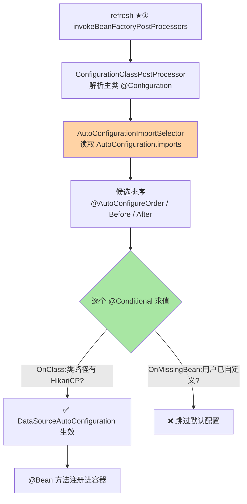
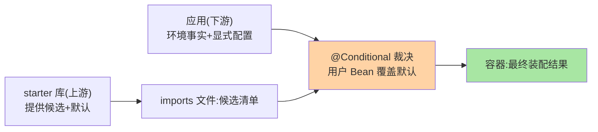

# 自动装配与条件装配源码：imports 文件、@Conditional 与配置生效顺序

> 「引个 starter，数据源就有了」——魔法的背后是一条精确的装配流水线：**imports 文件发现 → 配置类排序 → @Conditional 逐条求值 → @Bean 注册**。这篇以 Boot 4.1 源码为主线，把「魔法」还原成可推理的机制。

> **本文核心**：自动装配 = **约定路径的配置类发现机制 + 条件求值过滤**。**机制链**：classpath 存在 starter → `AutoConfiguration.imports` 文件列出候选配置类 → `AutoConfigurationImportSelector` 读取并按 `@AutoConfigureOrder/@AutoConfigureBefore/After` 排序 → `@Conditional` 族逐条求值（类路径/属性/Bean 缺失判定）→ 通过者作为配置类解析 → @Bean 方法注册进容器。

## 一句话摘要

自动装配解决「**第三方库怎么把它的 Bean 装进你的容器**」：约定文件（`META-INF/spring/org.springframework.boot.autoconfigure.AutoConfiguration.imports`，2.7+ 机制，取代 spring.factories 的装配职责）声明候选 → 条件装配按「环境事实」（类路径有没有、属性配没配、Bean 缺不缺）决定生效——**库提供候选 + 应用环境裁决**的协作模型。三个关键机制件：**imports 文件**（发现）、**@Conditional 族**（过滤：@ConditionalOnClass/@OnMissingBean/@OnProperty）、**生效顺序**（@AutoConfigureBefore/After 解决配置类间依赖）。理解后可解：为什么 @ConditionalOnMissingBean 让你的配置能覆盖默认、为什么顺序错会装配出诡异结果、怎么写自己的 starter。

## 一、边界：入门层讲过什么，本文讲什么

| 内容 | 入门层（篇 6） | 本文 |
|---|---|---|
| starter 的使用与 @SpringBootApplication 组成 | ✅ 讲过 | 不重复 |
| 自动装配的开关与排除方式 | ✅ 讲过 | 不重复 |
| imports 文件加载与排序源码 | 未讲 | **本文核心一** |
| @Conditional 求值机制 | 未讲 | **本文核心二** |
| 自定义 starter 的机制要点 | 提了一句 | **本文核心三** |

## 二、装配流水线全景



**imports 文件的机制细节**（3.x/4.x 一致口径）：每行一个配置类全限定名（`org.springframework.boot.autoconfigure.jdbc.DataSourceAutoConfiguration`）；`AutoConfigurationImportSelector` 通过 SpringFactoriesLoader 风格的加载器读取全部 jar 里的同名文件合并——**多 starter 的候选自动汇聚**。**排序的意义**：配置类之间有隐式依赖（Web 安全配置要在 Web 配置之后），`@AutoConfigureBefore/After` 显式声明相对顺序（这是自动装配特有的排序，与普通 @Order 不同层）——**顺序错配是「条件判定用了还没注册的 Bean」类诡异问题的根源**。

## 三、@Conditional 族：环境事实的判定器

| 注解 | 判定问题 | 典型用途 |
|---|---|---|
| @ConditionalOnClass | 类路径有这个类吗 | 有 HikariCP 才装配默认连接池 |
| @ConditionalOnMissingBean | 容器里还没有这个类型吗 | **用户配置优先于默认**的核心机制 |
| @ConditionalOnProperty | 属性开关配了吗 | `@AutoConfigureExclude` 类开关控制 |
| @ConditionalOnWebApplication | 是 Web 应用吗 | Web 专属配置 |
| @ConditionalOnResource | 资源文件存在吗 | 有 schema.sql 才执行初始化 |

**@ConditionalOnMissingBean 的设计深意**：它实现了「**默认配置可被覆盖**」——自动配置类里的 `@Bean @ConditionalOnMissingBean(DataSource.class)`，用户自己 @Bean DataSource 时默认的不注册——**「约定提供默认、显式配置赢」**的机制载体。这也是为什么自动配置类用 @Bean 方法而不是 @Component（方法级条件判定 + 用户覆盖语义）。**判定时机警告**：条件在配置类解析期求值，此时容器只有部分 Bean——OnMissingBean 对「同批装配的 Bean」判定有顺序依赖，这正是排序机制存在的原因（也是条件装配的经典坑位）。

## 四、源码关键路径（Boot 4.1 口径）

```text
ConfigurationClassPostProcessor.processConfigBeanDefinitions()
 └─ ConfigurationClassParser.parse()
     └─ processImports()                        // @Import 与 @EnableAutoConfiguration 入口
         └─ AutoConfigurationImportSelector.getAutoConfigurationEntry()
             ├─ getCandidateConfigurations()    // 读全部 imports 文件
             ├─ removeDuplicates() + sort()      // AutoConfigurationSorter
             │    // 按 @AutoConfigureOrder → Before/After → 字母序 三级排序
             └─ filter()                         // OnClass/OnMissingClass/OnWebApplication
                                               // 读取 spring-autoconfigure-metadata.properties 预筛
             → 候选作为配置类回流 parse() 继续处理
             → ConfigurationClassBeanDefinitionReader.loadBeanDefinitions()
                 // @Bean 方法 → BeanDefinition(含条件评估 OnMissingBean)
```

**性能彩蛋**：条件预筛用编译期生成的元数据文件（`spring-autoconfigure-metadata.properties`）做第一轮粗筛（不加载类就能判 OnClass），全量解析只对通过者——这是启动性能的隐藏优化，也解释了为什么改了条件注解有时要 clean rebuild（元数据是注解处理器生成的）。

库与应用的装配协作模型（架构分层）：



## 五、典型场景

- **排查「为什么没装配上」**：开 debug 开关（`--debug` 或 `debug=true`）→ 启动日志打 ConditionEvaluationReport（每个自动配置类的命中/未命中与原因）——**装配排查的第一工具**
- **自定义 starter**：autoconfigure 模块写配置类（@AutoConfiguration + 条件注解 + @ConditionalOnMissingBean 保留覆盖语义）+ imports 文件登记 + starter 模块只做依赖聚合——两模块分离是业内结构惯例
- **覆盖默认配置**：自己 @Bean 同类型即覆盖（OnMissingBean 让位）；精确控制用 `spring.autoconfigure.exclude` 排除整个配置类

## 业内惯例

- **自动配置类只放 @Bean，不放业务逻辑**：自动配置的职责是「装配件清单」，逻辑在库的 service 类里——配置类膨胀是 starter 质量劣化的信号
- **@ConditionalOnMissingBean 是给用户留的口子，不是装饰**：每个默认 @Bean 都问「用户可能想换吗」——想，就加条件；不想（如内部适配器），别加（避免被意外覆盖）
- **配置类顺序显式声明**：有依赖关系的自动配置类写 @AutoConfigureBefore/After，不赌默认顺序——排序是契约不是巧合
- **3.x 视角对照**：imports 文件机制自 2.7 引入、3.x 全面取代 spring.factories（其仅保留部分场景），4.1 延续——「spring.factories 做自动装配」是 2.6 前的历史知识，排障时先确认版本的机制归属

## 六、常见误区

- **「自动装配 = 全自动不可控」**：每个环节可控——exclude 排除、属性开关（OnProperty）、自定义覆盖（OnMissingBean）——「不可控感」来自不了解条件判定语言
- **条件注解放错位置**：@ConditionalOnClass 放配置类上（类级判定）、@ConditionalOnMissingBean 放 @Bean 方法上（Bean 级判定）——放反了判定语义全错（类级 OnMissingBean 在解析期几乎没有 Bean，永真）
- **在普通 @Configuration 上用 @AutoConfigureBefore/After**：这套排序只对自动配置类生效（imports 文件里的），普通配置类间顺序用 @DependsOn 或 Bean 依赖表达
- **以为 debug 报告是运行时日志**：ConditionEvaluationReport 是启动期一次性输出（条件求值只在启动发生）——运行时的「为什么没有这个 Bean」要回启动日志找

## 七、与相邻机制的关系

- 本系列篇 1：装配发生在 refresh ★① 阶段（本篇是 ★① 的内部展开）
- 《深入理解IoC容器》系列：@Bean 注册后的实例化链路（doCreateBean）在 IoC 篇 2
- tips 互指：自定义 starter 的完整工程结构（两模块分离）在专题层《工程实战》展开

## 你们可能会问

**Q1：@SpringBootApplication 里的 @EnableAutoConfiguration 做了什么？**
它 @Import 了 AutoConfigurationImportSelector——把「主类解析」与「自动装配候选加载」接起来（本篇流水线的入口）；没有它 Boot 就只是个普通 Spring 应用——一行注解背后是整条装配机制的挂载点。

**Q2：多个 starter 都想提供同一 Bean，谁赢？**
默认按「用户配置 > 自动配置（OnMissingBean 让位）」；自动配置之间靠排序 + OnMissingBean 协调——最终一个赢（不共存，除非设计为集合注入 List`<T>`，框架常见的多实现共存模式）。

**Q3：为什么我的条件注解改了没生效？**
大概率是元数据文件（编译期生成）过期——clean rebuild；或判定时机误解（解析期 vs 运行期）——条件只在启动求值一次。

## 八、自测三问

1. imports 文件的发现机制与排序的三级依据？
2. @ConditionalOnMissingBean 怎么实现「默认可覆盖」？判定时机的坑？
3. ConditionEvaluationReport 怎么开、看什么？

## 开放问题

- 装配机制的元数据化还在演进（编译期元数据预筛的覆盖面扩大），「启动期条件求值」向「构建期静态确定」（AOT 形态下条件在构建时定格）演进——条件装配的运行时语义在 native 形态下被重写。
- starter 的版本治理（同一库多版本 starter 的候选冲突）随模块化裁剪（4.x 的模块化 JDK 路线）出现新议题。

## 📎 核心带走

- **核心一句话**：自动装配 = imports 文件发现候选 + 排序保证依赖序 + @Conditional 族按环境事实裁决——库提供候选、环境决定生效
- **机制链**：imports 读取 → 去重排序 → 元数据预筛 → 条件逐条求值 → 配置类解析 → @Bean 注册（OnMissingBean 保留用户覆盖位）
- **失效点/边界**：条件只在启动求值一次；排序只管自动配置类；元数据过期要 clean rebuild

## 💡 实战提示

- 💡 装配问题第一步永远是 `--debug` 看 ConditionEvaluationReport，别猜
- 💡 自定义 starter 必留 OnMissingBean 口子 + imports 文件别写错路径（最高频的 starter 失效原因）
- 💡 决策口径：何时排除 vs 覆盖——整组不要用 exclude，单 Bean 换实现用自定义 @Bean
- 💡 装配确定性的取舍：条件越「聪明」越灵活但越难推理——starter 的条件设计在灵活与可预期之间偏后者

## 📌 数据与事实声明

- 写于 2026-09-10，机制主线 Spring Boot 4.1.1（gh 实测）；imports 文件机制自 2.7 起为标准、3.x/4.x 延续（spring.factories 装配为 2.6 前历史口径）
- 免责：源码细节以 GitHub 当前主线为准

## 📚 参考资料

| 类型 | 标题 | 来源 |
|---|---|---|
| 官方源码 | spring-boot-autoconfigure（AutoConfigurationImportSelector） | github.com/spring-projects/spring-boot |
| 官方文档 | Spring Boot Reference（Developing → Auto-configuration） | docs.spring.io |
| 关联系列 | 本系列篇 1 / IoC 容器系列 | 本目录 |
