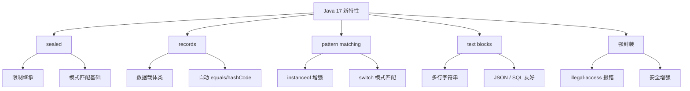

# 1.17 的亮点：Java 17 五大新特性速览

> 5 个新特性 + 1 张图 + 10 行代码，5 分钟搞懂 Java 17 为什么值得升级。
> 这是 Java 17 新特性系列第 1 篇：亮点速览。

## 1. 一句话定义

**Java 17 = Java 11 + 100+ 项新特性 + 至少 8 年长期支持。**

## 2. 为什么升 Java 17

- **官方 LTS 长期支持**（至少到 2029-09）
- **Spring Boot 3.x 强制要求**（不升 17 不能用 Spring Boot 3）
- **代码量大幅减少**（records + sealed + pattern matching）
- **现代特性**：sealed / records / text blocks / switch 增强

### 不升级会怎样

- 错过 Spring Boot 3.x（云原生时代标配）
- 代码啰嗦（要写大量 getter/setter/equals/hashCode）
- 编译期安全差（继承关系无法限制）

## 3. 五大新特性速览

| # | 特性 | 一句话 | 解决的问题 |
|---|---|---|---|
| 1 | **sealed classes** | 限制谁能继承 | 编译期防止意外继承 |
| 2 | **records** | 数据类自动生成 | 消灭 getter/setter 模板 |
| 3 | **pattern matching** | instanceof 简化 | 类型检查 + 强转一行 |
| 4 | **text blocks** | 三引号字符串 | 多行字符串不用拼接 |
| 5 | **sealed interfaces** | 接口也能限制实现 | 模式匹配的前提 |

## 4. 一张图



## 5. 10 行代码实战

```java
// 1. record（数据类）
record User(String name, int age) {}

// 2. sealed interface（限制实现）
sealed interface Shape permits Circle, Rectangle {}

// 3. pattern matching（类型检查 + 强转）
public double area(Shape shape) {
    // Java 17 之前：
    // if (shape instanceof Circle) {
    //     Circle c = (Circle) shape;
    //     return Math.PI * c.radius() * c.radius();
    // }

    // Java 17 之后：一行搞定
    if (shape instanceof Circle c) {
        return Math.PI * c.radius() * c.radius();
    }
    if (shape instanceof Rectangle r) {
        return r.width() * r.height();
    }
    throw new IllegalArgumentException("Unknown shape");
}

// 4. text blocks（多行字符串）
String json = """
        {
          "name": "%s",
          "age": %d
        }
        """.formatted("张三", 25);
```

**完整的 5 大特性在后续系列文章展开。**

## 6. 何时升 / 何时不升

### ✅ 适合升 17

- 新项目（直接 Java 21 LTS）
- 从 Java 8/11 升级（享受现代特性）
- 想用 Spring Boot 3.x
- 团队能投入升级成本

### ❌ 不建议升 17

- 强依赖 Java 8 的库（且无法替换）
- 大型单体应用，重构成本极高
- 团队没有升级经验（建议先小项目试水）

## 7. 升级决策 trade-off

| 维度 | 升 17 | 留 11 / 8 |
|---|---|---|
| LTS 支持 | ✅ 至少到 2029 | ❌ Java 8 已 EOL |
| 现代特性 | ✅ records / sealed | ❌ 没有 |
| Spring Boot 3 | ✅ 必须 17+ | ❌ 只能用 2.x |
| 升级成本 | ⚠️ 中-高（依赖兼容性） | ✅ 零 |
| 团队技能 | ⚠️ 需要培训 | ✅ 不变 |

**决策建议：**

- 新项目 → 直接 Java 17（甚至 21）
- 旧项目升级 → 先 17，再 21（逐步迁移）
- 不升级 → 锁版本 + 接受技术债

## 8. 5W 速记卡

| 维度 | 答案 |
|---|---|
| **What** | Java LTS 版本（Java 11 + 100+ 新特性） |
| **Why** | LTS + Spring Boot 3 要求 + 代码简洁 |
| **When** | 新项目 / 旧项目升级 / 用 Spring Boot 3 |
| **Where** | 后端服务 / 云原生应用 |
| **How** | 装 JDK 17 + IDE 配置 + 编译选项 + 升级依赖 |

## 9. 一句话总结

> Java 17 = 「现代化 Java 起点」——5 大特性让代码更简洁、生态更现代、支持更长期。

## 下一步

- [环境升级：装 JDK 17 跑 Hello World](../02_环境升级/)
- [sealed classes：受限继承](../02_sealed-classes/)
- [records：数据类](../03_records/)
- [pattern matching：类型模式](../04_pattern-matching/)
- [升级实战：从 11 升 17 踩坑](../工程实践/)

## 参考

- [JEP 索引：Java 17 所有新特性](https://openjdk.org/projects/jdk/17/)
- [Spring Boot 3 系统要求](https://docs.spring.io/spring-boot/docs/current/reference/html/getting-started.html#getting-started.system-requirements)
- 《Java 17 核心技术》
- 内部 ADR：「Java 版本升级策略」（待脱敏）