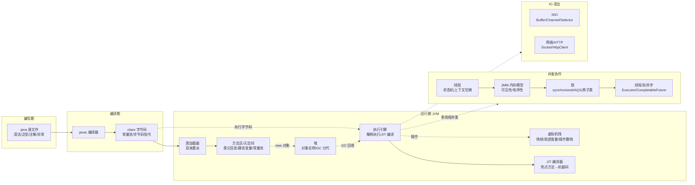

# Java 系列导读 · 从一段代码的一生认识 Java

> 📖 本系列共 42 篇（0_导读 + 1-41 正文），覆盖 Java 语言本体整个知识面：认知生态、语法核心、集合框架、并发编程、JVM、IO 网络、现代特性 7 组。
> 本篇是第 0 篇导读：先建立全局心智模型，再决定读哪条路。
> Spring Boot 生态是独立系列（见 ecosystem/spring-boot），不在此系列内。

## 一、为什么需要这套系列

Java 是后端开发绕不开的工程底座：业务接口跑它、中间件客户端用它、整个 JVM 生态建立在它之上。但 Java 的知识极其分散：语法在书里、集合在源码里、并发在实践里、JVM 在调优事故里，常见两种极端：

- **碎片化学习**：今天看 HashMap，明天看 synchronized，各知识点没有连线——问「HashMap 扩容为什么影响并发」就答不上来
- **一上来就啃源码/JVM 专著**：没建立整体框架，读两章就放弃

这套系列的设计思路：**先主线后支线**。主线是「一段代码的一生」——从写出的 .java 源文件，到编译成字节码、类加载进 JVM、对象分配在堆上、线程并发执行、GC 回收，把 Java 全部核心机制串起来；支线是挂在这条主线上面的七组知识：语法（怎么写）、集合（数据怎么组织）、并发（多线程怎么协作）、JVM（运行时怎么运转）、IO（数据怎么进出）、新特性（语言怎么演进）。主线通了，各组深挖时都知道「它在整条链路里处于什么位置」。

## 二、全局心智模型：一段代码的一生

一段代码的一生：

1. **编写期**：写 .java 源文件——语法核心（对象/继承/接口/异常/泛型/注解）决定「怎么写」
2. **编译期**：javac 把源码编译成 .class 字节码——类型擦除发生在这一步，注解被记录进字节码
3. **类加载**：类加载器按双亲委派把字节码加载进 JVM，类元信息放方法区（元空间），常量池跟着进来
4. **对象分配**：new 的对象在堆上分配（可能 TLAB 本地分配），栈帧里的引用指向它；对象头里藏着 GC 分代年龄、锁状态
5. **并发执行**：多线程共享对象时，JMM 决定可见性（volatile/happens-before），锁决定互斥（synchronized 升级/AQS），线程池管理线程生命周期
6. **GC 回收**：对象不再可达，垃圾回收器（分代 → G1）回收堆内存；栈上方法结束，栈帧弹出
7. **IO 进出**：数据通过流/NIO 进出进程，网络请求通过 Socket/HTTP 通道

> tips：(知识地图) 这条主线是整套 Java 知识的主干：7 组知识全部挂在「一段代码的一生」上——语法管编译前、类加载管进入 JVM、JMM/锁管并发协作、GC 管对象归宿、NIO 管数据进出。

## 三、系列导航表（42 篇 · 7 组）

### 第 1 组 认知与生态（2 篇）

| 序号 | 篇目 | 深度 | 一句话定位 | 对标书目 |
|---|---|---|---|---|
| 0 | 系列导读 | 全景 | 全局心智模型 + 阅读路径 | - |
| 1 | Java 全景与运行机制 | 入门 | 语言定位/发展简史/JDK-JRE-JVM/字节码/一次编译到处跑 | 核心技术卷I / 官方 |
| 2 | Java 版本演进与 LTS 节奏 | 入门 | 8→11→17→21→25 每个大版本核心变化/升级路径/选型 | 官方 / JavaGuide |

### 第 2 组 语法核心（8 篇）

| 序号 | 篇目 | 深度 | 一句话定位 | 对标书目 |
|---|---|---|---|---|
| 3 | 对象与类 | 入门 | 类与对象/构造器/this-static/包/内存布局直觉 | 核心技术卷I |
| 4 | 继承与多态 | 入门 | 继承/重写与隐藏/多态与动态绑定/组合优于继承 | 核心技术卷I / Effective Java |
| 5 | 接口与抽象类 | 入门 | 接口演进（default/static/private）/抽象类/函数式接口预告 | 核心技术卷I |
| 6 | 字符串与常量池 | 入门 | String 不可变/StringBuilder/StringBuffer/常量池演进/intern | 核心技术卷I |
| 7 | 异常体系与最佳实践 | 入门 | checked/unchecked/自定义/try-with-resources/异常反模式 | 核心技术卷I / Effective Java |
| 8 | 泛型 | 入门 | 泛型类方法/类型擦除/通配符与边界/桥方法 | 核心技术卷I |
| 9 | 注解与反射 | 入门 | 注解定义/元注解/反射 API/动态代理初识 | 核心技术卷I |
| 10 | 枚举与金额精度 | 入门 | enum 用法/EnumMap-EnumSet/单例 + BigDecimal/浮点误差/舍入（金融刚需） | Effective Java / 业务 |

### 第 3 组 集合框架（6 篇）

| 序号 | 篇目 | 深度 | 一句话定位 | 对标书目 |
|---|---|---|---|---|
| 11 | 集合框架总览 | 入门 | Collection/Map 五大接口/快速失败/选型决策 | 核心技术卷I |
| 12 | ArrayList 与 LinkedList | 入门 | 动态数组/链表/扩容/随机访问 vs 插入/Vector 对比 | 核心技术卷I |
| 13 | HashMap 原理与演进 | 入门 | hash 扰动/冲突链/红黑树化/扩容/Java 8 演进 | 核心技术卷I / 源码 |
| 14 | Map/Set 家族对照 | 入门 | LinkedHashMap-TreeMap-Hashtable / HashSet-LinkedHashSet-TreeSet | 核心技术卷I |
| 15 | Queue/Deque 与 PriorityQueue | 入门 | ArrayDeque/优先级队列/双端队列/场景选型 | 核心技术卷I |
| 16 | 并发集合与线程安全容器 | 入门 | ConcurrentHashMap 设计/并发 Queue/CopyOnWrite/同步包装器 | JUC 源码 / JavaGuide |

### 第 4 组 并发编程（9 篇）

| 序号 | 篇目 | 深度 | 一句话定位 | 对标书目 |
|---|---|---|---|---|
| 17 | 线程基础与生命周期 | 入门 | 创建 4 方式/状态机/上下文切换/为什么并发难 | 并发编程实战 |
| 18 | 线程协作与阻塞队列 | 入门 | wait-notify/join/yield/中断/生产者消费者 BlockingQueue | 并发编程实战 |
| 19 | JMM 与 volatile | 入门 | 内存模型/可见性/有序性/happens-before/volatile 语义 | 并发编程实战 |
| 20 | synchronized 与锁升级 | 入门 | 监视器/偏向→轻量→重量/可重入 | 深入理解JVM |
| 21 | CAS 与原子类 | 入门 | CAS 原理/ABA/Atomic 家族/LongAdder | 并发编程实战 |
| 22 | AQS 与 JUC 锁 | 入门 | AQS 骨架/ReentrantLock/读写锁/公平性 | 并发编程实战 |
| 23 | 并发工具类 | 入门 | CountDownLatch/CyclicBarrier/Semaphore/Exchanger | 并发编程实战 |
| 24 | ThreadLocal | 入门 | 原理/内存泄漏/线程池场景/传递方案 | JavaGuide / 实战 |
| 25 | 线程池与异步编程 | 入门 | Executor 框架/7 参数/拒绝策略/异常处理/CompletableFuture | 并发编程实战 |

### 第 5 组 JVM（7 篇）

| 序号 | 篇目 | 深度 | 一句话定位 | 对标书目 |
|---|---|---|---|---|
| 26 | 运行时内存区域 | 入门 | 堆/栈/方法区/直接内存/各区域 OOM 长相 | 深入理解JVM |
| 27 | 对象的一生 | 入门 | 创建流程/内存布局/对象头/指针压缩/TLAB/逃逸分析 | 深入理解JVM |
| 28 | 垃圾回收算法 | 入门 | 可达性分析/引用类型/标记清除-复制-标记整理/分代 | 深入理解JVM |
| 29 | GC 收集器全景 | 入门 | Serial→CMS→G1→ZGC/停顿与吞吐/选型 | 深入理解JVM |
| 30 | 类加载机制 | 入门 | 加载-验证-准备-解析-初始化/双亲委派/打破场景 | 深入理解JVM |
| 31 | 编译与执行 | 入门 | javac/字节码/解释 vs JIT/分层编译/C1-C2 | 深入理解JVM |
| 32 | JVM 调优与排查工具 | 入门 | 常用参数全解/GC 日志/jps-jstat-jmap-jstack/Arthas | 深入理解JVM / 实战 |

### 第 6 组 IO 与网络（3 篇）

| 序号 | 篇目 | 深度 | 一句话定位 | 对标书目 |
|---|---|---|---|---|
| 33 | IO 体系与序列化 | 入门 | 字节流字符流/装饰器/File/NIO 对比起点/Serializable | 核心技术卷II |
| 34 | NIO 与 IO 多路复用 | 入门 | Buffer-Channel-Selector/epoll/多路复用模型 | 核心技术卷II |
| 35 | 网络编程与 HTTP | 入门 | Socket/Java HttpClient/HTTP 要点/连接池（RPC 专题地基） | 核心技术卷II |

### 第 7 组 现代特性（6 篇）

| 序号 | 篇目 | 深度 | 一句话定位 | 对标书目 |
|---|---|---|---|---|
| 36 | Lambda 与函数式接口 | 入门 | lambda 语法/函数式接口/方法引用/变量捕获 | 核心技术卷II |
| 37 | Stream 流式编程 | 入门 | 创建/中间-终端操作/Collectors/并行流 | 核心技术卷II |
| 38 | Optional 与新 API | 入门 | Optional 用法与反模式/集合工厂方法/var | 核心技术卷II |
| 39 | 新日期时间 API | 入门 | java.time/LocalDate-DateTime/Instant/格式化/时区（账务刚需） | 核心技术卷II |
| 40 | Java 17 新特性 | 入门 | record/sealed/switch 表达式/文本块 | JEP 官方 |
| 41 | Java 21 与虚拟线程 | 入门 | 虚拟线程/pattern matching/25 展望 | JEP 官方 / JavaGuide |

## 四、阅读路径

- **新手 / 系统补一遍**：按 1-41 顺序通读入门层（7 组顺读，每篇 20-40 分钟）
- **面试/工作优先**：第 4 组并发（17-25）+ 第 5 组 JVM（26-32）权重最高，可先读
- **金融场景**：第 10 篇（枚举+金额精度）+ 第 39 篇（日期时间）直接对账务开发
- **进阶深入**：对哪篇有疑问，沿该篇进入特性层对应子目录（集合源码/并发/JVM/新特性），再到专题层组合实战
- **写代码随查**：集合选型（11）、并发方案（17-25）当手册翻

## 五、配套系列

- **Spring Boot 生态系列**：独立成系列（ecosystem/spring-boot），前置依赖本系列第 4 组并发 + 第 9 篇反射
- **未来 RPC 专题**：从零写一个 RPC，Dubbo 作对照——本系列 33-35（IO/网络）是它的地基
- **Redis / MySQL 系列**：本系列 10（精度/日期）与 39（日期）与信贷场景文章互相呼应

## 六、一句话总结

> Java 的知识地图只有一张：**一段代码的一生**——编译进 JVM、分配在堆上、并发在锁里、回收在 GC 里。主线通了，41 篇全是支线深挖的入口。
