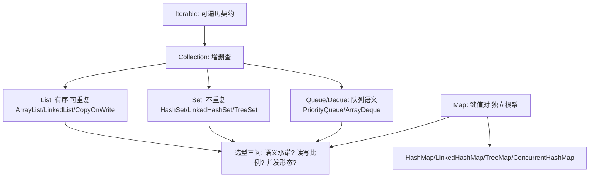

# 集合框架总览

> **一句话摘要**：集合框架 = 「 Collection（单值）与 Map（键值）两大根系 + 迭代器统一遍历 + 快速失败/安全失败两种并发姿态」——五大接口（List/Set/Queue/Map/Iterable）各有明确的语义承诺；本篇是集合组（11-16 篇）的总地图：选型先看语义承诺，再看实现代价。

> **本文核心**：机制链 = **Iterable（可遍历契约）→ Collection（增删改查）分出 List（有序可重复）/Set（不重复）/Queue（队列语义）三支 → Map 独立成系（键值对）→ 实现类的差异全部是「底层数据结构的代价差异」（数组/链表/哈希/树）→ 并发姿态分 fail-fast（遍历中结构变更即抛）与 fail-safe（副本遍历）**——选型 = 语义承诺 × 读写比例 × 并发形态。

前置阅读：[对象与类](./3_对象与类-入门.md)（引用语义——集合存的是引用不是对象副本）。各实现深挖见 12-16 篇。

## 1. 背景：为什么要有「框架」而不只是一堆类

集合框架（Java 1.2）的价值在「接口先行」：算法面向 `List` 接口编写，实现（ArrayList/LinkedList/CopyOnWriteArrayList）可替换——**语义承诺（接口）与实现代价（类）分离**。这让你可以「先按语义写代码，后按压力选实现」，也让你在读任何新实现（Guava/IDE 内部集合）时能按同一张接口地图定位。

## 2. 核心机制：两大根系与选型地图



- **五大语义承诺**：List 保顺序可重复（按位置访问）；Set 不重复（去重语义，实现决定是否有序）；Queue/Deque 队列语义（FIFO/LIFO/优先级）；Map 键到值映射（键唯一）。**语义承诺是选型第一维**——「需要去重」直接锁定 Set 系，「需要按序取」锁定 Queue 系。
- **实现差异 = 数据结构差异**：ArrayList（数组：随机访问 O(1)、中间插删 O(n)）、LinkedList（双向链表：插删 O(1)、随机访问 O(n)）、HashMap（哈希：均摊 O(1)、无序）、TreeMap（红黑树：有序 O(log n)）——**没有全能实现，只有「读写比例 × 有序需求」的匹配**。
- **快速失败 vs 安全失败**：ArrayList 的迭代器遍历中若发生结构性修改（modCount 校验）立即抛 ConcurrentModificationException（fail-fast——尽早暴露并发修改，但**不是线程安全保证**）；CopyOnWriteArrayList/ConcurrentHashMap 的遍历基于副本或弱一致视图（fail-safe——不抛但可能读到旧数据）。两者的正确理解：fail-fast 是「调试信号」不是「并发防护」，并发场景直接选并发容器（第 16 篇）。
- **equals/hashCode 的契约**：HashMap/HashSet 的正确性押在键对象的 equals 与 hashCode 契约上（equals 相等则 hashCode 必相等）——违约对象作键 = 「存进去找不到」的经典事故；不可变键（String/record/枚举）是安全默认。

## 3. 落地实践：选型三问工作流

```text
Q1 语义承诺: 有序去重? → LinkedHashSet / TreeMap
             仅去重?   → HashSet
             队列?     → ArrayDeque / PriorityQueue / BlockingQueue 系
             键值映射? → HashMap / TreeMap / ConcurrentHashMap
             位置访问? → ArrayList
Q2 读写比例: 尾部追加为主 + 随机读 → ArrayList(默认)
             头尾操作频繁 → ArrayDeque
             读多写极少 + 并发遍历 → CopyOnWriteArrayList
Q3 并发形态: 单线程/线程封闭 → 普通容器
             共享并发 → ConcurrentHashMap / CopyOnWrite / BlockingQueue
```

三条纪律：① **容量预估**（`new ArrayList<>(n)` 免多次扩容复制）；② **接口类型声明**（`List<String> l = new ArrayList<>()`——实现可换）；③ **遍历中删除用迭代器的 remove 或 removeIf**（不要 for-each 里直接 list.remove——fail-fast 抛异常是迟早的）。

## 4. 生产视角：集合事故的形态

- **for-each 中 remove 的并发修改异常**：遍历时直接调 list.remove——fail-fast 抛 ConcurrentModificationException（单线程也会抛！它与线程无关，是迭代器的一致性检查）。正解：`iterator.remove()` / `removeIf` / 倒序遍历。
- **可变对象作键的丢失**：把可变对象放 HashMap 后修改了参与 hashCode 的字段——键的哈希变了，get 找不到（对象还在 map 里但「失踪」）。纪律：键不可变。
- **Arrays.asList 的假 List**：返回定长视图（add/remove 抛 UnsupportedOperationException），且与原数组联动——当普通 List 用必翻车。
- **subList 的父子联动**：subList 是原 list 的视图——原 list 结构性修改后 subList 全部操作抛异常；「截取后删原表」的经典翻车。
- **集合泄漏**：static Map 作缓存只进不出——引用不断 GC 不收（ThreadLocal 泄漏的同族问题，第 24 篇），容量治理与过期策略是缓存集合的必配。

## 5. 主流系统怎么做：集合的生态扩展

| 生态 | 扩展点 | 机制要点 |
|---|---|---|
| JDK 并发包 | ConcurrentHashMap/CopyOnWrite/BlockingQueue 系 | 并发形态的一等公民（第 16 篇） |
| Google Guava | ImmutableCollection/多值 Map/双向 Map | 不可变集合（防篡改+免防御性拷贝）/Multimap |
| Eclipse Collections/Hutool | 原语特化/流式 API | 避免装箱的特化集合 |
| Netty | ByteBuf/池化容器 | 自研容器避 GC 压力（零拷贝场景） |

规律：**JDK 集合覆盖 95% 场景；扩展生态解决「不可变/多值/原语/零拷贝」四个 JDK 短板**——先 JDK 后生态，按短板引入。

## 6. 典型场景

- **业务列表展示**（通用级）：ArrayList + 预估容量——绝对主力。
- **去重与索引**（查找级）：HashSet 判重 / HashMap 建索引（O(1) 查找替代 O(n) 遍历）。
- **任务编排**（队列级）：生产者消费者 BlockingQueue / 优先级调度 PriorityQueue。

## 7. 与相邻概念的区别

- **Collection vs Collections vs CollectionUtils**：接口 / 纯静态工具类（sort/shuffle）/ Apache/Guava 工具扩展——三个名字三种东西。
- **数组 vs ArrayList**：定长原语支持（int[] 无装箱）vs 动长泛型——性能敏感批量数值用数组/特化库，业务代码用集合。
- **fail-fast vs 线程安全**：fail-fast 只是「尽早抛」的一致性检查，不做并发防护——不要把它当并发保证（第 16 篇的并发容器才是）。
- **本篇 vs ConcurrentHashMap（第 16 篇）**：本篇是地图与语义，16 篇是并发容器的机制深挖——总览与专篇。

## 8. 常见误区与不适用

- **「LinkedList 比 ArrayList 快」**：只有「迭代中段频繁插删」场景成立；随机访问 LinkedList 是 O(n)（实际还差于 ArrayList 的连续内存缓存友好性）——默认 ArrayList，基准证明再换。
- **「HashMap 无序所以不能用」**：无序是 HashMap 的承诺（不保证），需要插入序用 LinkedHashMap（访问序还能做 LRU）、排序用 TreeMap——承诺分清，需求对位。
- **「集合存的是对象」**：存的是引用——对象在堆上，集合只管地址条；「拷贝集合」拷的是引用列表（浅拷贝），防御性拷贝要显式深做。
- **「TreeMap 什么都好就是慢点」**：红黑树的 O(log n) 在超大规模下与 O(1) 的差距是实打实的——有序才选树，无序需求选哈希。
- **不适用**：原语高性能批量（特化库）；超大规模离线计算（Spark 等分布式集合）；流式无限数据（本篇是内存集合）。

## 9. 你们可能会问

- **扩容机制为什么重要？** ArrayList 1.5 倍扩、HashMap 2 倍重哈希——扩容是 O(n) 搬迁，预估容量（避免多次扩容）是小成本的确定性优化。
- **removeIf 与遍历 remove 的区别？** removeIf 内部处理了迭代一致性（且可能有批量优化）——语义清晰免手错；倒序下标遍历是数组类 list 的备选。
- **LinkedHashMap 怎么实现 LRU？** 构造参数 accessOrder=true + 覆写 removeEldestEntry——访问序维护 + 钩子淘汰，三行代码一个 LRU 缓存（机制详解在 14 篇）。
- **不可变集合怎么建？** Java 9+ `List.of/Set.of/Map.of`（真不可变，禁止 null）或 Guava ImmutableXxx（builder 友好）——对外返回不可变集合是防御性设计的标配。
- **怎么给集合选初始容量？** 期望条目数 ÷ 负载因子（HashMap 0.75）向上取整 + 余量；ArrayList 直接期望条目数——过大的初始容量反而浪费内存。

## 10. 一句话总结 + 5W 速记卡 + 自测三问

**🎯 核心带走**：

- **核心一句话**：集合框架 = 语义承诺（List/Set/Queue/Map）× 数据结构代价（数组/链表/哈希/树）× 并发姿态（fail-fast/fail-safe/并发容器）——选型三问：语义？读写比？并发？
- **链条复述**：Iterable→Collection 三支 + Map 独立系 → 实现差异即结构差异 → 扩容与视图的坑 → 并发选并发容器。
- **失效点与边界**：键必须不可变且契约正确；视图集合与父联动；原语批量走特化。

**5W 速记卡**：

| 维度 | 内容 |
|---|---|
| What | 两大根系 + 五大承诺 + fail-fast/安全失败 |
| Why | 语义与实现分离让「先写对、后选优」 |
| When | 任何集合选型与集合类故障排查 |
| Where | 一切内存数据组织场景 |
| How | 三问选型 → 容量预估 → 接口声明 → 并发选并发容器 |

💡 **实战提示**：for-each 不 remove；键不可变；容量预估；对外返回不可变集合；Arrays.asList 只当视图。

**开放问题**：Valhalla 值类型落地后，「原语特化集合」（避免装箱）会进 JDK 标准吗——`List<int>` 的泛型特化是集合框架的下一场革命吗？

**决策（何时用）**：默认 ArrayList/HashMap；并发共享直接并发容器；推荐「选型三问」进团队代码评审与新人培训材料。

**Trade-off（代价与反方案）**：每个实现都是一组 Trade-off——ArrayList 的随机读 vs 中间插删、HashMap 的均摊 O(1) vs 无序、TreeMap 的有序 vs log n；反方案不是「更好的集合」而是「错误场景的正确集合」——选型错误的代价以慢查询与线上故障结算。

**演进视角**：从 Vector/Hashtable 的全 synchronized（1.0）到 Collection 框架（1.2）到并发包（5）到不可变工厂（9）——集合框架的演进史就是「线程安全责任从容器转移到调用方」的历史；现代姿态：默认非并发容器 + 显式并发容器按需选。

---

**下篇预告**：最常用与最常被误解的两个 List——下一篇[ArrayList 与 LinkedList](./12_ArrayList与LinkedList-入门.md)讲扩容机制与「谁更快」的真实答案。

---

## 上下游地图

从系统架构的上下游看：**对象与类** 为本篇提供了地基——语义承诺 的机制向上游承接、向下游 **ArrayList(篇12)、HashMap(篇13)** 输出选型方法论；架构上它是这条知识链上不可跳过的一环，跳读时建议先回上游补齐语境。

```mermaid
flowchart LR
    U0[对象与类]
    --> ME[本篇: 语义承诺]
    ME --> DN0[ArrayList(篇12)]
 DN1[HashMap(篇13)]
```

---


## 质疑者追问链

**质疑：集合框架总览 为什么设计成这样，不那样设计？**
集合框架总览 的设计是在「易用性、安全性、性能」三者之间做取舍——没有完美的选择，只有场景匹配的选择。理解取舍比记住结论更有价值。

**追问一层：如果换个场景，这个设计还成立吗？**
不完全成立——集合容量 从十万级涨到千万级时，很多默认假设失效；理解设计边界，才能判断「什么时候需要换方案」。

**再深一层：底层原理和上层 API 之间是什么关系？**
上层 API 是底层机制的抽象封装——机制不变，API 可以演进；反过来，机制变了 API 必须跟着变。这就是为什么「理解机制」比「记住 API」更保值。

## 量级分档视角

| 量级 | 集合框架总览的形态变化 | 关注点 |
|---|---|---|
| 10 万级 | 入门阶段，集合容量默认配置即可 | 语法正确性 |
| 千万级 | 需要关注 集合遍历 的取舍 | 性能瓶颈与参数调优 |
| 亿级 | 集合容量 成为架构决策的核心变量 | 架构选型与底层机制 |

量级每上一档，对 集合容量 的容忍度就降一级——**同样的代码在十万级没问题，在亿级就是事故预备役**。

## 📌 数据与事实声明

集合接口语义、fail-fast 机制、扩容参数（1.5 倍/负载因子 0.75）为 JDK 官方文档与源码公开内容；Guava/不可变集合为 Guava 官方文档；性能量级为业内通用认知（以基准实测为准）。以官方文档为准。

## 📚 参考资料

| 类型 | 标题 | 来源 |
|---|---|---|
| 图书 | Java 核心技术 卷I（集合章节） | Pearson（2022） |
| 图书 | Effective Java 第 3 版（第 26-31 条集合与泛型） | Addison-Wesley（2019） |
| 文档 | Java Collections Framework 官方教程 | docs.oracle.com |
| 系列文章 | ArrayList 与 LinkedList（下一篇） | 本仓库同系列 |
