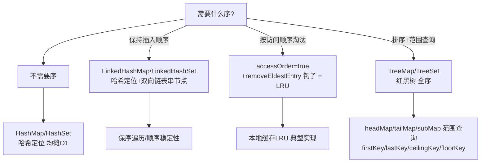

# Map 与 Set 家族对照

> **一句话摘要**：Map 与 Set 是同一枚硬币的两面——**Set 的底层就是 Map（HashSet 包着 HashMap，元素当键、公用哑值）**；家族选型的分界线只有一条：**要不要「序」**——HashMap 无序、LinkedHashMap 插入序/访问序（LRU 的机制基础）、TreeMap 排序（范围查询）；本篇给 Map/Set 全家福一张定位图。

> **本文核心**：机制链 = **Set 系委托 Map 系（HashSet→HashMap、TreeSet→TreeMap）→ 三种序：无序（哈希）、插入/访问序（双向链表串节点）、全序（红黑树）→ LinkedHashMap 的 accessOrder + removeEldestEntry 钩子 = 三行 LRU → TreeMap 的红黑树支撑 range 查询（headMap/tailMap/subMap）**——选型只问一句「需要什么序」。

前置阅读：[HashMap 原理与演进](./13_HashMap原理与演进-入门.md)。红黑树机制的通用原理在树化部分已覆盖。

## 1. 背景：Set 为什么「寄生」在 Map 上

「不重复集合」与「键值映射」的底层需求一致：**按键快速定位**。HashSet 的实现就是包了一个 HashMap（元素作 key，所有 value 指向同一个哑对象）——Set 的去重语义 = Map 的「键唯一」语义。这个设计让「Set 家族的特性」完全继承自「对应 Map 家族」：HashSet 无序、LinkedHashSet 保插入序、TreeSet 排序——**学完 Map 等于学完 Set**。

## 2. 核心机制：三种「序」与家族定位图



- **LinkedHashMap 的机制**：在 HashMap 每个节点上追加 before/after 指针串成双向链表——哈希定位（快）+ 链表维护序（稳）。`accessOrder=true` 时每次 get 把节点移到链尾——「最近访问的在后，最久未访问的在头」；配合 `removeEldestEntry` 钩子（put 后回调「要不要淘汰最老的」）——**LRU 缓存的最短实现**。
- **TreeMap 的红黑树能力**：全序（Comparator 或自然序）支撑**范围族 API**——`headMap(toKey)`（小于 toKey 的部分）、`tailMap`、`subMap(from,to)`、`ceilingKey`（≥key 的最小键）、`floorKey`（≤key 的最大键）——**「找最近的」「找区间」类需求只有树能优雅解**（哈希表无序无法范围查询）。
- **Set 的补充成员**：`EnumSet/EnumMap`（枚举专用，位向量/数组实现，性能极高——枚举场景首选）；`ConcurrentSkipListMap/Set`（跳表实现——并发且有序，TreeMap 的并发替身，16 篇提及）。
- **WeakHashMap 与引用语义**：键为弱引用（GC 后自动移除条目）——「元数据附着」场景（如给对象挂临时属性）；与之对照 ThreadLocal 的弱引用键设计（24 篇联动）。

## 3. 落地实践：家族选型与惯用法

```text
默认键值:      HashMap
配置保序展示:  LinkedHashMap(插入序)
本地 LRU 缓存: LinkedHashMap(accessOrder=true, removeEldestEntry)
排序报表/区间: TreeMap(Comparator 定序)
去重集合:      HashSet / LinkedHashSet(保序) / TreeSet(有序)
枚举集合:      EnumSet/EnumMap(性能首选)
并发场景:      ConcurrentHashMap / ConcurrentSkipListMap(有序并发)
```

三纪律：① **LRU 淘汰要配容量上限**（removeEldestEntry 里 `size() > maxEntries`）——没有上限的「LRU」只是保序 Map；② **TreeMap 的 Comparator 必须与 equals 一致**（比较为 0 视为同一键——不一致即键「失踪」）；③ **线程安全场景不混用普通家族**（LinkedHashMap 并发使用同样不安全——LRU 缓存并发化用 Caffeine 这类成熟库）。

## 4. 生产视角：家族误用的事故形态

- **LinkedHashMap 当缓存没设淘汰**：只用了插入序忘了钩子——缓存无限增长堆 OOM。「LRU 缓存」的三个件（accessOrder + 上限 + 钩子）缺一不可；生产级缓存更推荐 Caffeine（W-TinyLFU 淘汰 + 过期 + 统计全配齐）。
- **TreeMap 的 Comparator 漂移**：比较器依赖可变字段（按「状态」排序的对象作键）——状态改了键「失踪」（同 HashMap 可变键问题，树版是「排序位错乱」）。
- **EnumSet 的误用盲区**：知道 HashSet 不知道 EnumSet——枚举去重/标记位场景（权限位/状态标志组合）EnumSet 是位向量实现，性能与内存碾压通用集合。
- **ConcurrentSkipListMap 的定位模糊**：需要「并发 + 有序 + 范围查询」时的正解（跳表 O(log n)）——常被误用「ConcurrentHashMap + 排序」，排序语义根本不在 CHM 里。

## 5. 主流系统怎么做：序的应用生态

| 场景 | 家族选择 | 机制要点 |
|---|---|---|
| 本地缓存 | LinkedHashMap LRU / Caffeine | 钩子淘汰 vs W-TinyLFU（命中率更优） |
| 排行榜/时间线 | TreeMap / ConcurrentSkipListMap | 范围查询（TopN/区间）的机制支撑 |
| 字典表缓存 | HashMap + 不可变包装 | 无序无妨，读取 O(1) |
| 状态标志组合 | EnumSet | 位向量，代替「多个 boolean」散落 |

规律：**「序」是业务可感知的特性**——保序/排序/淘汰序各有明确业务对应；选错序的表现是「顺序不稳定」类 bug（同一查询两次结果顺序不同）。

## 6. 典型场景

- **配置项按序输出**（展示级）：LinkedHashMap——顺序即契约的场景（导出列序、菜单序）。
- **带淘汰的本地缓存**（缓存级）：LinkedHashMap LRU 快速起步 → Caffeine 生产化——演进的典型两段式。
- **区间检索**（查找级）：票务「找某时间点最近的车次」（TreeMap ceilingKey）、价格区间分档（subMap）。

## 7. 与相邻概念的区别

- **LinkedHashMap 的两种序**：插入序（默认，遍历按 put 顺序）vs 访问序（accessOrder=true，get 也算访问）——LRU 靠访问序，保序展示靠插入序，同一类两个模式。
- **TreeMap vs SortedMap/NavigableMap**：TreeMap 是实现，NavigableMap 是能力接口（ceiling/floor/descending 等导航方法）——面向接口编程时声明 NavigableMap 表达能力需求。
- **LinkedHashSet vs TreeSet**：插入序 vs 排序序——「保插入的去重」与「有序的去重」是两种需求，名字相近语义有别。
- **本篇 vs 缓存体系（Redis/Caffeine）**：本地 LRU 是单机缓存入门；分布式与高命中场景进入 Redis（仓库 Redis 系列）与 Caffeine（W-TinyLFU）的领域——机制同源、规模不同。

## 8. 常见误区与不适用

- **「TreeSet 自动排序所以性能无忧」**：O(log n) 恒定成本 + 插入时比较开销——不需要序的场景是纯开销；哈希系均摊 O(1) 不可替代。
- **「LinkedHashMap 线程安全」**：不安全——并发 LRU 要 Caffeine/加锁；「看起来只在自己线程用」的缓存常被并发请求打破。
- **「EnumSet 不了解也没关系」**：枚举场景它是性能最优解（位运算）——不知道它等于默认放弃最优解；枚举密集代码必知。
- **「WeakHashMap 能当缓存」**：弱引用键的语义是「GC 后即清」——它解决「元数据附着」不解决「缓存淘汰」（容量/过期策略它都没有）；缓存请用缓存库。
- **不适用**：持久化排序（DB 索引）；分布式限流/缓存（本地家族只管本机）；海量数据排序（外部排序/数仓）。

## 9. 你们可能会问

- **LRU 三行实现的具体写法？** `new LinkedHashMap<>(16, 0.75f, true) { protected boolean removeEldestEntry(Map.Entry e) { return size() > MAX; } }`——accessOrder=true + 覆写钩子；作为快速方案可行，生产缓存推荐 Caffeine。
- **TreeMap 怎么实现「找最接近的键」？** ceilingKey（≥）/floorKey（≤）/higherKey（>）/lowerKey（<）——红黑树的中序导航；「最近邻」类需求的标准 API。
- **ConcurrentSkipListMap 为什么用跳表不用红黑树？** 并发友好——跳表的插入删除只改局部指针（CAS 友好），红黑树的旋转在并发下代价高；「并发 + 有序」的工程折中。
- **EnumSet 的位向量怎么工作？** 底层 long 数组，每个枚举占一位——add/remove/covers 都是位运算；RegularEnumSet（≤64 个枚举）单个 long 搞定。
- **怎么排查「顺序不稳定」类 bug？** 先确认集合承诺：HashMap 本就无序（换成 LinkedHashMap 保插入序）；若已是 LinkedHashMap，检查并发访问或「重 hash 后顺序漂移」——顺序问题的第一步是问「用的是哪种 Map」。

## 10. 一句话总结 + 5W 速记卡 + 自测三问

**🎯 核心带走**：

- **核心一句话**：Set 寄生于 Map，家族选型只看「要什么序」——无序 HashMap、插入/访问序 LinkedHashMap（LRU 三行）、全序 TreeMap（范围查询）；枚举场景 EnumSet/EnumMap 性能封顶。
- **链条复述**：Set 委托 Map → 三种序对应三家族 → accessOrder+钩子=LRU → 红黑树 range 族 API → 并发有序跳表补位。
- **失效点与边界**：LRU 三件缺一不可；Comparator 与 equals 一致；并发场景全部换并发家族。

**5W 速记卡**：

| 维度 | 内容 |
|---|---|
| What | Map/Set 家族定位图 + 三种序 + LRU 机制 |
| Why | 「序」是业务可感知特性，选错序=顺序类 bug |
| When | 缓存实现、保序展示、区间检索、枚举标志 |
| Where | 堆（哈希表/链表/红黑树/位向量） |
| How | 问序选型 → LRU 配齐三件 → 树用导航 API → 并发换家族 |

💡 **实战提示**：LRU 上限必配；枚举集合用 EnumSet；最近邻用 ceiling/floor；生产缓存演进到 Caffeine。

**开放问题**：Caffeine 的 W-TinyLFU 已证明「频率+新鲜度」优于纯 LRU——LinkedHashMap 的 LRU 教学地位会一直保留，但「本地缓存默认实现」的帽子是否已永久易主？

**决策（何时用）**：按「需要什么序」直接对号入座；枚举场景强制 EnumSet/EnumMap；推荐「本地缓存直接 Caffeine、LinkedHashMap LRU 只作教学与极轻场景」的务实分层。

**Trade-off（代价与反方案）**：有序家族用「维护序的成本（链表/树的额外指针与旋转）」换「序的语义」；LRU 用「容量上限」换「热数据留存」；反方案——无序哈希（最快，丢序）、全量排序（有序，每次排序 O(n log n)）；「序」的代价评估永远是「这个序有多少业务价值」。

**演进视角**：家族成员自 JDK 1.2/1.4（LinkedHashMap）后极少新增（ConcurrentSkipListMap 是 6 的补位）——集合家族已进入「稳定期」，创新转移到并发包与生态库（Guava/Caffeine）；「家族定位图」因此可以长期使用，不会快速过期。

---

**下篇预告**：队列语义的专场——下一篇[Queue/Deque 与 PriorityQueue](./15_Queue与Deque与PriorityQueue-入门.md)讲双端队列、优先级堆与场景选型。

---

## 上下游地图

从系统架构的上下游看：**HashMap** 为本篇提供了地基——序的语义 的机制向上游承接、向下游 **Queue(篇15)、Caffeine(生态)** 输出缓存与报表；架构上它是这条知识链上不可跳过的一环，跳读时建议先回上游补齐语境。

```mermaid
flowchart LR
    U0[HashMap]
    --> ME[本篇: 序的语义]
    ME --> DN0[Queue(篇15)]
 DN1[Caffeine(生态)]
```

---


## 质疑者追问链

**质疑：Map 与 Set 家族 为什么设计成这样，不那样设计？**
Map 与 Set 家族 的设计是在「易用性、安全性、性能」三者之间做取舍——没有完美的选择，只有场景匹配的选择。理解取舍比记住结论更有价值。

**追问一层：如果换个场景，这个设计还成立吗？**
不完全成立——Map 选型 从十万级涨到千万级时，很多默认假设失效；理解设计边界，才能判断「什么时候需要换方案」。

**再深一层：底层原理和上层 API 之间是什么关系？**
上层 API 是底层机制的抽象封装——机制不变，API 可以演进；反过来，机制变了 API 必须跟着变。这就是为什么「理解机制」比「记住 API」更保值。

## 量级分档视角

| 量级 | Map 与 Set 家族的形态变化 | 关注点 |
|---|---|---|
| 10 万级 | 入门阶段，Map 选型默认配置即可 | 语法正确性 |
| 千万级 | 需要关注 Set 去重 的取舍 | 性能瓶颈与参数调优 |
| 亿级 | Map 选型 成为架构决策的核心变量 | 架构选型与底层机制 |

量级每上一档，对 Map 选型 的容忍度就降一级——**同样的代码在十万级没问题，在亿级就是事故预备役**。

## 📌 数据与事实声明

LinkedHashMap（accessOrder/removeEldestEntry）、TreeMap 导航 API、EnumSet 位向量、ConcurrentSkipListMap 跳表为 JDK 官方文档与源码公开内容；Caffeine W-TinyLFU 为其官方文档；LRU 三行实现为公开惯用法。以官方文档为准。

## 📚 参考资料

| 类型 | 标题 | 来源 |
|---|---|---|
| 文档 | JDK: LinkedHashMap/TreeMap/EnumSet 官方文档 | docs.oracle.com |
| 文档 | Caffeine 官方（W-TinyLFU） | github.com/ben-manes/caffeine |
| 图书 | Java 核心技术 卷I（Map/Set 章节） | Pearson（2022） |
| 系列文章 | Queue/Deque 与 PriorityQueue（下一篇） | 本仓库同系列 |
