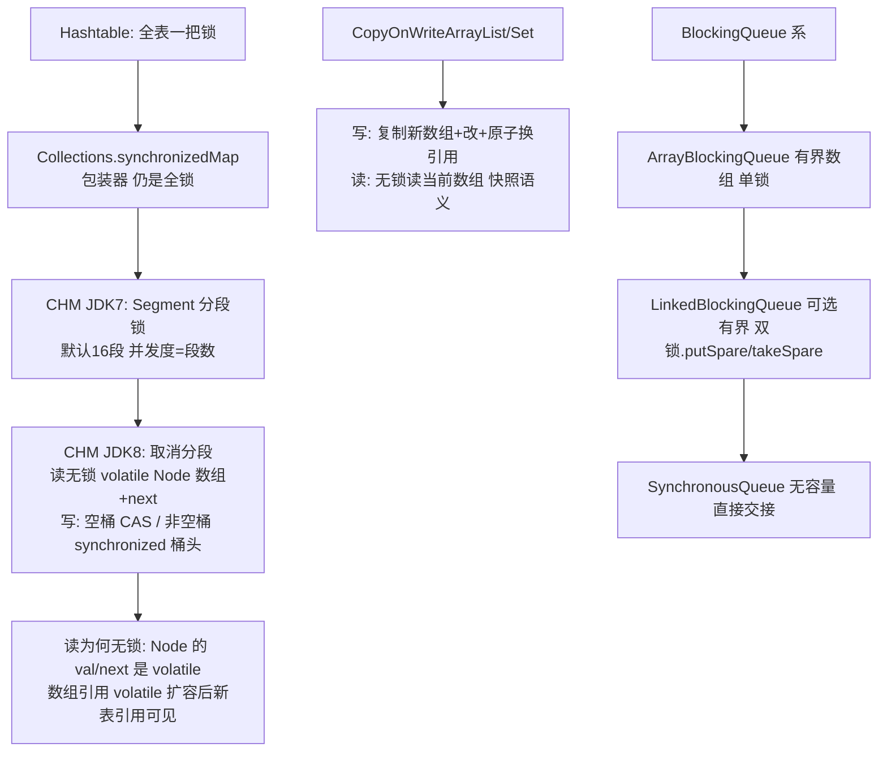

# 并发集合与线程安全容器

> **一句话摘要**：并发容器的演进史是一条「锁粒度越来越细、读越来越无锁」的路——**Hashtable 全表锁 → Collections.synchronized 包装（仍是全锁）→ ConcurrentHashMap（JDK 7 分段锁 → JDK 8 CAS+synchronized 单桶头，读全程无锁）→ CopyOnWrite（写时复制，读零锁）→ BlockingQueue（阻塞语义）**；选型 = 读写字比 × 一致性要求 × 是否需要阻塞。

> **本文核心**：机制链 = **普通容器并发使用的三类故障（丢失更新/并发修改/扩容死循环）→ CHM 的解法：读无锁（volatile + 桶节点不可变设计）写锁单桶（CAS 空桶插入 + synchronized 桶头）→ size 用计数器分散累加 → CopyOnWrite 用「写时复制整表」换读零锁（读多写极少专属）→ BlockingQueue 用「挂起唤醒」换生产消费解耦**——并发容器的本质是「一致性强度与性能的定价表」。

前置阅读：[HashMap 原理与演进](./13_HashMap原理与演进-入门.md)、[线程基础与生命周期](./17_线程基础与生命周期-入门.md)。线程池对阻塞队列的消费见[线程池与异步编程](./25_线程池与异步编程-入门.md)。

## 1. 背景：普通容器并发为什么必坏

三个层次的问题：① **操作原子性**——`map.put` 单步在 JDK 8 原子，但「检查再放进」（if absent then put）两步之间可插入；② **结构性修改并发**——扩容/树化与其他写并发，JDK 7 有死循环事故、JDK 8 后仍可能丢数据；③ **可见性**——一个线程写入另一个线程未必看到。synchronized 包装（`Collections.synchronizedMap`）解决了原子性，但**全表一把锁**把并发度打到 1——并发容器要解的就是「安全且并发度不塌」。

## 2. 核心机制：CHM 的演进与家族



- **CHM JDK 8 的写路径**：桶为空 → CAS 插入新节点（无锁快路径）；桶非空 → `synchronized` 锁住该桶的头节点（锁粒度 = 单桶）——不同桶的写完全并行，同桶串行。锁粒度从「全表」（Hashtable）到「段」（7）到「桶」（8）的演进即并发度的三级跳。
- **读为什么敢无锁**：Node 的 val/next 声明为 volatile（写后读立即可见）；扩容时新表引用的可见性靠 volatile 数组引用 + 转发节点（ForwardingNode 引导读旧表的请求到新表）——**读不锁但看到的是「某一时刻的一致视图」**（弱一致迭代器：迭代中不保证看到并发新增）。
- **CopyOnWrite 的取舍**：写时复制整个数组再原子替换引用——读完全无锁且迭代永不抛并发修改（迭代的是快照）；代价是**写极贵**（O(n) 复制）且**快照可能过期**。定位：读多写极少（监听器列表/配置快照），写多场景是灾难。
- **BlockingQueue 的阻塞语义**：put 满 则挂起、take 空则挂起——「生产消费解耦」的同步原语（线程池的工作队列、25 篇）；ArrayBlockingQueue（有界数组单锁）与 LinkedBlockingQueue（链表、两把锁 put/take 分离吞吐更高）、SynchronousQueue（零容量直接交接——线程池的 direct handoff）。

## 3. 落地实践：并发容器的选型与纪律

```text
并发键值:      ConcurrentHashMap(默认) —— 需要排序换 ConcurrentSkipListMap
读多写极少列表: CopyOnWriteArrayList(监听器/配置快照)
生产消费:      ArrayBlockingQueue(有界)/LinkedBlockingQueue
复合操作:      必须用容器的原子方法 —— putIfAbsent/computeIfAbsent/merge
               (否则 get+put 两步间可插入 = 丢失更新)
```

三条铁律：① **复合操作用容器的原子方法**——`CHM.computeIfAbsent(key, k -> create())` 替代 `if (get==null) put`（两步式在并发下必丢）；② **迭代是弱一致**——需要强一致快照就复制一份再遍历；③ **size 是近似值**（分散计数器汇总）——需要精确计数用外部原子类。

## 4. 生产视角：并发容器的事故形态

- **computeIfAbsent 里的递归/重活**：mapping function 里再操作同一 map 或执行耗时任务——同桶锁内嵌套锁（死锁风险）/锁持有时长暴增。纪律：函数内只做「轻量创建」，重活拿到值后做。
- **CopyOnWrite 被写多的场景误用**：高频 add 的监听器列表按 COW 用——每次 add 全数组复制，GC 与 CPU 双炸。写频率的判断要按「生产真实频率」，不是「感觉很少」。
- **弱一致迭代引发的「看起来漏数据」**：遍历 CHM 时另一线程 put 的条目本轮不可见——业务误以为丢数据。理解弱一致后，需要强一致的快照场景显式复制。
- **Synchronized 包装的残留**：`Collections.synchronizedMap(new HashMap())` 混在代码里——全锁性能塌 + 迭代仍需手动 synchronized（包装器不保证迭代安全）。新代码直接 CHM，存量见到即整改。

## 5. 主流系统怎么做：并发容器的生态位

| 场景 | 主流选择 | 机制要点 |
|---|---|---|
| 并发缓存 | ConcurrentHashMap + computeIfAbsent / Caffeine | 原子加载 vs 专业缓存（淘汰/过期全配） |
| 事件监听器列表 | CopyOnWriteArrayList | 迭代快照 + 写极少 |
| 任务缓冲 | ArrayBlockingQueue/LinkedBlockingQueue | 有界 + 阻塞（线程池标配） |
| 高性能计数 | LongAdder（CHM.size 的思想同源：分散累加） | 热点分离（21 篇） |

规律：**JDK 并发容器覆盖「键值/列表/队列」三形态；超出（缓存淘汰/统计/延迟）进入专业库（Caffeine/LongAdder/延迟队列）**——机制思想互相借鉴（分散计数、写时复制、锁分离）。

## 6. 典型场景

- **配置热更新**（读多级）：volatile 快照引用或 CopyOnWrite——读路径零锁零拷贝。
- **本地数据索引共享**（查找级）：CHM 承载「读多写少」的内存索引——与 Redis 级缓存分层（本机一层、远端一层）。
- **任务流水线**（解耦级）：BlockingQueue 串起多阶段——线程池与流水线的共同地基。

## 7. 与相邻概念的区别

- **CHM vs synchronized 包装**：锁粒度（单桶 vs 全表）、读锁（无 vs 有）、迭代（弱一致安全 vs 需手动锁）——三个维度全面替代。
- **弱一致 vs 强一致**：CHM 迭代是弱一致（某时刻视图）；需要「遍历时精确集合状态」的场景要么加锁要么快照复制——一致性强度是明码标价的。
- **CopyOnWrite vs 不可变集合**：COW 是「读多写极少」的运行期替换；不可变集合（List.of）是「永不变化」——会变的用 COW，永不变用不可变。
- **本篇 vs 线程池（25 篇）**：BlockingQueue 是线程池的「工作队列」组件——容器语义在池化场景的完整应用在后篇。

## 8. 常见误区与不适用

- **「CHM 的 computeIfAbsent 全场景无脑用」**：锁桶内执行重逻辑的代价（第 4 节）——重活分离是纪律。
- **「CopyOnWriteArrayList 安全，用它替代所有并发 List」**：写代价 O(n)——读写比不极端时性能劣于加锁方案；按读写比选型不按「安全」选型。
- **「CHM.size() 是精确的」**：分散计数汇总的近似值——并发中精确计数需要全局锁或外部 LongAdder。
- **「volatile 数组元素也可见」**：`volatile int[] arr` 只保证数组引用可见，元素不保证——数组元素的并发要 AtomicXXXArray 或 CHM（「volatile 数组」是常见认知坑）。
- **不适用**：单线程/线程封闭场景（普通容器零开销）；跨进程共享（本篇全是进程内）；需要事务性批量更新（容器级原子ity 不存在——要么加锁要么设计为不可变替换）。

## 9. 你们可能会问

- **CHM 为什么 JDK 8 放弃分段锁？** 分段（16 段）的并发度上限固定且内存开销大；「CAS 空桶 + synchronized 单桶头」让并发度=桶数（天然随容量增长）且空桶插入无锁——粒度细化 + 快路径优化双重收益。
- **CHM 的 key/value 能为 null 吗？** 不能——并发下 `get` 返回 null 无法区分「不存在」与「值为 null」（二义性在无锁读下不可消解）；HashMap 单线程可用 containsKey 消歧。这是「并发设计反过来约束 API」的经典案例。
- **CopyOnWriteArrayList 的迭代器为什么永不抛并发修改？** 迭代器持有创建时的数组快照引用——原数组被替换也不影响迭代（代价是可能读到旧数据）。
- **SynchronousQueue 什么时候用？** 「直接交接」语义：生产者必须等到消费者接手才返回——线程池的 direct handoff（不缓存任务，立即给空闲线程或拒绝）。
- **怎么量化「读多写少」该用 COW？** 粗略标尺：写频率低于每秒数次且读远多于写（行业经验量级）——写 O(n) 复制的成本被「读全免锁」摊平才有收益；拿不准就压测两条路。

## 10. 一句话总结 + 5W 速记卡 + 自测三问

**🎯 核心带走**：

- **核心一句话**：并发容器 = 一致性强度与性能的定价表——CHM 读无锁写锁单桶、COW 写时复制读零锁、BlockingQueue 挂起解耦；复合操作必须用容器的原子方法。
- **链条复述**：普通容器三类并发故障 → 全锁包装的并发度塌方 → CHM 三代演进（全表/分段/单桶）→ COW 的读写极端分工 → BlockingQueue 的挂起语义 → 原子方法铁律。
- **失效点与边界**：弱一致迭代；size 近似；写多的 COW 是灾难；跨进程归 MQ。

**5W 速记卡**：

| 维度 | 内容 |
|---|---|
| What | CHM 演进 + COW + BlockingQueue 家族 + 原子方法 |
| Why | 安全且并发度不塌是并发容器的存在意义 |
| When | 共享集合、监听器列表、生产消费、并发缓存 |
| Where | 堆（volatile 数组/节点/锁对象） |
| How | 按读写比与一致性选型 → 原子方法 → 重活分离 → 有界化 |

💡 **实战提示**：computeIfAbsent 只放轻活；COW 只给读多写极少；包装器是反模式；「volatile 数组元素」的认知坑记住。

**开放问题**：虚拟线程（21）时代「阻塞」的成本骤降——BlockingQueue 的挂起语义会与虚拟线程的挂起原语融合出新家族（挂起队列）吗？

**决策（何时用）**：并发键值默认 CHM；读多写极少列表 COW；生产消费 BlockingQueue；推荐「复合操作原子方法表」进团队并发编码规范。

**Trade-off（代价与反方案）**：CHM 用「弱一致迭代 + 不支持 null」换「读无锁写细粒度」；COW 用「写 O(n) 复制」换「读零锁零风险」；BlockingQueue 用「挂起的上下文切换」换「生产消费解耦」——并发容器的每行源码都是一致性 × 性能定价表的条目。

**演进视角**：Hashtable（全锁）→ 分段锁（7）→ CAS+单桶头（8）——锁粒度演进在 CHM 上完成三级跳后趋于稳定，演进重心转向「无锁数据结构」（LongAdder/不可变快照）；「读无锁化」是并发数据结构二十年的主旋律，未来在 AOT/虚拟线程时代仍会延续。

---

**下篇预告**：进入并发编程组——下一篇[线程基础与生命周期](./17_线程基础与生命周期-入门.md)讲线程创建、状态机与上下文切换的代价。

---

## 上下游地图

从系统架构的上下游看：**HashMap、线程基础(篇17)** 为本篇提供了地基——一致性定价 的机制向上游承接、向下游 **线程池(篇25)** 输出共享集合治理；架构上它是这条知识链上不可跳过的一环，跳读时建议先回上游补齐语境。

```mermaid
flowchart LR
    U0[HashMap]
    U1[线程基础(篇17)]
    --> ME[本篇: 一致性定价]
    ME --> DN0[线程池(篇25)]
```

---


## 质疑者追问链

**质疑：并发集合 为什么设计成这样，不那样设计？**
并发集合 的设计是在「易用性、安全性、性能」三者之间做取舍——没有完美的选择，只有场景匹配的选择。理解取舍比记住结论更有价值。

**追问一层：如果换个场景，这个设计还成立吗？**
不完全成立——并发度 从十万级涨到千万级时，很多默认假设失效；理解设计边界，才能判断「什么时候需要换方案」。

**再深一层：底层原理和上层 API 之间是什么关系？**
上层 API 是底层机制的抽象封装——机制不变，API 可以演进；反过来，机制变了 API 必须跟着变。这就是为什么「理解机制」比「记住 API」更保值。

## 量级分档视角

| 量级 | 并发集合的形态变化 | 关注点 |
|---|---|---|
| 10 万级 | 入门阶段，并发度默认配置即可 | 语法正确性 |
| 千万级 | 需要关注 锁粒度 的取舍 | 性能瓶颈与参数调优 |
| 亿级 | 并发度 成为架构决策的核心变量 | 架构选型与底层机制 |

量级每上一档，对 并发度 的容忍度就降一级——**同样的代码在十万级没问题，在亿级就是事故预备役**。

## 📌 数据与事实声明

CHM 实现（CAS/synchronized 桶头/volatile Node/ForwardingNode）、COW 机制、BlockingQueue 语义为 JDK 源码与官方文档公开内容；JDK 7 分段锁与死循环事故为源码演进公开记录；性能量级为业内通用认知。以 JDK 源码与官方文档为准。

## 📚 参考资料

| 类型 | 标题 | 来源 |
|---|---|---|
| 源码 | java.util.concurrent: ConcurrentHashMap/CopyOnWriteArrayList | github.com/openjdk/jdk |
| 图书 | Java 并发编程实战（第 5 章：构建块） | Addison-Wesley |
| 文档 | java.util.concurrent 官方文档 | docs.oracle.com |
| 系列文章 | 线程基础（17 篇）/ 线程池（25 篇） | 本仓库同系列 |
