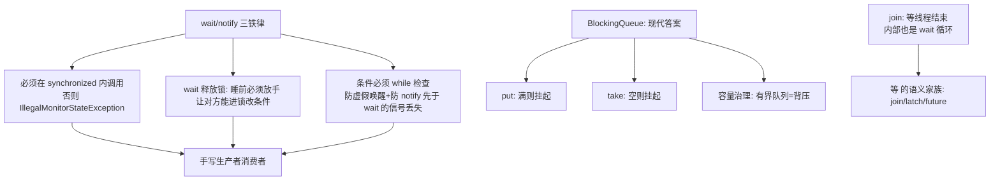

# 线程协作与阻塞队列

> **一句话摘要**：线程协作的两代机制——**wait/notify（必须在 synchronized 内、wait 释放锁、notify 随机唤醒，条件必须用 while 检查）是底层原语，BlockingQueue（put/take 自动挂起）是把协作封装成容器的现代答案**；生产者消费者是两者的共同主场——工程纪律一句话：**优先阻塞队列，wait/notify 只在实现新同步原语时手写**。

> **本文核心**：机制链 = **wait/notify 的三铁律（synchronized 内调用/wait 释放锁/while 循环检查条件——防虚假唤醒与信号丢失）→ 生产者消费者的手写版（条件队列）→ BlockingQueue 用「put 满则挂起、take 空则挂起」替代全部手写 → join（等线程结束）/CountDownLatch（等 N 个事件）是「等」的不同语义形态**——协作的本质是「线程间的等待与唤醒协议」。

前置阅读：[线程基础与生命周期](./17_线程基础与生命周期-入门.md)。BlockingQueue 的容器视角见[并发集合](./16_并发集合与线程安全容器-入门.md)。

## 1. 背景：协作问题的定义

两个线程有数据依赖：A 生产数据、B 消费——B 在没有数据时怎么办？忙等（while 循环空转烧 CPU）是下策；正确姿势是「挂起等通知」——**wait（我去睡了，条件好了叫我）/notify（条件可能好了，醒一个）**。这个「条件-等待-唤醒」协议是所有线程协作的原型：BlockingQueue、CountDownLatch、线程池的工作队列，内部全是它的变体。

## 2. 核心机制：wait/notify 三铁律与阻塞队列



- **三铁律逐条**：① `wait/notify` 是对象锁的协作方法，不在 synchronized 内调用直接抛 IllegalMonitorStateException；② wait 会**释放锁**再挂起（不释放锁对方永远进不了临界区改条件——死等）；③ **条件检查必须 while 不能 if**——虚假唤醒（无 notify 也醒）是允许的 + notify 可能唤醒的是「另一个等待者」（条件已被用掉），while 保证醒来后重新验证条件。
- **信号丢失的经典错**：notify 在 wait 之前发生——先通知后等待，信号蒸发，等待者永远睡。规避：条件用 while 重查（等待者睡之前最后一次确认）+ 协议设计保证「先改条件再 notify」。
- **手写生产者消费者 vs BlockingQueue**：手写版 = synchronized + while 条件 + wait/notify（30 行，坑在铁律细节）；BlockingQueue 版 = `queue.put(data)` / `queue.take()`（两行，挂起/唤醒/线程安全全内置）。**现代答案的胜利是封装的胜利**——阻塞队列把「协作协议」内化到容器里。
- **「等」的语义家族**：`join`（等某个线程结束——内部 wait 循环）、`CountDownLatch`（等 N 个事件各减一）、`Future.get`（等计算结果并取回）、`BlockingQueue.take`（等数据）——选型按「等什么」：等线程结束 join、等事件集合 latch、等结果 future、等数据队列。

## 3. 落地实践：生产者消费者的两代写法

```java
// 现代答案: BlockingQueue 两行流
BlockingQueue<Order> queue = new ArrayBlockingQueue<>(1000);   // 有界=背压
// 生产者
queue.put(order);          // 满则挂起(背压传导到上游)
// 消费者
Order o = queue.take();    // 空则挂起

// 底层原语: 手写版(理解 wait/notify 用, 生产不推荐)
synchronized (lock) {
    while (queue.isEmpty()) {          // while 铁律
        lock.wait();                   // 释放锁挂起
    }
    Order o = queue.remove(0);         // 被唤醒后条件已验证
}
```

工程选型四步：① 需求是不是「生产消费」？是 → BlockingQueue；② 要不要有界背压？要 → ArrayBlockingQueue（容量即背压）；③ 等待语义是什么？等结束 join / 等事件 latch / 等结果 Future；④ 只有在「实现新同步原语/极致性能」时才手写 wait/notify——且写完必须双人 review（铁律细节太容易错）。

## 4. 生产视角：协作机制的事故形态

- **if 改 while 的缺失引发的条件错乱**：手写 wait 用 if 检查条件——虚假唤醒后条件未验证直接消费，消费了不存在的数据。这是 wait/notify 手写的最高频 bug。
- **notify 与 notifyAll 的误选**：notify 只唤醒一个等待者——若唤醒的这个检查条件不满足继续睡，而「满足条件的等待者」永远没被唤醒（信号丢失变体）。惯例：不确定就 notifyAll（多唤醒无害，while 会过滤）。
- **忘释放锁的死等**：wait 在非 synchronized 内抛异常（铁律一）还只是开发期发现；「持有锁做耗时 IO 再 notify」是运行期死等制造机——**锁内只做短事**的纪律（与 20 篇锁纪律同源）。
- **join 无超时的卡死**：`t.join()` 无限等——被等线程卡死则主流程永久阻塞。工程用法 join 带超时（`join(timeout)`）或用 Future.get(timeout)/latch.await(timeout) 全家族超时化。

## 5. 主流系统怎么做：协作的生态形态

| 协作需求 | 现代载体 | 机制要点 |
|---|---|---|
| 生产消费 | BlockingQueue 家族 | 挂起语义容器化（16 篇） |
| 等 N 个任务 | CountDownLatch / invokeAll | 计数器归零即通行 |
| 等结果 | Future/CompletableFuture | 结果与异常的传递（25 篇） |
| 阶段性同步 | CyclicBarrier/Phaser | 可复用的栅栏（23 篇） |
| 限流准入 | Semaphore | 许可证发放（23 篇） |

规律：**wait/notify 是「汇编」，工具类家族是「高级语言」**——工具类（19-25 篇）全部构建在 wait/notify 与 AQS 之上；用高级语言写业务，读懂汇编排故障。

## 6. 典型场景

- **任务缓冲**（解耦级）：有界 BlockingQueue 串起上下游——背压保护下游不被冲垮。
- **并行任务收口**（编排级）：CountDownLatch 等 N 个并行调用全部返回再聚合。
- **优雅停机**（运维级）：「等处理中的任务做完再退」——latch/join(timeout) 的组合。

## 7. 与相邻概念的区别

- **wait vs sleep**（17 篇已述，此处从协作视角再看）：wait 释放锁参与协作协议；sleep 只是自己睡（不参与协作、不释放锁）——协作场景用 wait，计时用 sleep。
- **notify vs notifyAll**：单唤醒（省切换，要求条件对等待者同质）vs 全唤醒（多切换，while 过滤）——不确定用 notifyAll 是安全的默认。
- **BlockingQueue vs SynchronousQueue**：有界缓冲 vs 零容量直接交接——SynchronousQueue 的 put 必须等 take（无缓冲强同步），线程池 direct handoff 的选择。
- **本篇 vs AQS（22 篇）**：wait/notify 每个对象一套条件队列（单一通知队列）；AQS 提供多条件队列与队列化的等待管理——AQS 是「工业级 wait/notify」。

## 8. 常见误区与不适用

- **「wait 前不需要拿锁」**：必须 synchronized 内——这是语言规定（锁的条件队列挂在锁对象上）；绕不过去。
- **「notifyAll 会导致性能问题所以用 notify」**：notifyAll 的多余唤醒由 while 过滤，代价是几次切换；notify 选错人的代价是永久卡死——**正确性优先**。
- **「BlockingQueue.take 不需要处理中断」**：take 是阻塞方法——抛 InterruptedException，处理纪律同 17 篇（恢复中断或上抛）。
- **「join 替代品随便选」**：join（等线程）/latch（等事件）/Future（等结果）语义不同——「等错了对象」的语义 bug 不报错但逻辑错。
- **不适用**：单线程内无协作需求；跨进程协作（分布式锁/消息队列——本篇全部单机）；高频纳级协作（专用无锁结构）。

## 9. 你们可能会问

- **虚假唤醒是什么，为什么会存在？** 从等待队列醒来不等于「你要的条件成立」——JMM 允许（底层实现权衡），协议上用 while 重查免疫；「为什么允许」是性能与实现复杂度的历史取舍。
- **notify 会不会唤醒非本对象的等待者？** 不会——等待队列挂在锁对象上，notify 只叫醒「这个对象的等待者」；跨对象协作要各自对象各自协议。
- **CountDownLatch 与 join 怎么选？** 等线程结束 join 直白；「等 N 个事件」（事件可能不来自线程结束——如多个回调完成）用 latch——latch 把「等待」从线程概念解耦成「事件计数」。
- **BlockingQueue 的 poll(timeout) 什么时候用？** 不能无限等时（消费线程要定期检查停机标志）——带超时的阻塞是优雅停机的标配搭档。
- **怎么 review 一段手写 wait/notify？** 五查：synchronized 内？wait 释放锁（无耗时操作）？while 检查？notify 方向（All？）？锁对象与条件对象一致？——五查过再谈合并。

## 10. 一句话总结 + 5W 速记卡 + 自测三问

**🎯 核心带走**：

- **核心一句话**：wait/notify 三铁律（锁内/释放锁/while 检查）是协作的原语，BlockingQueue 是协作的容器化现代答案——工程优先阻塞队列，手写原语必双人 review。
- **链条复述**：协作问题（条件-等待-唤醒）→ 三铁律 → 手写生产者消费者 → 阻塞队列两行流 → 「等」的语义家族（join/latch/Future/队列）。
- **失效点与边界**：虚假唤醒与信号丢失靠 while 免疫；join 全家族要超时化；跨进程协作归分布式机制。

**5W 速记卡**：

| 维度 | 内容 |
|---|---|
| What | 三铁律 + 生产者消费者两代写法 + 等待语义家族 |
| Why | 有数据依赖的线程必须协作，忙等不可接受 |
| When | 生产消费、并行收口、优雅停机 |
| Where | 对象锁的条件队列 / 阻塞队列容器 |
| How | BlockingQueue 优先 → 带超时 → 手写必五查 |

💡 **实战提示**：while 永远替 if；不确定 notifyAll；join/latch 全超时化；锁内不做耗时操作。

**开放问题**：虚拟线程时代 BlockingQueue 的「挂起」成本趋近于零——「有界队列+背压」的容量艺术会不会被「海量轻量任务直接提交」的新范式取代一半？

**决策（何时用）**：生产消费一律 BlockingQueue；并行收口用 latch/invokeAll；推荐「wait/notify 手写需双人 review + 五查清单」进并发规范。

**Trade-off（代价与反方案）**：阻塞协作用「挂起/唤醒的切换代价」换「CPU 零忙等与正确性」；反方案——忙等自旋（极短等待下免切换更快，代价是烧 CPU）、无界队列（免背压思考，代价是 OOM 预备役）；notify 与 notifyAll 的权衡本质是「唤醒精确性 vs 协议健壮性」。

**演进视角**：从 wait/notify 裸原语（1.0）到 BlockingQueue 容器化（5）到 CompletableFuture 的函数式协作（8）到虚拟线程的直接阻塞（21）——协作的「写法成本」四代递减；但「条件-等待-唤醒」的协议思维永远有效——高级形态出问题时，会用的原语是最后的排障武器。

---

**下篇预告**：并发三难的理论收口——下一篇[JMM 与 volatile](./19_JMM与volatile-入门.md)讲 Java 内存模型如何定义「可见性与有序性」的契约。

---

## 上下游地图

从系统架构的上下游看：**线程基础** 为本篇提供了地基——协作协议 的机制向上游承接、向下游 **AQS(篇22)、工具类(篇23)** 输出生产消费；架构上它是这条知识链上不可跳过的一环，跳读时建议先回上游补齐语境。

```mermaid
flowchart LR
    U0[线程基础]
    --> ME[本篇: 协作协议]
    ME --> DN0[AQS(篇22)]
 DN1[工具类(篇23)]
```

---

## 📌 数据与事实声明

wait/notify 语义（锁内调用/释放锁/虚假唤醒）、join 实现等为 JLS 与 Javadoc 公开内容；BlockingQueue 语义为 java.util.concurrent 官方文档；手写反模式为公开工程共识（Java 并发编程实战第 13/14 章）。以官方文档为准。

## 📚 参考资料

| 类型 | 标题 | 来源 |
|---|---|---|
| 图书 | Java 并发编程实战（第 13-14 章显式锁与条件队列） | Addison-Wesley |
| 文档 | Object.wait/Javadoc / BlockingQueue | docs.oracle.com |
| 系列文章 | 线程基础（17 篇）/ AQS（22 篇） | 本仓库同系列 |
