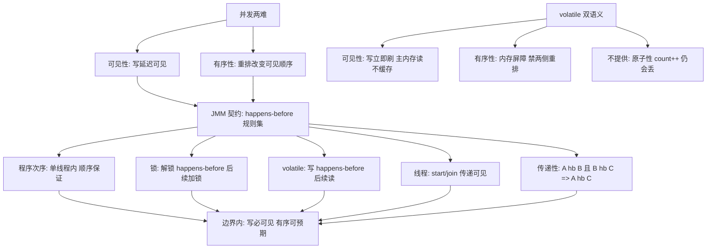

# JMM 与 volatile

> **一句话摘要**：JMM（Java 内存模型）回答「一个线程的写入，另一个线程什么时候、以什么顺序看到」——它用 **happens-before 规则**定义可见性与有序性的契约，用 **volatile** 提供「写立即对所有线程可见 + 禁止指令重排」的轻量保证；synchronized/ final/并发工具的一切可见性承诺都建立在 happens-before 之上——JMM 是并发三难里「可见性与有序性」两难的官方解法书。

> **本文核心**：机制链 = **三大问题中的两难（可见性：缓存/寄存器延迟可见；有序性：编译器与 CPU 重排）→ JMM 的抽象：主内存 + 工作内存 → happens-before 规则（程序次序/锁/volatile/传递性…）定义「写必然被看到」的边界 → volatile 双语义（可见性 + 禁重排但不保证原子性）→ 典型落点：状态标志位/双重检查锁**——volatile 是「只买可见性与有序性、不买原子性」的精准采购。

前置阅读：[线程基础](./17_线程基础与生命周期-入门.md)（并发三难的问题定义）。锁的互斥与可见性兑现见[synchronized 与锁升级](./20_synchronized与锁升级-入门.md)。

## 1. 背景：为什么需要「内存模型」这种东西

硬件层面：每个 CPU 核有自己的缓存，写入先落缓存再异步刷回内存——线程 A（核 1）的写入，线程 B（核 2）可能延迟才能看到；编译器与 CPU 还会重排指令（对单线程无感，多线程可见顺序变化）。**如果没有统一契约，并发程序的行为「因编译器/CPU/缓存策略而异」**——JMM 的历史使命：定义一份「与硬件解耦的可见性契约」，让 Java 程序在任何平台行为一致。JSR-133（Java 4 修订）是这份契约的现代形态。

## 2. 核心机制：happens-before 与 volatile 双语义



- **happens-before 的正确读法**：它不是「时间先后」，是**可见性承诺**——「A happens-before B」保证 A 的效果（写入）对 B 可见且不与 B 重排越过边界。规则清单（常用的五条）：程序次序规则（单线程内按代码序）、监视器锁规则（解锁先于后续加锁）、volatile 规则（写先于后续读）、线程规则（start/join 的可见性传递）、传递性——**所有并发工具的可见性承诺，最终都能追溯到某几条规则的组合**。
- **volatile 双语义**：① 可见性——写 volatile 立即刷出、读 volatile 绕过缓存直读；② 有序性——编译器与 CPU 在 volatile 读写两侧插入内存屏障，禁止重排穿越。**不提供的**：原子性——`volatile int count; count++` 依然是「读-加-写」三步，并发下照样丢失更新（需要原子类，21 篇）。
- **典型落点一：状态标志位**——`volatile boolean running` 作为停止开关：写线程置 false，工作线程 while 循环读它——可见性契约保证「置 false 后循环很快退出」。不用 volatile 时，JIT 可能把字段读提升到循环外（读一次不再读）——循环永不退出（这是可见性被破坏的最小可复现案例）。
- **典型落点二：双重检查锁（DCL）**——单例的 `volatile` 字段是**必需品不是装饰**：`instance = new Singleton()` 不是原子操作（分配/构造/赋值三步可重排）——另一个线程可能在「赋值已发生、构造未完成」时拿到半成品引用。volatile 的禁重排恰好封死这个重排——DCL 缺 volatile 是历史上著名的并发 bug（Effective Java 与 JMM 论文的经典案例）。

## 3. 落地实践：可见性问题的定位与选型

```java
// 场景1: 状态标志 -> volatile 够用(单写多读)
private volatile boolean running = true;

// 场景2: 计数 -> volatile 不够(非原子) -> AtomicLong(21篇)
private final AtomicLong count = new AtomicLong();

// 场景3: 多字段一致性快照 -> synchronized 或不可变对象替换
private volatile Config current;          // 整个 Config 不可变
void update(Config c) { this.current = c; }  // 引用赋值是原子的+volatile 可见

// 场景4: 判断要不要 volatile 的决策
// 有锁保护?        -> 不需要(锁自带 happens-before)
// 只有一写者+布尔/引用语义? -> volatile 够
// 有复合读改写?     -> 原子类
// 一组字段整体?     -> 不可变对象 + volatile 引用
```

决策树一句话：**volatile 管「单写多读的标志与引用发布」，复合操作找原子类，一组字段打包不可变对象再 volatile 引用**——按「需要什么保证」精准采购。

## 4. 生产视角：可见性事故的形态

- **无限循环的停机开关**：停止标志没 volatile——JIT 把循环内读取优化成寄存器常量，主线程改 flag 后工作线程永远看不到（「看起来」设置成功但线程不停）。这是可见性事故的最小案例，也是 volatile 最经典的教学场景。
- **DCL 单例的半成品对象**：缺 volatile 的双重检查锁——偶发的「对象字段异常」（构造未完成被使用），极难复现（依赖重排时机），并发量上来才偶发。它代表一类「低概率高危害」的可见性事故。
- **配置热更新的字段级不一致**：volatile 单字段 + 非易失的相关字段（更新了 URL 没更新配套的 connection）——多字段更新撕裂。解法：不可变配置对象整体替换（场景 3）。
- **final 的隐含保证被破坏**：final 字段在构造函数写入后（无 this 逃逸）对所有线程可见——但如果构造器里把 this 传出去（注册监听器），final 保证作废。final 的可见性保证有「构造器不逃逸」前提。

## 5. 主流系统怎么做：JMM 的生态兑现

| 机制 | 可见性来源 | 定位 |
|---|---|---|
| synchronized | 解锁-加锁 happens-before | 互斥 + 可见性一揽子 |
| volatile | volatile 规则 | 轻量可见 + 禁重排 |
| Atomic 类 | volatile 语义 + CAS | 可见 + 原子（21 篇） |
| ConcurrentHashMap | volatile Node/表引用 | 容器级可见性（16 篇） |
| CompletableFuture | 完成 happens-before 后续回调 | 异步结果的可见性传递（25 篇） |

规律：**全部并发工具的「线程安全承诺」翻译到底层都是 happens-before 的组合**——JMM 是并发包的「宪法」。

## 6. 典型场景

- **停机开关**（运维级）：volatile boolean——最小成本的可见性协作。
- **配置发布**（热更新级）：不可变对象 + volatile 引用——「整体替换」的一致性发布模式。
- **双重检查锁**（懒加载级）：volatile 实例字段——或直接用静态 Holder/枚举单例绕开。

## 7. 与相邻概念的区别

- **volatile vs synchronized**：可见性+有序性 vs 互斥+可见性+有序性——volatile 无阻塞（轻）但不能保护复合操作；「只管可见用 volatile，要互斥用锁」。
- **volatile vs Atomic**：Atomic = volatile 语义 + CAS 原子操作——需要原子复合操作时升级 Atomic。
- **JMM vs 硬件内存模型**：JMM 是语言层的「逻辑契约」（一套 happens-before）；硬件（x86 TSO/ARM 弱序）是「物理实现」——JMM 的伟大在于屏蔽差异：同一份 Java 并发代码在强弱内存序 CPU 上行为一致。
- **本篇 vs CAS（21 篇）**：本篇解决「看得到」，CAS 解决「改得对」——可见性与原子性两难的各自解法，组合成原子类。

## 8. 常见误区与不适用

- **「volatile 保证线程安全」**：只保证可见性与有序性——`volatile count++` 丢失更新照旧；「volatile = 线程安全的轻量锁」是最危险的误解。
- **「volatile 数组让元素也可见」**：volatile 修饰数组引用只保引用——元素访问不特殊（16 篇同款坑的重申：AtomicIntegerArray 才管元素）。
- **「happens-before 是时间顺序」**：它是可见性承诺不是时钟——没有 hb 关系的两操作，任何顺序都合法（「看起来乱序」在 JMM 下是合法行为）。
- **「加了 volatile 性能会崩」**：volatile 读的代价接近普通读（缓存一致性协议代劳），写有屏障成本——「volatile 慢」是过时印象（老 CPU 时代真慢）；现代 x86 上 volatile 写约等于一次普通写+轻屏障。
- **不适用**：复合操作（原子类/锁）；跨字段一致性（不可变对象模式）；需要互斥（synchronized/Lock）。

## 9. 你们可能会问

- **怎么向团队解释 happens-before？** 「写在前的操作，其效果对写在后的操作可见」的承诺清单——遇到「为什么这里可见」的问题就找对应的 hb 规则；找不到规则 = 不保证可见。
- **为什么 DCL 需要 volatile？** new 的三步（分配/构造/赋引用）可被重排为「赋引用→构造」——其他线程拿到非 null 引用时对象还没构造完。volatile 禁止这个重排——「字段可见性」之外的「构造顺序」保护。
- **x86 是强内存序，volatile 写是不是没开销？** x86 只禁止「写写/读写」重排（TSO），volatile 写需一次 StoreLoad 屏障（expensive）——「强序 CPU 不免费」；ARM（弱序）上屏障更贵。跨平台行为一致的代价按平台支付。
- **final 的可见性保证是什么？** 构造器内写 final 字段、构造完成后（this 不逃逸）其他线程读必见初始化值——不需要 volatile；前提「this 不逃逸」是条款的一部分。
- **怎么验证可见性问题？** 理论上可用 jcstress（OpenJDK 并发测试工具）构造交错；工程上「最小复现案例」（停机开关循环）是最直观的教学与验证手段。

## 10. 一句话总结 + 5W 速记卡 + 自测三问

**🎯 核心带走**：

- **核心一句话**：JMM 用 happens-before 规则集定义「写必可见」的契约——volatile 是「可见性+禁重排但不原子」的精准采购，复合操作找原子类，多字段一致性用不可变对象整体替换。
- **链条复述**：两难（可见/有序）→ JMM 抽象与 hb 规则五条 → volatile 双语义与不保证 → DCL/停机开关两个落点 → 决策树（锁/volatile/Atomic/不可变）。
- **失效点与边界**：不保证原子性；hb 是可见性不是时钟；final 保证有「不逃逸」前提。

**5W 速记卡**：

| 维度 | 内容 |
|---|---|
| What | happens-before 规则 + volatile 双语义 + 决策树 |
| Why | 可见性与有序性是并发三难中「看与序」的两难 |
| When | 停机开关、单例、配置发布、并发 bug 排查 |
| Where | 编译器屏障 + CPU 缓存协议 |
| How | 判需求 → volatile/Atomic/锁/不可变四选 → jcstress 验证 |

💡 **实战提示**：停机开关必 volatile；DCL 必 volatile（或换 Holder）；多字段更新用不可变整体替换；「volatile 线程安全」是禁句。

**开放问题**：硬件内存模型持续分化（ARM 扩张）——JMM 的「平台无关契约」在异构计算（GPU/加速器）时代会遇到新的表述挑战吗？

**决策（何时用）**：单写多读标志/引用发布推荐 volatile；复合操作推荐原子类；推荐「可见性决策树」进并发编码规范；推荐 jcstress 作为并发组件的验证工具。

**Trade-off（代价与反方案）**：volatile 用「无原子性」换「轻量可见+禁重排」；synchronized 用「阻塞」换「一揽子保证」；不可变对象模式用「对象分配成本」换「多字段一致发布的简单性」——并发保证的每一档都有价目表，JMM 就是价目表的语法。

**演进视角**：JMM 从 1997 的有缺陷初版到 JSR-133（2004）的科学重构——「给并发行为下形式化定义」这条路 Java 走通了并被 C++11 等语言效仿；内存模型从「实现细节」升格为「语言核心资产」是并发理论对工程的最大馈赠。

---

**下篇预告**：互斥的重量级主角——下一篇[synchronized 与锁升级](./20_synchronized与锁升级-入门.md)讲监视器锁、偏向/轻量/重量级的膨胀路径。

---

## 上下游地图

从系统架构的上下游看：**线程基础** 为本篇提供了地基——可见性契约 的机制向上游承接、向下游 **synchronized(篇20)、CAS(篇21)** 输出全部并发工具；架构上它是这条知识链上不可跳过的一环，跳读时建议先回上游补齐语境。

```mermaid
flowchart LR
    U0[线程基础]
    --> ME[本篇: 可见性契约]
    ME --> DN0[synchronized(篇20)]
 DN1[CAS(篇21)]
```

---

## 📌 数据与事实声明

happens-before 规则与 volatile 语义出自 JLS §17.4（JSR-133）与官方文档；DCL 案例出自公开并发文献（JMM 论文与 Effective Java）；x86 TSO/ARM 弱序为计算机体系结构公开知识；jcstress 为 OpenJDK 官方工具。以 JLS 原文为准。

## 📚 参考资料

| 类型 | 标题 | 来源 |
|---|---|---|
| 图书 | Java 并发编程实战（第 16 章 JMM） | Addison-Wesley |
| 规范 | JSR-133: Java Memory Model and Thread Specification | jcp.org |
| 工具 | OpenJDK jcstress（并发正确性测试） | github.com/openjdk/jcstress |
| 系列文章 | synchronized 与锁升级（下一篇） | 本仓库同系列 |
