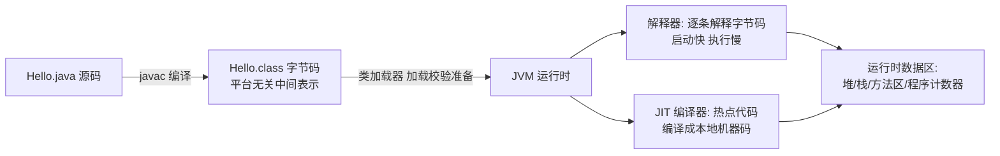
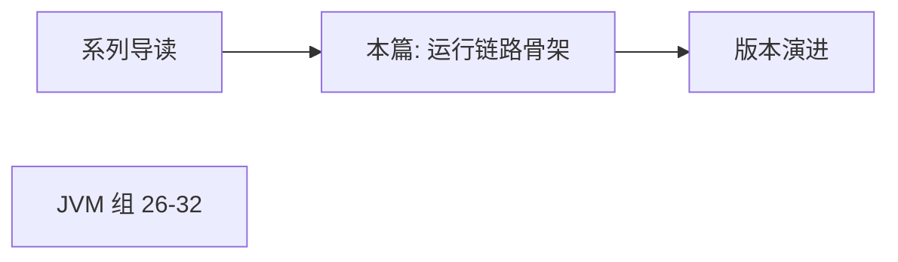

# Java 全景与运行机制

> **一句话摘要**：Java 的全部竞争力浓缩在一句话——**「一次编译，到处运行」**：源码编译成字节码，由各平台的 JVM 解释与 JIT 执行；本篇建立全系列的地基：语言定位、JDK/JRE/JVM 的关系、从源码到运行的整体链路，以及「为什么字节码 + 虚拟机」这个设计赢到了今天。

> **本文核心**：机制链 = **源码（.java）→ javac 编译 → 字节码（.class，平台无关中间表示）→ 类加载 → JVM 解释执行 + JIT 热点编译成本地机器码 → 运行时数据区**——「平台无关」由字节码与 JVM 的分工实现，「越跑越快」由 JIT 实现；理解这条链，后续 JVM 篇（26-32）全是它的展开。

前置阅读：[系列导读](./0_系列导读-全景.md)。JVM 的内部细节（内存区域/类加载/GC）在本系列第 5 组（26-32 篇）展开。

## 1. 背景：Java 靠什么赢的

1995 年 Java 诞生时的对手是 C/C++——性能王者，但有两个致命痛点：**指针与内存管理**（程序员亲手管理，事故率高）与**平台绑定**（每个平台重编译重测试）。Java 的回答是三个设计决策：

1. **字节码 + 虚拟机**：编译一次产出平台无关的字节码，各平台由对应 JVM 执行——「一次编译，到处运行」；
2. **GC 托管内存**：程序员不手工释放，垃圾回收器自动管理（用可控的性能代价换安全性）；
3. **强类型 + 去指针**：编译期多抓错，运行时少事故。

三十年后的今天，这三个决策依然是 Java 生态的骨架——「慢」的批评被 JIT 二十年进化逐步消解，「啰嗦」被 Lambda/record 等现代特性持续减负（第 7 组），而安全与跨平台在企业级场景始终是刚需。Java 的演进史（第 2 篇）就是在这条主线上开枝散叶。

## 2. 核心机制：从源码到运行的全链路



四个关键环节的机制（追问链式拆解）：

- **为什么编译成字节码而不是直接机器码？** 字节码是「一次编译、处处可用」的载体——平台差异被推给了各平台的 JVM 实现；同时字节码也是生态的接口：Kotlin/Scala/Groovy 都编译成字节码跑在 JVM 上（语言与平台解耦，JVM 成为多语言运行时）。
- **解释器与 JIT 为什么并存？** 解释器启动快（逐条翻译立即执行），JIT 编译慢但产出快代码——折中方案是「先解释跑起来，热点代码（反复执行的段）后台编译成机器码，编译完替换执行」。这就是 Java 程序「越跑越快」的机制根源（分层编译的细节见第 31 篇）。
- **运行时数据区为什么分这么多种？** 不同生命周期与共享需求的数据分开放——线程私有（程序计数器/虚拟机栈：每个线程自己的执行状态）与线程共享（堆/方法区：对象与类元数据）——这个分法直接决定了并发安全的边界与 GC 的作用域（第 26 篇展开）。
- **JDK/JRE/JVM 什么关系？** JVM 是执行引擎（虚拟机本体）；JRE = JVM + 核心类库（运行程序的最低配置）；JDK = JRE + 编译调试工具（开发者的全套工具箱）——三层包含关系，现代 JDK 发行版（Temurin/GraalVM 等）打包的通常是 JDK。

## 3. 落地实践：亲手验证这条链路

```bash
# 1. 编译: 源码 -> 字节码
javac Hello.java          # 产出 Hello.class
# 2. 看字节码: class 文件是给 JVM 读的指令(javap 反汇编)
javap -c Hello.class      # 能看到 invokevirtual/getstatic 等字节码指令
# 3. 运行: JVM 加载并执行(指定入口 main)
java Hello
# 4. 验证跨平台: 同一个 class 拷到另一 OS 的机器, 只要有 JVM 就能跑
java -version             # 确认 JDK 版本(建议 17 LTS 主线, 见第 2 篇)
```

两个顺手的好习惯：用 `javap` 看过一次字节码后，「语法糖」类话题（String 拼接、switch on String、增强 for）就不再是背诵题——糖都会还原成字节码指令；`java -Xlog:gc Hello`（JDK 9+ 统一日志）能直接看到 GC 在跑——运行时不是黑盒。

## 4. 生产视角：这条链路上的事故形态

- **NoClassDefFoundError vs ClassNotFoundException**：前者是编译期在、运行期丢（依赖冲突把 class 挤掉了）；后者是反射按名加载失败——两者都发生在「类加载」环节，定位入口是类加载器与 classpath（第 30 篇的机制地基）。
- **JIT 相关的「玄学」**：压测前几分钟 RT 偏高然后自己降下来——解释执行切换 JIT 编译的正常现象；基准测试不预热（warm-up）得到的就是「解释执行的性能」，JMH 的 warmup 轮次就是为此。
- **「本地能跑生产跑不了」的跨平台错觉**：字节码跨平台，但依赖的本地库（JNI）、文件路径分隔符、字符集默认值不跨——「到处运行」的是字节码，不是所有实践细节。
- **版本混装**：机器上有多个 JDK，IDE 用 17、终端用 8——`java -version` 与 `mvn -v` 的结果不一致是联调诡异问题的常见根因；统一工具链（SDKMAN/jenv 一类管理器）是工程纪律。

## 5. 主流系统怎么做：JDK 发行版生态

| 发行版 | 定位 | tips |
|---|---|---|
| Oracle JDK / OpenJDK | 参考实现与官方节奏 | 8(2014)/11(2018)/17(2021)/21(2023) LTS 半年一版的小步快跑 |
| Eclipse Temurin | 社区主流免费 LTS | 生产常用选择，版本对齐 OpenJDK |
| Amazon Corretto / 阿里 Dragonwell | 云厂商增强版 | 厂商在 OpenJDK 上加补丁与优化（长支持+云集成） |
| GraalVM | 原生镜像路线 | AOT 编译成本地可执行（启动毫秒级）——「字节码+JIT」范式的挑战者，Serverless 场景利器 |

规律：**发行版的差异在「运维增强与 AOT 路线」，语言语义以 OpenJDK 为准**——选型时先确认目标版本 LTS，再选发行版。

## 6. 典型场景

- **后端服务开发**（主流级）：Spring Boot 服务——全系列后续篇章（集合/并发/JVM）的服务场景底座。
- **大数据生态**（JVM 多语言级）：Hadoop/Spark/Kafka 都是 JVM 系——字节码生态的规模效应具象。
- **Android（历史形态）**：早期 Dalvik/ART 也是字节码虚拟机路线（语法同源、运行时分叉）——「字节码 + VM」设计的一次重大分支。

## 7. 与相邻概念的区别

- **JVM vs Java 语言**：语言是一种语法，JVM 是运行时——Kotlin/Scala 不写 Java 语法同样享受 JVM 生态；本系列组 5 讲 JVM（语言无关的机制），组 2-4、7 讲语言。
- **编译型 vs 解释型的二分法不适合 Java**：它是「编译到中间码 + 解释与 JIT 混合执行」的第三种形态——用老二分法理解 JIT 优化必然困惑。
- **JDK vs 框架（Spring 等）**：JDK 是语言工具箱，Spring 是构建在其上的应用框架——本系列（组 1-7）讲 JDK 层，Spring Boot 系列是独立系列（另见 ecosystem 目录）。
- **字节码 vs 机器码**：前者是给 JVM 的指令集（栈式、跨平台），后者是给 CPU 的指令集——JIT 的本职就是后者的按需生成。

## 8. 常见误区与不适用

- **「Java 是解释型语言所以慢」**：三分法误导——热点代码经 JIT 编译后就是本地机器码，长跑性能与 C++ 的差距是量级内的（GC 与内存布局才是差异主源，组 5 详谈）。
- **「Java 自动内存管理 = 不会内存泄漏」**：GC 只回收「不可达」对象——被静态集合/ThreadLocal/监听器引用着的对象永远「可达」，泄漏照旧（第 24 篇 ThreadLocal 泄漏专题）。
- **「class 文件可以直接改」**：字节码有常量池校验与验证阶段（类加载的验证环节）——手工改坏直接 VerifyError；字节码增强要走 ASM/Javassist 这类工具（框架的玩法）。
- **「一次编译到处运行 = 无需多平台测试」**：字节码跨平台但行为细节（字符集/文件系统/字体）平台相关——跨平台部署仍要集成测试。
- **不适用**：极低延迟（纳级交易——专用硬件/原生路线）；极小资源嵌入式（Micro 级设备有专门的裁剪方案）——企业后端是这条链路的绝对主场。

## 9. 你们可能会问

- **字节码长什么样，值得学吗？** 值得「读懂」不必「手写」——javap 输出里的 invokestatic/virtual/dynamic 三类调用指令，直接对应静态方法/实例方法/Lambda 的调用机制（第 36 篇会用到）。
- **JIT 优化了什么，举一个例子？** 方法内联（把小方法体直接嵌入调用点消除调用开销）是最典型的 JIT 优化——这也是「微基准必须用 JMH」的原因：裸测小方法测的是「没被内联前的假性能」。
- **为什么同一个程序每次跑的 GC 行为不完全一样？** JIT 编译时机、线程调度、分配速率的抖动——运行时是动态系统，GC 日志对比要看趋势不看单次（组 5 的排障纪律）。
- **GraalVM 原生镜像和传统 JVM 怎么选？** 启动毫秒级 + 内存小（Serverless/命令行工具）vs 传统 JVM 的 JIT 长跑性能与完整反射生态——长跑服务仍是传统路线主流。
- **本系列为什么从运行机制讲起而不是语法？** 后续每一组都挂在这条链上：集合的扩容是堆的行为、并发的可见性是内存模型、现代特性是字节码新指令——先有骨架，知识点才有挂载处。

## 10. 一句话总结 + 5W 速记卡 + 自测三问

**🎯 核心带走**：

- **核心一句话**：Java = 「字节码 + JVM」的跨平台设计 + GC 托管内存 + JIT 越跑越快——运行链路（源码→字节码→类加载→解释/JIT→数据区）是全系列的骨架。
- **链条复述**：javac 编译 → 类加载 → 解释器快启动 + JIT 热点编译 → 运行时数据区；三设计决策（字节码/GC/强类型）对抗 C 时代的三大痛点。
- **失效点与边界**：跨平台的是字节码不是实践细节；GC 管不了「可达的泄漏」；纳级延迟场景非其主场。

**5W 速记卡**：

| 维度 | 内容 |
|---|---|
| What | 运行链路全图 + JDK/JRE/JVM 关系 + JIT 机制直觉 |
| Why | 三设计决策对抗内存事故与平台绑定的历史痛点 |
| When | 建立语言认知、排查类加载/性能问题、选 JDK 发行版时 |
| Where | 一切 JVM 系场景（后端/大数据/工具链） |
| How | 亲手跑通 javac→javap→java 链路 + 统一 JDK 版本管理 |

💡 **实战提示**：javap 看字节码解语法糖之谜；基准测试必须预热（JMH）；多 JDK 用 SDKMAN 统一；GC 日志打开常态化。

**开放问题**：GraalVM 原生镜像代表「AOT 回归」路线——如果启动敏感场景全面 AOT 化，JIT 二十年的积累会在哪些场景继续不可替代？

**决策（何时用）**：新项目推荐 17/21 LTS + Temurin 类发行版起步；推荐「先懂运行链路再学语法细节」的学习顺序——本系列的编排就是这个顺序。

**Trade-off（代价与反方案）**：字节码 + JVM 用「运行时开销与内存占用」换「跨平台 + 安全托管 + 多语言生态」；反方案——原生编译语言（Go/Rust：性能与启动，代价是 GC 托管与生态重造）、AOT 原生镜像（启动快，代价是反射限制与构建时长）；托管与控制力的权衡贯穿 Java 三十年。

**演进视角**：从 1995 年的解释执行到今天分层编译 + ZGC 毫秒停顿 + 虚拟线程（第 41 篇），「字节码 + JVM」骨架从未动摇、运行时持续翻新——这是 Java 全部演进故事（下一篇展开版本史）的物理基础。

---

**下篇预告**：三十年版本长河怎么选——下一篇[Java 版本演进与 LTS 节奏](./2_Java版本演进与LTS节奏-入门.md)讲 8→11→17→21→25 各版本的核心变化与升级路径。

---

## 上下游地图

从系统架构的上下游看：**系列导读** 为本篇提供了地基——运行链路骨架 的机制向上游承接、向下游 **版本演进、JVM 组 26-32** 输出后续全部机制；架构上它是这条知识链上不可跳过的一环，跳读时建议先回上游补齐语境。



---


## 量级分档视角

| 量级 | Java 全景与运行机制的形态变化 | 关注点 |
|---|---|---|
| 10 万级 | 入门阶段，编译执行默认配置即可 | 语法正确性 |
| 千万级 | 需要关注 JIT 编译器 的取舍 | 性能瓶颈与参数调优 |
| 亿级 | 编译执行 成为架构决策的核心变量 | 架构选型与底层机制 |

量级每上一档，对 编译执行 的容忍度就降一级——**同样的代码在十万级没问题，在亿级就是事故预备役**。

## 📌 数据与事实声明

运行链路与 JDK/JRE/JVM 关系为官方文档（Oracle Java SE / JEP）公开内容；版本时间线（8/11/17/21/25）为官方发布节奏；发行版定位（Temurin/Corretto/GraalVM）为各官方资料；性能量级为业内通用认知。以官方文档为准。

## 📚 参考资料

| 类型 | 标题 | 来源 |
|---|---|---|
| 图书 | Java 核心技术 卷I（第 12 版） | Pearson（2022） |
| 文档 | Java SE 官方文档 / JEP 索引 | docs.oracle.com · openjdk.org |
| 文档 | Eclipse Temurin / GraalVM 官方 | temurin.dev · graalvm.org |
| 系列文章 | Java 版本演进（下一篇） | 本仓库同系列 |
