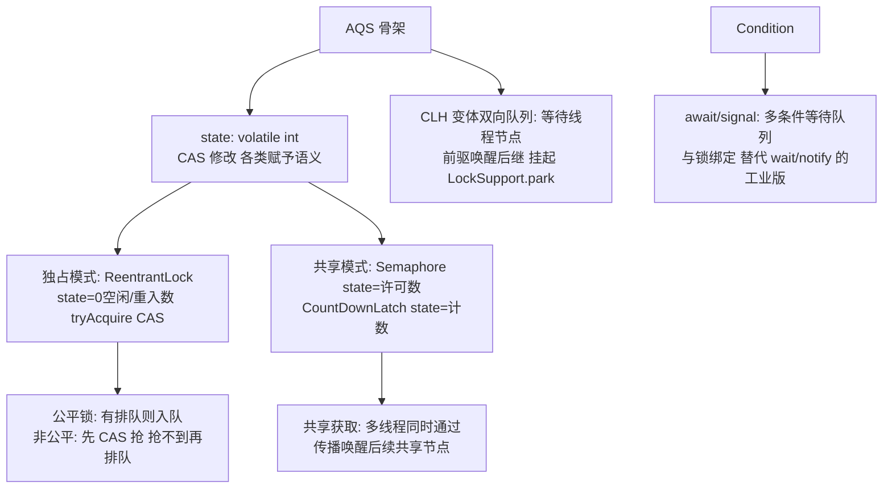

# AQS 与 JUC 锁

> **一句话摘要**：AQS（AbstractQueuedSynchronizer）= JUC 锁与同步器的公共骨架——**一个 volatile int state（同步状态）+ CLH 等待队列 + 「CAS 改状态 + 挂起唤醒」的模板**；ReentrantLock/ReadWriteLock/Semaphore/CountDownLatch 全部只实现「怎么获取/释放」（钩子方法），排队挂起唤醒全部复用骨架——它是「模板方法模式」在并发框架的旗舰应用，读懂 AQS = 读懂半个 JUC。

> **本文核心**：机制链 = **state（volatile int，CAS 修改）表达同步语义 → 获取失败入 CLH 双向队列挂起 → 释放时唤醒队头后继 → 独占模式（ReentrantLock：state=重入数）与共享模式（Semaphore/CountDownLatch：state=许可数）两种模板 → 公平（检查队列）与非公平（直接抢）之别 → Condition 多条件等待**——「排队的艺术」全部封装，使用者只写语义钩子。

前置阅读：[CAS 与原子类](./21_CAS与原子类-入门.md)（state 的 CAS 地基）、[线程协作](./18_线程协作与阻塞队列-入门.md)（挂起唤醒的原语背景）。

## 1. 背景：为什么要抽一个「同步器骨架」

ReentrantLock、Semaphore、CountDownLatch 的共同点：**都需要「获取失败 → 排队 → 挂起 → 唤醒 → 重试」的队列化管理**——每个类手写一遍等于三份队列 bug。Doug Lea 的抽象：把「排队 + 挂起 + 唤醒 + CAS 重试」全部封装进 AQS 基类，子类只回答两个问题：**「state 是什么含义」与「tryAcquire/tryRelease 怎么改 state」**——模板方法模式把「不变的机制」与「可变的语义」分离。这一抽象让 JUC 家族新增同步器（如 Phaser）的成本降到天级。

## 2. 核心机制：state、队列与两种模式



- **state 的语义多态**：同一个 volatile int，ReentrantLock 里是「重入次数」（0 空闲、1 首次、2 重入）；Semaphore 里是「剩余许可数」；CountDownLatch 里是「剩余计数」；FutureTask 里是「任务状态机」——**state 是白纸，语义由子类定义**，AQS 只提供「CAS 改 state + 失败排队」的机制。
- **CLH 队列的运作**：获取失败 → 包装成 Node 入队尾（CAS 尾插）→ `LockSupport.park()` 挂起；前驱节点释放时 `unpark` 后继 → 后继醒来重试 CAS。**挂起唤醒用 LockSupport（park/unpark）**而非 wait/notify——不要求持锁、许可制语义（先 unpark 后 park 也生效，信号不丢失——比 wait/notify 的信号丢失免疫）。
- **公平与非公平**：非公平（默认）——获取时先直接 CAS 抢一次（抢到插队），失败才排队——吞吐高（减少挂起唤醒）但可能饥饿；公平——先检查队列有没有人排队，有则乖乖排队——语义公平但吞吐低。**行业默认非公平**（吞吐优先，饥饿在业务上通常可容忍）。
- **共享模式与传播**：共享获取（Semaphore 的 acquire）成功后要**传播唤醒**后继的共享节点（一连串等待者一起通过）——与独占模式（一次只放一个）的核心差异；`setHeadAndPropagate` 是源码关键路径。
- **Condition（条件队列）**：`lock.newCondition()` 创建多条件等待队列——`await` 释放锁挂到条件队列、`signal` 移到同步队列——**wait/notify 的工业版**：每个 Condition 独立等待队列（不同条件分开等，不互相误唤醒）。典型应用：ArrayBlockingQueue 的 notFull/notEmpty 两个条件（16 篇）。

## 3. 落地实践：用 AQS 写一个自定义同步器

```java
// 不可重入互斥锁: 30 行的完整语义
public class SimpleLock extends AbstractQueuedSynchronizer {
    SimpleLock() { setState(0); }
    @Override protected boolean tryAcquire(int acquires) {
        if (compareAndSetState(0, 1)) {          // CAS 抢 state
            setExclusiveOwnerThread(Thread.currentThread());
            return true;                          // 抢到
        }
        return false;                             // 失败 -> AQS 排队挂起
    }
    @Override protected boolean tryRelease(int releases) {
        if (getState() == 0) throw new IllegalMonitorStateException();
        setExclusiveOwnerThread(null);
        setState(0);                              // 释放 -> AQS 唤醒后继
        return true;
    }
    public void lock() { acquire(1); }
    public void unlock() { release(1); }
}
```

这就是 AQS 的魅力：**排挂唤醒全免写，30 行拿到一个生产级互斥锁**。重入版只需在 tryAcquire 里判断「当前持有者是否自己」累加 state（ReentrantLock 的非公平 tryAcquire 即此结构 + 队列检查的公平分支）。

## 4. 生产视角：JUC 锁的事故形态

- **Lock 忘 unlock**：`lock()` 后异常路径未 `finally unlock()`——锁永不释放，后续全部排队卡死。铁律：lock 后立即 try/finally unlock（IDE 模板）。
- **公平锁的性能陷阱**：为「看起来公平」全量改公平锁——吞吐显著下降（排队 CAS + 挂起唤醒开销）；公平只在「确认有饥饿且业务不能容忍」时局部启用。
- **Condition 忘在循环里 await**：`if (!condition) cond.await()`——虚假唤醒同样存在（18 篇三铁律在 Condition 上的重演）；await 必须 while 包裹。
- **读写锁的写饥饿**：读多写少场景读锁长期持有（读读者接续），写线程饿死——StampsLock 的乐观读或「写优先调度」缓解；或评估是否该用不可变快照模式。

## 5. 主流系统怎么做：AQS 家族的应用图谱

| 组件 | state 语义 | 模式 |
|---|---|---|
| ReentrantLock | 重入次数 | 独占（公平/非公平） |
| ReentrantReadWriteLock | 高 16 读计数/低 16 写计数 | 独占 + 共享混合 |
| Semaphore | 剩余许可 | 共享 |
| CountDownLatch | 剩余计数（到 0 开闸） | 共享 |
| FutureTask | 任务状态机 | 独占（完成回调唤醒） |
| ThreadPoolExecutor 的 Worker | 继承 AQS（不可重入锁） | 独占（防工作线程重入任务锁） |

规律：**JUC 的同步组件「一个家族一个祖先」**——读懂 AQS 的 state/队列/两模式，六七个组件的源码变成「语义填空题」。

## 6. 典型场景

- **资源池限流**（资源级）：Semaphore（连接池许可/并发导出数控制）。
- **并行任务收口**（编排级）：CountDownLatch await（18 篇的「等 N 个事件」）。
- **读写分离的共享结构**（缓存级）：ReentrantReadWriteLock——读并发写独占。
- **多条件生产消费**（定制级）：ReentrantLock + 双 Condition（notFull/notEmpty）——ArrayBlockingQueue 的实现本体。

## 7. 与相邻概念的区别

- **AQS vs synchronized**：Java 层可继承扩展（模板钩子）vs JVM 内建（不可定制）；高级特性（tryLock/多条件/公平）AQS 系独占（20 篇对照）。
- **ReentrantLock vs synchronized**：语义等价（可重入互斥+可见性）+ Lock 的四项独占能力——「默认 synchronized、需要特性才 Lock」的行业共识不变。
- **CLH 队列 vs synchronized 等待队列**：CLH 显式双向队列（可观测/可公平/可传播）vs Monitor 内部队列（黑盒）——可定制性的差异是 AQS 存在的理由。
- **本篇 vs CAS（21 篇）**：CAS 是 AQS 的指令地基（state 的修改全靠 CAS）；AQS 是 CAS 之上的「可阻塞框架」——原语与建筑的关系。

## 8. 常见误区与不适用

- **「公平锁更安全所以全用公平」**：公平只防饥饿不防业务 bug——吞吐代价全局承担是误用；非公平默认 + 局部公平是惯例。
- **「读写锁适合一切读写场景」**：读持锁时间长时写饥饿、且读锁重入的复杂度——读极多写极少的「只读快照」场景不可变替换更优（19 篇）。
- **「AQS 的 state 是原子复合的」**：state 单变量 CAS 原子；子类钩子里的「检查再行动」复合逻辑要自己保证（钩子通常在独占保护内执行所以安全——但共享模式要细看）。
- **「Condition.signal 唤醒所有」**：signal 只唤醒条件队列一个（signalAll 才是全部）——与 notify/notifyAll 同款选择（18 篇）。
- **不适用**：简单互斥（synchronized 更防呆）；读极多写极少（不可变+COW）；跨 JVM（分布式锁）。

## 9. 你们可能会问

- **为什么队列叫「CLH 变体」？** 原版 CLH 是自旋队列（前驱状态自旋）；AQS 变体改为「前驱唤醒后继挂起」+ 双向指针（取消节点方便）——学术原型到工程实现的适配案例。
- **非公平锁的「插队」抢的是什么？** tryAcquire 的第一次 CAS——抢的是「锁恰好空闲的瞬间」；队列中的线程被唤醒后还要再 CAS 一轮（可能又被新来的插队——所以非公平吞吐高）。
- **LockSupport.park 为什么比 wait/notify 好？** 不需持锁、许可制（先 unpark 后 park 信号不丢）、可带 blocker 对象（jstack 可见挂起原因）——AQS 选它的三个理由。
- **读写锁的 state 怎么同时记读写计数？** 32 位拆两个 16 位（高读低写）——「一个 int 分账两方」的位分配技巧（与雪花算法的位分账同源，ID 篇呼应）。
- **怎么读 AQS 源码不迷路？** 三入口：acquire（独占获取全流程：tryAcquire→入队→park 循环）、release（唤醒后继）、setHeadAndPropagate（共享传播）——读懂三条路径，家族源码全通。

## 10. 一句话总结 + 5W 速记卡 + 自测三问

**🎯 核心带走**：

- **核心一句话**：AQS = volatile state（CAS）+ CLH 排队 + park/unpark 挂起唤醒的模板骨架——独占/共享两模式，子类只写 tryAcquire/Release 语义钩子；JUC 锁与同步器的公共祖先。
- **链条复述**：state 语义多态 → 获取失败入队 → 挂起 → 前驱唤醒重试 → 公平/非公平的插队取舍 → Condition 多条件 → 30 行自定义锁。
- **失效点与边界**：公平锁吞吐代价；读写锁写饥饿；Lock 忘 unlock 红线。

**5W 速记卡**：

| 维度 | 内容 |
|---|---|
| What | state + CLH 队列 + 两模式 + Condition |
| Why | 队列化同步的公共机制一次实现全家族复用 |
| When | 用/读 JUC 组件、自定义同步器、锁事故排查 |
| Where | JUC 包（Java 层 + LockSupport 内核挂起） |
| How | 子类写语义钩子 → 骨架管排挂唤醒 → 三入口读源码 |

💡 **实战提示**：lock 后立即 try/finally unlock；公平锁按需局部用；Condition 的 await 用 while；读写锁防写饥饿。

**开放问题**：虚拟线程的挂起是「JVM 层续体（continuation）」而非 park——AQS 的 park/unpark 挂起机制在虚拟线程上已被适配（ park 挂起虚拟线程），未来 AQS 会不会出「续体原生」的 V2 骨架？

**决策（何时用）**：需要 Lock 四特性时用 ReentrantLock；并发限流 Semaphore、并行收口 latch；推荐「自定义同步器先问『能不能用现成 JUC 组件』」——自研同步器是最后手段。

**Trade-off（代价与反方案）**：非公平用「饥饿风险」换「吞吐」；公平用「吞吐」换「有序保证」；读写锁用「复杂度」换「读并发」；AQS 的可扩展性用「理解门槛（源码抽象度高）」换「全家复用」——JUC 的优雅是把并发最难的部分（排队）做成了基础设施。

**演进视角**：AQS 自 JDK 5 落地二十余年核心未变（state+队列+park），JDK 9 后续体挂起适配虚拟线程——「骨架长存、挂起载体演进」；Doug Lea 的这次抽象与 JVM 之于字节码同构：机制层一次建成，语义层永久租用。

---

**下篇预告**：并发工具箱——下一篇[并发工具类](./23_并发工具类-入门.md)讲 CountDownLatch/CyclicBarrier/Semaphore/Exchanger 的语义分工与选型。

---

## 上下游地图

从系统架构的上下游看：**CAS、协作(篇18)** 为本篇提供了地基——排队骨架 的机制向上游承接、向下游 **工具类(篇23)** 输出JUC 家族；架构上它是这条知识链上不可跳过的一环，跳读时建议先回上游补齐语境。

```mermaid
flowchart LR
    U0[CAS]
    U1[协作(篇18)]
    --> ME[本篇: 排队骨架]
    ME --> DN0[工具类(篇23)]
```

---

## 📌 数据与事实声明

AQS 骨架（state/CLH 变体/独占共享/Condition）为 JDK 源码（AbstractQueuedSynchronizer 注释极详尽）与官方文档公开内容；LockSupport 许可语义为 Javadoc；ReentrantLock 公平性为源码实现；「30 行锁」为源码结构的教学化简化。以 JDK 源码为准。

## 📚 参考资料

| 类型 | 标题 | 来源 |
|---|---|---|
| 源码 | java.util.concurrent.locks.AbstractQueuedSynchronizer | github.com/openjdk/jdk |
| 图书 | Java 并发编程实战（第 13-14 章） | Addison-Wesley |
| 文章 | Doug Lea 的 AQS 论文（The java.util.concurrent Synchronizer Framework） | 公开学术资料 |
| 系列文章 | CAS（21 篇）/ 并发工具类（23 篇） | 本仓库同系列 |
