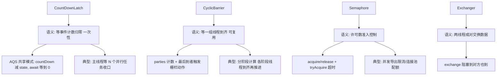

# 并发工具类

> **一句话摘要**：JUC 的同步工具家族按「等什么」分工——**CountDownLatch 等固定次数的事件（计数归零开闸）、CyclicBarrier 等一组线程到齐（可复用的栅栏）、Semaphore 控制同时访问的许可数（限流准入）、Exchanger 两线程交换数据**；全部构建在 AQS 之上，选型一句话：**等事件用 latch、等人齐用 barrier、限流用 semaphore、配对交换用 exchanger**。

> **本文核心**：机制链 = **CountDownLatch（AQS 共享模式，countDown 减 state、await 等归零、一次性）→ CyclicBarrier（ parties 计数 + 最后到者执行栅栏动作 + 可重置复用）→ Semaphore（许可语义 acquire/release、公平可选、减少许可动态限流）→ Exchanger（两线程成对交换）→ 家族之外的现代替代（CompletableFuture 聚合、虚拟线程时代「每任务一线程」简化协作）**——工具选型先答「协作的形状」。

前置阅读：[AQS 与 JUC 锁](./22_AQS与JUC锁-入门.md)（家族的骨架来源）。

## 1. 背景：协作形状的四象限

线程协作的常见形状有四种，各有专属工具：① **主线程等 N 个并行任务完成**（收口）→ CountDownLatch；② **一组线程互相等齐再一起走**（分阶段推进）→ CyclicBarrier；③ **N 个线程抢 M 个名额**（准入控制）→ Semaphore；④ **两个线程到点互换手上的东西**（配对）→ Exchanger。**「协作的形状」决定工具**——用错形状的工具（比如用 latch 做「人齐再走」）会让代码语义扭曲且不可复用。

## 2. 核心机制：四工具的能力矩阵



- **CountDownLatch 的一次性**：计数到 0 不可重置——「一次性闸门」；需要复用选 CyclicBarrier 或新建 latch。纪律：latch 的 count 必须与「异步任务数」严格对应——**countDown 必须在 finally 里**（任务异常也要减一，否则主线程永久等待）。
- **CyclicBarrier 的复用与栅栏动作**：最后到达的线程触发「栅栏动作」（barrierAction，在其他线程被放行前执行）——适合「每阶段收尾汇总」；可 reset 复用；线程 broken（一方中断）则本轮栅栏全体收到 BrokenBarrierException——**失败传播是显式的**（与 latch 的「等不到就等死」不同，barrier 有故障语义）。
- **Semaphore 的许可语义**：acquire 拿许可（没有则挂起）、release 还许可——**许可数 = 最大并发准入数**；`tryAcquire(timeout)` 非阻塞尝试；`acquire(N)` 批量拿（公平可选）。注意：release 不校验「是否 acquire 过」——多 release 会凭空加许可（配对纪律靠自觉，或用 tryAcquire 结构化写法）。
- **Exchanger 的成对性**：两个线程各自 `exchange(data)` 阻塞到对方也到 → 互换返回——多于两个线程的场景不适用（配对错乱）；现代场景少见（数据交换多走队列）。

## 3. 落地实践：四工具的标准用法

```java
// CountDownLatch: 并行调用收口
CountDownLatch latch = new CountDownLatch(tasks.size());
for (var t : tasks) executor.submit(() -> {
    try { t.run(); } finally { latch.countDown(); }   // finally 纪律
});
latch.await(10, TimeUnit.SECONDS);                     // 超时化

// CyclicBarrier: 分阶段并行计算
CyclicBarrier barrier = new CyclicBarrier(workers,
    () -> mergePartialResults());                      // 栅栏动作: 收尾汇总
// 每个分片线程: 算完本阶段 -> barrier.await() 等齐 -> 进入下一阶段

// Semaphore: 并发导出限流
Semaphore permits = new Semaphore(8);                  // 最多 8 个并发导出
permits.acquire();
try { doExport(); } finally { permits.release(); }
```

三条纪律：① **countDown/release 全部 finally**；② **await/acquire 全部超时化**（卡死豁免权不给他们）；③ **Semaphore 的配对靠结构化**（acquire 与 release 包在同一 try/finally，且中间不提前 return 漏 release）。

## 4. 生产视角：工具误用的事故形态

- **latch 计数不归零的永久等待**：任务异常导致 countDown 没执行——主线程 await 永久挂起（无超时则线程泄漏）。finally 纪律 + 超时化双保险。
- **Semaphore 泄漏许可**：acquire 后异常路径漏 release——许可只减不增，Eventually 全部请求拿不到许可（「服务假死」形态：不报错但全超时）。与连接池泄漏同族。
- **CyclicBarrier 的单方中断连坐**：一方异常退出未到栅栏，其他线程等在栅栏——本轮 broken，全体 BrokenBarrierException。需要「部分失败不影响他人」的语义时 barrier 不适用（换 latch 或 CompletableFuture 聚合）。
- **CompletableFuture 时代的冗余手写**：并行调用收口用 latch + 手工收集结果——`CompletableFuture.allOf(...).join()` 一步到位（异常传播/结果聚合全内置）；新代码的收口需求先看 CF 是否已覆盖。

## 5. 主流系统怎么做：家族与现代替代的对照

| 需求 | 经典工具 | 现代替代 | 取舍 |
|---|---|---|---|
| 并行收口 | CountDownLatch | CompletableFuture.allOf | 结果聚合+异常传播内置 |
| 分阶段同步 | CyclicBarrier | StructuredTaskScope（预览） | 作用域化任务组 |
| 限流准入 | Semaphore | Resilience4j RateLimiter/线程池池化 | 语义更全（熔断/统计） |
| 数据交换 | Exchanger | BlockingQueue | 通用性 |

规律：**经典工具解决「原语级协作」，现代库解决「工程级协作」**——学经典是为了读懂框架内部（线程池/AQS 家族全是它们），写业务优先现代形态。

## 6. 典型场景

- **并行接口聚合**（服务级）：多下游并行查询 + 收口——CF allOf 的主场（latch 用于「只等完成不要结果」的轻场景）。
- **批量导出限流**（保护级）：Semaphore 控并发——导出/爬取/批量任务打下游的准入控制。
- **分阶段流水线**（计算级）：并行排序/归并的阶段性推进——CyclicBarrier 或手写阶段状态机。

## 7. 与相邻概念的区别

- **latch vs barrier**：等事件（单向闸门，主从关系）vs 等人齐（对等栅栏，平权关系）——「主线程等任务」与「平级线程互相等」的语义分界。
- **latch vs Future.get**：等事件计数 vs 等特定结果——需要拿结果用 Future/CF，只需要「都完成了」用 latch。
- **Semaphore vs 锁**：N 个准入 vs 1 个互斥——Semaphore 是锁的泛化（许可数=1 时等价互斥但不可重入）。
- **本篇 vs AQS（22 篇）**：四工具全是 AQS 共享模式/条件队列的应用实例——「骨架」与「成品」的关系，读工具源码前先读 AQS。

## 8. 常见误区与不适用

- **「latch.countDown 忘 finally」**：任务异常跳过减一——永久等待（第 4 节的永久等待事故之源）。
- **「Semaphore.acquire 不配对 release」**：许可泄漏同连接池泄漏——「结构性配对」（同方法内 try/finally）是唯一可靠写法。
- **「CyclicBarrier 用于不对等协作」**：barrier 要求各方「都会到」——某方条件性缺席则全体 broken；不对等场景换 latch。
- **「用 Thread.sleep 做等待同步」**：睡多久都是猜——协作必须用机制（latch/queue/future），sleep 是「赌运气同步」的反模式。
- **不适用**：跨进程协作（分布式栅栏/信号量——Redis/ZK 域）；超高频细粒度同步（工具类的 AQS 挂起开销显性化——原子类/无锁结构）；单线程编排（CF 链即可）。

## 9. 你们可能会问

- **latch 的 count 与任务数怎么保证一致？** 结构化写法：`ExecutorCompletionService` 或 CF（`allOf` 自动对齐）——「数数」这件事交给框架，人只提交任务。
- **Semaphore 的公平性？** 构造可配公平（排队获取）——默认非公平（吞吐优先）；限流场景公平性通常不重要（拿了许可就执行）。
- **CyclicBarrier 的栅栏动作在哪个线程执行？** 最后到达的线程（其他线程在 await 上等着）——栅栏动作耗时会拖住全体（动作要轻或异步化）。
- **CompletableFuture 能替代全部四个吗？** 收口/结果聚合能（allOf/thenCombine）；限流（CF 无准入语义）与对等栅栏不能——CF 是「结果编排」不是「准入控制」，语义域不同。
- **怎么排查「latch 等待卡死」？** jstack 看等待线程的 await 位置 → 找「该 countDown 的任务线程」的状态（没跑完？异常退出了？根本没提交？）——latch 卡死九成是「计数与任务数不一致」。

## 10. 一句话总结 + 5W 速记卡 + 自测三问

**🎯 核心带走**：

- **核心一句话**：协作四形状四工具——等事件 latch（finally countDown + 超时）、等人齐 barrier（可复用 + broken 传播）、限准入 semaphore（finally release）、配对交换 exchanger；新代码先看 CompletableFuture/现代库是否已覆盖。
- **链条复述**：协作形状四象限 → 各工具的 AQS 机制 → 三纪律（finally/超时/配对）→ 现代替代的语义边界（CF 管结果编排不管准入）。
- **失效点与边界**：latch 一次性；barrier 失败连坐；semaphore 许可泄漏静默；全家族单机域。

**5W 速记卡**：

| 维度 | 内容 |
|---|---|
| What | latch/barrier/semaphore/exchanger 的语义分工 |
| Why | 协作形状不同，工具语义必须对位 |
| When | 并行收口、分阶段计算、限流准入、配对交换 |
| Where | AQS 共享模式与条件队列（Java 层） |
| How | 定协作形状 → 选工具 → finally/超时纪律 → 先查现代替代 |

💡 **实战提示**：countDown/release 进 finally；await/acquire 全超时；barrier 的 broken 连坐要评估；新代码收口优先 CompletableFuture。

**开放问题**：虚拟线程让「并行任务直接每任务一线程」——协作工具的使用频率会向「编排库（CF/结构化并发）」集中，原语工具退化为库的内部件吗？

**决策（何时用）**：原语级协作（读框架/写基础设施）用四工具；业务级编排优先 CompletableFuture/结构化并发；推荐「协作形状四象限」进并发选型培训。

**Trade-off（代价与反方案）**：latch 的一次性换「语义极简」；barrier 的复用换「故障连坐的显式性」；semaphore 的许可制换「准入的灵活性」；CF 的内置聚合换「结果导向的约束（必须关心返回值）」——工具的每个便利与限制都是协作语义的形状约束。

**演进视角**：工具家族（JDK 5）先于 CompletableFuture（8）与结构化并发（21+ 预览）——三代协作 API 的演进主线是「从『线程级协作』到『任务级编排』」；原语工具的学习价值正在从「写业务」迁移到「懂底层」，这个趋势与整个并发域一致。

---

**下篇预告**：并发泄漏之王——下一篇[ThreadLocal](./24_ThreadLocal-入门.md)讲原理、内存泄漏与线程池场景的清理纪律。

---

## 上下游地图

从系统架构的上下游看：**AQS** 为本篇提供了地基——协作形状 的机制向上游承接、向下游 **线程池(篇25)** 输出编排工具箱；架构上它是这条知识链上不可跳过的一环，跳读时建议先回上游补齐语境。

```mermaid
flowchart LR
    U0[AQS]
    --> ME[本篇: 协作形状]
    ME --> DN0[线程池(篇25)]
```

---


## 质疑者追问链

**质疑：并发工具类 为什么设计成这样，不那样设计？**
并发工具类 的设计是在「易用性、安全性、性能」三者之间做取舍——没有完美的选择，只有场景匹配的选择。理解取舍比记住结论更有价值。

**追问一层：如果换个场景，这个设计还成立吗？**
不完全成立——并发计数 从十万级涨到千万级时，很多默认假设失效；理解设计边界，才能判断「什么时候需要换方案」。

**再深一层：底层原理和上层 API 之间是什么关系？**
上层 API 是底层机制的抽象封装——机制不变，API 可以演进；反过来，机制变了 API 必须跟着变。这就是为什么「理解机制」比「记住 API」更保值。

## 量级分档视角

| 量级 | 并发工具类的形态变化 | 关注点 |
|---|---|---|
| 10 万级 | 入门阶段，并发计数默认配置即可 | 语法正确性 |
| 千万级 | 需要关注 屏障同步 的取舍 | 性能瓶颈与参数调优 |
| 亿级 | 并发计数 成为架构决策的核心变量 | 架构选型与底层机制 |

量级每上一档，对 并发计数 的容忍度就降一级——**同样的代码在十万级没问题，在亿级就是事故预备役**。

## 📌 数据与事实声明

四工具语义（一次性/复用/许可/配对）为 Javadoc 公开内容；AQS 共享模式实现为 JDK 源码；CompletableFuture.allOf 语义为官方文档；StructuredTaskScope 为 JEP 预览（JEP 453/462，以最新状态为准）。以官方文档为准。

## 📚 参考资料

| 类型 | 标题 | 来源 |
|---|---|---|
| 文档 | java.util.concurrent 官方文档（CountDownLatch 等） | docs.oracle.com |
| 图书 | Java 并发编程实战（第 5 章构建块） | Addison-Wesley |
| JEP | Structured Concurrency（JEP 453 等，预览状态以官方为准） | openjdk.org/jeps |
| 系列文章 | AQS（22 篇）/ 线程池（25 篇） | 本仓库同系列 |
