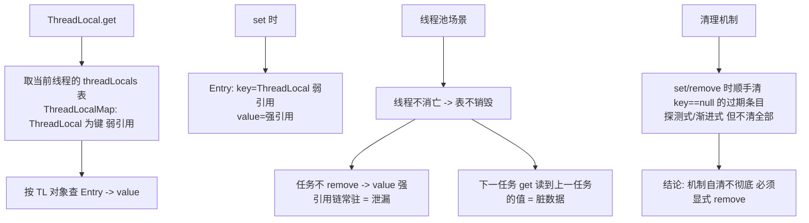

# ThreadLocal

> **一句话摘要**：ThreadLocal = 「以线程为作用域的变量访问」——每个线程持有一份独立副本（互不干扰），实现**无锁的线程封闭**；它的实现是反向的（Thread 对象里存表，ThreadLocal 自己只是表的键）——这决定了**线程池场景必须显式 remove**（线程不死，条目不走，弱引用键也救不了值），内存泄漏与脏数据是两大经典事故。

> **本文核心**：机制链 = **每个 Thread 内部一个 ThreadLocalMap → ThreadLocal 对象是键（弱引用），值是强引用 → 读：按当前线程取表按键查 → 池化线程不消亡 → 条目残留（Key 被回收成 null 但 Value 强引用链还在）→ 泄漏 + 脏数据（下一个任务读到上一个任务的值）→ 纪律：try/finally remove**——「用完必须 remove」是 ThreadLocal 唯一的安全姿势。

前置阅读：[线程基础](./17_线程基础与生命周期-入门.md)（线程池复用是事故的温床）。

## 1. 背景：线程封闭为什么值钱

共享可变状态是并发灾难之源（前几篇的全部机制都在治理它）；**线程封闭**换一条路：让可变状态根本不共享——每个线程一份。ThreadLocal 是「隐式传参」的载体：用户上下文/事务连接/日期格式化器，沿着调用链层层传参太丑，ThreadLocal 让「同一线程的任何代码」都能拿到「本线程的副本」——代价是把生命周期管理交给了使用者（泄漏与脏数据）。

## 2. 核心机制：反向存储、弱引用键与泄漏



- **反向存储的设计**：直觉是「ThreadLocal 内部一个 Map`<Thread, Value>`」——实际反着：**Thread 对象内部有一个 ThreadLocalMap**，ThreadLocal 自己只是这个 Map 的键。设计动机：线程多、ThreadLocal 少（键少表小、挂在 Thread 上随线程销毁而整体消失——非池化场景自动清理）。
- **弱引用键的用意与局限**：Entry 的 key 是弱引用——外部 ThreadLocal 对象被回收后，Entry 的 key 变 null（防「ThreadLocal 对象本身」泄漏）；**但 value 是强引用**——`Thread → ThreadLocalMap → Entry → value` 的强引用链还在，value 活着。**弱引用只救了 key 没救 value**——「ThreadLocal 弱引用所以不会泄漏」是半截理解。
- **机制自清的不彻底**：ThreadLocalMap 在 set/get/remove 时会顺手清理「key==null 的过期条目」（expungeStaleEntry 系列）——但只清理被「探测到」的路径附近，不保证全表清扫。结论：**依赖机制自清 = 赌运气，显式 remove 才是纪律**。
- **InheritableThreadLocal**：子线程继承父线程的值（创建时拷贝）——线程池场景失效（线程复用不重新创建）；传递方案的正解是阿里 TransmittableThreadLocal（TTL，包装任务捕获快照）或上下文框架显式传递。

## 3. 落地实践：正确的使用模板

```java
private static final ThreadLocal<UserContext> CONTEXT = new ThreadLocal<>();

// Web 过滤器场景的标准模板: set -> 业务 -> remove 三段式
public void doFilter(request, response, chain) {
    try {
        CONTEXT.set(parseUser(request));      // 入口 set
        chain.doFilter(request, response);    // 业务(任何深度都能 CONTEXT.get())
    } finally {
        CONTEXT.remove();                     // 出口必 remove: 防池化泄漏+脏数据
    }
}
```

三条纪律：① **set 与 remove 成对、remove 放 finally**（异常路径也要清）；② **线程池任务同样适用**（任务开头 set/结尾 remove，或用装饰 Runnable 的工具统一包装）；③ **能显式传参就不要 ThreadLocal**（隐式传参的可读性代价——ThreadLocal 是「实在没法传参」的场景工具，不是默认方案）。

## 4. 生产视角：ThreadLocal 的事故形态

- **用户数据串号**：线程池任务 A set 了用户 X 的上下文没 remove，任务 B（同线程）读到 X 的身份——**把 X 的数据当 Y 的处理**，串号事故是 ThreadLocal 脏数据的资金级形态（资金系统直接禁用不清理的 ThreadLocal）。
- **内存泄漏的堆增长**：海量任务各 set 大对象不 remove——Entry 常驻（key 可能已 null 的过期条目），老年代缓慢增长。排查：heap dump 看 ThreadLocalMap 的 Entry 链（MAT 的 path to GC roots 指向线程）。
- **透传失效**：异步线程读不到主线程的上下文（ThreadLocal 天然不跨线程）——改用 TTL/上下文框架，或显式传参；「为什么异步里取不到用户信息」是高频问题，答案永远是「ThreadLocal 不跨线程」。
- **框架的静默清理陷阱**：部分框架（Tomcat 类容器）检测到泄漏会警告甚至清理——但清理时机不可控（依赖业务先结束）；不能依赖容器的兜底作为清理方案。

## 5. 主流系统怎么做：ThreadLocal 的生态应用

| 场景 | 应用 | 机制要点 |
|---|---|---|
| 请求上下文 | Spring RequestContextHolder / MDC | 过滤器 set + 拦截器 remove 的成对结构 |
| 事务/连接绑定 | Spring 事务管理器 | Connection 绑定当前线程，同线程同事务 |
| 格式化器复用 | SimpleDateFormat 的 ThreadLocal 包装 | 非线程安全对象的线程封闭（现代可用 DateTimeFormatter 替代——它本身线程安全） |
| 上下文透传 | TransmittableThreadLocal | 装饰任务捕获-回放快照 |

规律：**ThreadLocal 的工业用法全部「成对出现」**（入口 set / 出口 remove）——不成对的用法都是事故预备役。

## 6. 典型场景

- **请求上下文**（Web 级）：用户身份/traceId 沿调用链隐式可达——过滤器三段式模板。
- **事务边界**（数据级）：同线程同事务的连接绑定——Spring 声明式事务的机制支柱之一。
- **非线程安全对象复用**（性能级）：SimpleDateFormat/随机数生成器的线程封闭——现代优先替代品（DateTimeFormatter/ThreadLocalRandom）。

## 7. 与相邻概念的区别

- **ThreadLocal vs 同步机制**：线程封闭（不共享）vs 共享治理（锁/原子）——「能封闭就封闭」是更优的并发策略（无竞争无代价）；ThreadLocal 是封闭的隐式形态，显式形态是「任务自持状态」。
- **ThreadLocal vs 传参**：隐式（任何深度可达）vs 显式（调用链可见）——可读性上显式完胜；ThreadLocal 留给「横切关注点」（上下文/日志 MDC）而非业务数据。
- **ThreadLocal vs TransmittableThreadLocal**：不跨线程 vs 跨线程（池化场景透传）——异步化上下文丢失的正解。
- **本篇 vs 虚拟线程（41 篇）**：虚拟线程是 Thread 的实现——ThreadLocal 语义保留（每虚拟线程一份）；但海量虚拟线程 × 大 value 的内存乘数效应要重新评估（原来千级线程的值，现在百万级线程的值）。

## 8. 常见误区与不适用

- **「ThreadLocal 用弱引用所以不泄漏」**：弱引用只防「ThreadLocal 对象」泄漏——value 的强引用链（Thread→Map→Entry→value）依然在；「remove 纪律」才是真防线。
- **「线程池里 set 完业务结束就算完」**：线程不死条目不走——脏数据（串号）比泄漏更危险（资金串号是资损）。remove 是铁律不是建议。
- **「static final 的 ThreadLocal 没有泄漏问题」**：static 防「ThreadLocal 对象本身」被回收（key 不变 null），但 value 生命周期仍由 remove 决定——static 反而让机制自清完全失效（key 永不 null），更要显式 remove。
- **「InheritableThreadLocal 能解决异步透传」**：只在「new 线程」时拷贝——线程池复用不触发；异步透传用 TTL。
- **不适用**：业务数据传递（显式传参优先）；大对象长期驻留（本篇机制天然「随请求生灭」——长驻是反模式）；跨服务传递（trace 上下文走协议头透传——W3C TraceContext，归可观测域）。

## 9. 你们可能会问

- **为什么不直接 Map`<Thread, Value>`？** 三个理由：锁竞争（Map 需要同步，反向存储每线程自己的表无锁）、生命周期（挂在 Thread 上随线程消失）、泄漏感知（弱引用键可标记过期）——反向设计是性能与治理的双重选择。
- **怎么排查 ThreadLocal 泄漏？** 三步：heap dump 找膨胀对象（MAT 查 ThreadLocalMap 的 Entry）→ path to GC roots 定位持有线程 → 对照业务确认哪个 set 没配 remove——dump 是唯一实证手段。
- **remove 之后 value 立即可回收吗？** 是——Entry 的强引用被断（value 引用清空），GC 可达性判断生效；「remove 即安全」在正确实现下成立。
- **MDC 是 ThreadLocal 吗？** 是——日志框架的 MDC（诊断上下文）就是 ThreadLocal 封装；所以「MDC 没清理导致日志串号」与「上下文串号」同根同源（异步日志/线程池场景要 MDC 透传）。
- **虚拟线程下 ThreadLocal 还有价值吗？** 机制保留（语义不变），但「百万级虚拟线程 × 每 threadLocal 大 value」的内存乘数是新命题——JDK 也在推进 ScopedValue（作用域值，不可变 + 作用域自动清理）作为现代替代（预览中）——「隐式共享」正在向「作用域绑定」演进。

## 10. 一句话总结 + 5W 速记卡 + 自测三问

**🎯 核心带走**：

- **核心一句话**：ThreadLocal = 反向存储（Thread 持表、ThreadLocal 作键）的线程封闭——弱引用键只救 key 不救 value；池化场景 set/remove 必成对（finally），泄漏与串号两大事故全靠 remove 纪律免疫。
- **链条复述**：线程封闭价值 → 反向存储设计 → 弱引用键的用意与局限 → 池化残留（泄漏+脏数据）→ 三段式模板 → TTL/ScopedValue 的演进方向。
- **失效点与边界**：不跨线程（透传用 TTL）；业务数据显式传参优先；大对象 × 海量线程的内存乘数要重估。

**5W 速记卡**：

| 维度 | 内容 |
|---|---|
| What | 反向存储 + 弱引用键 + 池化残留机制 |
| Why | 隐式传参/线程封闭的便利与泄漏/串号的风险并存 |
| When | 请求上下文、事务绑定、非线程安全对象复用 |
| Where | Thread 对象内的 ThreadLocalMap |
| How | set-remove 三段式 finally → 泄漏用 heap dump 排查 → 透传用 TTL |

💡 **实战提示**：remove 进 finally 铁律；资金链路慎用 ThreadLocal 存上下文；异步透传用 TTL；关注 ScopedValue 演进。

**开放问题**：ScopedValue（作用域值）的「不可变 + 作用域自动绑定/清理」被视为 ThreadLocal 的现代继任——ThreadLocal 会不会像 Vector 一样进入「保留但不再推荐」的历史区？

**决策（何时用）**：横切上下文（trace/MDC/身份）推荐「框架级封装的 ThreadLocal（带成对清理）」；业务数据推荐显式传参；推荐「ThreadLocal 使用必须成对清理」进评审红线，资金链路加静态扫描。

**Trade-off（代价与反方案）**：ThreadLocal 用「泄漏/串号风险 + 隐式性」换「无锁封闭与深度可达」；显式传参用「签名噪音」换「因果可见」；TTL 用「任务包装成本」换「池化透传」；ScopedValue 用「不可变约束」换「自动清理」——隐式便利的每一次兑现，都以纪律为担保。

**演进视角**：ThreadLocal 从「同步替代品」（1.2）到「泄漏代名词」（池化时代）到 ScopedValue 的「作用域化重设计」（21+ 预览）——「隐式线程级共享」的范式正在被「显式作用域绑定」接替；但「谁 set 谁 remove」的责任思想，会在任何新机制里继续存在。

---

**下篇预告**：并发的生产力之巅——下一篇[线程池与异步编程](./25_线程池与异步编程-入门.md)讲 Executor 框架、7 参数、拒绝策略与 CompletableFuture。

---

## 上下游地图

从系统架构的上下游看：**线程基础** 为本篇提供了地基——线程封闭 的机制向上游承接、向下游 **线程池(篇25)、虚拟线程(篇41)** 输出上下文治理；架构上它是这条知识链上不可跳过的一环，跳读时建议先回上游补齐语境。

```mermaid
flowchart LR
    U0[线程基础]
    --> ME[本篇: 线程封闭]
    ME --> DN0[线程池(篇25)]
 DN1[虚拟线程(篇41)]
```

---

## 📌 数据与事实声明

ThreadLocalMap 反向存储与弱引用键、过期条目清理（expungeStaleEntry）为 JDK 源码与 Javadoc 公开内容；InheritableThreadLocal 的拷贝时机、TTL/ScopedValue 为各官方文档（ScopedValue 为 JEP 预览，状态以官方为准）。以 JDK 源码为准。

## 📚 参考资料

| 类型 | 标题 | 来源 |
|---|---|---|
| 源码 | java.lang.ThreadLocal（含设计注释） | github.com/openjdk/jdk |
| 图书 | Effective Java 第 3 版 / Java 并发编程实战（ThreadLocal 章节） | respective |
| 项目 | alibaba/transmittable-thread-local（TTL） | github.com |
| 系列文章 | 线程池与异步编程（下一篇） | 本仓库同系列 |


## 质疑者追问链

**质疑：ThreadLocal 为什么设计成这样，不那样设计？**
ThreadLocal 的设计是在「易用性、安全性、性能」三者之间做取舍——没有完美的选择，只有场景匹配的选择。理解取舍比记住结论更有价值。

**追问一层：如果换个场景，这个设计还成立吗？**
不完全成立——内存泄漏 从十万级涨到千万级时，很多默认假设失效；理解设计边界，才能判断「什么时候需要换方案」。

**再深一层：底层原理和上层 API 之间是什么关系？**
上层 API 是底层机制的抽象封装——机制不变，API 可以演进；反过来，机制变了 API 必须跟着变。这就是为什么「理解机制」比「记住 API」更保值。
