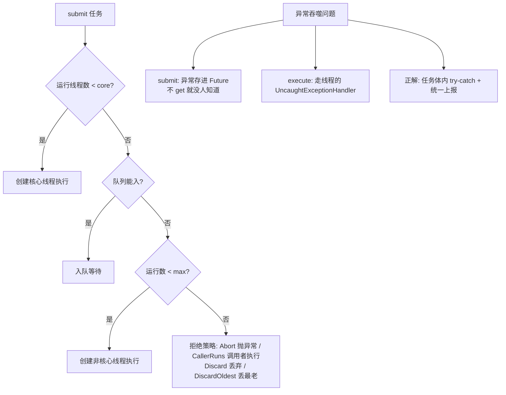

# 线程池与异步编程

> **一句话摘要**：线程池 = 「线程复用 + 数量管控 + 队列缓冲 + 拒绝策略」的四件套治理——**7 参数（core/max/keepAlive/队列/工厂/拒绝策略）每个都是治理旋钮**；参数没有万能值（CPU 密集 ≈ 核数、IO 密集按等待比放大），池要**按任务类型隔离**（快速池/慢池分家）；异步编程的现代形态是 **CompletableFuture（声明式编排）**，而虚拟线程（41 篇）正在改写「为什么要池」的答案。

> **本文核心**：机制链 = **提交任务 → 核心线程满？入队列 → 队列满？开到 max → max 满？拒绝策略 → 异常吞噬问题（submit 的 Future 静默吞 / execute 走 UncaughtExceptionHandler）→ 线程数公式是起点不是终点（压测定拐点）→ CompletableFuture 用回调链替代「等待」**——线程池的本质是「用有界资源承载无界请求」的治理结构。

前置阅读：[线程基础](./17_线程基础与生命周期-入门.md)、[线程协作与阻塞队列](./18_线程协作与阻塞队列-入门.md)。池化之外的轻量并发路线见[Java 21 与虚拟线程](./41_Java21与虚拟线程-入门.md)。

## 1. 背景：为什么裸线程必须被池取代

裸线程的三大罪：**创建销毁贵**（内核线程 + 1MB 栈）、**数量失控**（每个请求起一个线程，高峰即切换风暴/OOM）、**无人管理**（异常失踪、无监控、无排队）。线程池四件套逐一治：复用（免创建）、上限（core/max 管控）、缓冲（队列削峰）、出口（拒绝策略）。**线程池是「有界资源承载无界请求」的治理结构**——理解这一点，7 参数就不再是背诵题而是治理旋钮。

## 2. 核心机制：提交流程、参数与异常吞噬



- **提交流程的排序哲学**：优先复用核心线程 → 再排队（省线程）→ 再扩线程 → 最后拒绝——**先省资源后扩容**（与 K8s HPA 的「先排队再扩容」同构）；注意这个顺序意味着「队列无界时 max 参数永不生效」——`new LinkedBlockingQueue()`（无界）的池，max 形同虚设（Executors.newFixedThreadPool 的坑）。
- **7 参数逐个是治理旋钮**：corePoolSize（常驻兵力）、maximumPoolSize（极限兵力）、keepAliveTime（非核心闲兵遣散时间）、workQueue（缓冲区：有界是纪律）、threadFactory（**线程命名**——排障地图）、handler（拒绝策略：出口）。
- **异常吞噬是最隐蔽的坑**：`submit()` 返回 Future，任务异常被存进 Future——**不 get 就永远没人知道**（监控全绿业务全错）；`execute()` 的异常走线程的 UncaughtExceptionHandler（至少有处可挂日志）。**正解：任务体内自行 try-catch + 统一上报**——不依赖任何传递机制。
- **线程数公式是起点**：CPU 密集 ≈ 核数 + 1；IO 密集 ≈ 核数 ×（1 + 等待时间/计算时间）——公式给出**理论起点**，真实值由压测找拐点（吞吐最高/RT 可接受处的线程数）——因为「等待比」在真实负载里是动态的。

## 3. 落地实践：生产级线程池配置模板

```java
ThreadPoolExecutor pool = new ThreadPoolExecutor(
    8, 16, 60, TimeUnit.SECONDS,
    new ArrayBlockingQueue<>(1000),                    // 有界! 背压与拒绝的前提
    new ThreadFactoryBuilder().setNameFormat("order-pool-%d").build(),
    new ThreadPoolExecutor.CallerRunsPolicy());        // 满 时调用者执行(天然背压)

// 快慢任务分池隔离: 快池被慢任务拖死是事故之王
ThreadPoolExecutor fastPool = ...;   // 核心接口调用
ThreadPoolExecutor slowPool = ...;   // 报表/批处理

// 任务体内的异常处理(不依赖 submit/execute 机制)
executor.execute(() -> {
    try { doWork(); }
    catch (Throwable e) { monitor.report(e); }          // 统一上报
});
```

五条纪律：① **有界队列 + 显式拒绝策略**（无界队列 = OOM 预备役 + max 失效）；② **按任务类型分池**（快速/慢速/IO/CPU 分家，互不拖累）；③ **任务体自捕获异常上报**；④ **线程命名规范**；⑤ **池指标进监控**（活跃数/队列水位/拒绝计数——拒绝率突增先于业务故障）。

## 4. 生产视角：线程池事故的形态

- **Executors 快捷工厂的生产事故**：`newFixedThreadPool`（无界队列堆积 OOM）、`newCachedThreadPool`（无界线程切换风暴/OOM）——阿里巴巴 Java 开发手册明令禁用，必须手动 new ThreadPoolExecutor 显式声明全部参数。
- **慢任务拖死快池**：一个报表任务进了接口线程池——队列被报表任务填满，接口请求全部排队超时。分池隔离后故障半径收敛到慢池。
- **CallerRunsPolicy 的隐性背压反噬**：拒绝时调用者线程（Tomcat 工作线程）自己执行任务——上游线程池被占用，前端 RT 暴涨。它是「温和背压」也是「故障传导」——选它要清楚传导路径。
- **Future.get 忘记超时**：`future.get()` 无限等——下游故障则调用线程永久挂起（线程池被拖垮）。全家族超时化纪律（18 篇同源）。
- **动态调参的缺失**：流量形态变化后池参数过时——setCorePoolSize 等setter 支持运行期调整（配合配置中心动态生效），「参数写死」是运维债。

## 5. 主流系统怎么做：池化与异步的生态

| 场景 | 主流方案 | 机制要点 |
|---|---|---|
| Web 请求 | Tomcat 工作线程池 | 线程数与 RT/下游容量的联动 |
| 任务编排 | CompletableFuture | 回调链替代等待（本篇下半场） |
| 定时任务 | ScheduledThreadPoolExecutor | 延迟/周期调度 |
| 海量并发 | 虚拟线程（21+） | 池化的范式挑战者（41 篇） |
| 池化监控 | Micrometer + 动态调参 | 活跃/队列/拒绝三指标 + 配置中心热调 |

规律：**池的治理（隔离/有界/监控/动态化）比参数公式更重要**——公式给起点，治理保终局。

## 6. 典型场景

- **接口聚合**（响应级）：并行调用多下游 + CF 编排——RT 从串行求和降为最慢单链。
- **异步解耦**（吞吐级）：非核心动作（积分/通知）异步化——主链路 RT 与故障半径双降（与[异步削峰](../../../../../architecture/system-design/distributed-system-design/入门层/从零开始认识分布式系统设计系列/5_异步削峰-入门.md)的 MQ 方案互补：进程内 vs 跨服务）。
- **批处理**（吞吐级）：分片 + 多线程消费——有界队列 + 拒绝策略的完整治理。

## 7. 与相邻概念的区别

- **submit vs execute**：返回 Future（异常进 Future）vs 无返回（异常走 Handler）——「要不要结果」决定选哪个，但异常上报都要任务体自己做。
- **CompletableFuture vs Future**：Future 只能「阻塞等」；CF 能「回调链 + 组合编排 + 异常传播」——声明式异步 vs 阻塞式异步的分代。
- **线程池 vs 虚拟线程**：有界资源治理 vs 轻量到近似无限——虚拟线程不是「更好的线程池」，是「让池的『数量管控』理由失效」的新原语；但「信号量式限流下游」（保护下游容量）仍然需要（41 篇详述）。
- **本篇 vs 异步削峰（设计系列）**：线程池是「进程内异步」，MQ 是「跨服务异步」——下游是本地方法用池，是远程服务用 MQ；两者的选择边界是部署边界。

## 8. 常见误区与不适用

- **「线程数公式算出来就定死」**：等待比是动态的——公式是起点，压测拐点是终点，动态调参是长期主义。
- **「队列无界容量大=安全」**：无界队列把「拒绝问题」推迟成「OOM 问题」——有界 + 拒绝策略才是治理。
- **「submit 的异常不处理也行，反正丢不了」**：存进 Future 不等于被处理——不 get 就是黑洞；「任务异常上报」必须任务体自建。
- **「池只配线程数」**：队列水位/拒绝率/任务耗时分布才是池的健康三指标——只看线程活跃数是盲区。
- **不适用**：虚拟线程场景的「池化管控」（41 篇：VT 下用信号量限下游而非限线程）；纳级延迟（GC/调度抖动使 Java 不在主场）；单线程强顺序逻辑（并发化是负优化）。

## 9. 你们可能会问

- **CPU 密集为什么是核数+1？** +1 是「缺页/暂停时补位」的最小冗余；再多只有切换损耗——IO 密集的放大系数同理来自「等待时间可让出 CPU」。
- **CallerRunsPolicy 的正反两面？** 正：天然背压（提交者被拖慢即限流）；反：故障传导（Tomcat 线程被拖去干活，全站 RT 受累）——选它的前提是「上游能承受变慢」。
- **CompletableFuture 的线程池是哪个？** 默认 ForkJoinPool.commonPool（全 JVM 共享，用于非阻塞/短任务）——IO 任务要显式传自己的池（`supplyAsync(supplier, ioPool)`），否则 IO 慢任务拖垮公共池。
- **怎么给线程池做压测？** 逐级加压看「吞吐/RT/队列水位/拒绝率」四指标拐点；池参数一轮一变（控制变量）；对比「分池 vs 合池」两种形态。
- **优雅停机怎么停池？** `shutdown()`（停收新任务，处理完存量）→ `awaitTermination(timeout)` → `shutdownNow()`（中断兜底）——三段式，配合 17 篇的中断响应纪律。

## 10. 一句话总结 + 5W 速记卡 + 自测三问

**🎯 核心带走**：

- **核心一句话**：线程池 = 有界资源治理结构——7 参数是治理旋钮（有界队列是纪律核心）、按任务类型分池、任务体自捕获异常、指标进监控；异步编排用 CompletableFuture，池化范式正被虚拟线程改写。
- **链条复述**：裸线程三罪 → 四件套治理 → 提交流程（先省后扩）→ 异常吞噬三态 → 线程数公式起点+压测终点 → 分池隔离 → CF 编排 → 虚拟线程范式冲击。
- **失效点与边界**：无界队列与 Executors 禁用；CallerRuns 传导要知情；池治不了「下游容量不足」（限流/背压另配）。

**5W 速记卡**：

| 维度 | 内容 |
|---|---|
| What | 7 参数 + 提交流程 + 异常吞噬 + CF 编排 |
| Why | 有界资源承载无界请求是并发治理的本质 |
| When | 一切生产并发（这是唯一正解层） |
| Where | JVM 线程 + 工作队列 + 监控系统 |
| How | 分池 → 有界 → 命名 → 自捕获 → 监控 → 动态调参 |

💡 **实战提示**：禁用 Executors 快捷工厂；任务体 try-catch 上报；future.get 带超时；池三指标进监控；CF 的 IO 任务传自定义池。

**开放问题**：虚拟线程普及后「每个请求一个 VT + 信号量限下游」的新范式会让「调池参数」这门手艺变成历史吗——还是池化治理会以「信号量与背压治理」的形态换壳重生？

**决策（何时用）**：生产并发全部走显式 ThreadPoolExecutor/CF；按任务类型分池是架构纪律；推荐「Executors 禁用、任务体自捕获、三指标监控」进团队规范红线。

**Trade-off（代价与反方案）**：有界队列用「拒绝的可能」换「内存安全与背压」；CallerRuns 用「上游变慢」换「零丢弃」；分池用「资源碎片」换「故障隔离」；CF 回调链用「可读性下降（栈断链）」换「非阻塞编排」——池治理没有免费参数，每个旋钮都是一次定价。

**演进视角**：从裸线程（1.0）到 Executor 框架（5）到 CompletableFuture（8）到虚拟线程（21）——Java 并发的四代演进把「线程管理」的心智负担逐代下调；池化治理的功课（隔离/有界/监控）会迁移到新范式，而「有界资源治理」的工程思想永不过时。

---

**下篇预告**：进入 JVM 组——下一篇[运行时内存区域](./26_运行时内存区域-入门.md)讲堆/栈/方法区与各区域 OOM 的长相。

---

## 上下游地图

从系统架构的上下游看：**线程基础、协作(篇18)** 为本篇提供了地基——池化治理 的机制向上游承接、向下游 **虚拟线程(篇41)** 输出生产并发唯一解；架构上它是这条知识链上不可跳过的一环，跳读时建议先回上游补齐语境。

```mermaid
flowchart LR
    U0[线程基础]
    U1[协作(篇18)]
    --> ME[本篇: 池化治理]
    ME --> DN0[虚拟线程(篇41)]
```

---

## 📌 数据与事实声明

7 参数与提交流程为 ThreadPoolExecutor Javadoc/源码公开内容；「Executors 禁用」出自《阿里巴巴 Java 开发手册》公开版本；线程数公式为 Java 并发编程实战（Goetz）公开结论；CF 默认池为 ForkJoinPool.commonPool 官方文档；虚拟线程（JEP 444，JDK 21 正式）为官方记录。以官方文档为准。

## 📚 参考资料

| 类型 | 标题 | 来源 |
|---|---|---|
| 图书 | Java 并发编程实战（第 7-9 章：取消/池/GUI 外应用） | Addison-Wesley |
| 文档 | ThreadPoolExecutor / CompletableFuture Javadoc | docs.oracle.com |
| 手册 | 阿里巴巴 Java 开发手册（并发处理章节） | 公开版本 |
| 系列文章 | Java 21 与虚拟线程（41 篇） | 本仓库同系列 |
