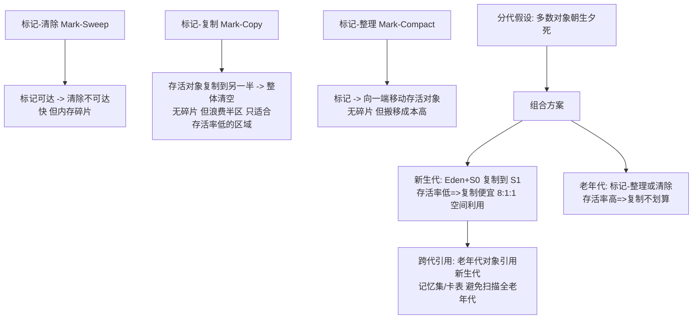

# 垃圾回收算法

> **一句话摘要**：GC 的全部算法只有三种基本款——**标记-清除（快但有碎片）、复制（无碎片但浪费一半空间、只适合存活率低的新生代）、标记-整理（无碎片但要搬移，适合老年代）**——分代假设（多数对象朝生夕死）把三种算法组合成分代回收；本篇讲清三种算法的取舍与「为什么新生代用复制、老年代用整理」的组合逻辑。

> **本文核心**：机制链 = **死亡判定（可达性分析，27 篇）→ 三算法分野（清除留碎片/复制换空间/整理付搬移）→ 分代假设（对象生死分布的统计规律）→ 组合方案：新生代 Eden+S0→S1 复制、老年代标记-整理或清除 → 跨代引用的记忆集（卡表）**——GC 算法的选择本质是「碎片、空间、停顿」三角的定价。

前置阅读：[对象的一生](./27_对象的一生-入门.md)（死亡判定）。算法之上的收集器实现见[GC 收集器全景](./29_GC收集器全景-入门.md)。

## 1. 背景：GC 的核心矛盾

回收垃圾有三个天然冲突：**清除后有空隙**（碎片——大对象放不下）、**整理要搬移**（搬移要暂停或并发协调）、**复制要双倍空间**（Half-Space 轮换）。没有任何算法同时做到「无碎片 + 全空间利用 + 零停顿」——**GC 的演进史就是在这三角里不断重新定价的历史**（29 篇收集器全景）。分代假设是组合的理论地基：「绝大多数对象朝生夕死」——对不同生死分布的区域用不同算法，整体最优。

## 2. 核心机制：三算法与分代组合



- **复制算法的账**：新生代 98% 对象朝生夕死（统计规律）——把存活对象（少数）复制走、整体清空 Eden+S0，比「逐个清除」便宜；空间浪费用「Eden:S0:S1 = 8:1:1」压缩到 10%（两个 Survivor 轮换只占一成）。**「存活率低」是复制算法成立的唯一前提**——存活率高的老年代用它就是灾难（复制代价 × 存活量）。
- **标记-整理的账**：老年代存活率高，复制不划算——标记后把存活对象向一端移动、清理边界外碎片；代价是搬移（引用更新 + 可能的暂停）。G1/ZGC 的「整理」是并发化的（读屏障/着色指针技术让搬移与业务并发——29 篇）。
- **跨代引用与记忆集（卡表）**：Minor GC 只扫新生代的前提是「老年代不会引用新生代对象」——但会。解法：记忆集（Remembered Set）记录「哪些老年代卡片指向新生代」——Minor GC 只扫脏卡片对应的老年代区块，不扫全老年代。**卡表（Card Table，每 512 字节一张卡，写后标记脏）是「用写屏障的成本换扫描范围」的经典结构**。
- **写屏障（Write Barrier）**：引用赋值时插入的 JVM 小钩子（记录跨代引用/维护三色标记不变量）——G1/ZGC 的并发标记都依赖它；它也是「GC 算法与业务线程共享运行时」的机制接口。

## 3. 落地实践：从算法理解参数

```text
新生代相关:
  -Xmn / -XX:NewRatio     新生代大小(复制算法的舞台)
  -XX:SurvivorRatio=8     Eden:S0:S1 = 8:1:1
  动态年龄判定             Survivor 同龄对象超半数 -> 提前晋升(不必等到15岁)
老年代相关:
  -XX:MaxTenuringThreshold=15  晋升年龄上限(默认15 与对象头4位对应)
  大对象直接入老年代            -XX:PretenureSizeThreshold(避免复制拷贝)
触发相关:
  -XX:+HeapDumpOnOutOfMemoryError   终局证据
```

参数理解的两条纪律：① **每个参数都挂在某个机制上**（SurvivorRatio 挂复制算法、TenuringThreshold 挂分代晋升）——不懂机制调参数是掷骰子；② **动态年龄判定修正教科书**——「年龄到 15 才晋升」不完整（同龄聚集提前晋升是主流行为），调参依据 GC 日志的实际情况。

## 4. 生产视角：算法与故障的对应

- **碎片导致的大对象分配失败**：标记-清除的老年代碎片化——「总空间够、连续空间不够」的大对象分配 OOM（或触发 Full GC 整理）。CMS 时代的经典死法（29 篇）。
- **Survivor 太小的提前晋升**：Survivor 装不下 Minor GC 存活对象 → 直接进老年代——「短命对象污染老年代」，老年代增长异常快。特征：Minor GC 后 Survivor 占用贴顶。
- **Full GC 由跨代引用引发的误判**：卡表污染（写屏障的误标）导致 Minor GC 扫描面扩大——Minor GC 耗时异常高的一个暗因。
- **大对象直入老年代的策略误用**：小内存机器设了很小的 PretenureSizeThreshold——中等对象全部直进老年代，加速老年代填满。

## 5. 主流系统怎么做：算法的收集器落地

| 收集器 | 算法组合 | 代际定位 |
|---|---|---|
| Serial/ParNew | 新生代复制 + 老年代标记整理/清除 | 分代经典 |
| Parallel Scavenge/Old | 同上，吞吐优先（JDK 8 默认） | 吞吐代 |
| CMS | 老年代标记-清除（并发） | 碎片时代牺牲品（14 废弃） |
| G1 | Region 化：复制为主 + 整理（JDK 9 默认） | 可预测停顿 |
| ZGC/Shenandoah | 着色指针/转发指针的并发整理 | 亚毫秒停顿（无分代或分代可选） |

规律：**收集器 = 算法 + 并发技术的组合产品**——CMS 死于碎片（清除无法整理）、G1 活于 Region 化（把「整理」变成 Region 级复制）、ZGC 用着色指针把搬移做成并发——算法三角的每次定价革命都诞生一代收集器。

## 6. 典型场景

- **低延迟服务**（延迟级）：ZGC/G1 的并发整理——停顿换复杂度（29 篇选型）。
- **大堆批处理**（吞吐级）：Parallel 收集器——停顿无所谓、吞吐最大化。
- **内存泄漏排查**（治理级）：理解「晋升与年龄」才能读懂 GC 日志里各代水位的变化语义。

## 7. 与相邻概念的区别

- **GC 算法 vs GC 收集器**：算法是思想（三种基本款+组合），收集器是产品（含并发协调/参数/行为）——思想稳定（三十年三种）、产品轮替（每代一个）。
- **Minor GC / Major GC / Full GC**：新生代回收 / （语义混乱的老说法：老年代）/ 全堆回收——术语混乱的源头是 CMS 时代的遗存；讨论时对齐「回收哪些区域」比名词更可靠。
- **STW vs 并发**：算法本身不决定停顿长短（复制也能并发——ZGC）——「停顿」是并发技术的问题不是算法本质的问题；这是教科书与现实的常见错位。
- **本篇 vs 对象的一生（27 篇）**：27 篇讲到「不可达」，本篇讲「不可达之后的回收」——生死分界的后半程。

## 8. 常见误区与不适用

- **「复制算法浪费一半内存」**：只对「无分代的纯复制」成立——分代设计用 8:1:1 把浪费压到 10%；「半区浪费」的批判对象是 Appelel 式原始复制。
- **「标记-清除最简单所以最好入门」**：碎片化是生产事故级问题——「入门算法」恰是最少直接使用的（都带整理或并发化）。
- **「分代假设对新应用永远成立」**：长命对象多的大缓存/流式应用（对象跨代存活率高）——G1/ZGC 提供非分代模式（ZGC 分代可选）——假设失配的应用要重新评估分代收益。
- **「Minor GC 一定比 Full GC 快」**：多数时候是；但跨代引用扫描面失控/存活对象过多时 Minor 也能很慢——「大小」不看名字看日志。
- **不适用**：算法的并发实现细节（29 篇收集器）；对象分配机制（27 篇）；真实调参决策（29+32 篇组合）。

## 9. 你们可能会问

- **为什么 Survivor 要两个？** 复制算法需要「来源」与「去向」两个半区——Eden+S0 复制到 S1，下轮 Eden+S1 复制到 S0 轮换；一个 Survivor 无法实现「清空来源区」。
- **晋升年龄为什么默认 15？** 对象头 Mark Word 里 GC 年龄只有 4 位（最大 15）——「15」是位宽决定不是玄学（与 ID 篇的位分账、读写锁的位分账同源）。
- **写屏障的性能代价多大？** 每次引用赋值多几个指令（记录卡片/维护标记）——微小但全量；ZGC 的着色指针把部分屏障移进指针读取（Load Barrier）——「屏障搬家」是并发 GC 的技术演进线。
- **动态年龄判定是什么？** Survivor 中「同龄对象总和 > Survivor 一半」→ 该年龄及以上的直接晋升——分代理论的工程修正；调 Survivor 参数前必须知道它（否则「等到 15 岁」的想象与现实不符）。
- **怎么从 GC 日志看出算法在起作用？** 新生代回收前后 Eden 归零（复制清空）、老年代渐进（整理）、无碎片分配失败（清除的病）——日志的形态即算法的行为指纹。

## 10. 一句话总结 + 5W 速记卡 + 自测三问

**🎯 核心带走**：

- **核心一句话**：GC 三算法各付一价（清除付碎片/复制付空间/整理付搬移）——分代假设用「生死分布」组合它们：新生代复制（8:1:1）、老年代整理或清除，卡表解决跨代引用。
- **链条复述**：可达性判定 → 三算法取舍 → 分代假设 → 组合方案 → 跨代记忆集/卡表 → 写屏障作为机制接口 → 收集器是算法的产品化。
- **失效点与边界**：存活率高时复制失效；分代假设可失配（非分代模式）；「停顿」是并发技术问题非算法本质。

**5W 速记卡**：

| 维度 | 内容 |
|---|---|
| What | 三基本算法 + 分代组合 + 记忆集/卡表 + 写屏障 |
| Why | 碎片/空间/停顿三角无全解，分代假设提供组合最优 |
| When | GC 日志解读、JVM 参数配置、收集器选型评估 |
| Where | 堆（Eden/Survivor/老年代） |
| How | 机制先于参数 → 日志验证算法行为 → 假设失配重新评估 |

💡 **实战提示**：参数挂在机制上才调得准；动态年龄判定修正教科书；大对象策略谨慎；卡表污染排查 Minor 变慢。

**开放问题**：ZGC 分代模式（JDK 21）让「分代」与「并发整理」合流——分代假设的「统计规律」与「全并发」的最终融合形态，会不会终结「算法选型」这个话题本身？

**决策（何时用）**：读懂 GC 日志与参数必用本篇机制；收集器选型（29 篇）是本篇的产品化延伸；推荐「机制-参数对照表」进 JVM 调优手册。

**Trade-off（代价与反方案）**：复制用「空间」换「无碎片+快」；整理用「搬移停顿」换「空间完整」；清除用「碎片」换「免搬移」；分代用「统计假设失配的风险」换「整体效率」——GC 三角（碎片/空间/停顿）的定价从 1960 年 Lisp 的第一个 GC 开始，到 ZGC 仍在持续。

**演进视角**：三算法（1960 年代 Lisp 时代全部发明）六十年不变，变的是「并发化技术」（卡表→写屏障→着色指针→读屏障）——算法层冻结、技术层狂奔，这个「思想冻结、实现狂奔」的模式与虚拟机/集合/并发各域完全一致：**机制即资产，实现即迭代**。

---

**下篇预告**：算法的产品化——下一篇[GC 收集器全景](./29_GC收集器全景-入门.md)讲 Serial→CMS→G1→ZGC 的演进线与选型决策。

---

## 上下游地图

从系统架构的上下游看：**对象的一生** 为本篇提供了地基——三算法 的机制向上游承接、向下游 **收集器(篇29)** 输出分代组合；架构上它是这条知识链上不可跳过的一环，跳读时建议先回上游补齐语境。

```mermaid
flowchart LR
    U0[对象的一生]
    --> ME[本篇: 三算法]
    ME --> DN0[收集器(篇29)]
```

---

## 📌 数据与事实声明

三算法与分代组合为 JVM 规范与《深入理解JVM》第 3 章公开内容；卡表/写屏障/动态年龄判定为 HotSpot 源码公开机制；JDK 8/9 默认收集器变化、CMS 废弃（JEP 291）、ZGC 分代（JEP 439）为 JEP 官方记录；泊松分布式的对象生死统计为 GC 领域公开共识。以官方文档为准。

## 📚 参考资料

| 类型 | 标题 | 来源 |
|---|---|---|
| 图书 | 深入理解 Java 虚拟机 第 3 版（第 3 章 GC 与内存分配） | 机械工业出版社 |
| JEP | 291（废弃 CMS）/ 439（分代 ZGC） | openjdk.org/jeps |
| 文档 | HotSpot GC 调优官方指南 | docs.oracle.com |
| 系列文章 | GC 收集器全景（下一篇） | 本仓库同系列 |
