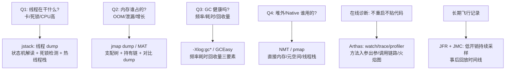
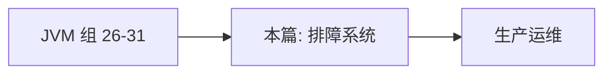

# JVM 调优与排查工具

> **一句话摘要**：JVM 排障的工具链是「**症状 → 数据 → 归因**」的分诊系统——**jps/jinfo 看身份、jstat 看趋势（GC 频率与代际水位）、jmap/jcmd 拿现场（堆 dump/NMT）、jstack 看线程（死锁/阻塞）、Arthas 在线诊断（不改代码热插拔）、JFR/JMC 长期飞行记录**；调优的纪律是「先测量定位瓶颈，再最小变量调参，最后压测验证」——调参不是玄学是工程。

> **本文核心**：机制链 = **排障四问（死了吗？卡在哪？谁占内存？谁在泄漏？）→ 每问一工具（状态机/jstack/堆 dump/NMT-MAT）→ GC 日志是第一证据源（频率/耗时/回收量三要素）→ 调优闭环：目标 → 测量 → 单变量调整 → 验证 → 固化**——「JVM 调优 = 用数据定位瓶颈后的参数表达」，跳过测量直接调参等于蒙。

前置阅读：[运行时内存区域](./26_运行时内存区域-入门.md)、[GC 收集器全景](./29_GC收集器全景-入门.md)（本篇是 26-31 篇机制的工具化落地）。

## 1. 背景：排障为什么先讲工具不讲参数

JVM 事故的形态千变万化（OOM/卡顿/CPU 飙高/泄漏/线程死锁），但**证据链只有几条**：堆 dump（内存现场）、线程 dump（执行现场）、GC 日志（回收行为）、JFR（时间线）。参数只是「修复动作的表达」——**先有证据链定位根因，参数才有意义**。本篇把 26-31 篇的机制与工具对位，形成「症状-工具-归因」的完整排障系统。

## 2. 核心机制：排障四问与工具对位



- **CPU 飙高的标准动作**：`top -Hp <pid>` 找高 CPU 线程 → `printf '%x' <tid>` 转 16 进制 → jstack 按线程号定位栈——**三步定位法**；若是 GC 线程在高跑（jstack 可见 GC 线程忙）→ 转向 GC 归因（频繁 GC 的根因在分配速率或泄漏）。
- **GC 日志三要素**：**频率**（多长时间一次——突变即异常信号）、**单次耗时**（尤其 Full：超过 RT 预算即事故）、**回收量**（回收后水位——基线持续抬升 = 泄漏特征）。`-Xlog:gc*:file=gc.log:time,uptime,level,tags`（JDK 9+ 统一日志）。
- **堆 dump 的分析入口**：MAT（Eclipse Memory Analyzer）的三个视图——**支配树**（谁占的内存最大——retained heap 排序）、**Leak Suspects**（自动泄漏嫌疑报告）、**Histogram/对比**（对象数量直方图、两次 dump 对比增长对象）。
- **Arthas 的在线诊断**：`watch`（方法入参出参/调用耗时）、`trace`（调用链路逐层耗时）、`dashboard`（线程/内存总览）、`profiler`（异步火焰图——CPU/内存分配的热点采样）、`jad/sc`（反编译/查类加载——类冲突排查，30 篇）。**不改代码不重启拿现场**，是生产排障的瑞士军刀。

## 3. 落地实践：GC 调优的闭环五步

```text
1 定目标: 停顿预算(如 P99 < 100ms) 或吞吐目标(GC 时间占比 < 5%)
2 测量基线: 开 GC 日志跑真实流量 -> GCEasy/GCViewer 出报告
3 归因定位: 
   频繁 Minor? -> 分配速率过高/新生代太小
   频繁 Full?  -> 泄漏(基线抬升)/大对象/元空间/跨代引用
   单次过长?   -> 收集器不匹配/堆过大/Humongous
4 单变量调整: 一次只动一个参数 -> 观察同指标
5 验证固化: 同压测模型对比 -> 达标则固化进配置管理
```

三条纪律：① **一次一变量**（多参数同调无法归因）；② **基线-对比**（调整前后同压测模型对齐）；③ **调参日志化**（每次调整记录「原因-参数-效果」——调参历史是团队资产）。

## 4. 生产视角：经典排障案例的形态

- **「CPU 100% 但业务不慢」**：JIT 编译线程在跑（31 篇）或 GC 线程忙（归因转向 GC 日志）——「CPU 高」本身不是业务故障信号，先分清是哪个线程在烧。
- **「内存缓慢增长三周后 OOM」**：慢性泄漏——两次 dump 对比（间隔一天）看增长对象集合 → MAT 支配树找持有链（ThreadLocal/static Map/监听器未注销三大嫌疑，24 篇）。
- **「偶发超时无规律」**：偶发 Full GC/去优化/换页——JFR 长期录制（低开销持续采样）抓时间线，对齐超时点看同期 GC/编译/系统事件。
- **「重启就好了的问题反复出现」**：状态泄漏（ThreadLocal/静态集合）——重启即清零的「内存型故障」，dump 抓在重启前一刻。

## 5. 主流系统怎么做：工具链的生态位

| 层 | 工具 | 定位 |
|---|---|---|
| 命令行 | jps/jstat/jmap/jstack/jcmd | JDK 自带的轻量现场工具 |
| 在线诊断 | Arthas | 不重启的动态诊断（生产神器） |
| 飞行记录 | JFR + JMC | 低开销持续采样 + 时间线回放 |
| 内存分析 | MAT / JProfiler | dump 的离线深度分析 |
| 日志分析 | GCEasy/GCViewer | GC 日志的可视化报告 |
| 全链路 | APM（SkyWalking 类） | 方法级耗时 + 拓扑（与 JVM 工具互补） |

规律：**「现场工具 + 飞行记录 + 离线分析」三层齐备**——只会在出事后抓现场（无 JFR 长期记录）的团队，偶发问题永远无法归因。

## 6. 典型场景

- **大促前的 JVM 体检**（备战级）：GC 日志周报 + 堆 dump 基线 + 池配置核对——容量评审的 JVM 章节。
- **新版本发布回归**（迁移级）：JDK/框架升级后的 GC 行为对比（第 2 篇联动）——同压测模型两份 GC 报告。
- **偶发超时攻坚**（疑难级）：JFR 持续录制一周 + 超时请求时间线对齐——偶发问题的唯一归因路径。

## 7. 与相邻概念的区别

- **调参 vs 排障**：排障是「找根因」（工具链为主）；调参是「根因后的参数表达」——顺序不可颠倒（26 篇「盲目调大 -Xmx 是掩盖」的呼应）。
- **jstack 的 dump vs Arthas 的动态**：一次性现场快照 vs 持续在线观测——「事故瞬间」与「运行全程」互补。
- **GC 日志 vs APM**：JVM 内部回收行为 vs 应用级调用链耗时——GC 归因与业务归因两个视角（29 篇「换收集器用 GC 日志」、APM 管「链路哪段慢」）。
- **本篇 vs JVM 篇（26-31）**：机制篇是「为什么」，本篇是「怎么办」——全组机制的实操出口。

## 8. 常见误区与不适用

- **「调优 = 背参数模板」**：参数模板是「先验假设」——真实调优必须「测量定位 → 最小变量 → 验证」；模板化的调参是伪工程。
- **「jstack 一次就下结论」**：线程 dump 是瞬时快照——阻塞/竞争要多次采样（间隔 5s 连抓 3-5 次）看模式，单次快照会误判。
- **「dump 生产堆无所谓」**：dump 会长时间 STW（大堆秒到分钟级）——生产堆 dump 要择时（或用 live 参数只 dump 存活对象，仍需评估）；JFR 是更安全的常态手段。
- **「Arthas 随便在生产 watch」**：watch/trace 有开销（字节码增强）——高频方法慎用、用完停掉（命令有存活时间意识）。
- **不适用**：无监控数据的事后复盘（无证据链只能猜测——教训是「可观测性先行」）；应用层 bug 的逻辑错误（JVM 工具管运行时，不管业务逻辑对错）。

## 9. 你们可能会问

- **jstack 抓不到的瞬间怎么办？** 加 `-XX:+HeapDumpBeforeFullGC`/提前开 JFR——「事后抓不到」的解法是「事前常开录制」；可观测性投入永远优于事后技巧。
- **MAT 里 shallow heap 和 retained heap 怎么用？** shallow 是对象自身大小，retained 是「它死后能释放的总大小」——**找泄漏按 retained 排序**（支配树），shallow 大只说明单个大。
- **GC 日志用哪个分析工具？** GCEasy（网页便捷）/GCViewer（离线深入）——工具只做可视化，三要素（频率/耗时/回收量）的解读能力在自己。
- **Arthas 的 trace 和 watch 怎么选？** watch 看单方法的入参出参（数据视角）；trace 看调用链路逐层耗时（链路视角）——「参数错了」用 watch，「哪步慢」用 trace。
- **调优报告的标准结构？** 五段：目标与现状基线 → 归因分析（数据）→ 变更内容（单变量）→ 验证结果（对比数据）→ 回滚预案——工程闭环的文档化。

## 10. 一句话总结 + 5W 速记卡 + 自测三问

**🎯 核心带走**：

- **核心一句话**：JVM 排障 = 「症状 → 工具 → 归因」的分诊系统——jstack 线程、dump 内存、GC 日志行为、NMT 堆外、Arthas 在线、JFR 长期；调优 = 测量定位后的最小变量参数表达。
- **链条复述**：排障四问 → 工具对位 → GC 三要素 → 调优闭环五步 → CPU 三步定位法 → dump/Arthas/JFR 的分层使用。
- **失效点与边界**：无证据链的事后复盘不可归因；dump 有 STW 代价；Arthas 有开销；工具不替代业务逻辑审查。

**5W 速记卡**：

| 维度 | 内容 |
|---|---|
| What | 排障四问工具对位 + GC 三要素 + 调优五步闭环 |
| Why | 先测量定位后调参——跳过测量的调参是蒙 |
| When | OOM/卡顿/CPU 高/泄漏/升级回归/大促备战 |
| Where | 生产与压测环境的 JVM 进程 |
| How | 四问分诊 → 证据链 → 单变量调参 → 验证固化 |

💡 **实战提示**：HeapDump/GC 日志常开；jstack 连抓多次；Arthas 用完即停；调参记录归档；JFR 常态录制。

**开放问题**：JFR 类「持续低开销飞行记录」如果成为所有生产 JVM 的默认开启项——「故障复现」这个排障环节会永久消失吗（一切问题都有时间线回放）？

**决策（何时用）**：一切 JVM 故障与调优的必经流程；推荐「排障四问工具对位图」进团队排障手册首页；推荐「调参日志化」作为团队 JVM 治理资产。

**Trade-off（代价与反方案）**：JFR 常开用「存储与微量 CPU」换「全时间线可回放」；dump 用「STW 停顿」换「内存现场」；Arthas 用「增强开销」换「在线可观测」；调参的单变量纪律用「迭代次数」换「归因清晰」——可观测性的每一分投入都在为未来的排障效率付费。

**演进视角**：从「命令行三件套」到 Arthas 到 JFR 默认化（JDK 11 起 openJDK 自带）——JVM 可观测性正从「专家技能」走向「基础设施默认能力」；本篇的机制-工具对位法因此比任何单个工具的用法更长寿——工具会换，「症状-数据-归因」的排障学不变。

---

**下篇预告**：进入 IO 与网络组——下一篇[IO 体系与序列化](./33_IO体系与序列化-入门.md)讲 BIO 装饰器体系与序列化的取舍。

---

## 上下游地图

从系统架构的上下游看：**JVM 组 26-31** 为本篇提供了地基——排障系统 的机制向上游承接、向下游 **生产运维** 输出机制落地；架构上它是这条知识链上不可跳过的一环，跳读时建议先回上游补齐语境。



---


## 质疑者追问链

**质疑：JVM 调优与排查 为什么设计成这样，不那样设计？**
JVM 调优与排查 的设计是在「易用性、安全性、性能」三者之间做取舍——没有完美的选择，只有场景匹配的选择。理解取舍比记住结论更有价值。

**追问一层：如果换个场景，这个设计还成立吗？**
不完全成立——调优参数 从十万级涨到千万级时，很多默认假设失效；理解设计边界，才能判断「什么时候需要换方案」。

**再深一层：底层原理和上层 API 之间是什么关系？**
上层 API 是底层机制的抽象封装——机制不变，API 可以演进；反过来，机制变了 API 必须跟着变。这就是为什么「理解机制」比「记住 API」更保值。

## 量级分档视角

| 量级 | JVM 调优与排查的形态变化 | 关注点 |
|---|---|---|
| 10 万级 | 入门阶段，调优参数默认配置即可 | 语法正确性 |
| 千万级 | 需要关注 排查工具链 的取舍 | 性能瓶颈与参数调优 |
| 亿级 | 调优参数 成为架构决策的核心变量 | 架构选型与底层机制 |

量级每上一档，对 调优参数 的容忍度就降一级——**同样的代码在十万级没问题，在亿级就是事故预备役**。

## 📌 数据与事实声明

命令行工具（jps/jstat/jmap/jstack/jcmd）与 JFR/JMC 为 JDK 官方文档；Arthas 命令集为 alibaba/arthas 官方文档；MAT 视图与「三步定位法」为公开排障实践；「Executors 禁用」等规范出自《阿里巴巴 Java 开发手册》公开版本。以官方文档为准。

## 📚 参考资料

| 类型 | 标题 | 来源 |
|---|---|---|
| 工具 | Arthas 官方文档 / Eclipse MAT | arthas.aliyun.com · eclipse.org/mat |
| 文档 | JDK Troubleshooting Guide（各版本） | docs.oracle.com |
| 图书 | 深入理解 Java 虚拟机 第 3 版（第 4-5 章工具与调优案例） | 机械工业出版社 |
| 系列文章 | IO 体系与序列化（下一篇） | 本仓库同系列 |
