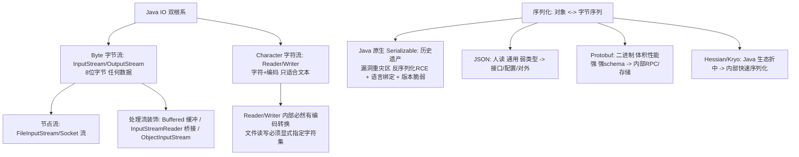

# IO 体系与序列化

> **一句话摘要**：Java 传统 IO 是一座「装饰器搭建的塔」——**字节流（InputStream/OutputStream）与字符流（Reader/Writer）两大根系，节点流（对接数据源）+ 处理流（缓冲/转换/对象流）层层装饰**；序列化是「对象 ↔ 字节序列」的转换协议——Java 原生序列化（Serializable）因安全与体积问题已被行业抛弃，主流是 JSON/Hessian/Protobuf 的三域分工。

> **本文核心**：机制链 = **字节流为基（万物皆字节）→ 字符流 = 字节流 + 编解码（Reader/Writer 处理字符集）→ 装饰器叠加（Buffered 缓冲/Data 数据类型/Object 对象流）→ 序列化的三问（跨进程要什么格式/体积与性能/兼容性演进）→ Java 原生序列化的废弃理由（漏洞重灾区 + 语言绑定 + 版本脆弱）→ JSON（人读与通用）/Protobuf（体积与性能）/Hessian（Java 生态折中）**——IO 选型 = 数据形态（字节/字符/对象）× 性能与互操作要求。

前置阅读：[对象与类](./3_对象与类-入门.md)。NIO 的演进（Buffer/Channel/多路复用）见下一篇[NIO 与 IO 多路复用](./34_NIO与IO多路复用-入门.md)。

## 1. 背景：为什么 IO 体系长成「装饰器塔」

IO 的需求维度天然正交：数据源（文件/网络/内存/管道）× 处理（缓冲/编码/对象化/压缩）——如果每个组合一个类，类爆炸（4×4=16 个起步）。Java IO 的解法是**装饰器模式**：节点流对接数据源（FileInputStream），处理流包装增强（`new BufferedReader(new InputStreamReader(new FileInputStream(f), UTF_8))`）——**功能按需叠加，类数量线性**。代价是「创建代码冗长」与「新人看不懂套娃」——理解装饰器意图后，套娃即架构。

## 2. 核心机制：两大根系与序列化的三问



- **字节流 vs 字符流的分界**：字节流是物理层（任何数据——图片/视频/加密块）；字符流是逻辑层（文本 + 字符集解码）——**文本必走 Reader/Writer 且显式字符集**（`new InputStreamReader(in, StandardCharsets.UTF_8)`）——不指定字符集（用平台默认）是历史 bug 重灾区（Windows GBK 与 Linux UTF-8 的经典互坑）。
- **缓冲为什么是第一装饰**：无缓冲的逐字节读 = 每字节一次系统调用（几百倍性能差）——BufferedInputStream 的 8KB 缓冲把系统调用摊薄——**缓冲装饰是 IO 的默认起步配置**（除非明确要无缓冲语义，如实时交互）。
- **Java 原生序列化为何被废弃**：三宗罪——① **安全**：反序列化漏洞（RCE 反序列化攻击，ObjectInputStream 自动调用 readObject 的魔法）是 Java 安全漏洞的最大类之一；② **语言绑定**：只服务 Java（跨语言不可用）；③ **版本脆弱**：serialVersionUID 与字段演进管理复杂。行业共识：**对外与存储不用 Java 原生序列化**；它仅存活于极老的内部系统。
- **序列化三域分工**：**JSON**——人类可读、跨语言通用、弱类型灵活（接口/配置/对前端）——代价是体积与解析性能；**Protobuf**——schema 强类型、二进制紧凑（体积小数倍、解析快数倍）、跨语言代码生成——代价是需要 schema 管理与不可读（内部 RPC/存储的主流）；**Hessian/Kryo**——Java 生态内的性能折中（比原生安全好用，跨语言弱于 Protobuf）。
- **readObject 魔法与安全防线**：类可自定义 `readObject(ObjectInputStream)` 方法（反序列化时自动调用）——攻击者构造 gadget 链触发危险逻辑（经典 Commons-Collections 链）；防线：避免反序列化不可信数据、用白名单过滤（ObjectInputFilter，JDK 9+ 内建）、干脆换 JSON/Protobuf（无执行语义）。

## 3. 落地实践：IO 与序列化的工程纪律

1. **字符集显式化**：所有文本 IO 与字符串字节转换写明 `StandardCharsets.UTF_8`——消灭平台默认值依赖。
2. **try-with-resources 全覆盖**：IO 资源关闭零遗漏（异常篇的纪律在 IO 的主场）。
3. **大文件流式处理**：边读边写（`in.transferTo(out)`）不整文件读入内存——「按行/按块流过」替代「全量 String 化」。
4. **序列化选型对表**：对外接口/前端 → JSON；内部 RPC/落盘 → Protobuf（或团队既定 RPC 序列化）；Java 内部临时缓存 → Kryo 类可接受。
5. **序列化兼容性演进**：加字段（兼容）/删字段（先停用两版）/改类型（新字段过渡）——协议演进的 expand-contract 思想（与数据库 DDL 同源）。

## 4. 生产视角：IO 事故的形态

- **未关流的资源泄漏**：异常路径漏 close——文件句柄耗尽（too many open files），服务整体 IO 失能。try-with-resources 归零此类事故。
- **未指定字符集的乱码**：Windows 开发正常、Linux 上线乱码——平台默认字符集差异。全链路显式 UTF-8 归零。
- **原生序列化的反序列化攻击**：对外暴露的 ObjectInputStream 接口被构造 gadget 链攻击（RCE）——安全扫描的高危项。整改：换 JSON/加 ObjectInputFilter 白名单。
- **JSON 序列化的精度丢失**：Long ID 被前端 JS 精度截断（ID 篇的坑在序列化层的重现）——Long 序列化为字符串的行业惯例。
- **BIO 线程模型的连接瓶颈**：每个连接一个线程的传统 IO——连接数上万时线程爆炸（NIO 多路复用是解药，下一篇）。

## 5. 主流系统怎么做：IO 与序列化的生态位

| 场景 | 主流选择 | 机制要点 |
|---|---|---|
| 对外 API | JSON（Jackson） | 通用性 + 人读 + 生态 |
| 内部 RPC | Protobuf / Hessian | 体积性能 + schema 演进 |
| 文件处理 | NIO.2 Files API + 缓冲装饰 | 现代路径 API 替代 File 类 |
| 高性能网络 | Netty（NIO 封装） | ByteBuf 零拷贝 + 多路复用（34 篇） |
| 消息载荷 | JSON/Protobuf 按生态 | 与 RPC 序列化一致性 |

规律：**「JSON 对外、二进制对内」是序列化的行业默认分界**——统一性（全链路一种格式）与最优性（按场景选格式）之间的权衡，一致性优先。

## 6. 典型场景

- **文件导入导出**（业务级）：缓冲装饰 + 流式行处理 + 字符集显式——CSV/Excel 处理三件套。
- **RPC 框架序列化**（通信级）：协议头 + body 序列化（Hessian/Protobuf）——序列化选型即 RPC 性能的一半。
- **对象深拷贝**（工具级）：序列化/反序列化实现深拷贝（性能差但简单）——或用不可变设计免深拷贝。

## 7. 与相邻概念的区别

- **序列化 vs JSON 序列化**：Java 原生序列化是「语言内建的缺陷协议」；JSON 序列化是「跨语言的标准交换」——同名词两世界，日常说的「序列化」默认指后者（或 Protobuf）。
- **BIO vs NIO**：阻塞流（一线程一连接）vs 多路复用（一线程管多连接）——连接规模的分水岭（34 篇专讲）。
- **序列化兼容 vs 版本化（REST 篇）**：思想同源（expand-contract、宽容读者）——字段演进的纪律在存储协议与 API 协议上重演。
- **本篇 vs 网络篇（35 篇）**：本篇的 Socket 流是 BIO 通信基座；35 篇讲网络编程与 HttpClient 的语义。

## 8. 常见误区与不适用

- **「Serializable 实现很简单加个标记就行」**：简单的是标记，复杂的是版本演进与安全——「能序列化」与「该序列化」的距离要用行业教训丈量。
- **「字符流比字节流高级所以都用字符流」**：字符流只服务文本（有编解码开销）——二进制数据（图片/加密块）走字节流；「层级」不是「优劣」。
- **「JSON 性能不够就换 Java 原生序列化」**：方向错了——性能不够换 Protobuf/Kryo，原生序列化的安全与兼容问题是「负资产」不是备选。
- **「缓冲流必然更快」**：对「小块高频读写」是几十倍提升；对「已是大块读写」无增益——缓冲的本质是摊薄系统调用，没有高频小 IO 就无收益。
- **不适用**：零拷贝需求（sendfile/ mmap 归 NIO2 与 OS 层）；流式计算框架（Flink 自有体系）；海量小文件（对象存储）。

## 9. 你们可能会问

- **serialVersionUID 不写会怎样？** 自动按类结构生成——类一改（加字段）UID 就变，旧数据反序列化直接 InvalidClassException；显式固定 UID + 字段演进纪律才是可控做法。
- **transient 与 Externalizable？** transient 字段不参与默认序列化；Externalizable 完全自定义序列化（性能可控但责任全在己）——默认 Serializable + transient 是主流。
- **Jackson 与 Gson 怎么选？** 生态与功能 Jackson 更强（Spring 默认）、Gson 更轻；团队统一优先（混用的注解漂移是维护债）。
- **Protobuf 的版本演进规则？** 字段编号是契约（已用编号不复用）、只加不删、新旧字段过渡期双写——与 API 版本化（REST 篇）同源的 expand-contract。
- **为什么 Netty 不用 Java 序列化？** 体积（字节码级冗余）、性能（反射开销）、安全（反序列化攻击面）三输——「选型基准线」的又一案例。

## 10. 一句话总结 + 5W 速记卡 + 自测三问

**🎯 核心带走**：

- **核心一句话**：Java IO = 装饰器塔（字节/字符双根 + 节点/处理流叠加）——字符集显式、缓冲默认、流式处理；序列化三域分工（JSON 对外、Protobuf 对内、Java 原生序列化废弃），兼容演进走 expand-contract。
- **链条复述**：双根系 → 装饰器意图 → 缓冲第一装饰 → 字符集显式化 → 原生序列化三宗罪 → 三域分工 → readObject 安全红线。
- **失效点与边界**：字符流只服务文本；缓冲无高频小 IO 无益；原生序列化不留活口。

**5W 速记卡**：

| 维度 | 内容 |
|---|---|
| What | 装饰器体系 + 序列化三域 + 安全防线 |
| Why | 功能正交需装饰器组合；序列化是跨进程的契约 |
| When | 文件/流处理、RPC 选型、存储格式设计 |
| Where | 节点流（数据源）+ 处理流（装饰）+ 序列化层 |
| How | 按数据形态选根系 → 缓冲起步 → 显式字符集 → 三域选序列化 |

💡 **实战提示**：try-with-resources 全覆盖；字符集显式 UTF-8；大文件 transferTo 流式；反序列化白名单；Long 序列化字符串。

**开放问题**：Protobuf 与 JSON 的边界正被「二进制 JSON 家族」（CBOR/MessagePack）与 schema 化 JSON（TypeScript 类型推导）双向渗透——序列化的「三域分工」会合并成「schema-first 一统」吗？

**决策（何时用）**：文件与流处理用装饰器体系纪律；序列化按三域分工选型；推荐「字符集显式 + try-with-resources + 序列化选型表」进团队规范。

**Trade-off（代价与反方案）**：JSON 用「体积与解析性能」换「通用与人读」；Protobuf 用「schema 管理成本」换「体积性能与类型安全」；装饰器塔用「创建冗长」换「组合灵活」——IO 与序列化的选型永远在「通用性/性能/演进」三角里定价。

**演进视角**：从 Java 1.0 的流体系到 NIO（1.4）到 NIO.2（7）——IO 的演进主线是「从阻塞字节流到多路复用到异步路径」；序列化的演进主线是「从语言绑定到跨语言 schema」——两条线都在「去 Java 中心化」，为生态互联服务。

---

**下篇预告**：连接规模的破局——下一篇[NIO 与 IO 多路复用](./34_NIO与IO多路复用-入门.md)讲 Buffer/Channel/Selector 与 epoll 的机制。

---

## 上下游地图

从系统架构的上下游看：**对象与类** 为本篇提供了地基——装饰器与序列化 的机制向上游承接、向下游 **NIO(篇34)** 输出IO 选型；架构上它是这条知识链上不可跳过的一环，跳读时建议先回上游补齐语境。

```mermaid
flowchart LR
    U0[对象与类]
    --> ME[本篇: 装饰器与序列化]
    ME --> DN0[NIO(篇34)]
```

---


## 质疑者追问链

**质疑：IO 体系与序列化 为什么设计成这样，不那样设计？**
IO 体系与序列化 的设计是在「易用性、安全性、性能」三者之间做取舍——没有完美的选择，只有场景匹配的选择。理解取舍比记住结论更有价值。

**追问一层：如果换个场景，这个设计还成立吗？**
不完全成立——IO 吞吐 从十万级涨到千万级时，很多默认假设失效；理解设计边界，才能判断「什么时候需要换方案」。

**再深一层：底层原理和上层 API 之间是什么关系？**
上层 API 是底层机制的抽象封装——机制不变，API 可以演进；反过来，机制变了 API 必须跟着变。这就是为什么「理解机制」比「记住 API」更保值。

## 量级分档视角

| 量级 | IO 体系与序列化的形态变化 | 关注点 |
|---|---|---|
| 10 万级 | 入门阶段，IO 吞吐默认配置即可 | 语法正确性 |
| 千万级 | 需要关注 序列化体积 的取舍 | 性能瓶颈与参数调优 |
| 亿级 | IO 吞吐 成为架构决策的核心变量 | 架构选型与底层机制 |

量级每上一档，对 IO 吞吐 的容忍度就降一级——**同样的代码在十万级没问题，在亿级就是事故预备役**。

## 📌 数据与事实声明

IO 类体系与装饰器结构为 JDK 官方文档；Java 反序列化安全问题为公开安全通告（Oracle 安全通告与 Apache Commons Collections 案例的机制级概括）；ObjectInputFilter（JDK 9 JEP 290）为官方记录；Protobuf 语义为官方文档。以官方文档为准。

## 📚 参考资料

| 类型 | 标题 | 来源 |
|---|---|---|
| 文档 | Java IO 官方教程 / ObjectInputFilter | docs.oracle.com |
| 文档 | Protocol Buffers 官方文档 | protobuf.dev |
| 图书 | Java 核心技术 卷II（IO 章节） | Pearson（2022） |
| 系列文章 | NIO 与 IO 多路复用（下一篇） | 本仓库同系列 |
