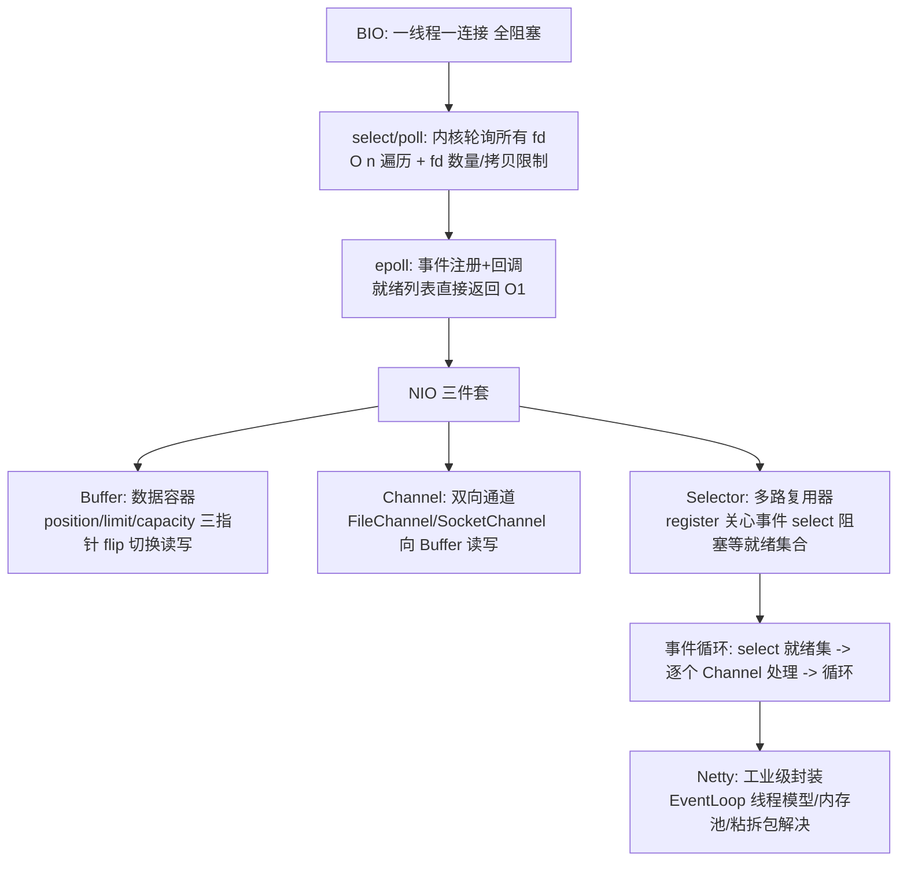

# NIO 与 IO 多路复用

> **一句话摘要**：BIO 的一线程一连接在万级连接下线程爆炸——**NIO 的破局是三件套：Buffer（数据容器）+ Channel（双向通道）+ Selector（一个线程监听成千上万的连接事件）**；底层是操作系统的多路复用（select→poll→epoll 的演进，epoll 事件回调零遍历）；Netty 是 NIO 的工业级封装——本篇讲穿「为什么 NIO 能用一个线程管一万连接」。

> **本文核心**：机制链 = **BIO 的瓶颈（accept/read 全阻塞，一线程一连接）→ 多路复用（Selector 注册多个 Channel，内核告诉你「谁就绪了」）→ epoll 相比 select/poll 的代差（事件回调替代轮询，O(1) 就绪通知）→ NIO 三件套协作（Channel 只管传输、Buffer 只管容器、Selector 只管就绪分发）→ Netty 补齐 JDK NIO 的工程短板（线程模型/内存池/边界处理）**——NIO 的本质是把「等待」集中化：等待交给内核，线程只处理就绪。

前置阅读：[IO 体系与序列化](./33_IO体系与序列化-入门.md)（BIO 体系）。Netty 的线程模型与生产实践归 Netty 域（本篇讲机制地基）。

## 1. 背景：BIO 的天花板在哪

BIO（Blocking IO）：`serverSocket.accept()` 阻塞等连接、`socket.read()` 阻塞等数据——**每个连接独占一个线程从头等到尾**。连接数少时没问题；万级长连接（IM/推送/物联网）时：一万线程 × 1MB 栈 = 10GB 内存 + 切换风暴——**「连接很多但大部分时间空闲」的场景，BIO 的线程模型是结构性浪费**。NIO 的破局思想：把「等」从线程身上剥离——线程不等待，由内核通知「谁就绪了」，线程只处理就绪的少数。

## 2. 核心机制：多路复用演进与 NIO 三件套



- **select/poll → epoll 的代差**：select/poll 每次调用把全部 fd 集合拷进内核、内核线性扫描、返回后应用再遍历——连接越多开销越大（O(n)）；**epoll**（Linux 专属）：fd 注册一次（红黑树管理），就绪时内核回调挂入「就绪链表」，`epoll_wait` 直接拿就绪列表——**O(1) 的事件通知，免轮询免全量拷贝**。macOS 的 kqueue、Windows 的 IOCP 是同层替代。JDK 的 Selector 在 Linux 上默认封装 epoll。
- **Buffer 的三指针模型**：capacity（容量）/position（当前位置）/limit（有效上限）——写模式 position 前移到 limit；`flip()` 切换读模式（limit=position，position=0）——**「读写模式的指针切换」是 NIO 编码的第一坑**（忘 flip 读不到刚写的数据）。
- **Channel 与 Buffer 的分工**：Channel 只负责「传输」（双向——SocketChannel 可读可写，与流的单向不同）；数据必须经过 Buffer 中转（`channel.read(buffer)` / `channel.write(buffer)`）；FileChannel 支持 `transferTo` 零拷贝（数据直达网卡缓冲区，免用户态中转——大文件传输的标准优化）。
- **Netty 补齐了什么**：JDK NIO 的工程短板——① 线程模型要自己搭（Reactor 模式手写复杂）；② ByteBuf 未解决粘包/拆包（TCP 流式语义）；③ epoll 空轮询 bug；④ 内存分配无池化。Netty 的 EventLoop（事件循环组绑定 Channel）、ByteBuf（池化+引用计数）、编解码器框架（LengthFieldBasedFrameDecoder 等）——**「NIO 是机制，Netty 是工程」**。

## 3. 落地实践：NIO 的使用纪律

1. **Reactor 模式是标准姿势**：不要手写 Selector 循环——用 Netty（或至少理解 Boss/Worker 线程组的 Reactor 分工：Boss 管连接、Worker 管 IO）。
2. **事件处理器必须快**：EventLoop 线程被阻塞 = 该线程上所有 Channel 停摆——**「EventLoop 内不做耗时操作」是 NIO 编程第一铁律**（耗时丢业务线程池）。
3. **粘包/拆包必须有解**：TCP 是字节流无消息边界——按定长/分隔符/长度字段解码（Netty 解码器家族），「直接 read 当一条消息」是必翻车项。
4. **写半包处理**：Socket 写缓冲满时 write 只写一部分——Netty 的 writeAndFlush + 高水位线背压；裸 NIO 要自己处理 `hasRemaining` 续写。
5. **文件 IO 的选择**：小文件随手 Files API；大文件传输 FileChannel.transferTo（零拷贝）；需要随机访问用 FileChannel + MappedByteBuffer（mmap）。

## 4. 生产视角：NIO 的事故形态

- **EventLoop 被阻塞的全站停摆**：在 ChannelHandler 里同步调数据库/下游——该 EventLoop 线程卡住，它管理的所有连接全部超时（影响面放大到「同线程全部连接」）。这是 Netty 应用事故之王。
- **粘包拆包的逻辑错误**：把一次 read 当一条完整消息——半包时消息截断、粘包时消息粘连。业务层症状是「偶发的解析失败/数据错乱」，根因在编解码缺失。
- **堆外内存泄漏**：DirectByteBuf 池化内存未释放（引用计数未减到零）——堆外增长（26 篇的直接内存盲区）。Netty 的泄漏检测（采样报告 LEAK 日志）开启常态化。
- **epoll 空轮询 bug**：JDK NIO 的历史 bug（Selector 无事件仍空转烧 CPU）——Netty 的解决方案内建（重建 Selector）；了解即可，裸 NIO 者须知。
- **write 高水位忽略导致 OOM**：发送快于对端接收，Netty 出站缓冲堆积——高水位线（writeBufferWaterMark）背压机制不看，内存持续涨。

## 5. 主流系统怎么做：NIO 的工业应用

| 系统 | NIO 的应用形态 | 机制要点 |
|---|---|---|
| Netty | NIO 工业封装（事实标准） | EventLoop/ByteBuf/编解码全家桶 |
| Tomcat | NIO 连接器（默认） | 一 Acceptor + N Poller 线程管万连接 |
| Kafka | NetworkClient + Selector | 客户端多路复用网络 IO |
| RocketMQ/Redis 客户端 | 长连接 + 事件驱动 | 同一 NIO 范式的各语言实现 |
| gRPC | Netty 传输层 | HTTP/2 多路复用叠加 NIO |

规律：**「所有高连接 Java 系统的 IO 底座都是 NIO（经 Netty）」**——理解 NIO 机制，等于理解了半个中间件的底层。

## 6. 典型场景

- **长连接网关**（连接级）：IM/推送/物联网——万级连接的 NIO 主场。
- **代理与网关**（转发级）：双向转发的事件驱动模型。
- **大文件传输**（吞吐级）：transferTo 零拷贝——文件服务的传输优化。

## 7. 与相邻概念的区别

- **BIO/NIO/AIO 三代**：阻塞（等数据）→ 多路复用（等就绪）→ 异步（内核完成后通知，Windows IOCP 成熟 Linux 生态弱）——AIO 的「完全异步」工程采用率低（Netty 主推 NIO），演进务实停在 NIO。
- **NIO vs NIO.2**：NIO（1.4，面向 Buffer/Channel/Selector）vs NIO.2（7，面向文件系统路径 API——AIO 文件操作只是其中一角）——名字像，领域不同。
- **epoll 的水平触发 vs 边缘触发**：LT（就绪未处理会反复通知——JDK 默认，安全）vs ET（只通知一次，必须一次读干净——性能优但易漏）；Netty 可配——「通知语义」是 epoll 使用的高阶分界。
- **本篇 vs HTTP 语义篇（REST 系列篇 2）**：本篇是「传输机制」，REST 是「应用语义」——分层不同，协同工作。

## 8. 常见误区与不适用

- **「NIO 一定比 BIO 快」**：NIO 的优势是「连接规模」（少线程管多连接）——单连接吞吐与低连接数场景，BIO/线程模型反而简单高效；「NIO 换性能」的前提是连接密集。
- **「NIO 是异步 IO」**：NIO 是同步非阻塞（select 后你自己 read，读仍是同步动作）；真正的异步 IO（内核完成读写）是 AIO——术语精确性（BIO/NIO/AIO 三代）。
- **「用了 Netty 就不用懂 NIO」**：Netty 排障（EventLoop 阻塞/内存泄漏/半包）全部回到 NIO 机制——框架越厚，机制理解越值钱。
- **「Buffer.flip 是魔法」**：flip 只是「position/limit 指针交换」——读写模式切换的机械操作；不懂指针模型的所有 NIO 代码都是碰运气。
- **不适用**：低连接数的内部调用（线程模型更简单可靠）；阻塞式脚本式业务（异步回调的心智负担不值）；CPU 密集处理（NIO 管的是 IO 密集）。

## 9. 你们可能会问

- **一个 Selector 能管多少连接？** 百万级（epoll 的 fd 上限极大，瓶颈在内存与处理能力）——C100K/C1M 问题在 epoll 时代的解法基础。
- **为什么不直接用 AIO（异步 IO）？** Linux 的 AIO 生态不成熟（io_uring 是新希望但 JDK 集成尚早）、AIO 回调模型的工程复杂度高、NIO + 多路复用已满足需求——「演进停在 NIO」的务实选择。
- **Netty 的 EventLoop 为什么要绑定 Channel？** 一个 Channel 的所有事件始终由同一个 EventLoop 线程处理——无锁化（Channel 状态无需加锁）+ 线程亲和的缓存友好；「绑定」是 Netty 线程模型的核心设计。
- **零拷贝有几种？** OS 级 sendfile/mmap（文件到网卡免用户态拷贝）+ 应用级 CompositeByteBuf/slice（用户态免复制聚合）——「零拷贝」一词两个层次，Netty 语境多指后者。
- **怎么观测 NIO 应用的健康度？** Netty 的 PooledByteBufAllocator 指标（池内存水位）、EventLoop 的任务队列积压、channel 活跃数——「IO 线程忙不忙、内存漏没漏、连接稳不稳」三板斧。

## 10. 一句话总结 + 5W 速记卡 + 自测三问

**🎯 核心带走**：

- **核心一句话**：NIO = 把「等待」集中交给内核（Selector 多路复用）+ 线程只处理就绪事件（Channel/Buffer 传输数据）——epoll 的 O(1) 事件通知是底层动力，Netty 是工程外壳；EventLoop 内禁耗时操作是第一铁律。
- **链条复述**：BIO 一线程一连接的天花板 → select/poll/epoll 三代演进 → 三件套协作（Channel/Buffer/Selector）→ Reactor 模式 → Netty 补齐工程短板 → 事故四形态。
- **失效点与边界**：低连接场景 NIO 无优势；AIO 生态未成熟；EventLoop 阻塞=同线程全停；堆外内存是排障盲区。

**5W 速记卡**：

| 维度 | 内容 |
|---|---|
| What | 三件套 + epoll 代差 + Reactor 模式 + Netty 工程封装 |
| Why | 万级连接的线程模型破局 |
| When | 长连接网关、代理转发、大文件传输、连接类故障排查 |
| Where | 用户态与内核的协作（epoll 事件） |
| How | Netty 起步 → EventLoop 铁律 → 粘拆包有解 → 背压与水位治理 |

💡 **实战提示**：EventLoop 内禁阻塞；粘包按定长/分隔/长度字段解码；堆外泄漏检测常开；高水位背压必配。

**开放问题**：io_uring（Linux 新一代异步 IO）若被主流 JDK 集成，「NIO 多路复用」的机制课会被「真异步」改写吗——Netty 的 EventLoop 范式还能延续多久？

**决策（何时用）**：连接密集场景推荐 Netty（NIO 封装）；低连接内部调用用阻塞模型即可；推荐「EventLoop 阻塞检查」进 Netty 应用健康监控。

**Trade-off（代价与反方案）**：NIO 用「编程复杂度（事件模型/指针/粘拆包）」换「连接规模与线程经济」；epoll 用「Linux 绑定」换「O(1) 事件」；Netty 用「框架厚度」换「工程完备」；背压高水位用「发送延迟」换「内存安全」——高并发的每一分能力都对应一份复杂度账单，Netty 是把账单打包得最整齐的那家。

**演进视角**：从 BIO（1.0）到 NIO（1.4）到 NIO.2（7）到 Netty 生态成熟——Java IO 十九年走完「阻塞 → 多路复用 → 工程化」三级；下一级（io_uring/AIO 生态）何时成熟未定——但「等待集中化、线程处理就绪」的 NIO 思想，已经成为所有高性能网络系统的共同语言（Redis/Netty/Kafka 全员遵守）。

---

**下篇预告**：IO 之上的通信——下一篇[网络编程与 HTTP](./35_网络编程与HTTP-入门.md)讲 Socket 编程模型、HttpClient 与连接池。

---

## 上下游地图

从系统架构的上下游看：**IO 体系** 为本篇提供了地基——多路复用 的机制向上游承接、向下游 **网络与 HTTP(篇35)、Netty(生态)** 输出连接规模破局；架构上它是这条知识链上不可跳过的一环，跳读时建议先回上游补齐语境。

```mermaid
flowchart LR
    U0[IO 体系]
    --> ME[本篇: 多路复用]
    ME --> DN0[网络与 HTTP(篇35)]
 DN1[Netty(生态)]
```

---

## 📌 数据与事实声明

Selector/Buffer/Channel 语义为 JDK NIO 官方文档；select/poll/epoll 机制为 Linux man page 与《Unix 网络编程》体系公开内容；Netty EventLoop/ByteBuf/水位机制为 Netty 官方文档；epoll 空轮询 bug 为 Netty 官方 issue 记录的公开问题。以官方文档为准。

## 📚 参考资料

| 类型 | 标题 | 来源 |
|---|---|---|
| 图书 | Netty in Action / Unix 网络编程卷1（IO 多路复用章节） | Manning / 人民邮电 |
| 文档 | Netty 官方用户指南 | netty.io |
| 文档 | Java NIO 官方教程 | docs.oracle.com |
| 系列文章 | 网络编程与 HTTP（下一篇） | 本仓库同系列 |


## 质疑者追问链

**质疑：NIO 与 IO 多路复用 为什么设计成这样，不那样设计？**
NIO 与 IO 多路复用 的设计是在「易用性、安全性、性能」三者之间做取舍——没有完美的选择，只有场景匹配的选择。理解取舍比记住结论更有价值。

**追问一层：如果换个场景，这个设计还成立吗？**
不完全成立——连接数 从十万级涨到千万级时，很多默认假设失效；理解设计边界，才能判断「什么时候需要换方案」。

**再深一层：底层原理和上层 API 之间是什么关系？**
上层 API 是底层机制的抽象封装——机制不变，API 可以演进；反过来，机制变了 API 必须跟着变。这就是为什么「理解机制」比「记住 API」更保值。
