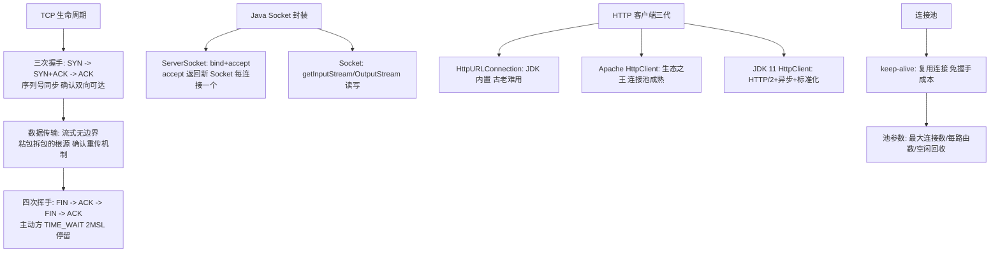
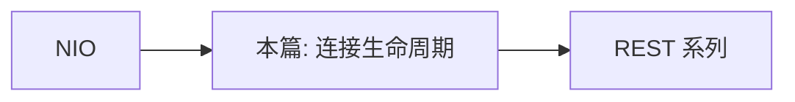

# 网络编程与 HTTP

> **一句话摘要**：Java 网络编程两层——**Socket 层（TCP/UDP 的原始通信原语：连接/读写/关闭）与应用层协议（HTTP 客户端）**；现代 Java 的 HTTP 客户端已经标准化（JDK 11 HttpClient：HTTP/2 + 异步），而 Socket 层的价值在于理解「HTTP 之下发生了什么」——三次握手/四次挥手/粘拆包/连接池，全部是 RPC 框架与网关的机制地基。

> **本文核心**：机制链 = **TCP 三次握手（序列号同步）→ 数据传输（流式无边界——粘拆包的根源）→ 四次挥手（TIME_WAIT 的代价）→ Java Socket 封装（ServerSocket accept/Socket 读写）→ HTTP 客户端三代（HttpURLConnection 老旧 → Apache HttpClient 生态 → JDK 11 HttpClient 标准）→ 连接池与 keep-alive（握手成本摊薄）**——网络编程的工程核心是「连接生命周期管理」。

前置阅读：[NIO 与 IO 多路复用](./34_NIO与IO多路复用-入门.md)。HTTP 应用语义的完整体系见[REST 系列](../../../../../architecture/system-design/rest/入门层/从零开始认识REST设计系列/0_系列导读-全景.md)。

## 1. 背景：为什么还要学 Socket 层

日常开发用 HTTP 客户端/RPC 框架，从不手写 Socket——但排障时：连接池耗尽、TIME_WAIT 暴涨、连接被对端重置（RST）、请求偶发超时——**这些问题的根因全在 Socket 与 TCP 层**。「上层框架是快捷方式，Socket 层是机制说明书」——读懂数据包怎么走，框架行为才可预测。

## 2. 核心机制：TCP 生命周期与 Java 封装



- **三次握手为什么是三次**：确认「双方收发能力都正常」且「初始序列号同步」——两次不能确认「客户端的发送、服务端的接收」闭环；四次挥手因 TCP 全双工（两个方向独立关闭）。**TIME_WAIT 是主动关闭方的代价**（2MSL ≈ 1-4 分钟的端口占用）——高并发短连接服务的 TIME_WAIT 暴涨（端口耗尽）是经典运维事故。
- **流式无边界 = 粘拆包根源**：TCP 只保证「字节按序到达」，不保证「一次 send 对应一次 recv」——应用层消息边界必须自建（定长/分隔符/长度字段——34 篇的粘拆包解码器）。**「TCP 有粘包」是术语误用**——TCP 是流没有包，是应用层把「消息边界」错误假设成了「发送边界」。
- **HTTP 客户端的三代演进**：HttpURLConnection（JDK 内置，API 古老、连接池弱）→ Apache HttpClient（生态最全、连接池/重试/拦截器成熟）→ **JDK 11 HttpClient**（标准化：HTTP/2、异步 CompletableFuture API、无第三方依赖）。现代选择：Spring 生态用 RestClient/WebClient（封装 Apache/Reactor Netty），独立场景用 JDK 11 HttpClient。
- **连接池的价值算术**：一次握手 = 1.5 RTT + 内核资源——高并发短连接的握手成本（时间+TIME_WAIT）远超长连接复用；**连接池把「每请求握手」摊薄为「每池生命周期握手」**——池参数（最大连接数/每路由上限/空闲存活/健康检测）与线程池参数同构（25 篇的治理思想迁移）。

## 3. 落地实践：HTTP 客户端的工程纪律

```java
// JDK 11 HttpClient: 异步 + HTTP/2
HttpClient client = HttpClient.newBuilder()
    .version(HTTP_2)
    .connectTimeout(Duration.ofSeconds(3))
    .build();
HttpRequest req = HttpRequest.newBuilder(URI.create("https://api.example.com/orders"))
    .timeout(Duration.ofSeconds(2))          // 请求级超时(必配)
    .header("Content-Type", "application/json")
    .POST(BodyPublishers.ofString(json))
    .build();
client.sendAsync(req, BodyHandlers.ofString())
    .orTimeout(2, TimeUnit.SECONDS)          // 异步超时
    .thenApply(HttpResponse::body)
    .exceptionally(e -> { monitor.report(e); return fallback(); });
```

五条纪律：① **超时三件套全配**（连接超时/请求超时/读超时）——无超时的网络调用是事故之王（18 篇的纪律在网络的形态）；② **连接池容量与下游匹配**（最大连接 ≤ 下游可承受并发——连接池本身是「对下游的限流器」）；③ **重试必须有幂等前提**（GET/幂等 POST 才自动重试——非幂等重试是资损之源，幂等篇呼应）；④ **错误分类处理**（连接失败可重试、4xx 不重试、5xx 按策略——重试组件的分级）；⑤ **DNS 缓存感知**（JVM 默认缓存 DNS——故障切换时 DNS 生效延迟的排查项）。

## 4. 生产视角：网络编程的事故形态

- **TIME_WAIT 暴涨端口耗尽**：短连接高频调用下游——主动关闭方 TIME_WAIT 堆积（数万条），新连接端口不够。根治：连接池长连接复用；缓解：端口范围调大 + `tcp_tw_reuse`。
- **连接池耗尽的全站超时**：下游变慢 → 连接借出不还（等响应）→ 池耗尽 → 上游全部等待超时——故障的「池化传导链」。防线：获取连接超时 + 熔断（快速失败）。
- **读超时与连接超时的混淆**：connectTimeout（握手 3s）正常但 readTimeout 未设——服务端 hang 住时调用线程永久等待。两者语义独立必须都配。
- **RST 重置的偶发失败**：对端进程崩溃/防火墙重置/keepalive 超时——连接被 RST，读写抛 SocketException「Connection reset」。长连接必须有「失效连接剔除 + 重试」机制。
- **大响应的内存暴涨**：BodyHandlers.ofString() 一次性读入大响应——大文件/大报表场景改流式（ofInputStream）。

## 5. 主流系统怎么做：网络客户端的生态位

| 场景 | 主流选择 | 机制要点 |
|---|---|---|
| 通用 HTTP 调用 | JDK 11 HttpClient / Apache HttpClient | 标准化 vs 生态成熟 |
| Spring 生态 | RestClient(WebClient) | 声明式 + 底层可切换 |
| 声明式 RPC | OpenFeign / Dubbo | 接口即客户端（注解驱动） |
| 长连接/推送 | WebSocket（Netty） | 全双工（34 篇 NIO 底座） |
| 高性能 RPC | 自研协议（Dubbo 协议等） | 定制协议头 + 序列化 + 连接复用 |

规律：**「HTTP 对外、自定义协议对内」的网络分层与序列化三域（33 篇）一致**——边界选通用，内部选效率。

## 6. 典型场景

- **下游调用**（日常级）：HTTP 客户端 + 超时三件套 + 重试分级——最高频的网络工程。
- **长连接网关**（连接级）：WebSocket/TCP 长连接 + 心跳保活——34 篇 NIO 的应用层。
- **对账拉取文件**（批处理级）：大文件流式下载 + 校验——流式的 HTTP 场景。

## 7. 与相邻概念的区别

- **Socket vs HTTP**：传输原语 vs 应用协议——Socket 给你字节管道（自由但无语义），HTTP 给你请求响应语义（标准但受约束）。
- **HTTP/1.1 vs HTTP/2**：文本协议+队头阻塞 vs 二进制分帧+多路复用——单连接多请求的复用让 HTTP/2 的连接池语义变化（连接数需求下降）。
- **HTTP 客户端 vs RPC 框架**：HTTP 客户端管「怎么发」，RPC 框架管「调用像本地」（代理+序列化+负载均衡+熔断全包）——客户端是零件，框架是整车（框架的机制地基之一就是本篇）。
- **本篇 vs REST 系列**：本篇是「传输与客户端工程」，REST 系列是「接口设计语义」——机制与设计的互补。

## 8. 常见误区与不适用

- **「HTTP 客户端是线程安全的所以共享随意」**：主流客户端实例线程安全（应共享单例——连接池在实例内）；每次 new 客户端 = 每次新建连接池（资源浪费 + 握手成本全付）。
- **「重试是免费的容错」**：非幂等请求重试 = 重复下单（幂等篇的协议层呼应）——重试必须与幂等设计成对评审。
- **「keep-alive 的连接永远可用」**：服务端/中间件（LB/防火墙）会静默断开空闲连接——客户端必须「失效连接剔除 + 借出校验」（连接池的活性检测）。
- **「HTTP/2 多路复用就不用连接池了」**：连接数需求下降但「单连接流控/拥塞」仍需治理——多路复用改变池形态（连接少但流多），不消除连接管理。
- **不适用**：跨公网不可信传输细节（TLS 体系——安全域）；浏览器端网络（前端域）；纯转发场景（网关/代理——服务治理域）。

## 9. 你们可能会问

- **TIME_WAIT 为什么必须等 2MSL？** 确保最后 ACK 可达（丢了对方重发 FIN 还能应答）+ 让旧连接的报文在网络中自然消亡（不污染新连接）——「宁可占端口」的设计是正确性优先。
- **connectTimeout 和 readTimeout 的机制差异？** connect 超时管「三次握手完成」（内核层）；read 超时管「数据到达间隔」（两次包之间的最大等待）——hang 死的服务端由 read 超时兜底。
- **TCP keepalive 和 HTTP keep-alive 是一回事吗？** 不是——TCP keepalive 是内核的空闲探测（数小时级默认）；HTTP keep-alive 是应用层连接复用——「保活」一词两个层次，长连接活性通常用应用层心跳。
- **HttpClient 要单例吗？** 要——实例内含连接池与配置；单例共享是标准用法（线程安全），多实例=多池=资源浪费。
- **怎么排查「偶发 connection reset」？** 四查：对端是否主动关（服务端日志/空闲超时配置）、中间设备（LB/防火墙的空闲断开）、客户端读超时后未消费、TCP keepalive 与中间设备的参数对齐——「reset 的来源」决定修法。

## 10. 一句话总结 + 5W 速记卡 + 自测三问

**🎯 核心带走**：

- **核心一句话**：网络编程 = TCP 生命周期（握手/流式/挥手 TIME_WAIT）+ Java 封装（Socket/HttpClient 三代）+ 连接池治理（keep-alive 摊薄握手、池参数即下游限流）——工程核心是连接生命周期管理与超时三件套。
- **链条复述**：三次握手/流式无边界/四次挥手 → Socket 封装 → HTTP 客户端三代 → 连接池治理 → 超时三件套 + 重试幂等配对 + RST 排查。
- **失效点与边界**：客户端单例纪律；重试配幂等；keep-alive 连接会静默失效；HTTP/2 改变池形态不消除管理。

**5W 速记卡**：

| 维度 | 内容 |
|---|---|
| What | TCP 生命周期 + Socket/HttpClient + 连接池治理 |
| Why | 上层框架的全部网络问题根因在 Socket/TCP 层 |
| When | 下游调用设计、TIME_WAIT/连接池/偶发 reset 排查 |
| Where | 内核 TCP 栈 + 客户端连接池 |
| How | 超时三件套 → 连接池与下游匹配 → 重试配幂等 → 失效剔除 |

💡 **实战提示**：客户端单例共享；超时三件套全配；重试必配幂等；TIME_WAIT 治理用连接池；长连接加心跳。

**开放问题**：QUIC（HTTP/3，UDP 基座）把连接语义从内核搬到用户态——「TIME_WAIT/连接池」这些内核时代的问题会整体上移为用户态管理吗？网络排障的工具箱要换血吗？

**决策（何时用）**：一切下游调用的设计与排障；推荐「超时三件套 + 重试幂等配对」进编码规范；推荐「连接池参数与下游容量匹配」进容量评审。

**Trade-off（代价与反方案）**：长连接用「服务端连接维持成本」换「免握手延迟」；连接池用「池化治理复杂度」换「复用与限流」；重试用「流量放大」换「瞬时故障自愈」；超时用「失败的可能」换「确定性」——网络工程的每个默认值背后都是「延迟 × 可靠性 × 资源」的三方合同。

**演进视角**：从 BIO Socket 到 NIO 到 HTTP/2 多路复用再到 QUIC——「连接」的形态从内核专属走向用户态重构；但「握手成本、流式无边界、连接复用」的机制思考三十年不变——协议在换代，生命周期管理的工程学常青。

---

## 本系列 35 篇 · IO 与网络组收官

全景（1-2）→ 语法核心（3-10）→ 集合（11-16）→ 并发（17-25）→ JVM（26-32）→ IO 网络（33-35）→ 现代特性（36-41 待续）——Java 语言本体的知识面即将闭环；生态系列（Spring Boot/MyBatisPlus/Dubbo）与语言系列互为表里。

---

## 上下游地图

从系统架构的上下游看：**NIO** 为本篇提供了地基——连接生命周期 的机制向上游承接、向下游 **REST 系列** 输出上层框架根因；架构上它是这条知识链上不可跳过的一环，跳读时建议先回上游补齐语境。



---


## 质疑者追问链

**质疑：网络编程与 HTTP 为什么设计成这样，不那样设计？**
网络编程与 HTTP 的设计是在「易用性、安全性、性能」三者之间做取舍——没有完美的选择，只有场景匹配的选择。理解取舍比记住结论更有价值。

**追问一层：如果换个场景，这个设计还成立吗？**
不完全成立——连接池 从十万级涨到千万级时，很多默认假设失效；理解设计边界，才能判断「什么时候需要换方案」。

**再深一层：底层原理和上层 API 之间是什么关系？**
上层 API 是底层机制的抽象封装——机制不变，API 可以演进；反过来，机制变了 API 必须跟着变。这就是为什么「理解机制」比「记住 API」更保值。

## 量级分档视角

| 量级 | 网络编程与 HTTP的形态变化 | 关注点 |
|---|---|---|
| 10 万级 | 入门阶段，连接池默认配置即可 | 语法正确性 |
| 千万级 | 需要关注 HTTP 延迟 的取舍 | 性能瓶颈与参数调优 |
| 亿级 | 连接池 成为架构决策的核心变量 | 架构选型与底层机制 |

量级每上一档，对 连接池 的容忍度就降一级——**同样的代码在十万级没问题，在亿级就是事故预备役**。

## 📌 数据与事实声明

TCP 握手挥手/流式语义/TIME_WAIT 为 RFC 793/9293 与《TCP/IP 详解》公开内容；JDK 11 HttpClient（JEP 321）与 HttpURLConnection 行为为官方文档；Apache HttpClient/连接池惯例为官方文档；HTTP/2 多路复用为 RFC 9113。以 RFC 与官方文档为准。

## 📚 参考资料

| 类型 | 标题 | 来源 |
|---|---|---|
| 图书 | TCP/IP 详解 卷1（TCP 章节） | 人民邮电出版社 |
| 标准 | RFC 9110/9113（HTTP 语义/HTTP2） | ietf.org |
| 文档 | Java HttpClient 官方教程 | docs.oracle.com |
| 系列文章 | REST 系列（接口语义） | 本仓库 rest/ |
