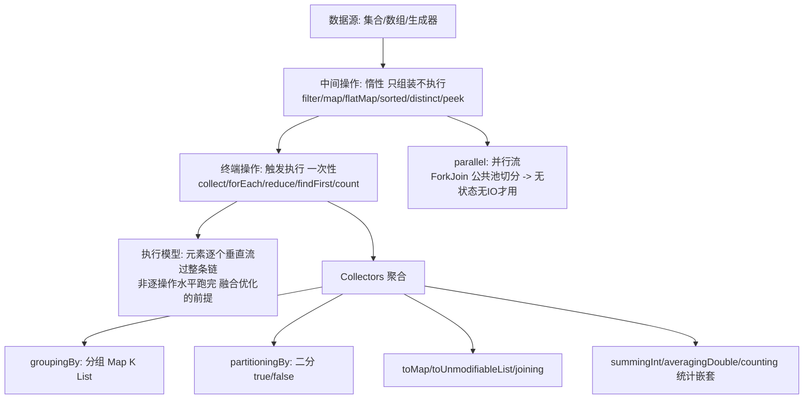

# Stream 流式编程

> **一句话摘要**：Stream = 「声明式数据流水线」——**中间操作（filter/map/sorted）惰性描述、终端操作（collect/forEach）触发执行**；「做什么」替代「怎么遍历」——循环骨架消失，业务意图浮出；本篇讲清惰性求值与短路、Collectors 的聚合体系、并行流的适用边界（不是加速开关）与流式风格的反模式。

> **本文核心**：机制链 = **数据源 → 中间操作链（惰性：只记录不执行）→ 终端操作（触发整条流水线一次跑完，元素逐个「垂直」流过而非逐操作「水平」跑完）→ 短路操作（limit/findFirst 提前终止——无限流的可能）→ Collectors 聚合（groupingBy/partitioningBy/joining/统计）→ 并行流（ForkJoin 公共池切分，数据规模与无状态是前提）**——「声明式 × 惰性 × 一次性（流不可复用）」三属性是全部使用规则的总纲。

前置阅读：[Lambda 与函数式接口](./36_Lambda与函数式接口-入门.md)。集合选型地基见[集合框架总览](./11_集合框架总览-入门.md)。

## 1. 背景：声明式解决什么问题

命令式遍历的问题：**「怎么做」（循环骨架/临时变量/状态管理）淹没「做什么」（业务过滤与转换）**——三重嵌套循环里找一行业务逻辑是代码评审的日常。Stream 把遍历骨架交给框架，代码只描述「数据怎么变换」：`orders.stream().filter(PAID).map(Order::amount).reduce(0, Long::sum)`——**意图即代码**；同时获得惰性求值、并行切换（stream().parallel() 一词）与操作组合复用三项机制红利。

## 2. 核心机制：惰性流水线与 Collectors



- **惰性与垂直执行**：中间操作只是「往流水线上加一道工序」，终端操作才启动——元素**逐个**流过整条链（filter 通过一个就立刻进 map）而非「先全部 filter 完再全部 map」——这使「短路 + 无限流」（`Stream.iterate` + `limit`）成为可能，也使操作融合的 JIT 优化成为可能。**流是一次性的**（终端操作后关闭）——复用抛 IllegalStateException。
- **Collectors 的聚合体系**：`groupingBy(分类函数, 下游收集器)` 是组合核心——两层嵌套（groupingBy + mapping/summing）覆盖「分组统计/分组取字段/分组计数」全家族；`toMap` 必须想清楚**键冲突策略**（第三个参数 merge 函数——缺省撞键抛异常）。
- **并行流的边界**：底层是 ForkJoin 公共池（与 CF 默认池共享——25 篇的坑）；**适用前提三查**：数据量够大（分割收益 > 调度成本）、操作无状态无 IO（有共享状态就错）、源可高效切分（ArrayList 好、LinkedList 差、iterate 极差）。**并行流不是加速开关，是「数据规模 × 任务纯度」的条件加速**——默认顺序流，压测证明再并行。
- **flatMap 的展开语义**：「一变多」的拍平（订单 → 明细流的聚合）——嵌套循环的声明式替代；`map` 一变一、`flatMap` 一变多——两个 map 的分界是初学者第一坑。

## 3. 落地实践：Stream 的工程纪律

```java
// 分组统计: 一层 groupingBy + 下游收集器
Map<String, Long> countByCity = orders.stream()
    .collect(groupingBy(Order::city, counting()));
// 多级: 城市分组 -> 金额求和
Map<String, Long> sumByCity = orders.stream()
    .collect(groupingBy(Order::city, summingLong(Order::amount)));

// toMap 必须想键冲突
Map<Long, Order> byId = orders.stream()
    .collect(toMap(Order::id, Function.identity(), (a, b) -> a));  // 冲突取先

// Optional 出口: findFirst/findMax 天然接 Optional(37->38 篇联动)
Order biggest = orders.stream().max(comparing(Order::amount)).orElseThrow();
```

四条纪律：① **逻辑 ≤3 步抽方法**（超长链的「伪声明式」不可读不可测）；② **副作用禁入中间操作**（filter 里改外部状态——并行下必错、顺序下埋雷；副作用收敛到 forEach 终端）；③ **数值流用 IntStream/LongStream**（mapToInt 免装箱——性能与统计方法双收益）；④ **大集合与 IO 操作不进流**（流是内存集合的声明式处理——数据源问题回到 33 篇）。

## 4. 生产视角：流式风格的事故形态

- **并行流共享状态的数据错乱**：`parallel().forEach(list::add)`——ArrayList 非线程安全，丢数据/ArrayIndexOutOfBounds。整改：collect 收集（框架安全聚合）或换并发容器。
- **公共池被并行流拖垮**：重计算任务跑并行流占满 ForkJoin 公共池——其他用公共池的 CF 任务饿死（25 篇的池共享坑）。重活用自定义池（parallelStream 无法指定池——改用 `stream.collect` + 手动提交或换 CF）。
- **无限流忘短路**：`Stream.generate(() -> random)` 没 limit——无限流直接 OOM/卡死。无限流必有短路终端（limit/takeWhile/findFirst）。
- **peek 的调试滥用**：peek 原语义是「调试观察」，被用于中途修改状态——依赖执行时机的行为在惰性下不可靠。改状态的正确位置是 map 或终端。

## 5. 主流系统怎么做：流的生态延伸

| 场景 | 载体 | 机制要点 |
|---|---|---|
| 内存集合处理 | JDK Stream | 本篇主场 |
| 大数据流式 | Spark RDD/Flink DataStream | Stream 思想的分布式放大（惰性/转换-行动分离同构） |
| 响应式流 | Reactor/Flow API | 推模型 + 背压（Stream 的异步版本） |
| 数据库查询 | JOOQ/QueryDSL 流式 | SQL 构建的声明式同构 |

规律：**「声明式数据流水线」是跨规模通用范式**——JDK Stream（内存）→ Spark（集群）→ Reactor（异步）同构思想，学一次通三域。

## 6. 典型场景

- **报表聚合**（业务级）：groupingBy 多级统计——SQL group by 的内存版。
- **数据清洗管道**（处理级）：filter/map/flatMap 链——ETL 的轻量实现。
- **集合间运算**（组合级）：两个列表的 join（flatMap + filter）或 map 索引法。

## 7. 与相邻概念的区别

- **Stream vs 集合**：集合是「数据的容器」（先算好存着）；流是「数据的计算表达式」（按需算）——「存储 vs 计算」的分野（集合格式化日期后集合变；流每次重新算）。
- **Stream vs Optional**：Optional 是「0/1 个元素的流语义」（38 篇）——两者 API 同族（filter/map），Optional 是单元素的流亲戚。
- **顺序流 vs 并行流**：同一条流水线的单线程/多线程模式——「并行是模式不是另一个类」；切换成本与前提（第 2 节三查）。
- **本篇 vs Kotlin 集合操作**：同构思想不同实现（Kotlin 序列惰性按元素、JDK 流终端触发）——范式跨语言传播的案例。

## 8. 常见误区与不适用

- **「并行流总是更快」**：小数据量（分割成本 > 收益）、LinkedList/iterate 源（切分低效）、有状态操作（锁竞争）——并行流负优化的三大场景；「默认顺序、基准证明再并行」。
- **「流的链越长越函数式」**：超长链是「伪声明式」（可读性与调试双输）——3 步抽方法与中间命名（收集中间结果或用注释分段）。
- **「peek 可以随便用来打日志」**：peek 的执行时机随惰性与并行变化——调试日志用 map(x -> { log(x); return x; }) 显式化或接受其调试定位。
- **「流比 for 循环性能差很多」**：顺序流与 for 的差距在现代 JIT 下微小（装箱场景除外——数值流解决）；性能焦虑让位于可读性，热点再基准。
- **不适用**：需要异常中断的复杂控制流（checked 异常与提前 return 是流的弱项）；大 IO 数据源（流式 IO 用 IO 体系）；强顺序副作用依赖（forEach 的顺序无保证——并行下）。

## 9. 你们可能会问

- **中间操作为什么设计成惰性？** 三收益：短路可行（无限流）、操作融合（逐元素垂直执行省中间集合）、并行切分自然（流水线结构即切分计划）——惰性是「声明式」的机制支柱。
- **collect vs reduce 怎么选？** reduce 是「不可变累积」（两两合并出新值——适合数值）；collect 是「可变容器聚合」（往容器里塞——适合构造集合/复杂对象）——「不可变累积 vs 可变容器」的分界。
- **groupingBy 的下游还能再嵌套吗？** 能任意嵌套（groupingBy 里套 groupingBy 套 mapping 套 toMap）——可读性红线在两层；更深用 SQL/中间模型。
- **parallelStream 的池能指定吗？** parallelStream 固定用公共池（无法指定）——要自定义池：`stream.collect` 到自定义 ForkJoinPool 提交（ tricks），或改用 CompletableFuture 手动并行。
- **怎么调试流链中间值？** peek 临时观察（调试用途合规）或拆链（中间 toList 存变量）——「流难调试」的工程应对是「拆到能测」。

## 10. 一句话总结 + 5W 速记卡 + 自测三问

**🎯 核心带走**：

- **核心一句话**：Stream = 声明式数据流水线——中间操作惰性组装、终端触发垂直执行、Collectors 聚合收口；并行流是条件加速不是默认开关；副作用禁入中间操作。
- **链条复述**：声明式价值 → 惰性与垂直执行 → 短路与无限流 → Collectors 聚合体系（groupingBy 核心）→ 并行流三查 → 四纪律（3 步抽方法/副作用/数值流/大集合）。
- **失效点与边界**：流一次性不可复用；checked 异常与复杂控制流是弱项；内存集合专属（大数据/IO 归各自体系）。

**5W 速记卡**：

| 维度 | 内容 |
|---|---|
| What | 惰性流水线 + Collectors 聚合 + 并行流边界 |
| Why | 声明式让业务意图浮出循环骨架 |
| When | 内存集合的过滤/转换/聚合/分组统计 |
| Where | 集合数据源（内存） |
| How | 语义描述 → collect 收口 → 3 步抽方法 → 并行三查再开 |

💡 **实战提示**：toMap 想冲突策略；并行流三查；数值流免装箱；无限流必短路；peek 只调试。

**开放问题**：虚拟线程让「每个元素一个任务」的成本趋零——Stream 的「切分-合并」并行模型与「海量轻任务」模型的边界会重新划分吗？

**决策（何时用）**：内存集合的处理与聚合默认 Stream；热点路径基准证明后考虑并行；推荐「3 步抽方法 + 副作用红线」进编码规范。

**Trade-off（代价与反方案）**：声明式用「调试链路变长」换「意图清晰与组合性」；惰性用「执行时机不可见」换「短路/融合/无限流」；并行流用「公共池争抢」换「一词切换的并行」——Stream 的每个便利都标注了适用前提，前提即纪律。

**演进视角**：Stream（8）把声明式数据处理带给 JVM 主流，Spark/Flink/Reactor 把同一思想放大到集群与异步——「声明式数据流水线」十年间从 Java 的新特性变成跨系统通用范式；JDK 内的 Stream 本体反而进入稳定期——「思想已扩散，本体即原点」。

---

**下篇预告**：空安全的类型化表达——下一篇[Optional 与新 API](./38_Optional与新API-入门.md)讲 Optional 的正确用法与集合工厂/var。

---

## 上下游地图

从系统架构的上下游看：**Lambda** 为本篇提供了地基——声明式流水线 的机制向上游承接、向下游 **Optional(篇38)** 输出数据聚合；架构上它是这条知识链上不可跳过的一环，跳读时建议先回上游补齐语境。

```mermaid
flowchart LR
    U0[Lambda]
    --> ME[本篇: 声明式流水线]
    ME --> DN0[Optional(篇38)]
```

---

## 📌 数据与事实声明

Stream 惰性/垂直执行/一次性语义、Collectors 体系、并行流公共池为 JDK 官方文档与源码公开内容；「并行流三查」与适用边界为官方文档与公开基准共识；ForkJoin 公共池共享为 CompletableFuture Javadoc 记录。以官方文档为准。

## 📚 参考资料

| 类型 | 标题 | 来源 |
|---|---|---|
| 图书 | Effective Java 第 3 版（第 45-48 条 Stream 专章） | Addison-Wesley（2019） |
| 文档 | java.util.stream 官方文档与教程 | docs.oracle.com |
| 图书 | Java 核心技术 卷II（流库章节） | Pearson（2022） |
| 系列文章 | Optional 与新 API（下一篇） | 本仓库同系列 |
