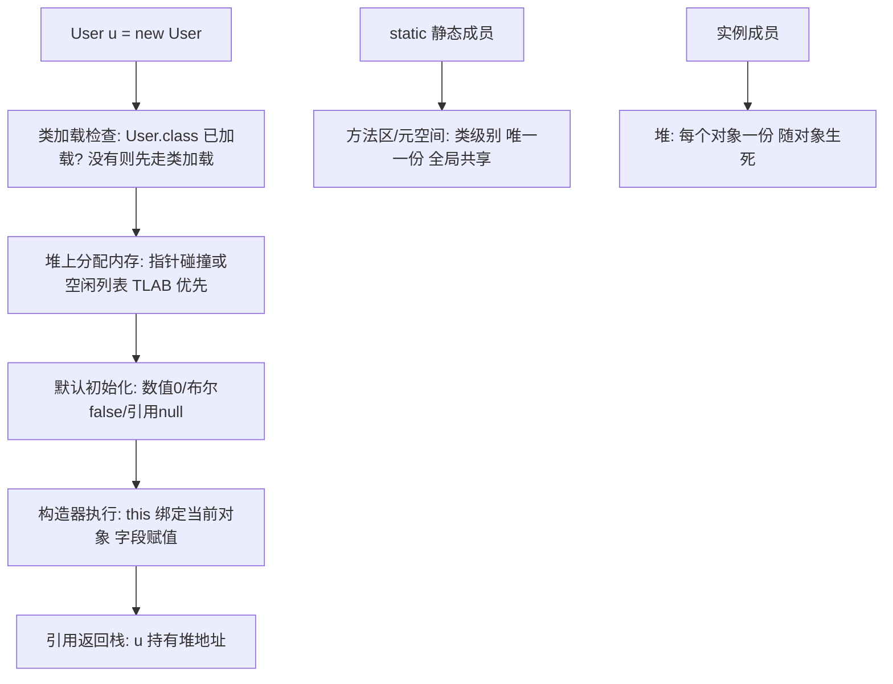

# 对象与类

> **一句话摘要**：类是模板、对象是实例——但工程上真正要建立的是**内存直觉**：对象在堆上、引用在栈上、类元数据在方法区；构造器/this/static/封装纪律都长在这条链上。本篇把语法点挂到内存模型上，为后续集合扩容、并发可见性、JVM 篇铺地基。

> **本文核心**：机制链 = **new 触发类加载检查 → 堆分配内存 → 字段默认初始化 → 构造器执行 → 引用交回栈**——对象的一生从此开始（第 27 篇专讲全程）；static 属于类不属于实例（方法区语义），this 指向当前实例——两个关键字是「类 vs 实例」边界的语法表达。

前置阅读：[Java 全景与运行机制](./1_Java全景与运行机制-入门.md)。对象创建的底层流程（指针碰撞/TLAB/逃逸分析）见[对象的一生](./27_对象的一生-入门.md)。

## 1. 背景：为什么要先建内存直觉

语法书把「类与对象」讲成概念题（猫类与猫实例），但工程事故全是内存题：空指针（栈上的引用没指向堆上的对象）、内存泄漏（引用该断没断）、并发可见（共享堆上的字段谁看得见）。**引用与对象的分离**是理解这一切的钥匙——变量是引用（拿在手里的一张地址条），对象是堆上的实体；赋值复制的是地址条不是实体本身。

## 2. 核心机制：从 new 到可用的全流程



四个语法点的机制定位（追问链）：

- **构造器是「初始化钩子」不是「创建者」**——对象内存已分配、字段已默认初始化，构造器只是最后一个「把字段调成业务初值」的环节；构造器重载间用 `this(...)` 委托，避免初始化逻辑复制。
- **static 为什么「属于类」？** 静态成员在方法区只有一份（类第一次加载时创建），不随实例生灭——「静态方法不能访问实例成员」的真正原因是：静态方法没有 this（它不知道自己被哪个实例调用）。
- **封装（private + getter/setter）在防什么？** 防「绕过不变量」——余额字段如果 public，任何代码可以 `account.balance = -999`；封装把字段访问收敛到方法，方法里才能放校验。封装不是形式主义，是不变量守卫。
- **JavaBean 规范为什么要求无参构造 + getter/setter？** 框架（序列化/ORM/依赖注入）需要「不经过业务构造器就能造出空对象再逐字段填充」的统一入口——规范是给框架的机械接口。

## 3. 落地实践：写一个不变量守卫的类

```java
public class Account {
    private final String id;        // 不变字段: final + 不暴露 setter
    private long balanceCents;      // 金额用 long 分(第10篇专讲精度)

    public Account(String id, long initCents) {
        if (id == null || id.isBlank()) throw new IllegalArgumentException("id 必填");
        if (initCents < 0) throw new IllegalArgumentException("初始余额非负");
        this.id = id;               // this 消歧义: 字段 vs 参数
        this.balanceCents = initCents;
    }
    public void withdraw(long cents) {
        if (cents <= 0) throw new IllegalArgumentException("金额必须为正");
        if (cents > balanceCents) throw new IllegalStateException("余额不足");
        this.balanceCents -= cents; // 不变量: 永远 >= 0 在方法内守卫
    }
    public long getBalanceCents() { return balanceCents; }
    public String getId() { return id; }
}
```

四条纪律：字段全 private、不变字段 final、不变量在构造器与方法内守卫、暴露行为方法而非数据 setter（`withdraw` 而非 `setBalance`）——**行为驱动的类设计**（告诉对象做什么，而不是问它要数据再替它算）是面向对象的工程化表达。

## 4. 生产视角：类设计失误的形态

- **贫血模型 + 公开 setter**：所有字段有 setter，任何代码可把订单改成任何状态——状态机崩坏，脏数据查无入口。整改方向是收窄 setter、以行为方法表达业务操作。
- **静态滥用**：把「工具方法」与「全局可变状态」都塞 static——静态可变集合成为并发事故与测试污染源（static 的生命周期 = 类的生命周期 = 通常整个 JVM，清理无门）。
- **构造器参数爆炸**：十几个参数的构造器——调用方按位置传参错位（两个 String 相邻互换编译不报错）。解法：Builder 模式或参数对象。
- **final 缺失的意外重绑**：可变字段没 final，被人中途换引用——「看似不可变」的假设崩塌。不变字段一律 final 是低成本防线。

## 5. 主流系统怎么做：类设计的生态惯例

| 惯例 | 载体 | 机制要点 |
|---|---|---|
| record（Java 17 主线） | 不可变数据载体 | `record Point(int x, int y)` 自动生成构造/equals/hashCode/toString——纯数据类首选 |
| Lombok | 样板消除 | 注解生成 getter/builder——团队要统一（生成代码的调试成本） |
| Builder 模式 | 多参数构造 | 链式构建 + 可读性强——4 参数以上构造器的事实替代 |
| 静态工厂 | Effective Java 首条 | `Account.of(...)`/`valueOf(...)` 命名明确、可缓存、可返回子类型——比 public 构造器更弹性 |

规律：**「数据类用 record、行为类用封装纪律、复杂构造用 Builder/静态工厂」**——现代 Java 的类设计三分法，互相组合不冲突。

## 6. 典型场景

- **领域对象**（业务级）：订单/账户类——不变量守卫 + 行为方法（贫血 vs 充血是团队决策，但不变量守卫不可省）。
- **数据传输对象 DTO**（边界级）：跨层数据搬运——record 是现代首选（不可变防中途篡改）。
- **工具类**（静态级）：StringUtils 类——「私有构造器 + 全静态方法」防实例化，纯函数无状态。

## 7. 与相邻概念的区别

- **类 vs 对象 vs 引用**：类是模板（方法区一份）、对象是实例（堆上一份）、引用是指向实例的句柄（栈上）——三个层次混谈是内存问题排查的认知障碍。
- **static 方法 vs 实例方法**：无 this vs 有 this——静态方法无法被覆写（静态绑定）、实例方法才能多态（下一篇）。
- **组合 vs 继承**：本篇埋伏笔——「组合优于继承」的完整论证在下一篇（继承的机制代价与脆弱基类问题）。
- **本篇 vs 对象的一生（第 27 篇）**：本篇讲「语法与直觉」，27 篇讲「底层全程」（对象头/TLAB/逃逸分析）——入门与深挖分层。

## 8. 常见误区与不适用

- **「Java 引用传递对象」**：Java 只有值传递——传的是「引用的值」（地址条副本）；方法内重绑引用（`param = new ...`）不影响调用方，这是「值传递」的机械证明。
- **「String 参数传进去改了，外面也变了」**：没变——String 不可变（第 6 篇），方法内拿到的是同一地址但对象内容改不了；可变对象（List）传进去改内容才影响原对象。
- **「static 变量当全局变量随便用」**：静态可变状态 = 全局共享可变状态——并发安全、测试隔离、生命周期三重问题；static 收敛到「真正无变化的常量与纯函数」。
- **「getter/setter 全生成就是封装」**：全字段裸 setter 等于 public 字段——封装的本质是不变量守卫，不是访问器形式。
- **不适用**：本篇纪律对「纯数据载体」可降级（record 自动不可变，无需手写守卫）；原型验证代码（先跑通再重构，但要标记技术债）。

## 9. 你们可能会问

- **this 到底是什么？** 当前实例的隐式引用——实例方法被调用时由调用方「悄悄传入」（`u.withdraw(100)` 等价于 `withdraw(u, 100)` 的心智模型）；静态方法没有这个隐式参数。
- **构造器里能调用可被覆写的方法吗？** 不能——子类覆写方法会在「子类字段还没初始化」时被父类构造器调用，读到默认值（经典的脆弱基类陷阱，下一篇展开）。
- **什么时候用静态工厂替代构造器？** 需要命名语义（`Account.frozen()`）、需要缓存（同参返回同实例）、需要返回子类型时——Effective Java 第一条，弹性全面占优。
- **字段初始化顺序是什么？** 默认值 → 实例初始化块与字段赋值（按书写顺序）→ 构造器体——「字段声明处直接赋值」其实被编译器挪进了构造器开头。
- **怎么判断该用 record 还是普通类？** 纯数据（无业务行为、不可变、字段即全部）→ record；有行为与不变量逻辑 → 普通类 + 封装纪律——record 不是要替代所有类。

## 10. 一句话总结 + 5W 速记卡 + 自测三问

**🎯 核心带走**：

- **核心一句话**：类是模板（方法区一份）、对象是堆上实例、引用是栈上地址条——构造器管初始化、static 管类级共享、封装管不变量。
- **链条复述**：new → 类加载检查 → 堆分配 → 默认初始化 → 构造器 → 引用回栈；行为驱动设计（方法守卫不变量）而非数据裸奔。
- **失效点与边界**：值传递的重绑陷阱；静态可变状态的三重问题；record 场景守卫可降级。

**5W 速记卡**：

| 维度 | 内容 |
|---|---|
| What | 类/对象/引用三层模型 + 构造器/static/封装机制 |
| Why | 内存直觉是并发、集合、JVM 各组的地基 |
| When | 一切类的设计与内存问题排查 |
| Where | 堆（实例）、方法区（类与 static）、栈（引用） |
| How | 字段全 private + final 收紧 + 行为方法守卫不变量 |

💡 **实战提示**：不变字段一律 final；4+ 参数用 Builder；静态工厂优于 public 构造器；纯数据类用 record。

**开放问题**：record 与虚拟线程时代的「不可变优先」风气，会不会让「可变对象 + 方法守卫」的传统面向对象模式持续收缩？

**决策（何时用）**：纯数据推荐 record；有不变量逻辑推荐封装纪律类；推荐「行为方法优先于 setter」作为团队类设计评审的第一检查项。

**Trade-off（代价与反方案）**：强封装用「样板与约束」换「不变量安全与演进弹性」；反方案——全 public 字段（零样板，代价是不变量失守）、record 全用（不可变免费，代价是行为逻辑无处安放）；贫血 vs 充血是更大的架构权衡（领域建模域），本篇的底线只是「不变量必须有守卫点」。

**演进视角**：从 Java 1.0 的 JavaBean 规范到 record（Java 16+）——「数据类」的样板成本三十年逐步归零，设计重心从「怎么写 getter」转向「怎么守不变量」；语法的演进在持续兑现「少写机械代码、多写业务逻辑」。

---

**下篇预告**：复用与多态的机制与代价——下一篇[继承与多态](./4_继承与多态-入门.md)讲动态绑定怎么实现、组合为什么优于继承。

---

## 上下游地图

从系统架构的上下游看：**全景篇** 为本篇提供了地基——内存直觉 的机制向上游承接、向下游 **继承多态(篇4)、对象一生(篇27)** 输出并发/集合/JVM 各组；架构上它是这条知识链上不可跳过的一环，跳读时建议先回上游补齐语境。

```mermaid
flowchart LR
    U0[全景篇]
    --> ME[本篇: 内存直觉]
    ME --> DN0[继承多态(篇4)]
 DN1[对象一生(篇27)]
```

---

## 📌 数据与事实声明

语法语义（构造器/static/封装/值传递）为 Java 语言规范（JLS）公开内容；record/Builder/静态工厂惯例出自 Java 官方与 Effective Java 第 3 版；对象创建流程的机制概述与第 27 篇深挖分层对应。以 JLS 与官方文档为准。

## 📚 参考资料

| 类型 | 标题 | 来源 |
|---|---|---|
| 图书 | Java 核心技术 卷I（第 12 版，类与对象章节） | Pearson（2022） |
| 图书 | Effective Java 第 3 版（第 1、2、4 条） | Addison-Wesley（2019） |
| 文档 | Java Language Specification | docs.oracle.com/javase/specs |
| 系列文章 | 对象的一生（第 27 篇深挖） | 本仓库同系列 |
