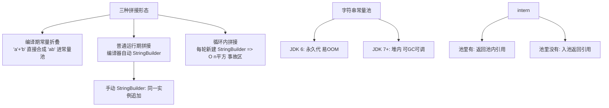

# 字符串与常量池：不可变设计的代价与红利

> **一句话摘要**：String 的不可变设计（final 类 + final 数组 + 无修改口）是字符串一切行为的总根源——安全（防 TOCTOU）、性能（哈希缓存）、共享（常量池）三大红利由此来；拼接、判等、intern 的所有坑，都是「不可变」这个设计决定的账单。

## 🎯 本文核心

**核心一句话：String = 「不可变内核 + 配套生态」的设计样本——不可变换来安全/缓存/共享三大红利，代价（修改即新对象）由 StringBuilder/常量池/G1 去重这套配套生态分期偿还；理解「设计决定行为」，拼接、判等、内存的坑都能从根源推出来。**

机制链：不可变设计 → 三大红利 → 拼接三形态（折叠/自动 SB/循环事故区）→ 常量池演进（永久代→堆）→ intern 与 G1 去重。前置阅读：[对象与类](./3_对象与类-入门.md)（final 语义）。

## 一、质疑者追问链：不可变真的好吗

**质疑**：String 设计成不可变，每次改都要新对象，这不是很浪费吗？为什么 JDK 团队坚持这个设计？

**追问一层：不可变到底换来了什么，值得付「修改即新对象」的代价？** 三笔账：① 安全——String 是最通用的参数载体（文件路径、连接串、类名），可变的话「校验路径」与「打开文件」之间内容可被篡改（TOCTOU 漏洞）；② 哈希缓存——不可变才敢把 hashCode 算一次缓存起来（String 作 HashMap 键的高频场景因此提速）；③ 共享——不可变才可全 JVM 安全共享一份（常量池的语义基础）。三笔账都是**架构级的**：不是性能小优化，是「字符串作为基础设施类型」的成立前提。

**再追问一层：那为什么是 final 类？允许继承加个可变子类不行吗？** 不行——如果 String 可被继承，任何代码都能传一个「重写了 equals/charAt 的恶意子类」进来，不可变承诺在子类里作废，安全账全部作废。**final 类不是防御性编程的洁癖，是「不可变承诺」的密封条**——承诺要成立，密封必须彻底（设计思想：不可变模式的完整性要求——类型封闭、字段私有 final、无暴露修改口，缺一不可）。

**再深一层：这个设计有没有它自己后悔的地方？** 有——JDK 9 把内部 char[] 改成 byte[]（JEP 254 紧凑字符串，Latin-1 省一半内存），说明「内部表示」当年选大了；但「不可变」这个**外部契约三十年没动过**——演进发生在实现层，契约层保持稳定（「内核稳定 + 外围增强」的设计模式，与 JVM 的演进史同构）。

## 二、拼接的三种形态：免费、自动、事故区

- **编译期常量折叠零成本**：两个字面量拼接在编译期合成一个字面量进池——`"a" + "b"` 与 `"ab"` 是同一个对象。
- **运行期拼接编译器自动 StringBuilder**：单次 `a + b` 编译器已优化，**没必要手动**——「拼接必须手动 StringBuilder」的一刀切是误传。
- **循环内拼接是事故区**：编译器只优化单表达式——循环体里的 `+=` **每轮新建一个 StringBuilder**，n 轮 = O(n²) 的数组复制，百万级循环秒级卡顿。当时排查过一个导出接口：万行 CSV 用 `+=` 拼，接口 30 秒超时；`StringBuilder` 提到循环外 + 预估容量后 800ms。**复盘**：这类问题 code review 比 profile 更早发现——`+=` 出现在循环里就该抬手。

## 5W 速记卡

| 维度 | 内容 |
|---|---|
| What | 不可变机制 + 常量池 + 三种拼接形态 + 现代增强 |
| Why | 安全/共享/哈希缓存三大动机造就不可变设计 |
| When | 拼接性能、判等 bug、字符串内存治理 |
| Where | 堆与常量池（JDK 7+ 都在堆） |
| How | 循环 SB + equals 判等 + join/format 分场景 + 去重替代 intern |

## 三、常量池与判等：池语义的完整账

- **常量池演进**：JDK 6 在永久代（大小受限易 OOM）；JDK 7 起移入堆（可 GC、可调）——「String 占永久代」的老知识要按版本更新。
- **`==` vs equals**：字面量（编译期确定）进池后 `==` 可判等（同一池内引用）；`new String` 强制堆上新对象（`==` 为 false）——**工程铁律：字符串判等永远 equals**。当时踩过一个坑：两处代码一处字面量一处 `new String`，`==` 判等测试环境碰巧真（都走池）生产环境假——判等纪律 equals 是唯一安全解。
- **intern 的价值与陷阱**：大量重复长字符串 intern 后共享一份省内存；但池查询有开销 + JDK 6 永久代 OOM 的历史事故——现代用法优先 G1 字符串去重（`-XX:+UseStringDeduplication`）做自动版，intern 退居「量大且高度重复」的特定场景。

## 四、与数组和 StringBuilder 的区别

- **String vs 数组**：数组可变无保护，String 不可变有契约——「要安全共享用 String，要高频修改用数组/缓冲」。
- **String vs StringBuilder**：不可变（线程安全、可共享）/ 可变非线程安全（单线程拼接主力）——**配合使用**：不可变承载结果，可变承载过程。
- **String vs char[]（密码场景）**：String 不可变会驻留到 GC，char[] 用完可显式清零——密码载体选 char[] 是安全惯例，这是不可变的边界案例。
- **本篇 vs JVM 篇**：常量池的运行时定位与去重的 GC 联动在[运行时内存区域](./26_运行时内存区域-入门.md)展开——本篇管类型语义，组 5 管运行时。

## 五、典型场景

- **Map 键**（高频）：不可变保证哈希稳定 + 哈希缓存提速。
- **日志拼接**（热路径）：占位符懒求值（`log.info("{}", x)`）+ 循环外 StringBuilder。
- **协议报文**（大流量）：网关层避免频繁 String 化——零拷贝/ByteBuf 方案（Netty 地基）。

## 六、常见误区与代价

- **「拼接必须手动 StringBuilder」**：单次拼接编译器已优化——只有循环/超长链式才必须手动，一刀切牺牲可读性。
- **「常量池在永久代」**：JDK 7 起移入堆——老知识要按版本核对。
- **「intern 多用省内存」**：池管理有成本，现代优先 G1 字符串去重，intern 退居特定场景。
- **不适用**：超高频修改（用缓冲）、密码存储（char[]）、超大文本（流式处理）。

## 七、你们可能会问

- **`new String("abc")` 创建几个对象？** 「看情况」：字面量池中已有则只 new 一个堆对象；没有则池内一个 + 堆一个——背「两个」不如理解「池与堆是两个空间」。
- **为什么 JDK 9 把 char[] 改成 byte[]？** 大量字符串是 Latin-1（单字节可表示），char（2 字节）浪费一半——byte[] + 编码标记自适应（Compact Strings，JEP 254）。
- **文本块与普通字符串运行时有区别吗？** 无——文本块只改变源码书写形态，编译产物相同。

## 八、开放问题

- 字符串模板（JDK 21 预览后撤回重设计）说明「语言级模板」仍在寻找正确形态——它会以什么形态回归？
- 不可变设计在值类型（Valhalla 项目）时代怎么演进——「不可变 + 栈上分配」是否是字符串性能的下一站？

## 九、自测三问

1. 不可变设计换来哪三大红利？各自的机制根源是什么？
2. 循环内拼接为什么是 O(n²)？编译器为什么救不了？
3. `==` 与 equals 的判等纪律是什么？什么场景 `==` 碰巧可用但依然不该用？

## 🎯 核心带走

- **核心一句话**：String = 不可变内核（final 密封）+ 配套生态（SB/常量池/G1 去重）——三大红利（安全/缓存/共享）是因，拼接与判等的纪律是果
- **链条复述**：不可变 → 红利 → 拼接三形态 → 常量池演进 → 紧凑化与去重
- **失效点与边界**：循环 `+=` 事故区；密码用 char[]；超大文本流式；`==` 判等永远换 equals

## 💡 实战提示

- 💡 循环拼接手动 SB 且预估容量（`new StringBuilder(预估长度)` 免多次扩容）。
- 💡 判等一律 `Objects.equals(a, b)`——NPE 免疫 + 不依赖池语义。
- 💡 split 注意正则元字符（`split(".")` 返回空数组，要 `split("\\.")`）。
- 💡 大量重复长字符串先试 G1 去重，再考虑 intern。
- 💡 密码载体用 char[]，用完显式清零。

## 决策速查（什么时候用什么）

拼接按「循环与否」选型（循环外手动 SB/单次交给编译器）；判等一律 equals；驻留场景优先 G1 去重；「字符串纪律五条」进 code review 清单。

**Trade-off（代价与反方案）**：不可变用「修改即新对象」换「安全/共享/缓存」；反方案——可变缓冲（StringBuilder/char[]）管修改性能、手工 intern 省内存（代价是池语义复杂度）——**不可变内核 + 可变工具的搭配是权衡的最终答案**。

**演进视角**：String 从 char[] 到 byte[]（JDK 9 紧凑化）、池从永久代到堆（JDK 7）、手工 intern 到 G1 去重——「不可变内核 + 运行时持续优化」让最古老的类型保持现代性；字符串的演进史就是 JVM 演进的缩影。

---

## 📌 数据与事实声明

String 内部实现（byte[] 紧凑字符串 JEP 254、常量池位置 JDK 7 迁移、G1 去重 JDK 8u20+）为 OpenJDK 官方 JEP 与源码公开内容；文本块（JDK 15 正式）/字符串模板撤回（JDK 23）为 JEP 公开记录。以官方文档为准。

## 📚 参考资料

| 类型 | 标题 | 来源 |
|---|---|---|
| 文档 | JEP 254（Compact Strings）/ JEP 368 相关 | openjdk.org/jeps |
| 图书 | Java 核心技术 卷I（字符串章节） | Pearson（2022） |
| 图书 | Effective Java 第 3 版（字符串相关条目） | Addison-Wesley（2019） |
| 系列文章 | 运行时内存区域（第 26 篇） | 本仓库同系列 |
