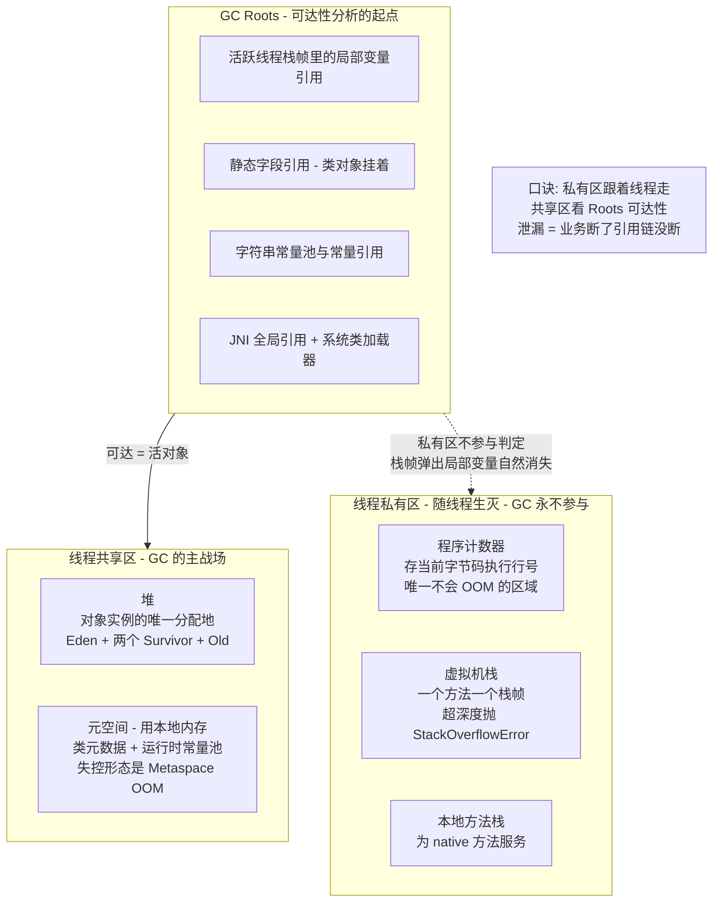
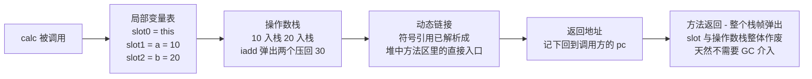
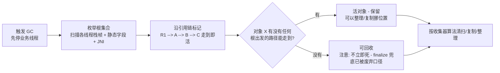
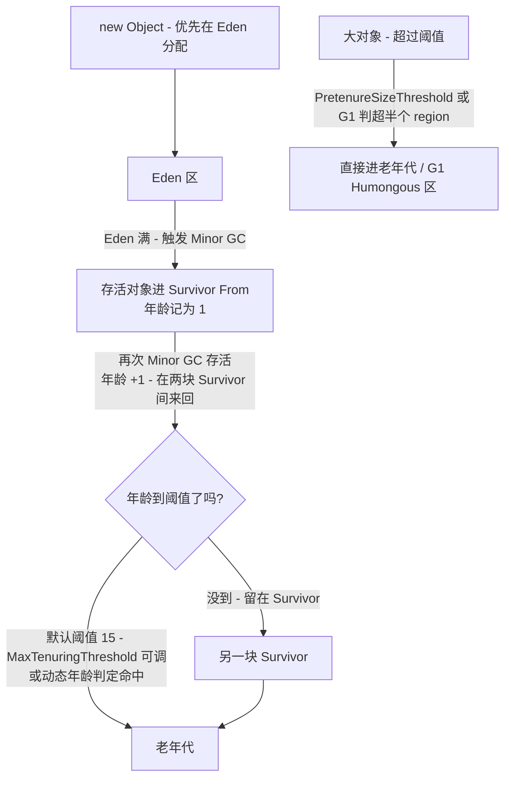
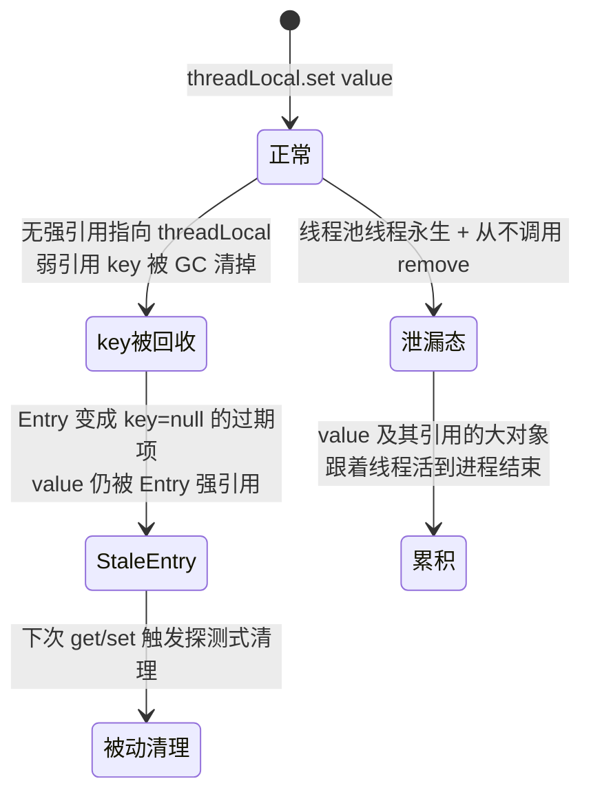
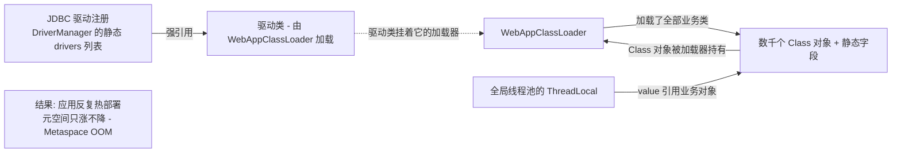
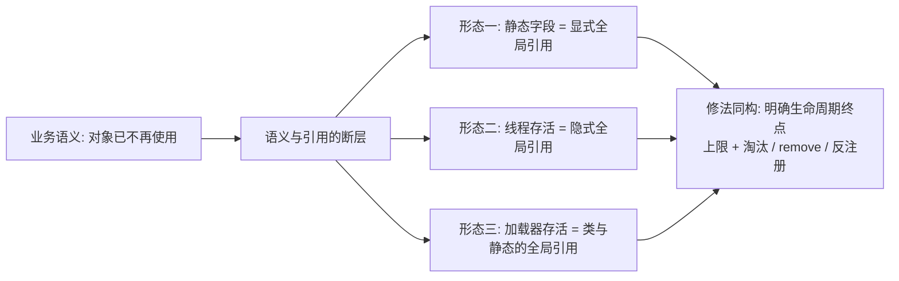
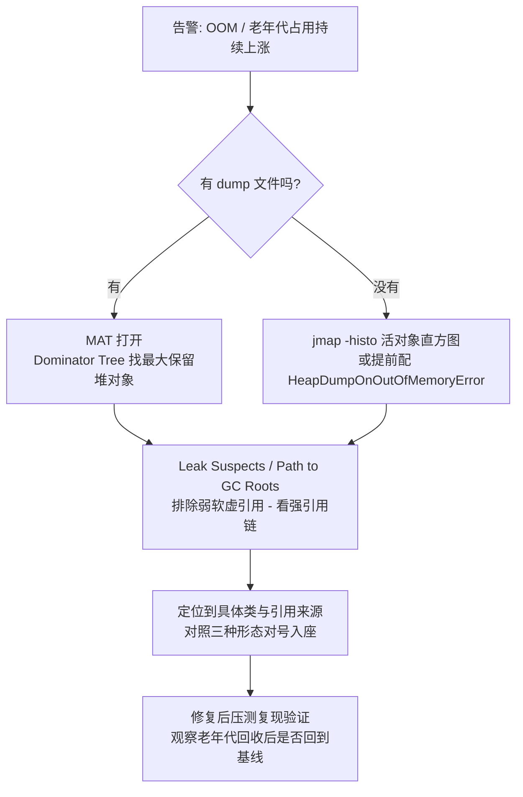

# JVM 运行时数据区与 GC Roots：谁在用、谁该收、谁收不走

> 堆、栈、元空间、程序计数器各自存什么、谁创建、谁回收？GC 为什么一定要先枚举 GC Roots？对象晋升老年代的三条路分别由什么参数把守？更关键的是——为什么有些对象「逻辑上已经是垃圾、GC 却永远收不走」？本篇把数据区的职责边界、可达性分析的起点、晋升规则与三种经典泄漏形态一次讲透，落到参数级与排查级。

## 一句话摘要

运行时数据区的本质是一张**「生命周期责任表」**：线程私有区（程序计数器/虚拟机栈/本地方法栈）随线程生灭、GC 永不参与；线程共享区（堆/元空间）才是 GC 的主战场。GC 判定回收与否不看「有没有引用」而看「从 GC Roots 出发可不可达」——静态字段、活跃线程栈帧、JNI 引用这些根只要还挂着，哪怕业务代码永远不再访问那个对象，它也回收不掉。ThreadLocal 忘 remove、静态集合只进不出、类加载器被挂住，是「垃圾但不可回收」的三种最典型形态。

## 🎯 本文核心

**核心一句话：GC 回收的正确性建立在「根枚举」之上——数据区划分决定了「去哪里找根」（线程栈帧、静态字段、JNI），可达性分析决定了「谁算活」（从根出发的引用链），而一切内存泄漏的本质都是「业务已经不用了，但引用链上还有一根没断」。**

机制链（本篇结构挂这条链上）：五个区域的职责与回收责任 → GC Roots 枚举清单与设计原因 → 对象晋升老年代的三条路径 → 三种「垃圾但不可回收」的泄漏链 → 参数级排查工具链 → 量级分档下的内存策略。

## 一图看懂：运行时数据区与回收入口



## 一、五个区域各自干什么：一张生命周期责任表

先回答最容易被含糊带过的问题：为什么要分区？因为**不同数据的生命周期不同**——方法参数和局部变量跟方法调用同生共死，对象实例跟「谁还在引用它」绑定，类元数据跟类加载器绑定。分区就是把不同生命周期的数据关进不同的笼子，让回收策略可以分而治之。这是分区机制背后的设计思想：**按生命周期隔离，是所有回收算法能工作的前提**。

| 区域 | 存什么 | 谁分配 | 谁回收 | 失控形态 |
|---|---|---|---|---|
| 程序计数器 | 当前线程执行的字节码行号 | JVM | 随线程消失 | 无（唯一不 OOM） |
| 虚拟机栈 | 栈帧：局部变量表/操作数栈/动态链接/返回地址 | 每次方法调用压栈 | 方法返回弹栈 | StackOverflowError / OOM |
| 本地方法栈 | native 方法的调用状态 | JNI 调用 | native 返回 | StackOverflowError / OOM |
| 堆 | 对象实例与数组 | new / 逃逸分析后栈上分配 | GC | OutOfMemoryError: Java heap space |
| 元空间 | 类元数据、方法字节码、运行时常量池 | 类加载时 | 类卸载时 | OutOfMemoryError: Metaspace |

（以上分区与异常形态为 JVM 规范与主流实现公开口径。）

追问一层：**为什么栈溢出和堆溢出是两种完全不同的病？** 因为栈的生命周期是「调用帧」——深度递归让帧堆到线程栈上限（主流 JDK 默认线程栈约 512KB-1MB 一档，公开口径，`-Xss` 可调）；而堆的病是「活对象总量超过堆容量」。一个看调用深度，一个看存活集合大小，排查入口从第一天就不一样。

### 栈帧拆开看：一次方法调用的完整档案

栈帧是理解「私有区为什么不需要 GC」的最小单元。拿一段最普通的代码看它装了什么：

```java
public int calc() {
    int a = 10;
    int b = 20;
    return a + b;   // 断点停在这行时，栈帧里是什么？
}
```



这张图就是栈帧的**组件四要素**齐活的样子：它的本质结论是「方法调用的一次性执行档案，进栈出栈即生灭」；实现原理入口在字节码层（javap 反编译可见 load/store/iadd 指令对局部变量表与操作数栈的操作）；它依赖的是线程私有的栈空间（`-Xss` 定大小）；会出问题的代码形态是「无边界递归」或「每个栈帧过大」（如超长参数列表、深层 JSON 递归解析），前者抛 StackOverflowError，后者在栈总容量上 OOM。

## 二、GC Roots：哪些是根、为什么偏偏是它们

可达性分析的基本算法课本都讲：从根集合出发，沿着引用链遍历，走到的是活对象，走不到的是垃圾。但**追问一层：为什么根偏偏是这几样？** 真相是——根的定义不是「重要的对象」，而是「**不需要再分析就确定有人在用的对象**」：

| GC Roots 类别 | 为什么算根 | 典型例子 |
|---|---|---|
| 活跃线程的栈帧局部变量 | 线程正在执行的代码马上就要用它 | `var list = new ArrayList()` 的 list |
| 方法区类静态字段 | 类对象生命周期与类加载器一致，静态字段是「全局变量」 | `static Cache CACHE` 挂着的一切 |
| 字符串常量池与常量引用 | 运行期间随时可能被拼出来使用 | `"hello"` 的驻留引用 |
| JNI 全局引用 | native 代码持有，Java 侧看不见 | 本地库登记的回调对象 |
| 活跃线程对象本身 | 线程在跑，Thread 对象及其上下文必须在 | 线程池里的 Worker |
| 同步锁持有的对象 | 别的线程正在 wait/notify 它 | `synchronized(lock)` 的 lock |
| JVM 内部引用 | 异常表、类加载器等自举需要 | NullPointerException 的预分配对象 |

设计逻辑一句话：**根集合 = 「引擎无需遍历就确定存活的引用来源」**。凡是「JVM 自己知道自己正在用」的引用，都进根；凡是「需要沿着引用才能发现」的，都不进根、交给遍历判定。

### 可达性分析怎么跑：从根到回收判定



再追问一层：**为什么主流 JVM 不用引用计数（数引用个数归零即回收），非要选可达性分析这种更重的方案？** 反方案对比很清楚——引用计数实现简单、回收及时，但有两个硬伤：一是**循环引用收不掉**（A 引用 B、B 引用 A，计数都不归零，哪怕外面没人用），二是**计数维护是全局热点**（每次赋值都要改计数，多线程下是原子操作开销）。可达性分析天然解决循环引用（互相引用但根不可达，照样判定为垃圾），代价是 GC 时需要一致性的快照——这就是为什么根枚举要 STW，为什么 HotSpot 用 OopMap/安全点把「扫描哪些位置是引用」提前记录好。两种方案的本质差异是设计哲学：引用计数把「回收判定」摊派到每次赋值，可达性分析把判定集中在 GC 时刻批量做。

## 三、对象什么时候进老年代：三条晋升路径

对象不是「活得久一点」就自动进老年代，而是有明确的三条路径，每条路径都有参数把守：



三条路径与把守参数（默认值为官方公开口径）：

| 路径 | 触发条件 | 关键参数 | 说明 |
|---|---|---|---|
| 年龄晋升 | Minor GC 存活次数达到阈值 | `-XX:MaxTenuringThreshold`（默认 15） | HotSpot 还有动态年龄判定：Survivor 中同龄对象总大小超过其一半，该年龄以上整体提前晋升（业内认知） |
| 大对象直入 | 体积超过阈值 | `-XX:PretenureSizeThreshold`（Serial/ParNew 生效）；G1 按超半个 region 判 Humongous | 避免大对象在 Survivor 间来回复制 |
| 空间分配担保 | Minor GC 前老年代连续空间不足 | `-XX:HandlePromotionFailure`（新版本已简化规则） | 担保失败会触发 Full GC，是线上毛刺的常见来源 |

追问一层：**为什么阈值默认是 15？** 因为 HotSpot 对象头的分代年龄字段只给了 4 个 bit，最大值就是 15（公开口径）。所以这个默认值不是精调出来的「经验最优」，而是**底层结构决定的硬上限**——这是「参数背后有结构约束」的典型样本，改参数之前先看结构给没给这个自由度。

再追问一层：**动态年龄判定为什么存在？** 打破砂锅问到底：如果只认硬阈值，一批同时创建的大流量对象（比如一次批量导入的缓存）会在 Survivor 里堆积到同一个年龄，等到阈值一起搬家，中间那段 Survivor 空间被占满会提前触发担保。动态判定让「明显活得久的一批」提前走人，Survivor 始终留有余量——用提前晋升换 Survivor 的稳定。

## 四、垃圾但不可回收：三种经典形态

这是本篇价值密度最高的部分。GC 不是万能的——**可达性分析的判定逻辑决定了：只要还有一根引用链从 Roots 长到对象上，哪怕业务代码永远不再用它，它就是收不掉的「僵尸对象」**。三种最典型的形态：

### 形态一：静态集合只进不出

```java
public class OrderCache {
    // 本意：缓存热数据。实际：成了对象坟场
    private static final Map<String, Order> CACHE = new ConcurrentHashMap<>();

    public static void put(String id, Order order) {
        CACHE.put(id, order);   // 只有 put 没有 evict
    }
}
```

泄漏链一眼可见：`静态字段 CACHE`（本身是 GC Root）→ ConcurrentHashMap 内部 Node 数组 → 每个 Order 及其引用的商品/用户/大字段对象。订单量一增长，缓存把自己变成堆里最大的「合法占用者」，直到 `Java heap space`。**它不是 Bug 级的引用错误，是设计级的容量失控**——没有上限、没有淘汰策略的缓存，等于把 GC Root 当成了无限延长线。

### 形态二：ThreadLocal 忘 remove（线程池场景放大器）

ThreadLocal 的底层结构是每个 Thread 内部一张 ThreadLocalMap，Entry 的 key 是对 ThreadLocal 对象的**弱引用**，value 却是**强引用**。这个不对称设计是理解它的关键：



为什么 key 设计成弱引用？设计思想是**自愈兜底**：业务代码把 ThreadLocal 变量本身丢弃后（局部变量出栈），key 下次 GC 就被回收，Entry 变成「过期项」，后续 get/set 时探测式清理会顺手清掉 value。但这个兜底是**被动的**——线程池里的核心线程几乎不死，如果代码从来不调 `remove()`，且之后不再触碰这个 ThreadLocal，value 连同它引用的大对象就一直挂在 `Thread → ThreadLocalMap → Entry.value` 这条强引用链上。**真相是：弱引用救的是 key，从来救不了 value；value 的唯一保证是 remove()。**

### 形态三：类加载器泄漏（元空间形态）

类卸载的苛刻条件（三者同时满足，公开口径）：该类的全部实例已回收 + 加载它的 ClassLoader 已回收 + 对应 Class 对象无引用。只要 ClassLoader 被挂住，它加载的**所有类、所有静态字段**整体成为僵尸。典型引用链：



排查复盘视角看一次典型事故：某个应用每次发布都热部署一次，运行两周后 Metaspace 告警，容器开始重启。第一次排查以为是类加载过多，加了 `-XX:MaxMetaspaceSize` 顶住；第三次复盘才用 MAT 打开 heap dump，在 Dominator Tree 里看到多个 WebAppClassLoader 实例同时存活——旧版本的 ClassLoader 被 DriverManager 里注册的驱动引用挂住，旧类的静态缓存跟着旧 ClassLoader 一起赖着不走。修复口径：驱动用反注册（`Servlet.removeListener`/手动 `deregisterDriver`）或把驱动放到容器共享层，避开应用加载器。

### 三种形态的共同底层结构



三种形态表面症状不同（堆 OOM / 堆慢性膨胀 / 元空间 OOM），底层结构完全一致：**某个「天然长命」的实体（静态字段、池化线程、ClassLoader）充当了全局引用的载体**。修法也同构：给缓存加上限与淘汰，给 ThreadLocal 配 remove 纪律，给动态加载配反注册。

## 五、源码关键路径与排查工具链

机制穿透到工具层，排查内存问题有一条固定的路径：



关键配置与工具（全部为公开口径）：

| 工具/参数 | 用途 | 备注 |
|---|---|---|
| `-XX:+HeapDumpOnOutOfMemoryError` | OOM 时自动留现场 | 配 `-XX:HeapDumpPath` 指定落盘位置，事故排查的第一现场 |
| `jmap -histo:live <pid>` | 活对象直方图，快速看谁最多 | 触发 Full GC，生产上注意时机 |
| `jstat -gcutil <pid> 1000` | 秒级观察各代占用与 GC 次数 | 判断「涨了不回收」还是「回收了又涨」 |
| MAT Dominator Tree | 找保留堆最大的对象 | 配合 Path to GC Roots（排除弱引用）看泄漏链 |
| `-Xlog:gc*`（JDK 9+ 统一日志） | GC 日志 | 本系列第 1 篇有完整解读 |

## 六、不同量级的思考：架构约束驱动解法

### 十万级：单体小服务的内存策略

这一档的核心问题是**「让默认参数稳定工作」，而不是「深度调优」**。约束来源是流量与对象量都有限，默认分代参数 + `-Xss` 默认栈 + 默认 15 的晋升阈值，配合 HeapDumpOnOutOfMemoryError 兜底就够。要守住的纪律只有两条：缓存必须带上限，ThreadLocal 用完必须 remove。这一档用「默认参数驱动」的思考方式就够了：自下而上看，问题几乎都源于业务代码的引用纪律，而不是 JVM 参数；触发升级的信号是老年代在无发布的情况下持续爬坡，或单机开始撑不住对象驻留量。

### 千万级：大堆服务的晋升与回收策略

这一档的核心问题是**「晋升速率与回收停顿的平衡」，而不是「堆越大越好」**。约束来源是堆到 8GB 以上量级后，一次 Full GC 的代价从「可感知」变成「不可接受」，动态年龄判定、大对象阈值、分配担保开始真实影响毛刺——需要按 GC 日志确认晋升速率，考虑换 G1 并给 Humongous 对象单独预算，容器化部署还要注意堆与机器内存的边界配比。这一档切换成「晋升速率驱动」的思考方式：自下而上看，要做的是让三条晋升路径的数据可观测（晋升速率、动态年龄触发频率、Humongous 占比）；触发升级的信号是回收停顿开始影响接口尾延迟，或单机内存预算被多进程挤压。

### 亿级：平台化与多租户的类与堆双预算

这一档的核心问题是**「堆之外还有元空间与堆外内存两个战场」，而不是「只看 -Xmx」**。约束来源是插件化/多租户平台会动态加载大量类（规则引擎、脚本、动态生成的代理类），类数量与 ClassLoader 数量本身成为资源，类加载器泄漏从「偶发事故」升级为「平台性风险」，必须建立 ClassLoader 存活审计与元空间预算。这一档换成「预算驱动」的思考方式：自下而上看，内存治理是三层预算——堆预算（分代与收集器）、元空间预算（类数量与加载器治理）、堆外预算（直接内存与 native 统计）；触发升级的信号是元空间随发布次数单调上涨不可恢复，或 native 内存增长快于堆。

跨档回看会发现：这一档的核心问题是所有档位同构的——**让回收机制与业务生命周期对齐，而不是事后抢救**；量级变化的只是「对齐的成本」与「失控的爆炸半径」，这是量级演进视角下内存治理不变的主线。

## 七、业内惯例与生产实践

- **缓存三件套纪律**：上限容量 + 淘汰策略 + 命中率监控。业内大量事故复盘的根因都是「缓存没有上限」，静态 Map 裸奔是最高频的堆泄漏来源（业内认知）。
- **ThreadLocal 纪律**：`try/finally` 里 `remove()`；线程池场景把 ThreadLocal 视为「必须显式归还」的资源。框架代码（如日志链路追踪实现）普遍在拦截器层统一清理，把纪律工程化。
- **发布与元空间联动监控**：热部署/动态类生成的应用，把「每次发布后的 Metaspace 基线」做成监控项，基线抬升 = 类加载器没释放。
- **Dump 现场第一**：OOM 第一现场比任何事后推理都值钱，HeapDumpOnOutOfMemoryError 是几乎所有团队的标配（业内认知）。
- **一次真实的排查叙事**：某服务堆占用持续爬坡但从不 OOM，团队先怀疑缓存，压测复现不了。后来用 `jstat` 发现老年代「回收了又快速涨回」，dump 分析发现最大保留堆是一批连接包装对象，根链是 `静态 Map → 停止使用的旧连接池`——业务早已切换新连接池，旧池实例因为挂在静态字段上一直没释放。复盘结论写进了团队规范：**下线组件必须同步清空静态引用**。

## 八、追问链：打破砂锅问到底

**追问一：可达性分析既然要 STW 枚举根，为什么不把根枚举做得更快一点、干脆不 STW？** 再深一层：根枚举的难点不是「遍历」而是「一致性」——业务线程一边改引用一边扫，扫到一半引用被改，判定就错了。所以工程解法不是「加速扫描」而是「少扫」：HotSpot 用 OopMap 在类加载/即时编译时就把「栈上哪些位置是引用」记录下来，枚举时照表收兵，把 STW 压到毫秒级；G1 更进一步用记忆集把跨代引用登记好，避免全堆扫描。（为什么不用单纯的引用计数？见第二节反方案分析——循环引用收不掉。）

**追问二：动态年龄判定这么聪明，为什么还要保留 MaxTenuringThreshold 参数？** 再深一层：动态判定是「Survivor 空间压力下的应急通道」，硬阈值是「确定性的生命线」。只留动态判定，Survivor 一紧张就提前晋升，老年代晋升速率失控；只留硬阈值，Survivor 装不下同批对象时只能走担保。两者是**稳态路径与应急路径**的组合，不是冗余。

**追问三：ThreadLocalMap 既然有探测式清理，为什么不干脆在 GC 后全量清理过期项？** 打破砂锅：全量清理意味着 GC 后要对所有线程的 ThreadLocalMap 再扫一遍，成本等价于把清理做成了另一种 GC；且线程私有的 Map 本来就是「谁使用谁负责」的契约。设计上选择了「key 弱引用自动过期 + 使用时顺带清理」的折中，把确定性清理的责任留给 `remove()`——这是「机制兜底 + 契约保证」分工的教科书案例。

## 💡 实战提示

💡 **先看形态再上工具**：堆 OOM、元空间 OOM、栈溢出三种病的第一时间处置完全不同（dump 分析 / 查类加载与发布历史 / 查递归与调用深度），告警文案里先看异常类型再动手，能省一半排查时间。

💡 **`jmap -histo:live` 两次对比法**：间隔几分钟各来一次直方图，两张图里「持续增长且 Full GC 后不回落」的类，就是泄漏嫌疑榜单的第一页。

💡 **MAT 里排除弱引用看强链**：Path to GC Roots 默认会列出所有引用，勾选「exclude weak/soft references」再看，剩下的强引用链才对应「收不走」的真相——不排除弱引用会把 ThreadLocal key 的正常回收误判成泄漏。

💡 **容器里堆大小留余量**：容器内存限额要给元空间、线程栈、直接内存留预算，堆配满限额是 `unable to create native thread` 与容器 OOM Kill 的常见来源（业内认知）。

## Trade-off：可达性分析的代价账本

| 收益 | 代价 | 边界 |
|---|---|---|
| 天然处理循环引用 | 根枚举需要一致性快照（STW） | 安全点/OopMap/记忆集把代价压到最低 |
| 判定结果全局正确 | GC 时刻集中付出成本，停顿可感知 | 增量/并发标记分摊成本（G1/ZGC 路线） |
| 根集合清单明确，泄漏可归因 | 「根上的对象」完全豁免于 GC | 静态字段/ThreadLocal/加载器纪律必须靠人来守 |

取舍的核心：可达性分析把「正确性」做满，把「根上对象的纪律」留给人。所有泄漏治理工具（缓存淘汰、引用队列、加载器审计）本质都是在给「人守的那部分」补自动化。

## 什么时候用得上这份知识 / 什么时候不必

**值得深究**：做内存泄漏排查（必须懂根集合与引用链）；设计缓存与池化组件（生命周期责任在自己手里）；平台化产品涉及动态类加载（元空间预算）。**不必深究**：普通业务 CRUD 开发里争论「这个临时对象在 Eden 还是 TLAB」——编译器与 JVM 的分配优化远比直觉聪明，把精力放在引用纪律与监控基线上收益高得多。明确推荐：所有服务从第一天带上 HeapDumpOnOutOfMemoryError 与 GC 日志，这两个是「事后能查」的保险。

## 你们可能会问

**Q1：程序计数器为什么必须是线程私有的？** 因为线程切换后要恢复到正确的执行位置，每个线程需要独立的行号记录。如果共享，切换回来就不知道该从哪继续执行——它是五区域里唯一在 JVM 规范里没有规定任何 OOM 情况的区域（公开口径）。

**Q2：元空间取代永久代之后，类卸载问题解决了吗？** 没有。从永久代到元空间的演进只是把存储从 JVM 堆挪到本地内存，缓解了容量上限问题，**类卸载的条件一个字都没变**——ClassLoader 被挂住，类照样卸不掉，只是溢出报错从 `PermGen space` 变成了 `Metaspace`。泄漏的根因在引用链，不在存储位置。

**Q3：对象一定分配在堆上吗？** 不一定。逃逸分析开启后，未逃逸出方法的小对象可能标量替换在栈上分配；大数组可能直接进老年代；堆外还有直接内存。但「对象优先在 Eden 分配」仍是主干规则，特殊路径都有明确的触发条件。

**Q4：为什么我的服务没有 OOM，堆占用却一直缓慢爬升？** 这是慢性泄漏的标准形态：泄漏速度慢于 GC 回收速度，老年代每次回收都能腾出一点空间，但基线单调上升。用「回收后基线是否回落」替代「是否 OOM」作为监控信号，能在 OOM 之前几周发现问题。

## 留一个开放问题

弱引用/软引用/虚引用配合引用队列，能把「引用断开」做成可编程的事件（缓存框架、资源回收器都靠它）。但引用队列的投递时机由 GC 决定，业务无法确定性地感知「这个对象什么时候真正被收走」——如果把「对象生命周期的终点事件」做成语言级一等公民（类似确定性析构），内存泄漏问题会不会从「纪律问题」退化成「语言机制问题」？值得结合 Value Type 与外存管理的新提案持续观察。

## 5W 速记卡

| 维度 | 要点 |
|---|---|
| What | 五区域按生命周期分责；GC 以 GC Roots 可达性判定回收 |
| Why | 生命周期隔离才能分而治之；根集合是「无需遍历即确定存活」的引用来源 |
| When | 晋升三路径：年龄到阈值 / 大对象直入 / 担保触发 |
| Where | 根藏在栈帧、静态字段、常量池、JNI、活跃线程 |
| How | 泄漏治理三纪律：缓存上限 + ThreadLocal remove + 加载器反注册 |

## 自测三问

1. 一个对象只被一个静态 final 的 List 引用，业务已不再访问它，GC 能回收吗？为什么？
2. ThreadLocalMap 的 key 是弱引用，为什么 value 还是可能泄漏？remove() 断的是哪一环？
3. 为什么 MaxTenuringThreshold 最大只能是 15？这说明了参数与什么之间的关系？

## 🎯 核心带走

**运行时数据区是一张生命周期责任表：私有区跟线程走、共享区看可达性。GC Roots 的本质是「引擎无需遍历就确定存活的引用来源」，一切泄漏的本质是「业务断了引用链没断」——静态集合、ThreadLocal、类加载器只是这条断层的三种高频载体。晋升三路径（年龄/大对象/担保）各有关卡参数，而参数背后常有结构约束（4 bit 年龄字段定死 15 上限）。排查口诀：异常类型定战场，dump 直方图找大户，Path to GC Roots（排除弱引用）定元凶。**

## 📌 数据与事实声明

- 运行时数据区划分、异常类型、类卸载条件：依据 JVM 规范与主流实现公开文档表述；线程栈默认大小、`MaxTenuringThreshold` 默认 15、动态年龄判定等实现细节为公开口径，具体数值随 JDK 版本与收集器可能变化，以目标版本官方文档为准。
- 文中标注「业内认知」的经验值（如缓存泄漏为高频事故来源）来自公开技术社区与行业分享的常见结论，非任何特定系统的实测数据。
- 事故叙事已做匿名化与形态抽象，不指向任何真实公司、系统或数据；参数与代码均为教学示例。

## 📚 参考资料

| 资料 | 说明 |
|---|---|
| 《深入理解Java虚拟机》周志明 | 运行时数据区、GC Roots 枚举、对象晋升机制的系统性中文论述 |
| JVM 规范（The Java Virtual Machine Specification） | 运行时数据区与异常行为的规范性定义 |
| HotSpot 运行时源码注释（OpenJDK 公开仓库） | OopMap、安全点、记忆集等实现的公开参考 |
| JSR-133（Java Memory Model FAQ 公开版） | 可见性与引用语义的背景材料 |
| MAT（Eclipse Memory Analyzer）官方文档 | Dominator Tree 与 Path to GC Roots 的使用口径 |
