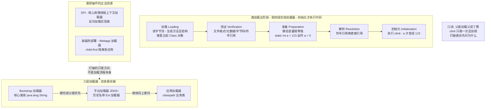
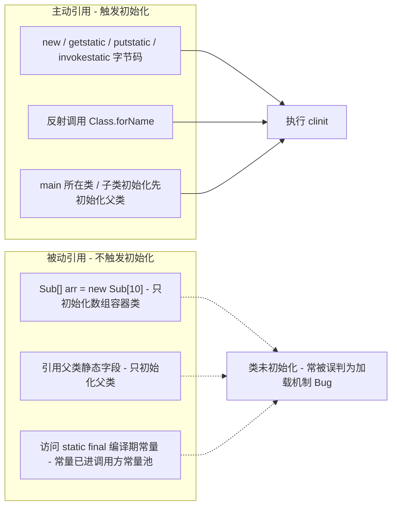
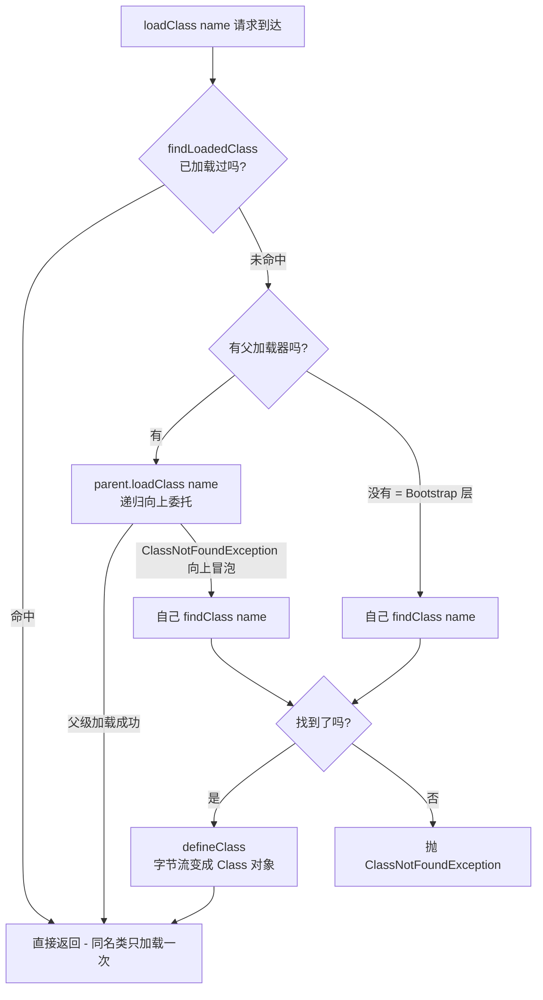
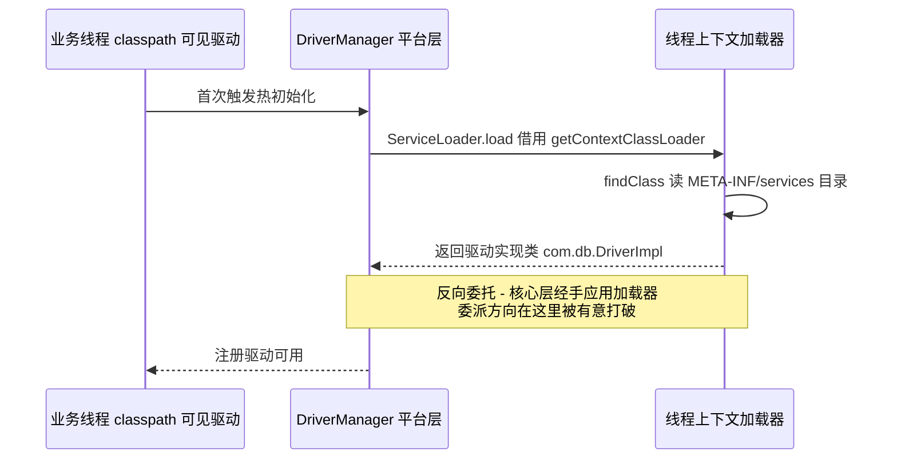
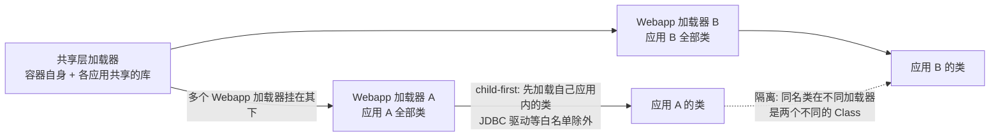
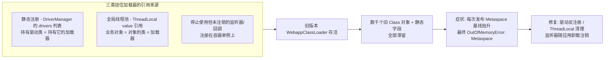
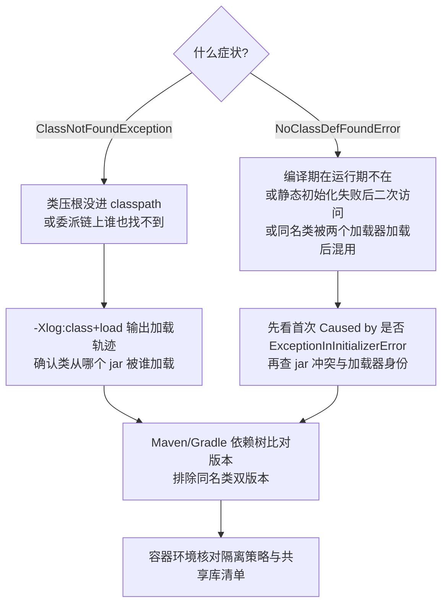

# 类加载机制与双亲委派：五阶段、安全设计与打破的正当理由

> 一个 class 文件从字节流变成可用的 Class，要经过加载、验证、准备、解析、初始化五个阶段——每个阶段在什么时机发生、静态变量在哪个阶段变成什么值？双亲委派为什么是安全设计而不只是「规矩」？SPI 与容器热部署为什么要打破它、怎么打破才正当？本篇落到 loadClass 源码路径与 ClassLoader 泄漏的事故形态，把「背概念」变成「看得见机制」。

## 一句话摘要

类加载的本质是**「把字节流变成方法区里的结构、并在堆里立起 mirror Class 对象」**的五阶段流水线；双亲委派的本质是**「把加载责任向上收拢，让核心类只有一种来源」**的安全设计——它同时解决了核心类防篡改与同名类全局唯一两个问题。打破它的场景也只有一个正当理由：**核心库反过来需要加载「它看不见的实现类」**（SPI/容器隔离）。而 ClassLoader 一旦被引用链挂住，它加载的全部类与静态字段整体滞留，这是元空间泄漏的头号来源。

## 🎯 本文核心

**核心一句话：类加载机制的全部复杂性都来自一个矛盾——「类必须由类加载器定义身份」与「运行环境希望类可以隔离、替换、按需产生」；双亲委派是这个矛盾在「单一稳定运行时」下的最优解，SPI 与热部署则是这个矛盾在「核心库需要发现实现」时的受控破坏。**

机制链（本篇结构挂这条链上）：五阶段时序与静态变量取值 → 三层加载器与 loadClass 递归路径 → 双亲委派的安全与唯一性论证 → SPI/Tomcat 两种受控破坏 → ClassLoader 泄漏的引用链形态 → jar 冲突与类加载问题的排查工具链。

## 一图看懂：五阶段流水线与委派链



## 一、五阶段各自干什么：静态变量的取值时间线

五阶段里最容易被含糊过去的是「准备」与「初始化」的分工。用一段代码把时间线钉死：

```java
public class OrderService {
    public static int a = 123;                  // 准备阶段 = 0，初始化阶段 = 123
    public static final int MAX = 300;          // 编译期常量，准备阶段就是 300
    public static OrderConfig cfg = new OrderConfig();  // 初始化阶段才真正 new
}
```

| 阶段 | 干什么 | 此刻 a 的值 | 关键细节 |
|---|---|---|---|
| 加载 | 读字节流 → 方法区结构 + 堆中 Class 对象 | 不存在 | 来源不限：文件/网络/动态生成 |
| 验证 | 文件格式/元数据/字节码/符号引用四道检查 | 不存在 | 安全防线，可关闭但不应关闭 |
| 准备 | 静态变量分配并赋**零值** | 0 | `static final` 编译期常量直接赋真值 |
| 解析 | 符号引用 → 直接引用 | 0 | 可在初始化后才惰性发生 |
| 初始化 | 执行 `<clinit>`（静态变量赋值 + static 块） | 123 | JVM 保证加锁且只执行一次 |

追问一层：**为什么准备阶段只赋零值、不直接赋 123？** 设计思想是**把「分配内存」与「执行代码」分离**——准备阶段是加载器的机械动作，赋值语句是程序逻辑；`new OrderConfig()` 这种带副作用的动作必须推迟到初始化阶段统一执行，否则静态变量的求值顺序会依赖加载顺序，产生「类还没初始化完就执行了用户代码」的不可控状态。

再追问一层：**`<clinit>` 为什么说「加锁且只执行一次」？** JVM 保证类的初始化是线程安全的——两个线程同时触发同一类初始化，一个执行 `<clinit>`，另一个阻塞等待；执行完成后永不重跑。这就是「静态单例」写法（静态字段 + 静态内部类）线程安全的机制根源，也是**静态初始化死锁**的来源：A 的 `<clinit>` 里触发 B 的初始化、B 又回头依赖 A，两个线程交错进入就可能互相等待。

### 主动引用与被动引用：初始化的触发边界

初始化是惰性的，只有「主动引用」才触发（规范公开口径，六种主动引用场景中最高频的三种）：



被动引用是理解「常量传播」的关键：`static final int MAX = 300` 在编译期就被折叠进调用方的常量池，运行期连目标类的初始化都不需要——所以改常量后只重编一半代码会出现「新旧值共存」的诡异现象，根因在这里。

## 二、双亲委派：loadClass 里的安全设计

三层加载器各管一段：Bootstrap 加载核心类库（如 `java.lang.String`），平台加载器（JDK 9+；历史上叫 Ext）加载扩展类，应用加载器加载 classpath 上的业务类。委派规则一句话：**收到加载请求，先交给父级，父级做不到才自己 findClass**。源码关键路径（简化到方法级，`java.lang.ClassLoader#loadClass` 公开口径）：



**为什么说它是安全设计？** 两个论证：

1. **核心类防篡改**：业务代码里写一个自己的 `java.lang.String`，委派链会把它一路送回 Bootstrap——核心层已经加载过真正的 String，直接返回，伪造版本根本没有机会被 defineClass。加载器层次把「核心类库的唯一来源」用结构固化了，不依赖任何运行时检查。
2. **同名类全局唯一**：JVM 里类的身份是「加载器 + 全限定名」二元组。没有委派，同一个类会被不同加载器重复加载成多个互不兼容的 Class——`instanceof` 失败、`ClassCastException`（明明是同一个名字却转型失败）这类幽灵问题全是这条规则被破坏后的症状。委派让「父级能给的类」天然只有一个副本。

追问一层：**为什么验证阶段要检查「元数据/字节码」这么多道？** 因为 defineClass 是把外部字节流注进运行时的唯一入口——字节码验证本质上是这道门的安检。打破双亲委派的容器环境里，安检责任从「信任父级已验证」变成「每个加载器自己负责」，这也是容器类加载器实现复杂度的主要来源。

## 三、破坏双亲委派的正当场景

打破不是 hack，是有明确正当理由的工程决策。两种主流形态：

### 场景一：SPI——核心库反过来要加载实现类

`DriverManager`（属于核心/平台层）要加载的数据库驱动（在 classpath，属于应用层）。按委派规则，核心层的加载器**根本看不见**应用层的类——父加载器可见的类，子加载器才可见，方向不可逆。Java 的解法是**线程上下文类加载器（TCCL）**：由发起调用的业务线程「借出」自己的应用加载器给核心库用：



打破的正当性论证：**委派方向是为「应用使用核心类」设计的，而 SPI 是「核心类使用应用实现」——方向反了，委派链自然要走反方向的通道**。代价是 TCCL 成为全局可变状态（`setContextClassLoader` 谁都能改），异步切换线程时忘记传递上下文加载器，SPI 发现就会失败，这是框架开发里最经典的隐形坑之一。

### 场景二：容器热部署——隔离优先于委派

Tomcat 要在同一进程里部署多个应用，且要求应用之间类隔离、应用可以单独重部署。它的 Webapp 加载器采用 **child-first（本地优先）**：先自己加载应用内的类，加载不到才委派给共享层——方向与标准委派恰好相反。打破的理由依然是结构性的：如果遵循父优先，两个应用各自带的不同版本同名类会被共享层先截胡，隔离就不成立。



注意细节：并非所有类都 child-first——JDBC 驱动这类要被容器层 SPI 发现的类走委派白名单（各容器实现有公开配置口径）。隔离设计与 SPI 需求在这里交汇，两类机制互相制约。

## 四、ClassLoader 泄漏：事故形态与引用链

热部署是类加载泄漏的头号场景。类的卸载条件苛刻（三条同时满足，公开口径）：该类全部实例已回收 + ClassLoader 已回收 + Class 对象无引用。只要加载器被挂住，它加载的**所有类与静态字段**整体滞留元空间：



排查复盘视角看一次典型形态：某应用每次热发布后元空间上涨约一段固定量、从不回落，最终 Metaspace OOM。第一轮排查以为是「类太多」，调大 `-XX:MaxMetaspaceSize` 只是推迟爆炸；第二轮用 heap dump 在 MAT 里看到**多个 WebappClassLoader 实例同时存活**，对旧加载器跑 Path to GC Roots，链头是全局注册表里的一个旧监听器——应用卸载时没人注销它。修复后把「注册即配对注销」写进组件规范，并把「每次发布后的元空间基线」做成监控项。这个事故的复盘结论很有代表性：**元空间泄漏九成不是「类太多」，是「加载器没放」**。

## 五、源码关键路径与排查工具链



两个高频混淆点的方法级区分（公开口径）：

| 对比项 | `Class.forName("X")` | `ClassLoader.loadClass("X")` |
|---|---|---|
| 是否执行初始化 | 默认执行 `<clinit>`（第二次参数可关） | 只加载不初始化 |
| 典型场景 | JDBC 驱动注册（靠静态块生效） | 容器/框架的惰性加载 |
| 抛出异常 | ClassNotFoundException | ClassNotFoundException |

`NoClassDefFoundError` 与 `ClassNotFoundException` 的区别也要钉死：前者是 Error（编译期存在、运行期找不到，或初始化失败后的连带失败——错误日志里找首次的 `ExceptionInInitializerError`），后者是受检异常（主动按名字找而没找到）。把两者混为一谈会把排查带向完全错误的方向。

## 六、不同量级的思考：架构约束驱动解法

### 十万级：单体应用的默认委派链

这一档的核心问题是**「让默认委派链不受干扰地工作」，而不是「自定义加载器」**。约束来源是单体应用的类来源只有 classpath 一个，双亲委派 + 验证机制开箱即用；要守的纪律只有两条——不写 `java.` 开头的自定义类名，不随意 `setContextClassLoader`。这一档用「默认机制驱动」的思考方式：自下而上看，类加载问题几乎全是 jar 冲突而非机制问题；触发升级的信号是 classpath 里同名类出现多个版本，或开始集成带 SPI 的框架。

### 千万级：微服务与容器化部署的隔离需求

这一档的核心问题是**「多应用的类隔离与共享库版本的平衡」，而不是「每个应用都扔进一个容器」**。约束来源是多应用共存后，共享层的每个库版本都成了全局契约，隔离层每次打破委派都要回答「这个类谁说了算」。这一档换成「隔离边界驱动」的思考方式：自下而上看，要显式管理共享层白名单与容器版本矩阵；触发升级的信号是共享层频繁为单个应用降级版本，或热发布后元空间基线不稳。

### 亿级：平台化产品的类数量与加载器治理

这一档的核心问题是**「类与加载器本身成为需要预算的资源」，而不是「加载机制是否正确」**。约束来源是平台型产品（规则引擎/插件体系/动态代理生成）会持续产生新类与新旧两代加载器并存的时间窗，元空间与加载器数量必须进入容量预算与审计。这一档用「预算驱动」的思考方式：自下而上看，治理动作是加载器生命周期审计（每个动态加载器必须有人负责关闭）、发布基线监控、类数量上限；触发升级的信号是发布次数与元空间基线同步单调上涨、或加载器数量随业务对象增长失控。

跨档回看：这一档的核心问题是所有档位同构的——**让「类的身份与生命周期」跟「它的加载器」绑定且可释放**；量级演进的只是隔离的复杂度与泄漏的爆炸半径。

## 七、业内惯例与生产实践

- **jar 冲突排查第一动作**：`-Xlog:class+load`（JDK 9+；旧版本 `-verbose:class`）打开加载轨迹，直接看目标类「从哪个 jar、被哪个加载器」加载——比翻依赖树快一个量级（业内认知）。
- **SPI 实现注册纪律**：实现写在 `META-INF/services/` 下，接口全限定名为文件名；框架代码借用 TCCL 后应当恢复原值，把「借了要还」作为框架开发的硬纪律。
- **Never override loadClass**：自定义加载器只覆盖 `findClass`——`loadClass` 里的委派与缓存逻辑是所有上层机制（缓存、委派、锁）的地基，覆盖它等于自己重写安全设计。
- **一次真实的排查叙事**：某服务升级依赖后随机抛 `NoClassDefFoundError`，且只在部分实例出现。排查发现日志里同名类分别从新旧两个 jar 加载—— fat 包构建残留了旧版本副本。复盘改进：构建产物增加「同名类多版本」检查，冲突直接失败而不是带病上线。
- **热部署应用的发布监控**：把「每次热部署后的元空间占用」记录为序列，基线抬升即告警——泄漏在第一次发布后就会留下痕迹，不必等 OOM。

## 八、追问链：打破砂锅问到底

**追问一：既然 child-first 隔离更好用，为什么 Java 默认不这么做？** 再深一层：默认委派要保证的是**核心类库的唯一性**——如果每个加载器都先加载自己，伪造的核心类（重写 `java.lang.String` 加后门）就能绕过 Bootstrap 直接生效，安全模型整体崩塌。Tomcat 敢 child-first，是因为它对应用内的类做了「核心前缀必须委派」的白名单约束，隔离是「受约束的打破」，不是「自由的打破」。

**追问二：SPI 为什么不直接把驱动也塞进核心层加载？** 再深一层：核心/平台层的可见范围在构建期就固定了，而驱动的种类与版本由部署方决定——把实现类塞进核心层等于要求「每次换驱动都升级 JDK」，可行性与安全模型都不允许。TCCL 是在「核心层不能看见应用类」与「核心层必须加载应用实现」之间架的桥，代价是全局可变状态，桥本身没有免费。

**追问三：为什么类的身份要用「加载器 + 全限定名」二元组，不用全限定名一个维度？** 打破砂锅：一维身份意味着全 JVM 一个扁平命名空间，隔离、热替换、多版本共存全部不可能——「加载器即命名空间」是一切隔离机制（容器、插件、模块化）的元机制。身份设计的选择决定了上层能力的上限，这是「结构先于功能」的典型案例。

## 💡 实战提示

💡 **看到 NoClassDefFoundError 先找第一现场**：翻日志找首次出现的 `ExceptionInInitializerError`——静态初始化失败后该类被标记为「失败状态」，后续访问全部报 NoClassDefFoundError，直接修后者永远修不到根因。

💡 **类加载轨迹是排查的显微镜**：`-Xlog:class+load` 一开，同名类多版本、加载器身份混乱、意外提前加载全部现形，成本几乎为零（注意输出量大，建议只在排查时开）。

💡 **自定义加载器只覆盖 findClass**：需要突破委派顺序时，明确写注释说明打破的理由与白名单边界——打破委派的决定必须在代码里可追溯，不能只活在设计文档里。

💡 **发布基线监控元空间**：热部署/动态类生成场景，把「每次发布后的 Metaspace 值」做成时序，连续抬升即告警——这是加载器泄漏最早、最便宜的信号。

## Trade-off：委派与打破的代价账本

| 方案 | 收益 | 代价 | 适用边界 |
|---|---|---|---|
| 标准双亲委派 | 核心类唯一 + 防篡改 + 实现简单 | 无法隔离多版本、核心库看不见实现 | 单体应用、常规服务 |
| SPI + TCCL | 核心库可以发现应用实现 | 全局可变状态、跨线程要手动传递 | 有 SPI 发现需求的框架 |
| child-first 隔离 | 应用间隔离 + 独立热部署 | 白名单治理成本 + 泄漏风险集中 | 容器/多应用共存 |
| 模块化（JPMS） | 静态声明的显式依赖与强封装 | 迁移成本、动态性弱于加载器方案 | 平台类产品的长期方向（公开口径） |

取舍的核心：**委派换取的是「唯一性与安全」，打破换取的是「隔离与可发现」**——每次打破都要配套白名单与生命周期治理，否则代价以泄漏与幽灵异常的形式延迟到账。

## 什么时候用得上这份知识 / 什么时候不必

**值得深究**：排查 ClassNotFoundException/NoClassDefFoundError 与 jar 冲突（必须懂委派链与加载轨迹）；开发框架或 starter（TCCL 与 SPI 是日常工具）；维护热部署/插件化平台（加载器生命周期是稳定性主战场）。**不必深究**：普通业务开发里追问「这个类在哪个阶段解析」——解析时机是惰性的且对业务透明，把精力放在依赖收敛与冲突检查上的收益高得多。明确推荐：项目从第一天开启「同名类多版本」构建检查，这条纪律挡掉的问题比任何运行期排查都多。

## 你们可能会问

**Q1：`static` 块里抛异常后，这个类还能用吗？** 不能。初始化抛异常的类进入「失败状态」，再次访问不会重跑 `<clinit>`，而是抛 `NoClassDefFoundError`。所以静态初始化块里只做「必然成功」的事，可能失败的外部资源读取要延迟到使用时。

**Q2：两个不同版本的同一个类都在 classpath 上，JVM 用哪个？** 用委派链上**先到达**的那个——通常是 classpath 顺序里靠前的 jar（容器环境则取决于加载器层次与白名单）。这个「顺序决定论」就是 jar 冲突难缠的原因：本地和线上构建产物顺序不同，症状就不同。

**Q3：为什么 JDK 9 之后没有四层加载器了？** 模块化落地后，Ext 加载器的「扩展目录」机制被模块系统取代，简化为三层（Bootstrap/平台/应用），委派规则本身没变。理解层次关系比记住具体层数更重要——结构随演进调整，原理保持稳定。

**Q4：代码里怎么拿到「加载了我这个类的加载器」？** `X.class.getClassLoader()`。排查「类到底被谁加载」时，把两个来源不明的类的 ClassLoader 打出来对比，身份不同 = 隔离在起作用，也往往是 ClassCastException 的元凶。

## 留一个开放问题

TCCL 作为「借用通道」用线程属性承载了跨层加载语义，但它的读写都是全局可变状态，虚拟线程大规模落地后「线程 = 上下文」的假设还在多大程度上成立？模块化体系（JPMS Layer）能否在不依赖线程属性的前提下重新定义「实现发现」？这个问题决定未来十年框架发现机制的标准答案，值得持续跟踪。

## 5W 速记卡

| 维度 | 要点 |
|---|---|
| What | 五阶段流水线把字节流变成 Class；类的身份 = 加载器 + 全限定名 |
| Why | 双亲委派同时解决核心类防篡改与同名类唯一 |
| When | 初始化惰性触发（主动引用才触发）；准备赋零值、初始化才赋真值 |
| Where | 打破场景 = SPI 借 TCCL 反向加载 + 容器 child-first 隔离 |
| How | 排查靠加载轨迹日志 + MAT 看加载器存活；泄漏治理靠反注册与发布基线 |

## 自测三问

1. `static int a = 123` 在准备阶段和初始化阶段分别是多少？`static final int MAX = 300` 呢？为什么不同？
2. DriverManager 属于平台层，为什么能加载 classpath 上的驱动？借的是谁的加载器？
3. 热部署应用反复发布后元空间上涨，第一可疑引用链是什么？用什么工具定位到具体加载器？

## 🎯 核心带走

**类加载五阶段是「机械分配（准备赋零值）」与「程序逻辑（初始化执行 clinit）」的分离；双亲委派用「责任向上收拢」的结构同时买到安全（核心类防篡改）与唯一（加载器即命名空间）；打破它的正当理由只有「方向反转」——核心库要加载看不见的实现（SPI/TCCL）或应用要隔离多版本（child-first）。类卸载与加载器绑定，加载器被挂 = 全部类与静态字段滞留，元空间泄漏九成是「加载器没放」而不是「类太多」。排查口诀：加载轨迹定来源，加载器身份定隔离，MAT 存活链定泄漏。**

## 📌 数据与事实声明

- 五阶段划分、初始化触发条件、类卸载条件：依据 JVM 规范与官方文档公开口径；加载器层次按 JDK 9+ 口径（平台加载器）表述，历史名称随版本演进可能不同。
- loadClass 委派与缓存逻辑、TCCL 借用机制为 `java.lang.ClassLoader` 公开源码口径；Tomcat 加载器层次与白名单为各容器公开文档口径，细节随版本变化，以目标版本官方文档为准。
- 文中标注「业内认知」的结论（如 jar 冲突为类加载问题主因）来自公开技术社区的常见复盘，非特定系统实测数据；事故叙事已匿名化与形态抽象。

## 📚 参考资料

| 资料 | 说明 |
|---|---|
| 《深入理解Java虚拟机》周志明 | 类加载五阶段、双亲委派与打破场景的系统性中文论述 |
| JVM 规范（The Java Virtual Machine Specification）第 5 章 | 加载/链接/初始化的规范性定义 |
| `java.lang.ClassLoader` 源码注释（OpenJDK 公开仓库） | loadClass 委派与 findClass 扩展点的权威口径 |
| Tomcat 官方文档 ClassLoader HOW-TO | 容器加载器层次与 child-first 白名单口径 |
| JPMS（JSR 376）公开文档 | 模块化与类加载协同的演进方向 |
