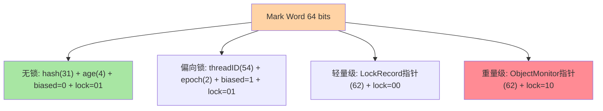
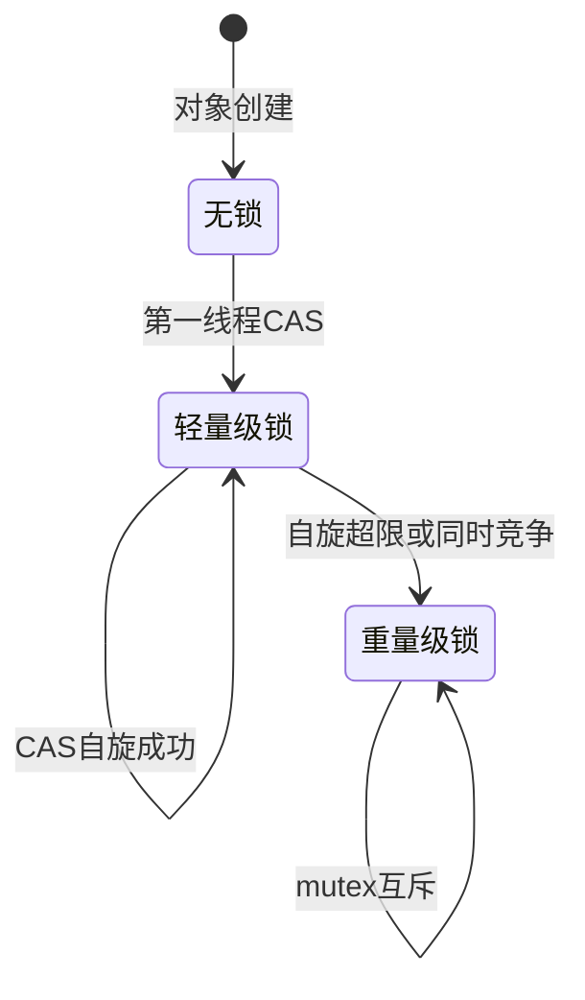
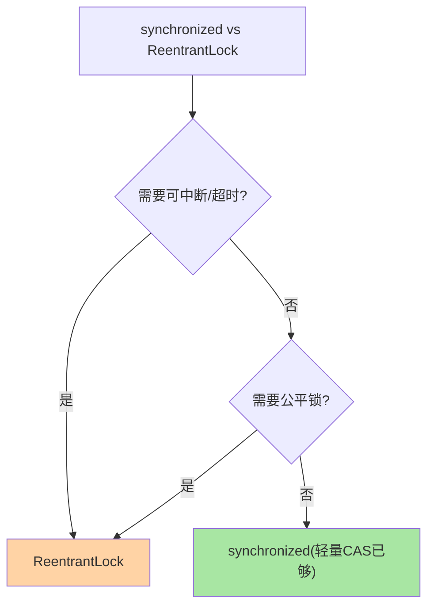

# synchronized 与锁升级全解析

> **本文核心**：synchronized 的锁升级是 JVM 对并发性能的逐级优化——**无锁 → 偏向锁 → 轻量级锁 → 重量级锁**，每一级对应不同竞争场景。**机制链**：对象头 Mark Word 存锁状态 → 单线程访问走偏向锁 → 交替竞争升级轻量级（CAS 自旋） → 同时竞争膨胀重量级（OS mutex）——偏向锁在 JDK 15+ 已废弃（JEP 374）。

## 一句话摘要

synchronized 底层不是一把「大铁锁」——JVM 通过对象头 Mark Word 的**锁标志位**实现四级优化：**偏向锁**假设「只有一个人用」（零成本），**轻量级锁**假设「交替使用」（CAS 自旋），**重量级锁**才是真互斥（OS mutex）。**锁升级单向不可逆**——偏向锁在 JDK 15+ 已废弃（JEP 374），现代 JVM 直接从无锁到轻量级锁。

## 前置阅读

- 入门层篇 20《synchronized 与锁升级》
- 入门层篇 19《JMM 与 volatile》

## 目标导向

本文是什么：synchronized 底层机制的源码级解析。功能：从对象头二进制位推断锁状态、预判锁升级路径。收益：并发性能问题归因能力 + 锁优化决策依据。必看场景：高并发调优、锁竞争分析、JVM 参数调优。

## 一、为什么需要锁升级

synchronized 直接用 OS mutex（重量级锁），每次加锁/解锁涉及**用户态↔内核态切换**（1-10μs），而多数同步块实际执行只有几百纳秒——锁开销远大于业务开销——这是安全性与性能的 Trade-off 起点，偏向/轻量/重量各自代表不同级别的安全-性能取舍点。**锁升级的本质是按竞争烈度匹配最便宜的同步原语**：无竞争零成本（偏向），低竞争 CAS 自旋（轻量级），高竞争才用 OS mutex。

## 5W 速记卡

| 维度 | 一句话 |
|---|---|
| What | 无锁→偏向→轻量→重量的四级锁状态机 |
| Why | 按竞争烈度匹配最便宜的同步原语 |
| When | 高并发调优、锁竞争分析、JVM 参数调优 |
| Where | 对象头 Mark Word + ObjectMonitor |
| How | Mark Word 锁标志位 → CAS → 膨胀或保持 |

## 二、对象头 Mark Word：锁状态的物理载体

每个 Java 对象头部有 **Mark Word**（64 位 JVM 上 8 字节），存储哈希码、GC 分代年龄、锁标志位——**锁信息复用哈希码空间**（哈希码在无锁态存储，加锁后被覆盖）。



**Mark Word 复用意味着**：调用过 `Object.hashCode()` 后偏向锁不可用——哈希码需要 31 位存储空间，与偏向锁线程 ID 冲突。

## 三、锁升级的完整流程



**偏向锁撤销成本**：需等全局安全点 + 遍历线程栈——JDK 15 废弃的原因（JEP 374），现代 JVM 直接走轻量级锁。

## 四、源码关键路径（OpenJDK 17/21）

```text
偏向锁(已废弃): ObjectSynchronizer::fast_enter → CAS 写线程 ID
轻量级锁: ObjectSynchronizer::slow_enter
  → 栈帧 Lock Record → CAS Mark Word → 失败 → inflate()
重量级锁: ObjectMonitor::enter
  → _owner CAS → park()/unpark() 内核互斥
锁消除: JIT 逃逸分析 → C2 IR 消除 synchronized
```

**JDK 15+ 偏向锁废弃**：新 JVM 直接从无锁→轻量级锁——偏向锁撤销的 safepoint 成本在高并发下弊大于利。

### ReentrantLock 替代决策的架构取舍



**事故视角**：某中间件在 JIT 消除锁后出现数据不一致——开发者以为 synchronized 保护了共享变量，但逃逸分析证明对象不逃逸后 JIT 直接消除了锁。修复：将共享变量提升为实例字段（不可消除）或改用显式锁。

## 典型场景

- 高频短临界区：轻量级 CAS 开销极低
- 多线程同时竞争：直接膨胀重量级 → 考虑 ReentrantLock
- 读写分离：ReadWriteLock / StampedLock

## 业内惯例

- **JDK 15+ 偏向锁废弃**：新项目不考虑偏向锁调优
- **锁粗化/锁消除**：JIT 自动优化（相邻同步块合并/逃逸分析消除）
- **lock coarsening**：JIT 自动合并相邻同步块

## 常见误区

- **「synchronized 一定慢」**：无竞争时轻量级 CAS 接近无锁——历史印象
- **「锁只升不降」**：应用层面确实只升不降
- **「hashCode 和锁无关」**：调用 hashCode 后偏向锁不可用（Mark Word 冲突）
- **偏向锁所有场景有益**：高竞争多线程下撤销 safepoint 成本弊大于利

## 与 ReentrantLock 的区别：synchronized 对照

| 维度 | synchronized | ReentrantLock |
|---|---|---|
| 实现 | JVM C++ | Java AQS |
| 可中断 | ❌ | ✅ |
| 超时 | ❌ | ✅ tryLock |
| 公平锁 | ❌ | ✅ 可选 |
| 条件变量 | 单一 wait/notify | 多个 Condition |
| 性能 | 接近（轻量级 CAS） | 固定 AQS 开销 |

## 追问思考

**质疑者**：JDK 15 废弃偏向锁后 synchronized 和 ReentrantLock 差距是否拉大？——实测无竞争时两者接近（轻量 CAS vs AQS CAS），高竞争时 ReentrantLock 可中断/可超时更有价值——**「synchronized 慢」在 JDK 15+ 已不成立**。

**实践**：某团队在高频交易系统将全部 synchronized 替换为 ReentrantLock——吞吐反而降 3%（AQS 开销 > 轻量级锁）。**锁优化必须基于竞争分析（jstack+perf），不能基于假设**。

## 你们可能会问

**Q1**：偏向锁废弃后旧代码怎么办？JDK 15+ 轻量级锁路径性能退化可忽略，无需改代码。
**Q2**：怎么判断锁状态？`jstat` 或 JFR 锁事件，`ThreadMXBean.getThreadInfo()` 获取锁信息。
**Q3**：锁粗化什么时候触发？JIT 合并相邻同步块——同一把锁无跳出连续获取即触发。

## 开放问题

- Loom 虚拟线程 synchronized 阻塞导致 pinning——JDK 24 已完全解决，虚拟线程锁模型仍在演进。
- Valhalla 值类型无对象头——可能催生全新同步原语设计。

## 💡 实战提示

- 💡 JDK 15+ 不需要考虑偏向锁——轻量级锁已是默认
- 💡 高并发用 jstat/JFR 观察锁膨胀频率——膨胀高说明竞争激烈
- 💡 决策口径：低竞争 synchronized、高竞争 ReentrantLock、读写分离 ReadWriteLock。锁策略选择是并发架构的上下游模块边界

## 📎 核心带走

- **核心一句话**：锁升级 = 按竞争烈度匹配最便宜同步原语（无锁→偏向→轻量→重量），偏向已废弃
- **机制链**：Mark Word → 偏向 CAS → 轻量级 CAS → ObjectMonitor mutex
- **失效点/边界**：升级不可逆；hashCode 撤销偏向；JDK 15+ 偏向废弃

## 📌 数据与事实声明

- 写于 2026-09-10，机制以 OpenJDK 17/21 为基准；JEP 374 偏向锁废弃口径
- 免责：源码以 OpenJDK 当前主线为准

## 📚 参考资料

| 类型 | 标题 | 来源 |
|---|---|---|
| 官方源码 | openjdk/jdk objectMonitor.cpp | github.com/openjdk/jdk |
| 官方文档 | JEP 374 | openjdk.java.net |
| 原理书 | 《深入理解 Java 虚拟机》周志明 | 公开出版 |
| 实践书 | 《Java 并发编程实战》Goetz | 公开出版 |
