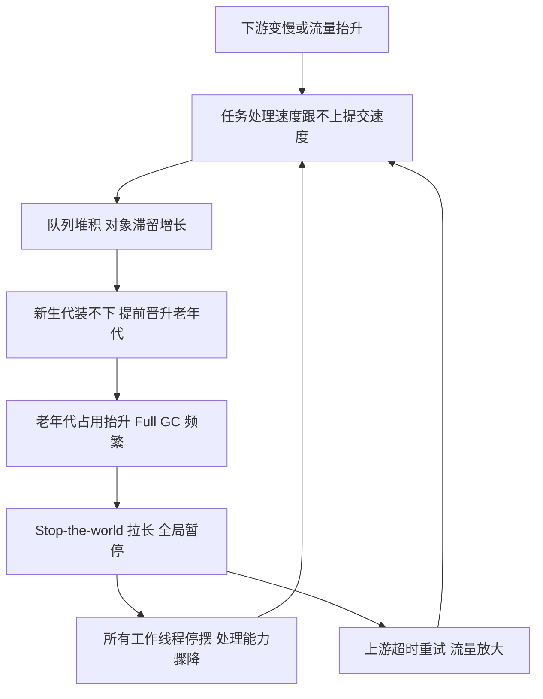
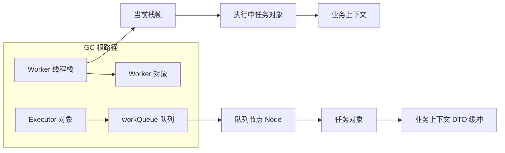
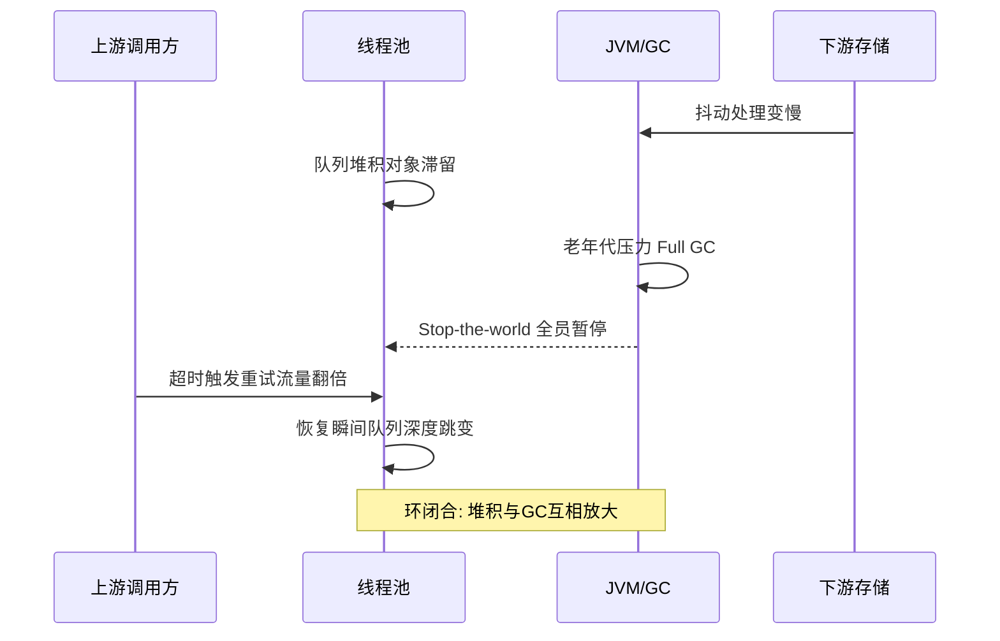

# 线程池与GC的交叉地带：任务堆积如何变成老年代压力

> 线程池调优和 GC 调优在大部分文章里是两个章节，但在生产故障里它们是同一个故事——队列堆积的每个待执行任务都是一堆滞留在堆里的对象，老年代压力上来后 Full GC 频繁，Stop-the-world 又让任务进一步堆积，形成自我强化的恶化环。本篇沿这条交叉地带走一遍：参数怎么互相影响、坑长什么样、排查的形态是什么。

## 一句话摘要

线程池与 GC 通过**对象生命周期**耦合：任务对象从提交起就在堆上，队列堆积 = 对象滞留时间拉长 = 新生代装不下、提前晋升老年代；老年代回收慢又放大 Stop-the-world，让吞吐进一步下降、堆积加剧。池参数（队列容量、核心线程数、拒绝策略）本质是在给 GC 的**对象驻留曲线**塑形——不看 GC 谈池参数，等于不看水位谈堤坝高度。

## 🎯 本文核心

**核心一句话：线程池是对象驻留时间的调节器——队列是「把短命对象变成长命对象」的装置，线程数是「分配速率」的放大器；池参数调错的本质错误只有一个：让本该朝生暮死的任务对象在堆里住了下来，还越住越多。**

机制链（本篇结构挂这条链上）：提交路径上对象的生命周期 → 堆积如何转化为老年代压力 → GC 反压线程池的恶化环 → 典型坑形态 → 源码关键路径与排查手法 → 参数清单 → 量级差异。

## 一、任务的生命周期：从提交到晋升

一个任务从 `execute()` 提交开始，它的对象图（任务本体 + 捕获的业务上下文 + 引用的 DTO）就活在堆上。走一遍它的生命周期，你会发现每一步都和内存行为挂钩：

1. **入队等待**：核心线程忙，任务进队列。此刻这坨对象从「马上要被处理的新生代短期对象」变成了「要活到轮到它为止的中期对象」——队列越长，它们活得越久。
2. **被 Worker 取走执行**：任务在栈上跑，产生大量真正短命的对象（解析、计算、临时集合），这些进新生代、朝生暮死，这是健康形态。
3. **执行完成**：任务对象图失去引用，等下次新生代回收即被清走——**前提是队列里没有积压把整个新生代顶满**。

追问一层：**为什么堆积会直接顶到老年代，而不是堆在新生代慢慢等？** 新生代的设计假设是「绝大多数对象朝生暮死，Survivor 区装得下每一波幸存者」。队列堆积打破这个假设：待执行任务活过一轮轮 Minor GC，年龄增长到阈值就晋升老年代——**它们不是内存泄漏，是合法对象，但驻留策略错了**。老年代被「活着的排队任务」占满后，真正的长期对象（缓存、元数据）反而没地方去。追问再一层：**那把新生代调大点行不行？** 治标不治本——驻留总量没变，只是把晋升推迟；而且新生代越大，装满的耗时越长，Minor GC 停顿反而变长。这两层追问合起来指向同一条机制：**问题出在对象驻留时长，而不在分代配比——改变对象「住多久」的手段（队列治理）优先级高于改变「住哪里」的手段（堆参数）**。

## 二、恶化环：GC 与线程池如何互相拖下水

堆积和 GC 不是单向因果，是相互放大的闭环——这是交叉地带最危险的形态：



这个环里有两个放大器。**放大器一：Stop-the-world 期间提交不会停**——上游照常发请求，暂停 2 秒就是 2 秒的量一次性涌进队列，恢复瞬间队列深度的跳变比平时几分钟的累计还大。**放大器二：重试流量**——处理变慢导致上游超时，超时触发重试，重试制造双倍流量，双倍流量进一步拖慢处理。业内对这种形态的公开复盘很一致：**故障的第一现场在下游，但压垮系统的往往是自己的队列加上游的重试**。

反方向的影响同样成立：池参数也在影响 GC 行为。线程数过多 → 并行分配速率高 → 新生代装满更快 → Minor GC 更频繁；每个 Worker 线程的栈、线程局部缓存、预分配的缓冲区都是常驻内存。**线程池与 GC 互为因果，这正是调优必须一起看的原因**。

## 三、典型坑形态：不看 GC 的池参数都在赌

**坑一：无界队列是慢性 OOM 的标配。** 用无界队列（如不设容量的 `LinkedBlockingQueue`）时，「堆积」不会触发拒绝策略，而是静默转化为堆增长——监控上线程数稳定、CPU 不高、一切安好，直到某天 Full GC 开始频繁、随后 OutOfMemoryError。业内公开的《Java 开发手册》以强制条款禁用 `Executors` 的快捷工厂方法（`newFixedThreadPool`/`newSingleThreadExecutor` 的队列无界、`newCachedThreadPool` 的线程数无界），理由正是这两类失控。

**坑二：核心线程数配多大，本质是在配分配速率。** 追问一层：**为什么线程从 32 调到 128，吞吐反而可能下降？** CPU 密集型任务超过核数的线程只增加上下文切换；更隐蔽的是内存侧——每个线程执行时分配速率叠加，新生代装满频率随之上升，Minor GC 消耗的时间把多线程抢来的吞吐又吃回去。线程数的正确推导起点是「任务类型 × 核数 × 目标利用率」，而不是「越大越快」的经验直觉。

**坑三：拒绝策略选错，把 GC 压力转嫁给别人或转嫁给自己。** `CallerRunsPolicy` 让提交线程自己执行任务，形成天然反压——但它会让上游线程被拖住，如果上游是消息消费线程，反压会传导成消费停滞；`DiscardPolicy` 静默丢弃，等价于把「堆积」换成「丢失」。没有免费选项，**拒绝策略是在「反压传导」「丢失」「失败可见」之间做取舍**。

**坑四：keepAliveTime 与流量波形的错配。** 应对突发流量把 maxPoolSize 拉高、keepAlive 配长，波峰过去后几十个空闲线程长期不回收——每个线程 1MB 栈（业内常见默认口径）加线程本地对象是实打实的常驻占用。波形规律的业务，keepAlive 应贴合波谷时长。

**事故叙事一（公开复盘常见形态，业内认知）**：某数据同步服务用无界队列，夜间批量任务高峰时队列悄悄堆到几十万个任务，每个任务携带数 KB 上下文——堆使用曲线白天平缓、夜间陡涨，值班同学连着几天看到 Full GC 升频以为是缓存膨胀，扩了堆勉强撑住；直到某晚批量翻倍，扩堆也兜不住，OOM 中断同步。复盘定位时 heap dump 的支配树里最大的对象簇不是缓存，是队列里的任务对象图。**教训：堆增长的第一 suspects 里应该有「队列深度」，而不是只盯缓存。**

**事故叙事二（公开复盘常见形态）**：某接口改造把同步链路改成线程池异步化，核心 8 线程 + 容量 100 的有界队列，压测时只验证了单接口性能。上线后一次下游存储抖动，处理耗时从 20ms 涨到 800ms，队列秒级打满触发拒绝，调用方收到的是拒绝异常——但调用方自己也配了重试，拒绝 + 重试叠加把队列永远顶在满位，下游恢复后系统花了十几分钟才消化完存量重试。**下游抖动是诱因，把系统拖入长尾的是「拒绝策略与上游重试没有联动设计」。**

## 四、源码关键路径：引用链决定排查手法

从 `ThreadPoolExecutor` 源码走一遍关键路径，所有坑都能在路径上找到落点：

```java
// 提交路径: 拒绝与入队的决策点
public void execute(Runnable command) {
    int c = ctl.get();                       // ctl: 高3位状态 + 29位线程数
    if (workerCountOf(c) < corePoolSize) {
        if (addWorker(command, true)) return;   // 路径1: 未满核心线程直接建Worker
    }
    if (isRunning(c) && workQueue.offer(command)) {  // 路径2: 入队(堆积发生地)
        // 二次检查状态, 非运行态则移除并拒绝
    }
    else if (!addWorker(command, false))      // 路径3: 尝试扩到maxPoolSize
        reject(command);                       // 路径4: 触发RejectedExecutionHandler
}
```

三个关键落点。**落点一：`workQueue.offer`**——堆积从这里开始，队列容量、队列类型（有界/无界、数组/链表节点）决定了堆积的显性程度：`ArrayBlockingQueue` 容量固定、堆积有上限；`LinkedBlockingQueue` 每个元素一个 Node 对象，链式引用让任务对象图的 GC 根路径清晰可查。**落点二：Worker 线程本身**——Worker 持有任务线程的引用，线程栈是 GC 根，栈帧里正在执行的任务及其上下文不会被回收；线程数多意味着「被线程栈钉住的对象」基线大。**落点三：`ctl` 的状态机**——SHUTDOWN/STOP 状态决定队列还能不能继续消化，优雅停机（`shutdown` vs `shutdownNow`）的差异在停机瞬间就是「存量任务对象要不要等消化完再释放」的差异。

这条引用链直接给出排查手法：堆 dump 里从 `ThreadPoolExecutor → workQueue → ArrayList/Node → task → 业务上下文` 一路点开，支配树排序看队列占堆的比例——**「队列及任务对象占老年代的百分比」是交叉地带最核心的单个指标**。



## 五、排查案例形态：把症状对回机制

交叉地带的故障症状有两类高频形态，各配一条排查路径：

**形态 A：Full GC 频繁 + CPU 不高 + 线程数正常。** 这是无界队列堆积的签名症状——处理能力没崩，只是堆被排队任务吃掉。排查顺序：`jstat -gcutil <pid> 1000` 看 FGC 频率与老年代占用趋势 → `jmap -histo:live <pid> | head -30` 看占用大头是业务类还是队列节点类 → dump 支配树确认 `workQueue` 占比 → 回到提交侧找流量来源与队列容量配置。验证修复：给队列加上界 + 监控队列深度，Full GC 频率应回落到基线。

**形态 B：停顿尖刺 + 恢复后队列深度跳变。** 这是 STW 与堆积互激的签名——GC 日志里单次停顿不长但频繁，应用日志里同一时刻队列深度台阶式上涨。排查顺序：GC 日志确认停顿时段与时长 → 对齐应用监控的队列深度曲线看「暂停期间队列增量」→ 确认上游是否有超时重试放大 → 用限流或消费端降速把「恢复瞬间的反扑流量」削平。



**事故叙事三（复盘方法论层面，业内认知）**：多个公开复盘里有一个共同的弯路——团队先花两天调堆参数（扩堆、换收集器、调 regions），症状缓解三天后复发，最后才在应用侧发现队列无界 + 下游超时预算错配。**交叉地带的排查纪律：先看「谁在产生对象、谁在滞留对象」（应用视角），再看「GC 怎么应对」（JVM 视角）；顺序反了，调参就是在给错误的对象驻留策略擦屁股。**

## 六、业内惯例与生产实践

生产环境里交叉地带的成熟做法收敛为几条：**队列必有界 + 队列深度进监控大盘**（四金指标：活跃线程数、队列深度、拒绝计数、任务耗时 P99——队列深度是其余三个的领先指标）；**按业务隔离池**（快慢任务分池，防止单类任务堆积拖垮全部——隔离的本质是控制架构上下游之间的故障传染半径，让一条链路的堆积不顺着共享池传导到另一条）；**反压显式化**（用有界队列 + 明确的拒绝语义把「系统满了」变成上游可感知的信号，而不是静默堆积）；**压测必须打满一个完整故障场景**（下游抖动 + 上游重试 + 队列打满），只压正常流量测不出交叉地带的问题。此外，任务对象瘦身是常被忽略的杠杆：入队前把大对象（报文、图片字节数组）落外存、队列里只传引用键，堆积时的内存代价可以从 MB 级降到字节级。

从演进的视角看，这套惯例不是拍脑袋来的：早期大家只调池参数，后来发现堆积事故的根因一半在内存驻留，于是「池参数 × GC 联动评审」才逐步成为生产纪律——**惯例是事故复盘沉淀下来的机制认知，抄惯例之前先理解它防的那个坑**。

## 七、参数级配置清单

线程池与 GC 联动的关键参数（默认值为 JDK 公开口径，推荐值为业内认知）：

| 配置项 | 默认值 | 分档推荐 | 为什么 |
|---|---|---|---|
| `workQueue` 容量（有界队列） | `LinkedBlockingQueue` 无界（快捷工厂） | 十万级 1000 / 百万级 200-500 / 毫秒级接口 100-200 | 有界是底线；容量按「P99 耗时 × 峰值 QPS」的反压窗口算，不是拍脑袋 |
| `corePoolSize` | 快捷工厂=n / `newCachedThreadPool`=0 | CPU 密集≈核数 / IO 密集≈核数×(1+等待比)，实测校准 | 线程数决定并行分配速率，超出核数的部分主要贡献切换与 GC 频率 |
| `maximumPoolSize` | 同 core | core 的 1-2 倍，配合告警而非常态扩容 | max 被常态用到说明容量规划错了，不是参数救得回来的 |
| `keepAliveTime` | 60s（快捷工厂） | 贴合业务波谷时长，波峰明显场景 30-120s | 空闲线程的栈与本地对象是常驻内存，波形规律的业务没必要常驻 |
| `-Xmn`/新生代占比 | G1 下动态 / Parallel 约 1/3 | 分配速率高且任务对象短命：适当调大但盯 Minor 停顿 | 新生代大小决定「堆积对象晋升前」的缓冲量，治标手段，队列治理优先 |
| 堆外监控（队列深度告警阈值） | 无 | 有界容量的 60% 预警 / 85% 告警 | 队列深度是 Full GC 的领先指标，等 GC 告警就晚了 |
| 拒绝策略 | `AbortPolicy` 抛异常 | 对外接口 Abort（可见失败）/ 消费场景 CallerRuns 或自定义降级 | 默认抛异常至少可见；静默 Discard 在交易链路是事故预定 |

## 八、什么时候这么调 / 什么时候不用管

**必须联动调**：任务对象大（KB 级以上上下文）、流量波动大、下游依赖多、堆与池是新配的——这四个特征占齐两个，池参数和 GC 就必须一起评审。**可以不用管**：任务对象小且短命、队列容量验证过反压窗口、流量平稳且监控基线干净——此时按常规池参数经验即可，不必过度设计。明确推荐：**任何新上线的线程池，压测报告里必须有「队列深度-堆使用」联动曲线**，没有这条曲线的容量结论不采信。判断口诀：先定队列有界，再定线程数上限，最后才动 JVM 参数——顺序反了是在用 JVM 参数补偿池配置的错误。

## 💡 实战提示

💡 实战提示一：把「队列深度」做成大盘第一行而不是 Fold 在 JVM 面板里——它是交叉地带一切问题的领先指标，队列深度爬坡出现在 Full GC 抬头之前分钟级，这段时间足够人工介入。

💡 实战提示二：dump 分析先看支配树里 `workQueue` 的堆占比，超过 10% 就值得回应用侧查堆积来源——这条经验对 1.7/1.8/各收集器都成立，因为它查的是「谁在滞留」而不是「GC 怎么回收」。

💡 实战提示三：改造同步链路为异步化时，拒绝策略和上游重试要作为一个整体设计——拒绝异常触发对方重试的链路，等价于把自己的过载放大成双倍流量；两边参数放同一张评审表里过。

## Trade-off：交叉地带的取舍账本

- **反压 vs 吞吐**：有界队列 + 快速拒绝保护了系统，代价是高峰期明确拒绝部分请求；无界队列保住了每一笔请求的「受理」，代价是把过载转化为 OOM 风险。交易链路选前者（可感知失败优于不可感知崩溃），异步批处理可选后者（任务不丢优先）。
- **线程数 vs 内存基线**：加线程提吞吐的同时抬高了被线程栈钉住的对象基线和分配速率；内存紧张的容器环境（堆小、配额紧），线程数上限要和堆一起预算，而不是分开拍。
- **调堆 vs 治队列**：扩堆十分钟见效但治标，队列治理要发版但治本；事故当下先扩堆止血完全正确，但复盘动作必须落在队列与上游重试上——只落在「再扩点堆」上，事故就在下一次批量翻倍时等你。

## 你们可能会问

**Q1：为什么队列堆积严重时 CPU 反而不高？** 因为线程池还没崩——大量线程在等下游 IO 或已提交的任务在排队，CPU 空闲恰恰说明瓶颈在「处理速度/下游」而不是「算力」。这也是无界队列堆积隐蔽的原因：CPU、线程数都正常，只有堆曲线和队列深度在涨。

**Q2：直接用 `SynchronousQueue`（如 `newCachedThreadPool`）零堆积行不行？** 它是另一个极端：不堆积、来一个开一个线程，代价是线程数无界——流量尖峰下线程创建失控（每个线程 1MB 栈级别起步，业内常见默认口径）。它适合「任务极快、并发可控」的场景；「防堆积」的正解是有界队列 + 拒绝语义，不是换一种失控方式。

**Q3：G1 这类收集器还需要关心这些吗？** 需要——收集器改变的是「怎么回收」，改变不了「有多少本不该滞留的对象」。G1 缓解了大堆的停顿，但队列把几十万任务对象图钉在堆里时，Mixed GC 的回收效率照样被拖累，停顿预测照样失准。收集器选型与池治理是两个正交的杠杆，前者不能替代后者。

**Q4：怎么快速判断线上问题是「池的问题」还是「GC 的问题」？** 看时间相关性：队列深度爬坡在前、FGC 在后 = 池的问题传导给 GC；FGC 频繁在先、处理能力下降在后 = GC 的问题传导给池（比如堆配太小或内存泄漏另存）。谁先动，谁是因。

## 留一个开放问题

队列容量的「反压窗口」目前靠压测定标，但压测流量形态和真实流量形态总有偏差——有没有可能用线上「P99 耗时 × 到达率」的实时滑动窗口动态校准队列告警阈值，让反压窗口跟着流量形态自演进？这个方向值得结合监控数据做一次验证。

## 🎯 核心带走

**线程池与 GC 的交叉地带 = 对象驻留问题**：队列把短命对象变长命对象，堆积把新生代对象顶进老年代，Full GC 的停顿又反哺堆积形成恶化环。穿透到底层看，这条链上没有任何一环是神秘的：入队即滞留（机制起点）、滞留即晋升（内存后果）、停顿即反压（反噬回路）。三句话复述：无界队列是慢性 OOM 的标配；线程数是分配速率的放大器；队列深度是 Full GC 的领先指标。失效边界记两条：拒绝策略不与上游重试联动，过载会被放大成事故；只调堆不治队列，等于给错误的驻留策略续命。

## 📌 数据与事实声明

- 线程池机制描述（ctl 结构、execute 四路径、Worker 结构）来自 JDK 公开源码与官方文档口径；`LinkedBlockingQueue` 无界、`AbortPolicy` 默认拒绝等默认值为 JDK 公开默认。
- 「每个线程默认 1MB 栈」「《Java 开发手册》禁用 Executors 快捷工厂」为公开口径与业内认知；各收集器行为以所用 JDK 版本官方文档为准。
- 文中事故形态均为公开复盘常见形态的匿名化归纳，非特定公司内部数据；参数推荐值为业内认知，需结合实测校准。

## 📚 参考资料

| 资料 | 说明 |
|---|---|
| [JDK 源码 - java.util.concurrent.ThreadPoolExecutor](https://github.com/openjdk/jdk) | execute 路径/Worker/ctl 状态机权威来源 |
| [Java®平台官方文档 - Executor 接口规范](https://docs.oracle.com/javase/8/docs/api/java/util/concurrent/Executor.html) | 提交语义与默认行为 |
| [Understanding the G1 GC Logs（Oracle 官方）](https://docs.oracle.com/en/java/javase/17/gctuning/garbage-first-garbage-collector.html) | GC 日志解读与停顿分析 |
| [jstat / jmap 工具参考（Oracle）](https://docs.oracle.com/en/java/javase/17/troubleshoot/diagnostic-tools.html) | 排查命令权威口径 |
| [Java Tutorials - Thread Pools（Oracle）](https://docs.oracle.com/javase/tutorial/essential/concurrency/pools.html) | 官方对池参数与任务类型的建议 |
