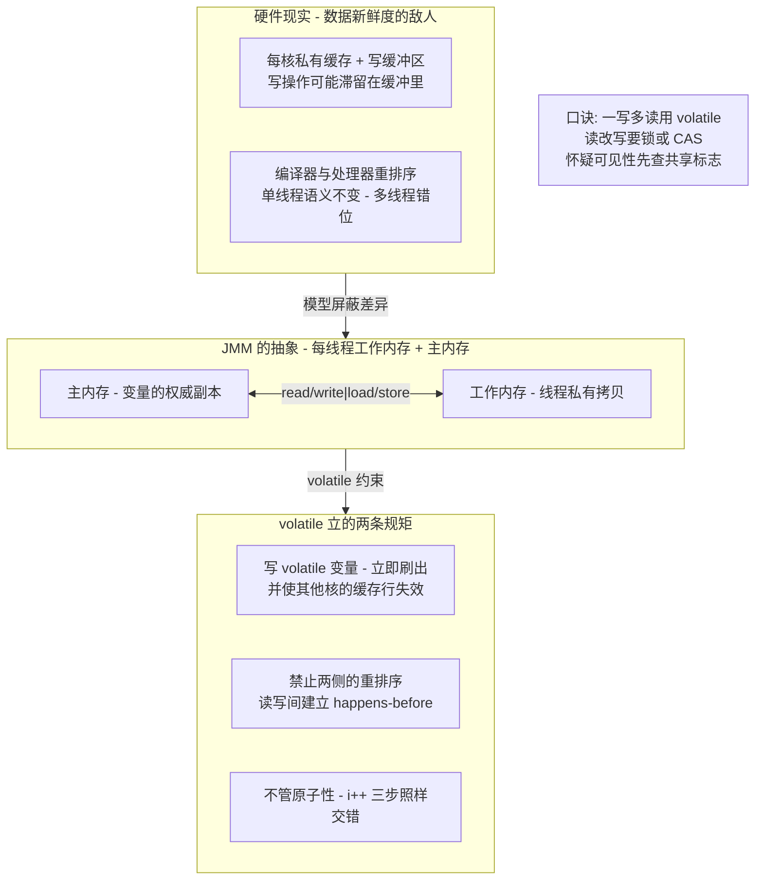
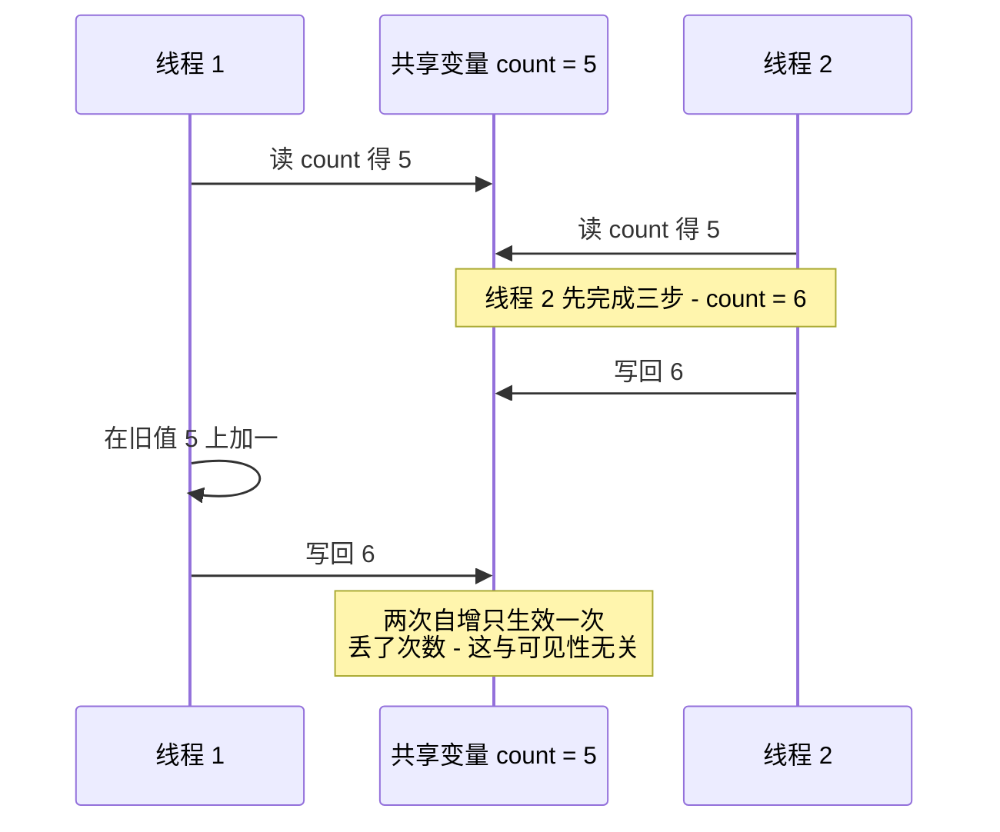
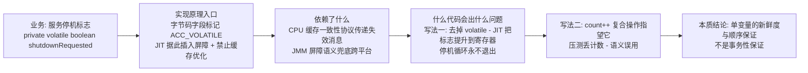
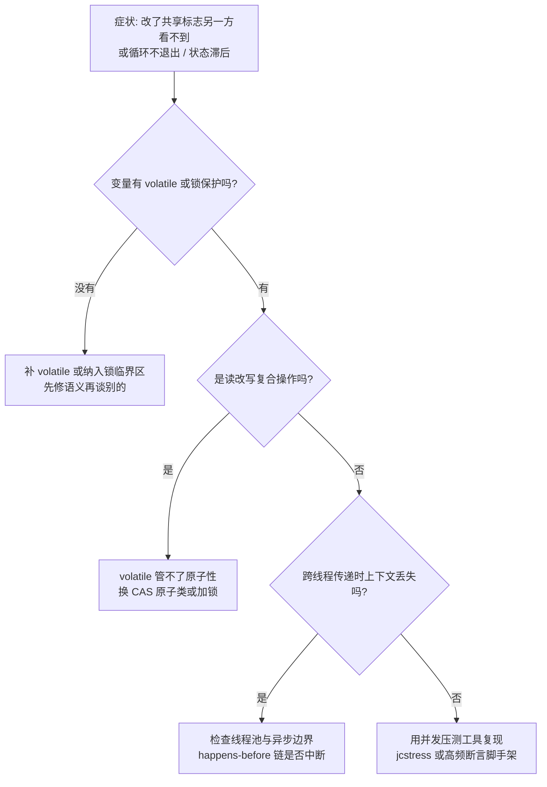

# volatile 与内存屏障：三性分工、插入策略与成本账本

> volatile 是 Java 并发里最「便宜又够用」的关键字，也是被误用最多的：它保证可见性、禁止重排序，却不保证原子性——为什么偏偏这样分工？内存屏障按什么策略插进指令流？它与 synchronized 的成本差距到底差在哪个环节？本篇从 JMM 的 happens-before 讲到 x86 的 lock 前缀，落到双重检查锁定与线上「循环不退出」的真实形态。

## 一句话摘要

volatile 的本质是**「对编译器与处理器的两条禁令」：volatile 写之后不允许重排到前面去、读写两侧插入内存屏障保证顺序与新鲜度**。它在可见性与有序性上近似轻量锁，在原子性上完全缺席——`i++` 这类读改写复合操作它救不了。与 synchronized 的差距不在「能不能做到」而在「做到了多少」：volatile 只约束单个变量的读写顺序，synchronized 额外买到互斥与一段代码的原子性，代价是锁链路与上下文切换。

## 🎯 本文核心

**核心一句话：volatile 是 JMM happens-before 规则的「单变量通道」——它把一个变量的写与后续读固定成「先写后读」的顺序关系，从而买到可见性与有序性；但读改写是三步指令，任何只约束「顺序」的机制都买不到原子性，这就是 volatile 与锁的能力分界线。**

机制链（本篇结构挂这条链上）：为什么需要内存模型（重排序从哪来）→ happens-before 的判断方法 → volatile 三性分工的精确边界 → 内存屏障插入策略与 x86 实际实现 → 与 synchronized 的成本对比 → DCL 与状态标志两类标准用法 → 可见性问题的排查路径。

## 一图看懂：JMM 视角下的 volatile



## 一、为什么需要内存模型：重排序从哪来

写一段看起来必然正确、实际会出问题的代码，比背规则更有说服力：

```java
// 线程 A
data = 42;            // 步骤 1
ready = true;         // 步骤 2（ready 未加 volatile）

// 线程 B
if (ready) {          // 可能为 true，但 data 还是旧值
    use(data);        // 读到 null 或 0
}
```

两步之间没有任何数据依赖，编译器可能重排，处理器也可能乱序执行、写缓冲让 `data = 42` 延迟可见——线程 B 看到 `ready == true` 时 `data` 还是旧值。**「单线程里正确的语句顺序，在多线程里只是众多可能执行序中的一种」**，这就是 JMM 存在的理由：它定义了一套规则，让程序员可以声明「哪些顺序必须被保持」。

保持顺序的规则就是 happens-before（JMM 公开口径）：**如果操作 A happens-before 操作 B，A 的结果对 B 可见，且 A 不会被重排到 B 之后**。日常判断可见性问题只需要一张规则表加一条推理法：

| 规则 | 内容 | 日常用法 |
|---|---|---|
| 程序顺序规则 | 单线程内按代码顺序 | 同线程不用操心 |
| 监视器锁规则 | 解锁 happens-before 后续加锁 | synchronized 内外的边界 |
| volatile 规则 | volatile 写 happens-before 后续读 | 本篇主角 |
| 线程启动/终止规则 | start 前的操作对子线程可见；子线程结束对 join 后可见 | 传递数据给子线程 |
| 传递性 | A hb B 且 B hb C，则 A hb C | 跨规则串链条 |

**判断法**：把「线程 A 的写」和「线程 B 的读」放进同一张图，看能否沿着规则串出一条从写读到链条——串不出来，就没有可见性保证，代码就靠运气。上面反例里 `ready` 没有任何规则可用，所以靠运气；给它加 volatile，volatile 规则 + 程序顺序规则 + 传递性串成 `data=42 → ready 写 → ready 读 → data 读`，链条闭合，问题消失。可见性判断的全部原理就是把这张规则表用熟——这套「用规则声明顺序」的设计思想，是整个 JMM 的骨架。

## 二、三性分工：volatile 各管什么

先给结论表，再讲为什么：

| 特性 | volatile 管不管 | 依据 |
|---|---|---|
| 可见性 | 管 | 写立即刷出、读绕过本地缓存取新值 |
| 有序性 | 管 | 两侧插入屏障，禁止特定重排 |
| 原子性 | **不管** | 单个读/写是原子的，读改写复合操作不是 |

原子性为什么救不了？把 `count++` 拆开看——它是**读、加一、写回**三条指令：



即使两个线程每次都读到「最新值」，交错仍然发生在「读」与「写」之间——**交错是时序问题，不是新鲜度问题**，可见性保证对它无效。这就是为什么 `volatile int count` 配 `count++` 在并发压测下必然丢计数，修复方向只有两条：加锁，或换成 CAS 的原子类。唯一沾边的安慰是：volatile 对 64 位 long/double 的读写也是原子的（规范对 volatile 变量豁免了「非 64 位拆分」的口子，公开口径），非 volatile 的 long/double 在 32 位平台上才存在「读半个变量」的理论风险。

### volatile 的组件四要素：用状态标志看全



这张图里的两个「出问题的写法」值得记住：第一个是**缺 volatile**——主线程把标志读进寄存器后循环，工作线程改了主内存也没用，JIT 优化在单线程语义下完全合法；第二个是**错用 volatile**——指望它保住复合操作。前者是「没买到」，后者是「以为买到了」。

## 三、内存屏障：插入策略与真实实现

屏障是 JVM 落实 volatile 语义的底层工具。JSR-133 Cookbook 的保守插入策略（公开资料口径）可以背成一张小表：

| 位置 | 插入的屏障 | 作用 |
|---|---|---|
| volatile 写**之前** | StoreStore | 保证前面的普通写先于 volatile 写对外可见 |
| volatile 写**之后** | StoreLoad（最贵） | 保证 volatile 写先于后续任何读可见 |
| volatile 读**之后** | LoadLoad | 后续读不能提前到 volatile 读之前 |
| volatile 读**之后** | LoadStore | 后续写不能提前 |


StoreLoad 是四种屏障里最贵的（多数架构上近似「清空缓冲」），它也是 volatile 写比普通写贵的主要来源。追问一层：**x86 上 volatile 到底编译成什么？** 真相是 x86 属于强内存模型——硬件已经保证了 LoadLoad/LoadStore/StoreStore 的顺序，四张屏障三张免费，**只剩 StoreLoad 需要指令**：HotSpot 在 x86 上用 `lock` 前缀指令（如 `lock addl` 对栈顶空操作）实现它（公开口径）。所以「volatile 写加锁前缀、volatile 读是普通读」就是 x86 的实际形态——这也解释了为什么 volatile 读的开销低到近乎免费，写的开销才是账单所在。

再追问一层：**屏障和缓存一致性是什么关系？** 打破砂锅说透：缓存一致性协议（如 MESI，业内认知）负责「失效消息的传递」，但它**不防重排序**——写缓冲可以把写推迟到一致性协议之外。屏障的职责是卡住重排、必要时等缓冲清空；一致性协议负责把结果传播出去。这套机制层面的分工——「顺序裁判」与「传令兵」——谁也替代不了谁，理解它比背屏障表更接近底层原理。

## 四、与 synchronized 的成本对比

两者的差距不在「同一个能力的快慢版」，而在**买到的东西不一样**：

| 维度 | volatile | synchronized |
|---|---|---|
| 原子性范围 | 单变量单次读/写 | 一段代码块（互斥） |
| 可见性 | 该变量的写对后续读可见 | 解锁前所有写对加锁者可见 |
| 字节码形态 | 字段标记 ACC_VOLATILE | monitorenter/monitorexit |
| 硬件成本 | 写侧一条 lock 前缀；读近乎免费 | 无竞争时偏向/轻量级锁 CAS；竞争后膨胀 + 挂起线程（锁演进为公开口径；偏向锁在新版 JDK 已移除） |
| 阻塞 | 永不阻塞 | 高竞争下上下文切换 |
| 语义边界 | 只约束这一个变量 | 管住临界区内的一切共享状态 |

反方案对比：**为什么不用 synchronized 替代所有 volatile？** 因为大多数 volatile 的真实场景是「一写多读的状态标志」，锁的开销买来了用不上的互斥——临界区里只有一行赋值时，锁的全部成本都在排队。**为什么不用原子类替代所有 volatile？** AtomicXxx 是 volatile + CAS 的封装，标志位场景它只多不少；但「读最新值 + 条件判断」不要求原子时，裸 volatile 语义更清晰、依赖更少。选型口诀：**单写多读标志用 volatile；读改写用 CAS 原子类；多变量一致性或复杂临界区用锁。**

## 五、两类标准用法与一次真实排查

### 用法一：停机标志与状态开关

一写多读的 `volatile boolean shutdownRequested` 是教科书场景：写方一个线程，读方（轮询循环）多个线程，读改写不存在。变体是「独立观察」——定期发布的统计值（如 `volatile long lastHeartbeat`），读侧容忍轻微滞后，写侧单线程更新。

### 用法二：双重检查锁定（DCL）——volatile 的必要性证明

```java
public class ConfigHolder {
    private static volatile Config instance;   // volatile 不可省

    public static Config getInstance() {
        if (instance == null) {                          // 第一次检查，无锁
            synchronized (ConfigHolder.class) {
                if (instance == null) {
                    instance = new Config();             // 关键行
                }
            }
        }
        return instance;
    }
}
```

`new Config()` 不是一步：**分配内存 → 执行构造器 → 把引用赋给 instance**。后两步若无约束可能重排——另一个线程在第一次检查处拿到「已赋值但未构造完」的引用，用到半初始化字段。volatile 写在这里同时干两件事：禁止「构造器与赋值」重排 + 让赋值对后续 volatile 读可见。追问一层：**为什么第一次检查不用加锁就能信任？** 因为第二次检查在锁内， volatile 保证「锁内写、锁外读」的链条——外层检查只是性能捷径，正确性由「volatile 读看到非 null → 必然已看到构造完成的写」这条 happens-before 链兜底。

### 线上排查叙事：循环不退出

一次典型事故形态：某服务优雅停机时，工作线程卡在 `while (!stop)` 循环里不退出，进程只能强杀。排查时线程 dump 显示该线程 RUNNABLE、栈顶在业务循环方法——没有死锁、没有 IO 阻塞。复盘定位：`stop` 字段没加 volatile，JIT 把它提升为寄存器读取，循环体里又没有任何同步点，优化完全合法。修复是把字段改成 volatile（或换 AtomicBoolean），停机流程恢复。这次排查的复盘结论值得沉淀：**「线程活着但看不刷新值」的症状，第一怀疑对象就是缺同步的共享标志**——它比死锁隐蔽，因为一切看起来都在正常运转。

### 排查路径图



## 六、不同量级的思考：架构约束驱动解法

### 十万级：低并发服务的正确性优先

这一档的核心问题是**「把共享状态的语义写对」，而不是「榨干 volatile 与锁的差距」**。约束来源是低并发下锁与 volatile 的性能差距低于测量噪声，语义清晰与可维护才是主要矛盾。这一档用「语义驱动」的思考方式：所有跨线程共享状态一律显式声明同步手段（锁/volatile/原子类三选一），不依赖「应该没事」；自下而上看，这一档的并发 Bug 几乎全是语义缺失而非性能选型错误；触发升级的信号是出现了高频读的共享配置或状态，且压测显示锁竞争开始出现在火焰图上。

### 千万级：读多写少路径上的开销核算

这一档的核心问题是**「把同步开销从「感觉有」变成「算得出」」，而不是「全面无锁化」**。约束来源是高频读路径上每次锁竞争的微秒级代价会被 QPS 放大成可观的尾延迟，而 volatile 读近乎免费——这是两者差距真正兑现的档位。这一档切换成「路径开销驱动」的思考方式：先量化（热点路径上的同步点数量 × 竞争概率），再降级（锁 → 原子类 → volatile 逐级降，而不是跳级）；自下而上看，多数服务只需要把两三个热点标志从锁改成 volatile 就够；触发升级的信号是单变量锁竞争成为瓶颈、或写侧也必须高频发生。

### 亿级：写侧竞争与无锁化的边界

这一档的核心问题是**「写侧本身就是瓶颈」，而不是「读侧还能不能再快」**。约束来源是高写并发下 volatile 写的 StoreLoad 成本与 CAS 自旋失败率同时上升，单变量原子性已不够，需要分片（LongAdder 的分段计数思想）、缓冲、批量化。这一档用「写侧分片驱动」的思考方式：自下而上看，volatile 从「解决方案」退化为「无锁结构的积木」，真正的决策上移到数据结构层（分片/队列/不可变快照）；触发升级的信号是 CAS 自旋重试率与缓存行争用（伪共享）成为火焰图主角。

跨档回看：这一档的核心问题是所有档位同构的——**「同步手段的能力边界必须与共享访问模式匹配」**；量级演进的只是「匹配错误的代价」从语义 Bug 放大到架构瓶颈。

## 七、业内惯例与生产实践

- **共享标志三选一口诀**：单写多读 volatile、读改写原子类、临界区加锁——团队规范里明确写出默认选择，减少每次讨论成本（业内认知）。
- **DCL 的现代替代**：能用静态 holder（类初始化锁语义）或 enum 单例的场景优先用它们，把 volatile 的必要性留给真正需要延迟初始化成员的场景。
- **压测验证并发语义**：可见性/有序性问题靠 review 抓不全，关键共享结构用并发压测或 jcstress 类工具验证（公开工具口径），「本地单线程跑对」不构成证据。
- **一次真实的复盘叙事**：某计数服务并发压测时统计值长期偏低但从不报错。第一轮排查怀疑统计逻辑，第二轮用「两次读一致性断言」复现丢计数，定位到 `volatile long total` 上的 `total += x`。复盘修复换成 `LongAdder`，同时把「volatile 字段上的复合操作」加进了代码评审检查单。

## 八、追问链：打破砂锅问到底

**追问一：volatile 读真的「免费」吗？** 再深一层：x86 上 volatile 读是普通读指令，但它是「获取语义」的读——后续访存不能提前，这会限制编译器与处理器的调度自由度。单点看免费，密集使用会收敛指令级并行的空间；说「近乎免费」成立，说「零成本」不成立。

**追问二：既然 CAS 也能保原子性，为什么还需要锁？** 再深一层：CAS 买到的是「单个变量比较交换」的原子性，两个以上变量的一致性、或「检查后执行复杂动作」的临界区，CAS 要么用循环把整段逻辑做成重试机器（复杂度爆炸），要么退化回锁。锁的设计本质是「把一致性边界声明出来」，这个能力 CAS 没有对应物——这是两种同步原语在设计哲学上的分野。

**追问三：CAS 的 ABA 问题在 volatile 场景存在吗？** 打破砂锅：ABA 是 CAS 的病，不是 volatile 的——volatile 只保证读到新值，不保证「值没变过」。但两者会在「用版本号判断状态」的场景相遇（如无锁栈），解法是版本号原子类（`AtomicStampedReference` 思路，公开口径）。边界记法：volatile 管新鲜度，CAS 管原子性，ABA 管的是「历史」——三者别混——分清它们靠的不是背结论，是把每一层机制的原理边界各自推到底。

## 💡 实战提示

💡 **volatile 字段上禁止复合操作**：代码评审里把「volatile 变量出现 `++`、`+=` 或先读后判后写」列为必拦项——这是并发语义误用的最高频形态，压测前安静，压测后丢数据。

💡 **停机标志、配置刷新、心跳时间戳**是 volatile 的三大标准位：遇到「改了没生效」的工单，先查这三个位置的字段修饰符，成本一分钟。

💡 **跨线程池提交任务时补齐 happens-before**：任务对象在提交前写入的字段，对执行线程可见（线程启动/任务提交规则），但任务执行**过程中**由第三方线程更新的数据不在保证内——别把「提交时可见」误当成「永远可见」。

💡 **伪共享是 volatile 性能模型的隐藏项**：高频写的 volatile/原子字段挨在一起会互相打缓存行（业内认知），热点场景考虑补齐填充或换分片结构——量级到了这一步再动手，不要提前。

## Trade-off：轻量与完备的代价账本

| 方案 | 买到 | 没买到 | 代价 | 适用 |
|---|---|---|---|---|
| volatile | 可见性 + 有序性（单变量） | 原子性、互斥 | 写侧 StoreLoad；读侧调度受限 | 一写多读标志/独立观察 |
| CAS 原子类 | 单变量原子性 + volatile 语义 | 多变量一致性 | 自旋失败开销、ABA 需版本化 | 计数器/引用更新 |
| synchronized | 原子性 + 互斥 + 可见性（一段代码） | 无（语义最完备） | 竞争下挂起与切换 | 临界区/多变量一致性 |

取舍的核心：**三种手段是按「语义强度对代价」设计出来的能力光谱三级台阶，买得多付得多**——按「访问模式」选台阶，而不是按「哪个听起来高级」选。

## 什么时候用得上这份知识 / 什么时候不必

**值得深究**：写并发工具/无锁结构（必须懂屏障与 happens-before）；排查「改了没生效」类问题（可见性判断法直接可用）；设计高频共享状态（成本账本直接可用）。**不必深究**：低频共享配置改动争论「volatile 与锁差多少纳秒」——语义正确远比纳秒差值重要；把精力花在「每个共享变量都有明确同步手段」的纪律上。明确推荐：团队规范固化「三选一口诀」+ 评审必拦「volatile 复合操作」，这两条挡掉的 Bug 占并发问题的大头。

## 你们可能会问

**Q1：volatile 能替代 synchronized 吗？** 不能，语义上不覆盖。volatile 没有互斥、没有原子性，「替代」只在「一写多读标志」这类锁的能力过剩的场景成立。正确关系是光谱分工：按需要的语义强度选工具，而不是找一个万能替代品。

**Q2：为什么 volatile 写在 x86 上要加 lock 前缀，读却不用？** x86 的强内存模型已经保证大多数顺序，四种屏障里三种硬件免费，只有 StoreLoad（volatile 写之后）需要显式指令，HotSpot 用 lock 前缀实现（公开口径）。读侧的「获取语义」由编译器遵守即可，不需要额外指令。

**Q3：双重检查锁定不加 volatile，绝大多数时候不是也正常吗？** 是——这正是它的凶险：重排 + 并发窗口同时命中才会读到半初始化对象，概率低但一旦发生是字段默认值级别的静默数据损坏。低概率 + 高破坏 + 难复现，是并发 Bug 里最差的组合，值得为确定性多付一次 volatile 写。

**Q4：怎么验证我的并发推断是对的？** 靠推理（happens-before 链条闭合）+ 工具（并发压测/jcstress 类脚手架）双保险，不靠「跑了一百万次没出事」——那只能证明窗口没命中，不能证明窗口不存在。

## 留一个开放问题

volatile 的语义单位是「单个变量」，而真实业务的一致性边界常常是「一组变量」（配置快照、账户对）。现在通行的做法是用不可变对象 + volatile 引用发布快照来模拟「组语义」——如果 JMM 未来提供「发布一组写」的原生原语（类似事务性发布的语言级支持），volatile 与锁的能力光谱会怎样重新划分？值得跟踪 Valhalla 与并发模型演进的公开讨论。

## 5W 速记卡

| 维度 | 要点 |
|---|---|
| What | volatile = 单变量的可见性 + 有序性保证，写侧插屏障 |
| Why | 重排序与缓存滞后让「语句顺序」不等于「执行顺序」，JMM 需要显式声明保持点 |
| When | 一写多读标志/独立观察/DCL；读改写与临界区不在此列 |
| Where | 字节码 ACC_VOLATILE 标记；x86 写侧 lock 前缀、读近乎免费 |
| How | happens-before 链条判断可见性；压测与 jcstress 类工具验证推断 |

## 自测三问

1. `volatile int count` 上执行 `count++` 会发生什么？交错发生在哪一步、与可见性有什么关系？
2. happens-before 判断法怎么用？「线程 A 写 data、写 ready，线程 B 读 ready、读 data」的链条是怎么闭合的？
3. DCL 里 `instance = new Config()` 若无 volatile 可能重排成什么顺序？另一个线程会看到什么？

## 🎯 核心带走

**volatile 买的是「单变量的新鲜度与顺序」，卖的是「写侧 StoreLoad 的硬件成本」；它救不了读改写——交错是时序问题，不是新鲜度问题。happens-before 是可见性的推理工具：写与读之间链条闭合才有保证，否则一切正确性都是运气。与 synchronized 的差距是能力差距不是速度差距：标志用 volatile、读改写用 CAS、临界区用锁。排查口诀：「改了没生效」先查字段修饰符，「线程活着但不退出」先查共享标志，「压测丢计数」先查 volatile 上的复合操作。**

## 📌 数据与事实声明

- JMM happens-before 规则、volatile 语义、64 位原子性豁免：依据 JVM 规范与 JSR-133 公开文档；内存屏障保守插入策略出自 JSR-133 Cookbook（公开资料），x86 上以 lock 前缀实现 StoreLoad 为 HotSpot 公开口径。
- 锁升级路径、偏向锁移除、伪共享影响为公开口径与业内认知，具体行为随 JDK 版本与处理器架构变化，以目标版本官方文档与实测为准。
- 事故叙事已匿名化与形态抽象，不指向任何真实公司、系统或数据；代码为教学示例，未含任何真实业务参数。

## 📚 参考资料

| 资料 | 说明 |
|---|---|
| JSR-133（Java Memory Model）及其 FAQ 公开版 | happens-before 规则与 volatile 语义的权威定义 |
| JSR-133 Cookbook（公开资料） | 内存屏障插入策略的参考表 |
| 《深入理解Java虚拟机》周志明 | Java 内存模型与 volatile 的中文系统性论述 |
| OpenJDK wiki（内存模型与并发相关页面） | 屏障实现与偏向锁移除等演进口径 |
| JCStress（OpenJDK 并发测试工具）公开文档 | 并发语义压测验证的工程化工具 |
