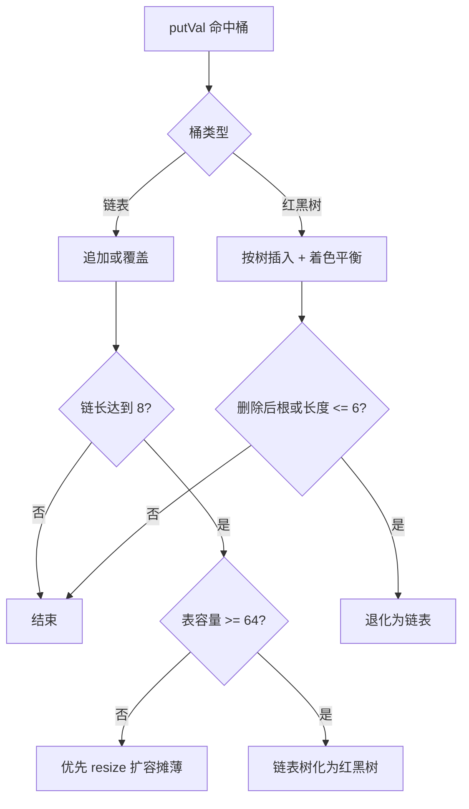
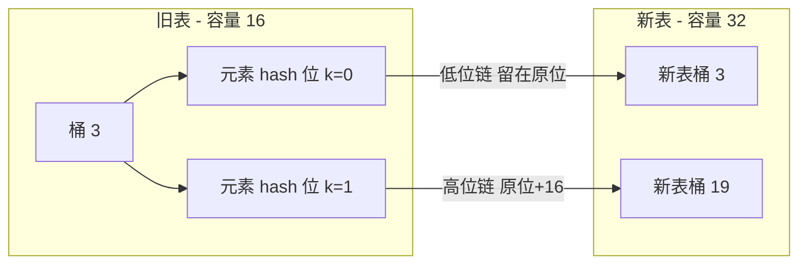
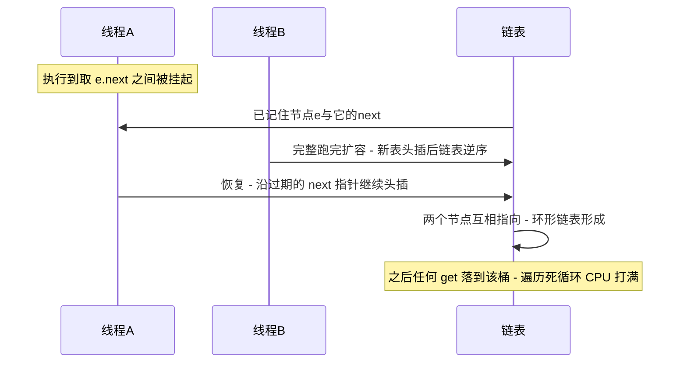

# HashMap 源码深度：扰动、树化、高低位扩容与并发史

> HashMap 是被读得最多、也最容易被读浅的源码——背下「负载因子 0.75、树化阈值 8」不难，难的是回答「为什么偏偏是这两个数」。本篇沿着四个纵深问题走：hash 为什么要扰动、链表为什么在 8 变树又在 6 变回、1.8 的扩容凭什么从「整表重排」变成「高低位拆分」、以及 1.7 到 1.8 的并发问题史为什么「修了环形链表却没修成线程安全」。

## 一句话摘要

HashMap 的全部设计都在服务两个目标的平衡：**查询时间复杂度稳定在 O(1) 附近，内存与重排成本可控**——hash 扰动是把「键的分布质量」兑换成「桶内长度」；树化与退化阈值（8/6）是「极端哈希碰撞的兜底」与「树节点 2 倍内存」之间的对价；1.8 扩容的高低位拆分利用「容量是 2 的幂」这一约束，把 rehash 从重新取模变成一次位判断；而 1.7 的环形链表死循环到 1.8 仍有数据覆盖，共同证明一件事：**HashMap 从未承诺线程安全，并发场景唯一的正解是 ConcurrentHashMap**。

## 🎯 本文核心

**核心一句话：HashMap = 数组寻址（位运算取模）+ 链表兜底（碰撞）+ 红黑树止损（极端碰撞）的三层结构，扰动函数、8/6 阈值、高低位拆分三个「魔法数字」全部是这层结构在「时间-空间-迁移成本」三角里的最优点，而不是随手拍的经验值。**

机制链（本篇结构挂这条链上）：寻址与扰动 → 插入路径与树化 → 高低位扩容 → 并发问题史 → 业内惯例与使用纪律。

## 二、hash 扰动：为什么先异或高 16 位

先看寻址的底层事实：桶数组下标由 `(n - 1) & hash` 计算（n 是容量，恒为 2 的幂）。这个位运算等价于取模但快得多——代价是**只有 hash 的低 log2(n) 位参与寻址**：容量 16 时只有低 4 位起作用。如果键的 hashcode 只在高位有差异（ Integer 相邻值、对象地址分布等场景都可能出现），低位全同，所有键挤进同一个桶，退化成链表遍历。

源码的对策是在寻址前先做一次扰动：

```java
// HashMap.hash: 高低位异或, 把高位的差异"搬"进低位
static final int hash(Object key) {
    int h;
    return (key == null) ? 0 : (h = key.hashCode()) ^ (h >>> 16);
}
```

追问一层：**为什么只异或一次高 16 位，而不是做更复杂的混合（比如雪崩式混淆）？** 因为 `(n-1) & hash` 本身会丢弃大部分位——无论扰动多复杂，参与寻址的始终只有低位。一次「高位异或」以极低成本把高位信息注入低位，对绝大多数应用已经把碰撞拉回均匀区间；更重的混合函数收益递减，还会拖慢每次 put/get。追问再一层：**为什么用异或而不是与/或？** 与和或都是「信息有损」的（结果偏向 0 或 1），异或保留两侧位的差异信息——这是位级混合的标准选择。

设计思想落在一句：**扰动函数是「分布质量」与「计算成本」的折中——它不追求理论完美，只追求把常见的坏分布拉回好区间**。

用一个可手算的例子把效果落到实处：设两个键的 hashcode 分别是 `0x12345678` 与 `0xABCD5678`——高 16 位天差地别，低 16 位完全相同。容量 16 时掩码是 `0xF`，若直接寻址两者落入同一个桶（低位全同）；经过扰动，`0x12345678 ^ 0x1234` 与 `0xABCD5678 ^ 0xABCD` 的低 4 位分别被各自的高位信息改写，落入不同桶的概率大幅上升。**扰动前的碰撞是「键的低 16 位碰撞」，扰动后是「键的全部 32 位都参与了低 4 位的竞争」**——这正是那句位运算用一次异或买到的分布改善。

## 三、8 与 6：树化阈值的概率依据

1.8 引入红黑树的逻辑是：哈希碰撞退化到极端时（攻击或坏分布），链表查询 O(n) 不可接受，树化把它压到 O(log n)。但树节点（TreeNode）的内存是普通链表节点的约 2 倍（公开口径），所以树化必须是**兜底而非常态**。两个阈值的来历：

- **树化阈值 8**：在理想分布下，桶内元素个数服从泊松分布，参数约为 0.5（负载因子的期望水平）。按泊松分布计算，单个桶长度达到 8 的概率约为亿分之几量级（源码注释里给出了各长度的概率表，公开口径约为 0.00000006）——**正常使用几乎永远碰不到 8**，碰到 8 基本意味着分布出了系统性问题（hash 实现差或被刻意碰撞），此时树化止损才有意义。追问：**为什么不是 16 或更小比如 4？** 更小则树化频繁触发，内存翻倍的代价常态化；更大则止损来得太晚。8 是「概率上近乎不该发生」与「止损及时」的交点。
- **退化阈值 6**：为什么树退化回链表不在 8 而在 6？留出 7、8 两个位置的**滞回带**——如果恰好等于 8，桶长度在 7/8 之间波动时会反复树化↔链表化，重排开销来回抖动。6 的选择让状态切换有明确的方向性。这个滞回设计在操作系统与工程领域是通用手法，本质是**用一点滞后换状态机稳定**。

还有一个容易被漏掉的前置条件：树化前先检查 `MIN_TREEIFY_CAPACITY = 64`——表容量不足 64 时优先扩容而不是树化。追问为什么：**小表 + 高碰撞的最可能原因是「表太小导致拥挤」，扩容一次就能把桶摊薄，成本低于树化**。这是「先怀疑拥挤、再怀疑分布」的诊断顺序写进了代码。



## 四、1.8 扩容：高低位拆分如何省掉整表重排

1.7 的 resize 是「整表重排」：扩容后对每个元素重新计算 `(newN - 1) & hash` 落新桶，遍历成本 O(原容量)，且元素在新表中的位置毫无规律地跳。1.8 发现了一个约束红利：**容量是 2 的幂，扩容只翻倍**——新掩码只比旧掩码多看 hash 的**一个位**（第 k 位）。于是每个元素的去向只有两种：该位是 0，留在原下标；该位是 1，落到「原下标 + 旧容量」。这就是高低位拆分：

```java
// resize 中的拆分逻辑(简化): 只判断多出来的那一位
if ((e.hash & oldCap) == 0) {
    // 低位链: 新表下标 = 原下标
    if (loTail == null) loHead = e; else loTail.next = e;
    loTail = e;
} else {
    // 高位链: 新表下标 = 原下标 + oldCap
    if (hiTail == null) hiHead = e; else hiTail.next = e;
    hiTail = e;
}
```

追问一层：**为什么用 `e.hash & oldCap` 而不是重新取模？** `oldCap` 是 2 的幂，二进制只有第 k 位是 1——与它做与运算，结果非 0 即「hash 第 k 位为 1」，一步位判断等价于「新下标的判定」，且原链表顺序天然被保持成两条完整子链，不需要任何重算。追问再一层：**这个优化的深层收益是什么？** 不只是快——它把「rehash 成本」从「与元素 hash 值相关的不确定成本」变成「与元素个数线性相关的确定成本」，扩容停顿变得可预估，这对延迟敏感系统是定性改善。

拆分完成后再看拆出的两条子链长度：理想分布下各占一半，相当于**扩容顺便完成了一次「按新增位分桶」**。整个设计环环相扣：容量 2 的幂 → 位运算寻址 → 扩容只多看一位 → 高低位拆分——**抽掉任何一环，后面一环的前提就塌了**。



## 五、并发问题史：修了环形链表，没修成线程安全

这段历史是被公开复盘和讨论最多的集合话题，值得按时间线把机制讲准：

**1.7 的头插与环形链表**。1.7 的 transfer 在扩容时对链表**头插**（新表逆序），且没有任何并发保护。两个线程同时扩容：线程 A 在执行「取 e、取 e.next」之间被挂起，线程 B 完整跑完扩容（链表在新表里已逆序）；线程 A 恢复后拿着「过期的 next 指针」继续头插——两个节点互相指向形成**环形链表**。之后任何一次 get 落到这个桶，遍历无法终止，CPU 100%，线程堆积。公开排查记录里「线上 CPU 飙满、jstack 显示大量线程卡在 HashMap.get」正是这个形态的经典签名：



追问一层：**头插是原罪吗？** 头插只是放大器（逆序让过期指针必然错位）；即便尾插，并发 put 依然存在丢失更新、size 不准等问题——**根因是「无同步的多步操作」，不是某一种插法**。

**1.8 的尾插与仍然存在的问题**。1.8 改为尾插 + 高低位拆分，扩容时保持顺序，环形链表的经典成因被消除。但 HashMap 的线程不安全没有变化：并发 put 仍是「读-算-写」的多步无同步操作——两个线程同时向同一个空桶插入，后写的覆盖先写的（**数据丢失**）；一个线程 put 时另一个线程 resize，size 字段的非原子递增让 size() 返回值失真；Javadoc 与官方口径从来没有承诺过它的线程安全。追问再一层：**为什么 1.8 不顺手把它做成线程安全？** 因为加同步会让单线程场景支付不必要的锁开销——**HashMap 与 Hashtable/ConcurrentHashMap 的分野是「按场景分层」的设计决策**：单线程用最快的，并发用带同步语义的，而不是一个「全场景都慢但都对」的集合。

**事故叙事一（公开复盘经典形态，业内认知）**：某服务用 HashMap 做本地计数缓存，多线程读写，上线平稳运行数月后某天 CPU 突然单核打满，jstack 显示十几个线程卡在同一个 get 调用上——正是环形链表死循环（该服务还在 1.7 上）。临时恢复靠重启，根治靠换成 ConcurrentHashMap。**教训：数月不出事不是安全的证据，只是竞态窗口还没被踩中。**

**事故叙事二（公开讨论常见形态）**：另一个团队升级到 1.8 后认为「环形链表修了，稍微并发一下没关系」，用 HashMap 做会话属性表，偶发出现「刚 put 的属性 get 不到」——正是并发 put 的覆盖丢失。这类问题没有死循环那么戏剧化，但更隐蔽：丢的是数据，且难复现。排查形态也完全不同：死循环是 CPU 签名（一眼定位），覆盖丢失只能靠「写日志对账 + 压测复现」，两条路径的成本差一个量级——**可见性差的并发 bug 才是最贵的 bug**。

| 并发问题 | 1.7 | 1.8 | 根因 |
|---|---|---|---|
| 扩容环形链表（get 死循环） | 存在（头插） | 经典成因已消除 | 多步操作无同步 |
| 并发 put 数据覆盖丢失 | 存在 | 存在 | 读-算-写非原子 |
| size 不准 | 存在 | 存在 | 非原子递增 |
| fail-fast 迭代异常 | 存在 | 存在 | modCount 检测 |

## 六、业内惯例与生产实践

生产实践里的收敛口径：**任何可能被并发触碰的 Map 一律 ConcurrentHashMap，HashMap 只出现在「单线程归属明确」的局部**（方法内局部变量、单线程消费的私有状态）；对「读多写极少」的本地元数据，业内常用不可变快照替换整个 Map（volatile 引用 + 整体重建）来兼得读性能与一致性；大键值量的场景预估容量并初始化（容量按「预期条数 / 0.75」向上取 2 的幂，公开口径的通用算法），避免业务高峰期撞上 resize 的重排停顿；**key 用不可变对象且正确实现 equals/hashCode**（String 与各类数值类型是天然安全的选择，可变对象做 key 在入表后被修改是「查不到自己」的经典事故来源）。

按 Map 规模分档看，惯例的重心会移动：**十万级条目以下**，HashMap 的默认参数完全够用，唯一值得做的是预估容量初始化，把 resize 从运行期挪走；**百万级条目**，每条目节点开销开始可感（链表节点 + 装箱 key/value 的内存放大），要算的是内存账——考虑专门的紧凑结构或分片存储，并监控 Major GC 与该 Map 的驻留关系；**千万级条目以上**，单个进程内的大 Map 本身就是架构风险点，惯例是按业务键分片成多个小实例（或直接下沉到带持久化与过期语义的存储组件），让单实例规模保持在「树化几乎不触发、扩容停顿不构成毛刺」的舒适区。一句话：规模越大，治理越从「参数」走向「架构」。从演进的角度回看，这套分层惯例正是 1.0 到 1.8 历次机制迭代（懒加载、树化、高低位拆分）在生产侧的自然延伸——机制每演进一步，实践惯例就跟着重新划一次界。

## 七、参数级配置清单

HashMap 的关键「参数」与衍生配置（默认值为 JDK 公开口径，推荐为业内认知）：

| 配置项 | 默认值 | 分档推荐 | 为什么 |
|---|---|---|---|
| `initialCapacity` | 16（首次 put 才分配） | 预估条数/0.75 向上取 2 的幂 | 避免运行期 resize；懒加载决定了默认小表是对的 |
| `loadFactor` | 0.75 | 无强理由保持 0.75 | 空间利用率与碰撞概率的实测平衡点，动它收益低风险高 |
| `TREEIFY_THRESHOLD` | 8 | 不可配（源码常量） | 泊松分布下近乎不该触发的止损线，业内认知的出处是源码注释概率表 |
| `UNTREEIFY_THRESHOLD` | 6 | 不可配 | 滞回带防树化/退化抖动 |
| `MIN_TREEIFY_CAPACITY` | 64 | 不可配 | 小表高碰撞优先扩容摊薄而非树化 |
| 预估容量式构造（Guava `Maps.newHashMapWithExpectedSize` 等价算法） | 无 | 大数据量一律显式 | 把 resize 成本从运行期挪到构造期 |

## 八、什么时候用 / 什么时候不用

**用**：单线程归属明确的键值存取、方法内临时映射、以不可变快照形态提供的只读配置表——这些场景 HashMap 是最快的通用选择。**不用/换**：任何跨线程读写（换 ConcurrentHashMap）；需要按 key 排序遍历（换 TreeMap）；需要插入顺序（换 LinkedHashMap）；key 是可变对象且会被修改（先修设计）。明确推荐：**默认写 HashMap，一旦「这个 Map 会不会被另一个线程摸到」出现疑义，立即换 ConcurrentHashMap——怀疑成本永远低于数据丢失的排查成本**。

## 💡 实战提示

💡 实战提示一：自定义类做 key 时，equals 与 hashCode 必须成对重写且用参与 equals 的同一批字段计算 hashCode——只重写 equals 不重写 hashCode 的对象入表后「放得进取不出」，这类问题的排查时间通常以小时计。

💡 实战提示二：压测延迟毛刺时把「是否撞上 resize」列入排查清单——大表扩容的 rehash 停顿集中且可观，预估容量初始化能把这类毛刺从生产里直接抹掉。

💡 实战提示三：读到「1.8 修了 HashMap 并发问题」的说法要警惕——修掉的是环形链表这一个成因，线程不安全的本质（无同步的多步操作）纹丝未动；给团队做分享时把第五节的对照表讲清楚，比一句「HashMap 线程不安全」的口号更能防事故。

## Trade-off：设计的取舍账本

- **位运算寻址 vs 任意容量**：容量锁死 2 的幂换来「取模变位运算」「扩容变一位判定」两项红利，代价是容量利用率让位（实际可用条数是容量的 0.75 倍，且不能按需设任意值）——HashMap 选了速度。
- **树化兜底 vs 内存开销**：TreeNode 约 2 倍内存的代价换 O(log n) 的极端止损，用 8/6 阈值 + 64 容量前置把树化压到「几乎不发生」——HashMap 选了「常态零成本、极端才付费」。
- **默认不安全 vs 全场景同步**：HashMap 不带同步，把并发语义让渡给 ConcurrentHashMap，换来单线程路径的极致简洁——这是集合家族「按场景分层」的设计哲学，也解释了为什么 1.8 明知并发问题也不顺手修。

## 你们可能会问

**Q1：为什么容量必须扩成 2 倍，能不能一次扩 4 倍？** 扩成 2 倍时新旧容量都是 2 的幂，高低位拆分的「只看一位」红利成立；一次翻 4 倍虽然减少 resize 次数，但多看的位数变成 2 位，拆分逻辑退化为重新分桶，且内存峰值翻 4 倍。翻倍是「迁移成本确定性」与「resize 次数」的平衡点。

**Q2：负载因子为什么是 0.75 不是 0.5 或 1？** 0.5 空间浪费明显；接近 1 时碰撞急剧上升、桶变长。0.75 是 JDK 公开口径下「空间利用率与查询成本」的实测折中，且它与泊松分布参数配合让树化几乎不触发——三个设计（容量、因子、阈值）是配套的，单独动任何一个是拆设计。

**Q3：树化的红黑树为什么不用 AVL 或跳表？** 红黑树在插入删除的旋转次数上有上界保证（业内认知：最多 3 次旋转完成再平衡），对「写也频繁」的 Map 场景比 AVL（更严格平衡、写时旋转更多）更合适；跳表需要额外的多层索引内存且依赖随机化，在「桶内」这个小规模场景收益不显。

**Q4：扩容时正在遍历的迭代器会怎样？** 迭代器按 fail-fast 语义工作——结构变更（含 resize）会让 modCount 变化，迭代器下一次 next 抛 ConcurrentModificationException。遍历中需要修改结构的正解是迭代器自身的 remove 或 CopyOnWrite 类集合，不是硬扛异常。

## 留一个开放问题

扰动函数只混合了高 16 位，对「低位天然分散、高位集中」的键足够，但对某些自定义 hash 分布（低位全同且高位也集中）它也无能为力——应用侧有没有办法在不动 JDK 源码的前提下，用「包一层 hash 重写」或「换用按位打散的 key 包装」系统性改善分布？这个实践问题值得结合真实的坏分布案例做一次验证。

## 🎯 核心带走

**HashMap 源码深度 = 三个魔法数字 + 一段并发史**。穿透到底层：扰动函数把高位差异搬进低位，是对「位运算寻址只看低位」的补偿；8/6 阈值是泊松分布「几乎不该发生」与树节点 2 倍内存的对价，6 留滞回防抖动；高低位拆分吃的是「容量 2 的幂」的红利，rehash 从重算变成一次位判断。并发史上，1.7 环形链表（头插+无同步）、1.8 仍有的覆盖丢失，根因同一个：多步操作无同步——HashMap 从未承诺线程安全。失效边界记两条：可变对象做 key 会在入表后失效；「几个月没出事」不构成并发使用的证据。

## 📌 数据与事实声明

- 源码行为（hash 扰动、树化/退化阈值、MIN_TREEIFY_CAPACITY、resize 高低位拆分、头插改尾插）来自 JDK 公开源码与官方 Javadoc，文中代码为简化示意。
- 「泊松分布参数 0.5、桶长 8 概率约亿分之几」「TreeNode 约为普通节点 2 倍内存」为 JDK 源码注释与公开资料的公开口径；1.7 环形链表成因分析与并发问题对照为社区公开讨论的共识性结论。
- 文中事故形态为公开复盘与社区公开案例的匿名化归纳，非特定公司内部数据；容量预估算法等推荐值为业内认知，需结合实测校准。

## 📚 参考资料

| 资料 | 说明 |
|---|---|
| [JDK 源码 - java.util.HashMap](https://github.com/openjdk/jdk) | 扰动/树化/resize 权威实现与注释概率表 |
| [Java® API 规范 - HashMap](https://docs.oracle.com/javase/8/docs/api/java/util/HashMap.html) | 默认值、fail-fast 与线程安全口径 |
| [OpenJDK Bug Database - JDK-8071667（HashMap 并发相关讨论）](https://bugs.openjdk.org/) | 并发问题的官方问题库 |
| [Java® API 规范 - ConcurrentHashMap](https://docs.oracle.com/javase/8/docs/api/java/util/concurrent/ConcurrentHashMap.html) | 并发替代方案的官方口径 |
| [Effective Java（公开出版物）- 覆盖 equals 时总要覆盖 hashCode](https://www.oreilly.com/library/view/effective-java-3rd/9780134686097/) | key 契约的经典论述 |
