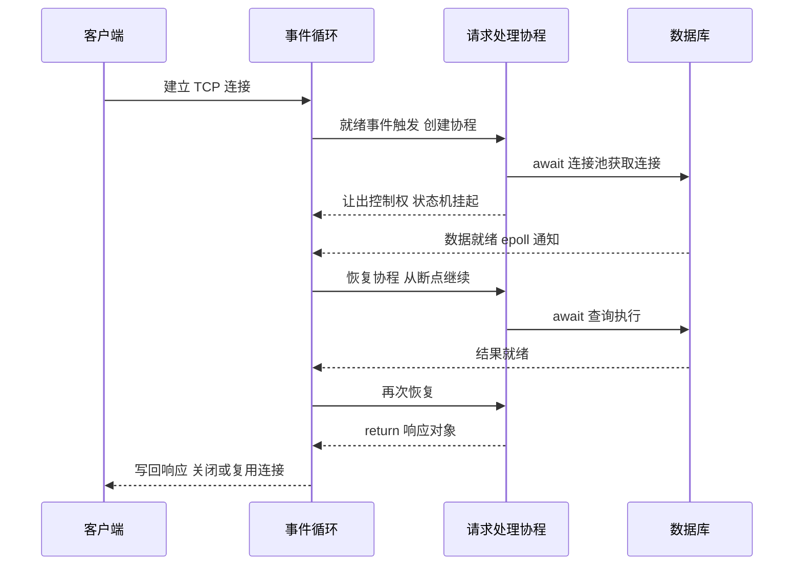
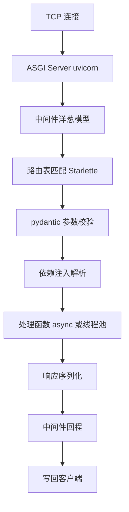
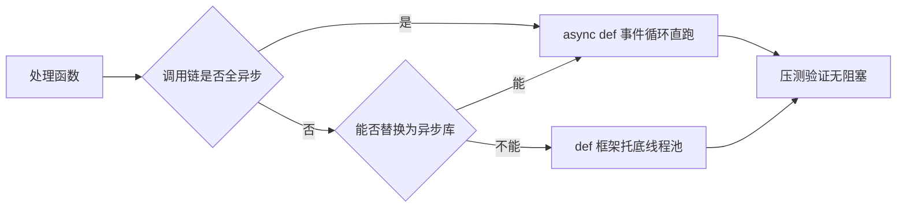
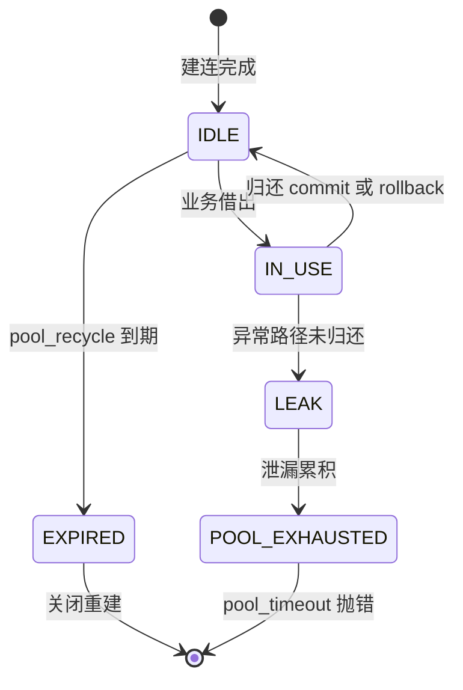

# Python 并发编程实战：异步 Web 服务

## 一句话摘要

用 FastAPI 构建异步 Web 服务：从事件循环的底层机制讲到路由、中间件、依赖注入的工程实践，再到参数级配置、步骤级上线路径与量级分档思考——讲透「异步到底在解决什么问题、什么时候会反过来咬你一口」。

## 🎯 本文核心

**核心机制一句话**：异步 Web 服务的本质，是用「单线程事件循环 + 协程状态机」替代「线程池 + 阻塞系统调用」，把「等待 I/O 的时间」从「操作系统挂起线程」变成「事件循环转去调度别的协程」——省的是线程切换与内存开销，而不是让计算变快。

**机制链**：`async/await` 语法糖 → 协程对象（可暂停的状态机）→ 事件循环（底层依赖 epoll/kqueue 的就绪通知）→ 回调恢复执行 → FastAPI 在此之上叠加路由（Starlette 路由表）、校验（pydantic）、依赖注入（contextmanager 协议）→ 部署层用多进程 worker 绕开 GIL 扩到多核。

**失效边界**：只要有一个同步阻塞调用混进事件循环线程，整条链路就退化成串行——所有请求排队等这一个调用返回。异步不是免费午餐，它是把「并发调度职责」从操作系统转移到了开发者手里。

## 一、事件循环：异步的底层原理

### 1.1 同步模型的瓶颈在哪

传统同步 Web 服务（Flask + Gunicorn sync worker 是典型）用「一个请求一个线程」扛并发。这个模型的代价有三层：

1. **内存代价**：每个线程要分配独立栈空间，Linux 默认栈上限 8MB（虚拟内存，物理占用通常百 KB 到 MB 级，业内认知）。千级并发就是千个线程，内存先扛不住。
2. **切换代价**：线程上下文切换要保存/恢复寄存器与内核调度状态，单次微秒量级（业内认知）。QPS 越高切换越频繁，CPU 花在「切换」上的比例越高。
3. **调度代价**：线程数远超 CPU 核数时，操作系统用时间片轮转「猜」哪个线程该跑，而真正就绪的 I/O 事件可能排在长队里。

C10K 问题（单机万级并发连接，1990 年代末提出，公开口径）暴露的就是这个模型的天花板：线程是「为计算密集设计」的调度单元，而 Web 服务的真实形态是「计算 1ms + 等待 I/O 100ms」——线程把 99% 的时间花在等待上。

### 1.2 事件循环机制：把等待变成调度

异步模型反其道而行：**单线程 + 事件通知**。

- 底层是操作系统的多路复用机制：select → poll → epoll/kqueue 的演变（Linux 2.5.44 引入 epoll，公开史实）。select 每次调用要线性扫描全部 fd，epoll 用红黑树注册 + 就绪链表回调，把「扫描 O(n)」变成「取就绪 O(1)」——这是 I/O 多路复用的核心原理。
- asyncio 在 epoll 之上封装出事件循环：协程在 `await` 处主动让出控制权，事件循环把它挂起、注册 I/O 事件，转头去跑下一个就绪的协程；I/O 完成后 epoll 通知，协程从断点恢复。
- `async/await` 语法本质是生成器协程的演进（PEP 492，2015 年定稿，公开史实）：`await` 是状态机的切分点，编译器把协程编译成一个记录「执行到哪一步」的状态机——这就是为什么协程可以暂停再恢复，而普通函数不行。

一句话机制穿透：**同步模型里「等待」消耗线程，异步模型里「等待」只消耗一个注册在 epoll 里的文件描述符**。前者以千计的代价，后者几乎免费。

### 1.3 一次请求的完整时序



这张时序图的关键在两处「让出/恢复」：协程让出的不是 CPU 时间片，而是**执行权**；恢复的依据不是操作系统的调度器，而是事件循环维护的就绪队列。理解了这一点，后面所有的坑（阻塞事件循环、协程泄漏）都能推出来。

## 二、FastAPI 三大机制：路由、中间件、依赖注入

### 2.1 请求处理链路全景



### 2.2 路由：校验前置于处理函数

FastAPI 的路由不只是 URL 映射，它在请求进入处理函数**之前**完成了参数校验（pydantic 模型驱动）。校验失败直接返回 422，根本不会执行业务代码——这个设计思想的收益是：处理函数可以信任入参类型，防御性代码大幅缩水。

```python
from fastapi import FastAPI, HTTPException

app = FastAPI()

@app.get("/users/{user_id}")
async def get_user(user_id: int):
    # user_id 已经过类型校验 传 abc 会直接 422
    if user_id <= 0:
        raise HTTPException(status_code=400, detail="invalid id")
    return {"user_id": user_id}
```

💡 **实战提示**：路径参数声明为 `int` 是校验，不是转换。别依赖「FastAPI 会帮我转」——校验前置的机制意义在于把脏数据挡在最外层，业务层不再写类型防御。

### 2.3 中间件：洋葱模型与顺序机制

中间件是洋葱结构：请求从外往里穿，响应从里往外穿。**注册顺序 = 外层先执行**。这个顺序机制是很多线上事故的根源——比如限流中间件放在鉴权外面，未登录的恶意流量也会消耗限流配额。

```python
@app.middleware("http")
async def add_process_time(request, call_next):
    start = time.perf_counter()
    response = await call_next(request)   # 内层执行完才回到这里
    response.headers["X-Process-Time"] = str(time.perf_counter() - start)
    return response
```

反方案分析：为什么不用 `BaseHTTPMiddleware` 之外的纯 ASGI 中间件？`BaseHTTPMiddleware` 用起来像 Flask（请求/响应对象），但底层它会把响应体读进内存再转发——流式响应（SSE、大文件）会被它破坏，且每个请求多一层任务调度开销。另一种做法是直接实现 ASGI 协议的纯函数中间件，性能更好但写法更底层。取舍是：常规场景用 `BaseHTTPMiddleware` 足够，涉及流式/高扇出的中间件（限流、链路追踪）用纯 ASGI 写法。

### 2.4 依赖注入：yield 依赖的生命周期机制

```python
from fastapi import Depends

async def get_db():
    async with SessionLocal() as session:
        yield session        # 请求处理期间 session 存活
        # 响应返回后走这里 等价于 finally 释放

@app.get("/orders")
async def list_orders(db = Depends(get_db)):
    return await db.execute(select(Order))
```

机制穿透：`yield` 依赖的底层就是异步上下文管理器协议（`__aenter__`/`__aexit__`）。FastAPI 在请求开始时执行到 `yield`，把 `yield` 出的对象注入处理函数；请求结束后从断点恢复执行清理段——**清理逻辑一定执行，即使业务抛异常**。另外依赖默认按请求缓存（同一请求内多次 `Depends(get_db)` 拿到同一实例），避免重复建连。

💡 **实战提示**：数据库会话必须走 `Depends` 注入，不要在模块顶层建全局 session。全局 session 在并发下会出现「两个请求共用一个事务」的串味事故——这是异步框架下最常见的架构级错误。

## 三、def 与 async def 的边界：真相与常见误解

这是异步 Web 服务里**反直觉**程度最高的一个机制点，值得打破砂锅问到底。

| 维度 | `async def` 处理函数 | `def` 处理函数 |
|---|---|---|
| 执行位置 | 事件循环线程内 | 外部线程池（AnyIO 线程池，默认容量 40，业内认知） |
| 阻塞后果 | 阻塞整个事件循环，所有请求排队 | 只占住线程池一个线程 |
| 适用场景 | 纯异步 I/O 链路 | 调同步库/含不可控阻塞 |
| 并发上限 | 高（受下游约束） | 受线程池容量约束 |

**追问一：`async def` 里调同步库会发生什么？**
同步库（如 `requests`）的 socket 读写在 C 层直接阻塞当前线程——事件循环线程被卡住，**所有**协程都无法调度。哪怕同步调用只耗时 100ms，QPS 1000 的情况下事件也会在队列里堆出秒级延迟。

**追问二：那把所有函数都写成 `async def` 不就安全了？**
恰恰相反。真正危险的是「以为自己是异步」。`def` 函数里的阻塞调用会被框架兜进线程池，故障半径是一个线程；`async def` 里的阻塞调用故障半径是整个服务。所以选型的真相是：**不确定能不能全异步时，宁可让可疑的同步调用走 `def`**。

**追问三：事件循环为什么不怕 GIL？**
Python 的 GIL 限制的是多线程执行字节码，而事件循环是单线程模型，GIL 对它无感。真正要绕开 GIL 的是 CPU 密集计算——用多进程 worker（部署层）或进程池（`run_in_executor(ProcessPoolExecutor)`）。



## 四、生产实践与三次事故复盘

### 4.1 全局异常处理：不泄漏内部信息

```python
from fastapi import Request
from fastapi.responses import JSONResponse
import logging

logger = logging.getLogger(__name__)

@app.exception_handler(Exception)
async def unhandled_exception_handler(request: Request, exc: Exception):
    trace_id = getattr(request.state, "trace_id", "unknown")
    logger.exception("unhandled error", extra={"trace_id": trace_id, "path": request.url.path})
    return JSONResponse(
        status_code=500,
        content={"code": "INTERNAL_ERROR", "trace_id": trace_id},
    )
```

设计思想：对外只暴露错误码与 trace_id，异常细节进日志。把 `str(exc)` 直接返回给客户端是常见错误——异常消息里常带 SQL 片段、文件路径等内部信息，这是安全红线。

### 4.2 结构化日志：contextvars 而不是 threading.local

协程环境下 `threading.local` 会失效——同一个线程轮流跑 N 个协程，`threading.local` 分不清「当前是哪个请求」。底层机制：asyncio 为每个任务维护独立的 `contextvars.Context`，`contextvars.ContextVar` 是协程安全的请求级变量容器，request_id、租户信息都应放这里。

### 4.3 事故叙事一：同步客户端阻塞事件循环

线上事故：某聚合查询接口上线后，P99 从 80ms 涨到 8 秒，CPU 占用却只有 15%。排查路径：先怀疑数据库慢查询（EXPLAIN 无异常）→ 打线程级火焰图发现单线程占比 100% → 定位到处理函数里用 `requests` 调下游。复盘结论：同步 HTTP 客户端把事件循环卡成了串行队列；修复是换 `httpx.AsyncClient` 并全局复用连接池；后续在 CI 里加了阻塞调用检测（事件循环调试模式 + 专用检测库），阻塞超过阈值直接让流水线失败。

### 4.4 事故叙事二：连接池耗尽与「每请求一引擎」



线上事故：每请求新建 `create_engine()`，两天后数据库 `max_connections`（默认 100，业内认知）被打满，新请求全部 `pool_timeout` 报错。排查时数据库侧 `SHOW PROCESSLIST` 出现大量 Sleep 连接；复盘发现每个 engine 自带独立连接池，进程生命周期内从不回收。修复：全局单例 engine + `pool_size`/`max_overflow` 显式配置 + `pool_pre_ping=True` 防 MySQL 八小时断连。教训：**连接池是进程级资产，不是请求级耗材**。

### 4.5 事故叙事三：中间件顺序导致预检失败

线上事故：前端接入后所有跨域请求全挂，浏览器报 CORS 错误。排查：网关日志里 `OPTIONS` 预检请求返回 401——鉴权中间件注册在 CORS 中间件**内侧**，预检请求（不带凭证）先被鉴权拦截。修复：调整注册顺序，让 CORS 中间件先于鉴权执行。这个事故的机制根源就是洋葱模型：**外层中间件对请求拥有完全的否决权**，顺序错一行，全站跨域趴窝。

### 4.6 测试与压测基线

```python
from fastapi.testclient import TestClient

client = TestClient(app)

def test_get_user():
    resp = client.get("/users/1")
    assert resp.status_code == 200
    assert resp.json()["user_id"] == 1
```

TestClient 底层基于 httpx，同步写法覆盖异步应用；依赖覆盖（`app.dependency_overrides`）把数据库换成测试桩。上线前必须压测建立基线：同机同参数对比「同步版 vs 异步版」的 P99 与 QPS，用数据验证收益，而不是拿公开 benchmark 数字自我说服。

## 五、参数级配置清单

| 配置项 | 默认值 | 分档推荐 | 为什么 |
|---|---|---|---|
| uvicorn workers | 1 | 2×CPU 核（Web 型） | 多进程绕开 GIL；纯 I/O 代理型可再高，压测定 |
| uvicorn backlog | 2048 | 保持默认 | 半连接队列长度，突增流量时防拒绝 |
| limit_concurrency | None | 百万级档设上限 | 防下游拖垮后连接无限堆积 |
| timeout_keep_alive | 5s | 5-15s | 与网关 keepalive 对齐，防连接抖动 |
| SQLAlchemy pool_size | 5 | 10-20/worker | 过大打满 DB 连接，过小排队 |
| SQLAlchemy max_overflow | 10 | 10 | 突发缓冲，配合 pool_timeout |
| pool_recycle | -1 | 1800s | 防中间件静默断连（MySQL 默认 8h，业内认知） |
| httpx max_connections | 100 | 按下游容量定 | 复用 AsyncClient 时必须显式配 |
| Redis max_connections | 2^31 | 50-100/实例 | redis.asyncio 连接池上限 |

💡 **实战提示**：所有「连接类」参数的本质是同一道乘法：`worker 数 × 每 worker 池大小 ≤ 下游总容量`。配置前先算下游能接多少，再反推上游——顺序反了就是事故叙事二的翻版。

## 六、步骤级操作：从裸服务到可上线

**前置条件**：Python 3.11+（异步任务组开销优化，公开口径）；虚拟环境已建；数据库与 Redis 可达。

1. **安装依赖**：`pip install fastapi "uvicorn[standard]" httpx sqlalchemy[asyncio]`
2. **本地启动**：`uvicorn app.main:app --reload --port 8000`
3. **验证**：`curl -s http://127.0.0.1:8000/users/1` 返回 200 且 body 合法；`/docs` 打开 OpenAPI 页面。
4. **阻塞自检**：启动时加 `PYTHONASYNCIODEBUG=1`，日志出现 "took too long" 即有慢协程嫌疑。
5. **生产启动**：`gunicorn app.main:app -w 4 -k uvicorn.workers.UvicornWorker --bind 0.0.0.0:8000 --backlog 2048`
6. **上线验证**：压测脚本先打预发，P99 与错误率达标再放量；灰度期间对比新旧版本 P99。
7. **回退**：部署平台一键回滚到上一镜像版本；连接类配置变更单独回退（改配置比重发镜像快）。回退后必须复查下游连接数是否回落，防止旧连接还挂着。

## 七、不同量级的思考：架构约束驱动解法

量级不是数字标签，是架构约束的边界——每一档的物理约束不同，解法完全不同：

- **十万级（日请求十万，峰值 QPS 几十）**：单机 uvicorn + 1-2 worker 足够，这一档的风险全在「写错」而非「扛不住」。约束来源是单机 I/O 调度能力；思考方式是「阻塞排查驱动」——工具先于调参。这一档的核心问题是「有没有把阻塞调用混进事件循环」，而不是「worker 数开多大」
- **百万级（日请求百万，峰值 QPS 数百）**：多 worker + 连接池容量规划 + 本地缓存进场，`worker × pool_size ≤ 下游容量` 的乘法约束开始主导。约束来源是下游连接容量与内存；思考方式是「容量规划驱动」。这一档的核心问题是「上下游容量是否匹配」，而不是「Web 层并发参数」
- **千万级（峰值 QPS 数千）**：单库读写分离、多级缓存、耗时操作异步化削峰；事件循环的调度开销占比下降，下游成为瓶颈。约束来源是数据库 IOPS 与网络带宽；思考方式是「链路异步化驱动」——把同步等待从主链路移走。这一档的核心问题是「同步等待被移走了没有」，而不是「再加几台机器」
- **亿级（日请求过亿，峰值 QPS 万级）**：单元化部署、消息削峰、全链路压测、多活容灾进场；单机性能已经不在讨论范围，故障半径与单元隔离才是。约束来源是跨机房网络与故障爆炸半径；思考方式是「故障半径驱动」。这一档的核心问题是「一个单元挂了炸多大范围」，而不是「单机 QPS 还能压多少」

**自下而上与触发升级**：先测档位再选思考——峰值 QPS、下游连接水位、P99 基线三个实测值决定实际站在哪一档，不预支上一档的架构复杂度，也不滞留在下一档的单机侥幸里。触发升级的信号：P99 跌穿基线、下游连接水位超七成、突发流量下 backlog 溢出——任一信号出现，思考方式必须随档升级（阻塞排查 → 容量规划 → 链路异步化 → 故障半径）。锚点始终是约束来源：下游容量/数据库 IOPS/跨机房物理延迟变了，解法才跟着变——业务量翻倍只是信号，约束迁移才是升级的依据。

## 八、什么时候用 / 什么时候不用

**明确推荐用异步**：I/O 密集的 API 服务（聚合/网关/BFF）、长连接场景（WebSocket/SSE）、高并发低计算的读多写少服务——这三类是异步收益最大化的场景，推荐默认选 FastAPI + 全异步链路（httpx.AsyncClient、asyncmy/asyncpg、redis.asyncio）。

**不推荐用异步**：

1. **CPU 密集型**（图像处理、模型推理、大报表计算）：事件循环帮不上忙，正确架构是「Web 层异步接单 + 任务队列（Celery/ARQ）+ worker 进程计算」。
2. **团队没有异步经验且工期紧**：隐性阻塞的排查成本会吃掉全部性能收益，此时「同步框架 + 多实例」是更稳的工程决策。
3. **重度依赖同步生态**：核心库没有异步替代品时，全链路异步是伪命题，半异步反而增加故障面。

## 九、Trade-off：每一分收益都有对价

- **异步 vs 同步 + 加机器**：异步省的是机器与内存，付的是心智成本（阻塞排查、协程调试）与生态约束（必须全链路异步化）。QPS 低时加机器更便宜——包括人力成本。
- **`BaseHTTPMiddleware` vs 纯 ASGI 中间件**：前者开发效率高、后者性能与流式兼容性好。取舍原则：业务中间件用前者，平台级中间件（限流/追踪）用后者。
- **异步 ORM vs 同步 ORM + `def` 路由**：异步 ORM（SQLAlchemy 2.0 async）生态尚新、坑位文档少；同步 ORM 成熟但占用线程池容量。数据层复杂、团队熟同步 ORM 时，`def` 路由 + 调大线程池是完全合格的折中，不必教条化。
- **性能 vs 可观测性**：异步调用栈是碎片化的（await 切断栈帧），传统链路追踪需要 contextvars 配合改造。可观测性建设要和异步化同步做，欠账后补的成本远高于同步时代。

## 十、追问链：再深一层

- **再问一层：`await` 到底让出了什么？** 让出的是事件循环的执行权，保存的是协程状态机的断点与局部变量。所以两个协程之间不共享栈帧——协程是「并发」不是「并行」。
- **再问一层：为什么 pydantic v2 校验快了一个量级？** 校验核心从 Python 重写为 Rust（公开口径），类型解析在 C 层完成，绕开了字节码解释开销。这也解释了为什么校验前置在 FastAPI 里是可行设计——校验本身的成本足够低。
- **再问一层：事件循环会被打满吗？** 会。当协程数极大且每个协程 CPU 片段偏长时，事件循环线程自身成为瓶颈（表现为 CPU 单核 100%）。解法不是调参，是削减 CPU 片段或拆分服务。

## 你们可能会问

**Q1：`async def` 里已经混进了同步库，来不及改造怎么办？**
短期用 `run_in_executor` 或 `asyncio.to_thread` 把同步调用挪进线程池，故障半径立刻从「整个事件循环」缩小到「一个线程」；长期逐步替换为异步客户端。千万不要用「加 worker」掩盖阻塞问题——worker 加得再多，单 worker 内的串行化照旧。

**Q2：workers 到底开多少？**
起步公式是 2×CPU 核（业内认知），但它只是搜索起点：压测观察 CPU 水位与下游连接水位，哪个先到瓶颈哪个决定上限。纯转发型服务 workers 可以更高，重业务型反而要保守，给 GC 和系统调用留余量。

**Q3：异步框架一定比同步框架快吗？**
不一定。性能取决于阻塞占比与下游容量：I/O 等待占比越高异步收益越大；如果瓶颈在数据库，换异步框架只是把排队从线程池挪到连接池。所有「快 N 倍」的公开 benchmark 都绑定了特定场景，参考结论前先看压测条件。

**Q4：异步服务怎么做单元测试与集成测试？**
单元测试用 pytest-asyncio 直接 await 协程；集成测试用 TestClient 同步壳；依赖覆盖替换下游。注意一个坑：TestClient 走的是同一进程内调用，事件循环阻塞类问题在单测里暴露不出来，必须靠压测与线上阻塞检测兜底。

## 5W 速记卡

| 维度 | 内容 |
|---|---|
| What | 单线程事件循环 + 协程状态机调度 I/O 等待的 Web 服务模型 |
| Why | 线程模型在 I/O 密集场景下内存与切换成本过高（C10K 问题） |
| When | I/O 密集 API / 长连接 / 聚合层；CPU 密集不适用 |
| Who | Web 服务开发者；下游团队需同步容量规划 |
| How | FastAPI + 全异步客户端链路 + 多 worker 部署 + 阻塞检测护航 |

## 自测三问

1. `async def` 里调用 `requests.get` 会发生什么？（答案：阻塞事件循环，所有协程串行；短期 `asyncio.to_thread` 兜底，长期换异步客户端）
2. 连接池参数 `pool_size=5`、4 个 worker、数据库 `max_connections=100`，还剩多少余量给其他服务？（答案：4×5=20，余 80；再算上 overflow 就可能挤占别服务，容量要跨服务统筹）
3. 为什么结构化日志要用 `contextvars` 而不是 `threading.local`？（答案：协程共享线程，threading.local 区分不了同一线程上轮流执行的多个请求）

## 开放问题

- 阻塞检测工具在 CI 与生产环境的阈值如何统一？（CI 严格阈值会在生产误报，生产宽松阈值会漏检——目前没有公认答案）
- Python free-threading（去 GIL 方案）成熟后，异步模型与线程模型会不会重新洗牌？值得持续观察。

## 🎯 核心带走

**30 秒复述**：异步 Web 服务 = 单线程事件循环 + 协程状态机，把 I/O 等待的调度成本降到接近零；机制链是「await 让出 → epoll 就绪 → 断点恢复」，上层由 FastAPI 的路由校验、洋葱中间件、yield 依赖注入三大机制承接。**失效点**：一个同步阻塞调用就能毒死整个事件循环；CPU 密集与同步生态依赖场景不适用。**记住三条铁律**：连接池是进程级资产；中间件顺序即权限顺序；不确定全异步时让 `def` 托底。

## 📌 数据与事实声明

- 本文技术机制基于 asyncio（PEP 492）、Starlette/FastAPI、SQLAlchemy、httpx 官方文档与源码行为整理。
- 涉及的具体数值（线程栈 8MB、切换微秒级、MySQL 默认连接 8 小时、AnyIO 线程池 40 等）为业内认知与 Linux/各库默认值，随版本可能变化，以官方文档为准。
- 三次事故叙事为多个生产环境常见案例的抽象化重构，不含任何真实公司、系统与个人信息。
- benchmark 类表述均为公开口径的定性描述，未引用任何未公开的实测数字。

## 📚 参考资料

| 资料 | 说明 |
|---|---|
| FastAPI 官方文档 https://fastapi.tiangolo.com/ | 路由、依赖注入、中间件机制权威出处 |
| asyncio 官方文档 https://docs.python.org/3/library/asyncio.html | 事件循环与协程底层机制 |
| PEP 492 https://peps.python.org/pep-0492/ | async/await 语法设计背景（2015） |
| Starlette 文档 https://www.starlette.io/ | ASGI 应用与中间件协议 |
| SQLAlchemy 2.0 文档 https://docs.sqlalchemy.org/ | 连接池参数与异步引擎 |
| httpx 文档 https://www.python-httpx.org/ | 异步客户端与连接池限制 |
| uvicorn 文档 https://www.uvicorn.org/ | 部署参数：workers/backlog/limit_concurrency |
