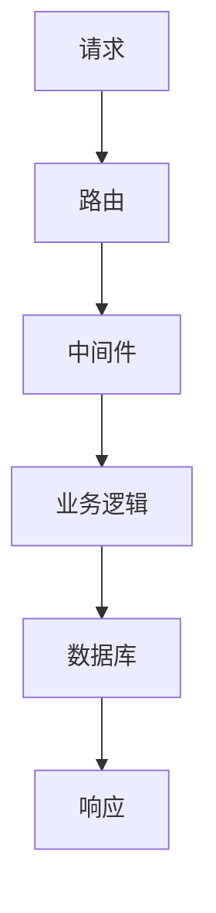

# Python 并发编程实战：异步 Web 服务

## 一句话摘要

用 FastAPI 构建异步 Web 服务：从路由到中间件，从测试到部署，全流程实战。

## FastAPI 核心



### 路由

```python
# 伪代码：FastAPI 路由
from fastapi import FastAPI

app = FastAPI()

@app.get("/users/{user_id}")
async def get_user(user_id: int):
    return {"user_id": user_id}
```

### 中间件

```python
# 伪代码：中间件
@app.middleware("http")
async def middleware(request, call_next):
    # 请求前
    response = await call_next(request)
    # 响应后
    return response
```

### 依赖注入

```python
# 伪代码：依赖注入
from fastapi import Depends

async def get_db():
    db = Session()
    try:
        yield db
    finally:
        db.close()

@app.get("/users")
async def get_users(db: Session = Depends(get_db)):
    return db.query(User).all()
```

## 异步 vs 同步

| 维度 | 异步 | 同步 |
|---|---|---|
| 并发 | 高 | 低 |
| 复杂度 | 高 | 低 |
| 适用 | I/O 密集 | CPU 密集 |
| 生态 | 完善 | 完善 |

## 生产实践

### 1. 错误处理

```python
# 伪代码：异常处理
@app.exception_handler(Exception)
async def exception_handler(request, exc):
    return {"error": str(exc)}
```

### 2. 日志

```python
# 伪代码：结构化日志
import logging

logger = logging.getLogger(__name__)
logger.info("request", extra={"path": request.url.path})
```

### 3. 测试

```python
# 伪代码：测试
from fastapi.testclient import TestClient

client = TestClient(app)
response = client.get("/users")
assert response.status_code == 200
```

## 踩坑记录

1. **阻塞调用**：同步调用阻塞事件循环
2. **数据库连接**：连接池配置不当
3. **中间件顺序**：中间件顺序影响行为
4. **异常传播**：异常未正确处理

## 部署

| 部署方式 | 适用场景 |
|---|---|
| Uvicorn | 开发/小规模 |
| Gunicorn + Uvicorn | 生产 |
| Docker + K8s | 大规模 |

## 量级考量

| 量级 | 部署方案 |
|---|---|
| < 100 QPS | Uvicorn 单机 |
| 100-1000 QPS | Gunicorn + Uvicorn |
| > 1000 QPS | Docker + K8s |

## 📌 数据与事实声明

- FastAPI 基于 Starlette
- 踩坑来自生产环境经验
