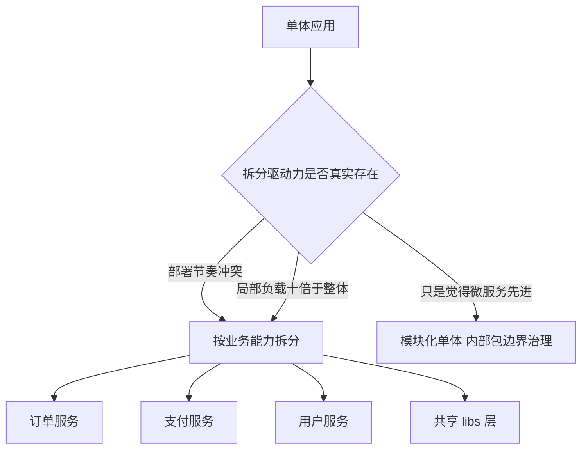
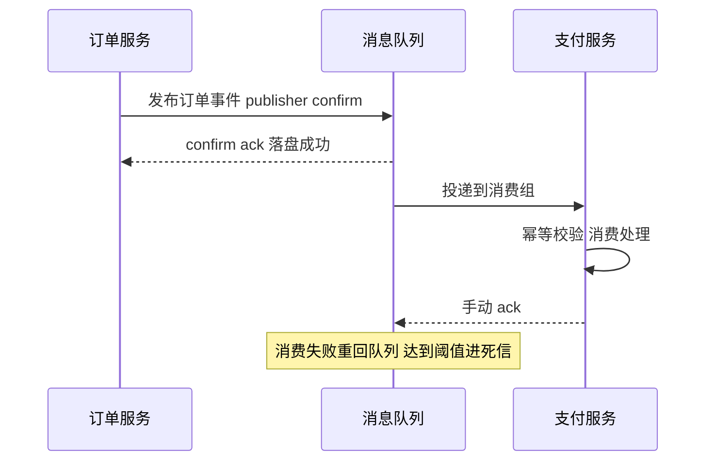
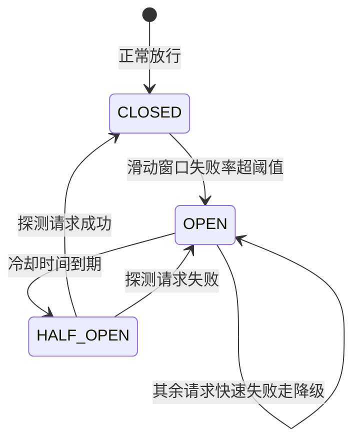
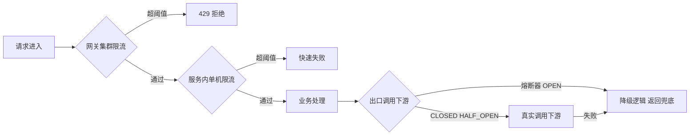

# Python 企业级微服务架构

## 一句话摘要

从单体到微服务的完整演进：项目结构、框架选型、服务间通信、服务治理（注册发现/熔断/限流）、统一配置与日志、容器化部署——每一层都给机制原理、反方案取舍与事故复盘。

## 🎯 本文核心

**核心机制一句话**：微服务架构的本质是把「一个进程内的函数调用」换成「跨网络的进程协作」，用网络透明化的基础设施（注册发现、熔断、限流、链路追踪）去对冲网络带来的不确定性——拆分买的是组织效率与独立部署，付的是分布式复杂度。

**机制链**：业务拆分（按业务能力边界）→ 服务间通信（同步 HTTP/gRPC + 异步消息）→ 注册发现（心跳续约 + 客户端负载均衡）→ 治理三件套（熔断快速失败、限流保护自身、降级保核心）→ 可观测（统一日志 + trace_id 贯穿）→ 部署（容器化 + 声明式编排）。

**失效边界**：服务数量低于拆分收益阈值时，微服务是纯负债——治理成本（部署/排查/联调）会吃掉全部灵活性。单体先行、按痛点拆分，是比「一步到位微服务」更稳的工程路线。

## 一、先回答要不要拆：单体反方案分析

反方案分析：为什么不直接上微服务？把「模块化单体」作为对照方案摆出来：

| 维度 | 模块化单体 | 微服务 |
|---|---|---|
| 事务一致性 | 本地事务 | 分布式事务（Saga/最终一致） |
| 故障排查 | 一个进程内断点 | 跨服务日志聚合 + 链路追踪 |
| 部署粒度 | 一个制品 | N 个制品 + 编排 |
| 团队协作 | 合并冲突 | 接口契约 + 联调 |
| 独立伸缩 | 不支持 | 天然支持 |

结论很简单：微服务的每一项收益都对应一项成本。什么时候值得付？**部署节奏冲突**（各模块发布频率差异大，互相卡版本）与**伸缩需求冲突**（某模块负载是其他模块的十倍）真实存在时。设计思想是：微服务拆的是「业务能力边界」，不是技术分层——按「订单能力」「支付能力」拆，而不是按「三层架构」拆成 web 服务/逻辑服务/DAO 服务，后者是历史上有名的反模式（分布式单体，公开口径）。



## 二、项目结构：monorepo 还是 multirepo

反方案分析：为什么不选 multirepo（一服务一仓库）？multirepo 的独立性强，但公共库升级要跨 N 个仓库发版；monorepo（本节结构）用统一 CI 按目录触发构建，公共层一次升级全局生效。取舍是 monorepo 需要更强的 CI 分轨能力，否则任何提交都触发全量构建。

```
project/
├── apps/                  # 部署单元：一个目录一个服务
│   ├── orders/            # 订单服务
│   ├── payments/          # 支付服务
│   └── users/             # 用户服务
├── libs/                  # 共享库：只放无状态、无副作用的代码
│   ├── database/          # 连接池与基础 ORM 配置
│   ├── cache/             # 缓存客户端封装
│   ├── middleware/        # 鉴权/追踪中间件
│   └── mq/                # 消息客户端封装（confirm/幂等内置）
├── configs/               # 配置模板与环境差异层
├── tests/                 # 跨服务契约测试
├── docker/                # 各服务 Dockerfile
└── k8s/                   # 部署清单
```

设计思想：`libs` 只沉淀「机制」（怎么连、怎么重试、怎么打日志），`apps` 承载「策略」（业务规则）。机制下沉、策略上浮——这条边界守住，公共层才不会腐烂成大杂烩。

## 三、框架选型：决策表与明确推荐

| 框架 | 适用场景 | 优势 | 代价 |
|---|---|---|---|
| FastAPI | API 服务/聚合层 | 异步、类型校验内置、OpenAPI 自动生成 | 异步生态要求全链路配合 |
| Flask | 小型服务/内部工具 | 生态成熟、心智负担低 | 同步模型并发上限低 |
| Django | 内容型/管理后台 | ORM/Admin 全家桶 | 重，微服务场景偏大 |
| Celery | 异步任务（配套） | 定时/重试/路由成熟 | 不适合低延迟 RPC |

**明确推荐**：对外 API 与服务间同步调用用 FastAPI；遗留同步生态多的团队用 Flask 起步不丢人；Django 只在「服务本质是个带后台的内容系统」时选；Celery/ARQ 作为任务通道与 Web 层解耦。决策原则：**按服务职责选框架，而不是全公司一刀切**——框架异构的代价由统一的可观测层（日志格式、trace 规范）吸收。

## 四、服务间通信：同步与异步的机制边界

### 4.1 同步调用：超时、重试与熔断缺一不可

```python
import httpx

async def call_payment(payload: dict) -> dict:
    transport = httpx.AsyncHTTPTransport(retries=1)
    async with httpx.AsyncClient(
        transport=transport,
        timeout=httpx.Timeout(connect=1.0, read=3.0, write=1.0, pool=1.0),
        base_url="http://payment-service",
    ) as client:
        resp = await client.post("/api/pay", json=payload)
        resp.raise_for_status()
        return resp.json()
```

机制穿透：超时必须分相设置——连接超时管「对方挂没挂」，读超时管「处理多慢」，池超时管「连接池排队」。整体一个 timeout 数值是常见误区：连接 3 秒超时会让「对方宕机」的感知延迟放大三倍。

**追问一：为什么重试必须配幂等与抖动？**
重试放大流量：下游 P99 抖动时，N 个调用方的重试会让流量翻倍，把「慢」变成「雪崩」。指数退避 + 抖动把重试打散；而幂等（请求 ID 去重）保证「超时但实际成功」的请求重试后不产生重复副作用。没有幂等的接口只允许对「确定失败」的异常重试。

### 4.2 异步消息：解耦与削峰的原理



反方案分析：为什么不全部用同步调用？同步链路每加一层，可用性按乘法衰减（两个 99.9% 的服务串联，链路可用性降到 99.8%，业内认知口径）；消息队列把「同时在线」的依赖变成「最终到达」，还能把突发流量削成平稳消费。代价是最终一致——用户下单后「支付结果稍后通知」的交互模式必须能接受这个语义。什么时候不用消息：调用方需要「立即拿到结果」（余额查询、风控判定）时，只能同步。

💡 **实战提示**：消息队列的可靠性三件套是「生产端 confirm + 队列持久化 + 消费端手动 ack」，缺一环都会丢消息。发布确认机制（publisher confirm）是生产端等 broker 落盘回执，而不是 fire-and-forget。

## 五、服务治理三件套：发现、熔断、限流

### 5.1 注册发现的机制

```python
import nacos

client = nacos.NacosClient("nacos:8848", namespace="prod")

def register():
    client.add_naming_instance(
        "payment-service", "10.0.0.11", 8000,
        heartbeat_interval=5,
    )

def resolve(service: str) -> list[str]:
    return client.list_naming_instance(service, healthy_only=True)
```

机制：服务启动时注册地址，之后按间隔发心跳续约；注册中心把超时未续约的实例标记下线；调用方拉取健康实例列表后做**客户端负载均衡**（本地轮询/随机/加权）。为什么选客户端 LB 而不是中心化网关转发？少一跳网络与单点；代价是每个 SDK 都要实现负载均衡逻辑——这是服务框架层（libs）把它封装掉的动机。

**追问二：心跳间隔与下线感知的 Trade-off 怎么定？**
心跳越密，故障实例下线越快，但注册中心压力越大。5 秒心跳 + 15 秒未续约判死是常见档位（业内认知）。更快的感知靠主动注销：进程收到 SIGTERM 时先反注册再退出，把「优雅下线」从 15 秒压缩到秒级——滚动发布不 500 的关键就在这一步。

### 5.2 熔断器：三态状态机



熔断的设计思想不是「不调用了」，而是**快速失败**：与其让请求在线上排队 30 秒超时，不如 1ms 内返回降级结果，把下游的恢复窗口让出来。半开态放少量探测请求验证恢复——这就是「熔断器为什么会自己好起来」的机制答案。

```python
class CircuitBreaker:
    def __init__(self, failure_threshold=5, recovery_timeout=30):
        self.failure_count = 0
        self.failure_threshold = failure_threshold
        self.recovery_timeout = recovery_timeout
        self.state = "CLOSED"
        self.last_failure_time = 0.0

    def allow(self) -> bool:
        if self.state == "OPEN":
            if time.monotonic() - self.last_failure_time > self.recovery_timeout:
                self.state = "HALF_OPEN"
                return True
            return False
        return True

    def on_result(self, ok: bool) -> None:
        if ok:
            self.state, self.failure_count = "CLOSED", 0
        else:
            self.failure_count += 1
            if self.failure_count >= self.failure_threshold or self.state == "HALF_OPEN":
                self.state, self.last_failure_time = "OPEN", time.monotonic()
```

### 5.3 限流：令牌桶机制与放置位置

令牌桶以固定速率补充令牌，请求消耗令牌，桶空则拒绝——「平均速率 + 突发容量」双参数，比固定窗口计数更平滑。机制穿透：单机限流（进程内令牌桶）与集群限流（Redis + Lua 原子扣减）是两个东西，前者挡单机过载，后者保护下游总容量；集群限流的 Redis 本身也要限流，否则限流组件成为新单点。

**追问三：限流、熔断、降级三者什么关系？**
限流是「进门时控制人流量」（保护自己），熔断是「发现对方病了就别挤了」（保护关系），降级是「挤不进去时给个替代答案」（保护体验）。放置顺序：入口网关集群限流 → 服务内单机限流 → 出口调用套熔断 → 熔断触发走降级逻辑。



### 治理形态的演变：从 SDK 到 Sidecar

跨周期看服务治理的演变很有意思：2019 年前后主流形态是「胖客户端」——注册发现、负载均衡、熔断全塞进语言 SDK，Python/Java/Go 各自实现一遍；2022 年之后 Service Mesh 把流量治理下沉到 Sidecar 代理，应用里只剩纯业务代码。这条演进路径的驱动力是多语言团队的 SDK 维护成本，但对价是每跳代理延迟与网格控制面的运维复杂度。真相是：两种形态今天都在生产中大量存在——Python 生态的 Mesh 落地成熟度弱于 Java 生态，中小规模团队用 SDK 形态（本节的 libs 封装）依然是性价比最高的选择，不必追新。

## 六、三次事故复盘

### 事故叙事一：熔断阈值过低，正常抖动触发雪崩连锁

线上事故：把失败阈值设成「连续 3 次失败即熔断」，大促期间下游只是 P99 抖到 2 秒，瞬时超时 3 个就熔断；熔断期间积压的流量恢复后又以更高并发砸向下游，再次抖动、再次熔断——熔断器「打嗝式震荡」。排查复盘：阈值不该按「次数」而按「滑动窗口失败率」配（如 10 秒窗口失败率超 50% 且请求数达标才熔断）；冷却期从 30 秒调整为指数递增。教训：熔断参数是统计问题不是计数问题。

### 事故叙事二：注册中心推送延迟，调用打到已死实例

线上事故：某实例 OOM 被杀，注册中心 30 秒后才标记下线，这 30 秒内所有调用该实例的请求全部连接拒绝，网关错误率飙红。排查：调用方本地实例列表缓存刷新周期过长，叠加心跳判死延迟。复盘动作：① 优雅下线——SIGTERM 时先反注册、等流量排水完成再退出；② 调用方对「连接拒绝」类错误做实例级摘除（不重试同一实例）；③ 注册中心健康检查与 Kubernetes 存活探针双保险。机制教训：**注册发现是最终一致系统，任何依赖它「实时准确」的设计都是错的**。

### 事故叙事三：消息无 confirm，发布端重启丢消息

线上事故：发布节点滚动重启期间，几十条支付回调消息丢失，对账发现几百笔订单状态停在「处理中」。排查：pika BlockingConnection 在 publish 后立即进程退出，消息没到 broker 就没了。复盘修复：开启 publisher confirm + 失败落本地重试表；消费端同步改手动 ack + 幂等表（按业务单号去重）；补一个对账兜底任务，定期补偿「处理中」超时订单。教训：消息可靠性是两端的事，缺任何一端都得靠对账兜底。

### 事故叙事四（旁证）：压测暴露的限流反模式

线上演练时压测打到预期容量的一半，服务就出现大量 429。排查发现限流阈值按「理论容量」配而非「压测基线」配，理论值高估了一倍。复盘：限流配置与压测报告绑定更新——容量变了，限流跟着变，这个动作要写进发布清单。

## 七、统一配置与结构化日志

```python
from pydantic_settings import BaseSettings

class Settings(BaseSettings):
    debug: bool = False
    database_url: str
    redis_url: str = "redis://redis:6379/0"
    payment_timeout_s: float = 3.0

    class Config:
        env_file = ".env"

settings = Settings()
```

配置机制：类型校验的配置类 + 环境变量覆盖——同一份代码在多环境只换环境变量，配置漂移在启动时即被 pydantic 拦截。敏感信息走密钥管理，不进仓库。

```python
import json, logging

class JSONFormatter(logging.Formatter):
    def format(self, record):
        payload = {
            "ts": self.formatTime(record),
            "level": record.levelname,
            "service": record.name,
            "msg": record.getMessage(),
        }
        if hasattr(record, "trace_id"):
            payload["trace_id"] = record.trace_id
        return json.dumps(payload, ensure_ascii=False)
```

日志的架构级要求只有两条：JSON 结构化（采集端免正则）+ trace_id 贯穿（入口生成，HTTP 头透传，消息体携带）。没有 trace_id 的微服务排查等于盲人摸象——跨服务日志聚合后按 trace_id 串联，才能还原一次请求的完整路径。

## 八、参数级配置清单

| 配置项 | 默认值 | 分档推荐 | 为什么 |
|---|---|---|---|
| 熔断失败率阈值 | 50% | 40%-60% | 过低误熔断，过高形同虚设 |
| 熔断统计窗口 | 10s | 10-30s | 太短对抖动过敏 |
| 熔断冷却时间 | 30s | 30-60s | 半开探测前等待期 |
| 半开探测并发 | 1 | 1-3 | 探测流量必须远小于正常流量 |
| 令牌桶速率 | 按容量 | 压测 P99 容量的 80% | 留突发余量 |
| 令牌桶桶容量 | 速率值 | 1-2×速率 | 允许的瞬时突发 |
| http 连接超时 | 1s | 0.5-1s | 快速感知实例死亡 |
| http 读超时 | 3s | 按 P99×2 | 覆盖正常慢请求 |
| 重试次数 | 0 | 同步链路 ≤1 次 + 抖动 | 重试是流量放大器 |
| 心跳间隔 | 5s | 5s，主动注销必配 | 下线感知速度关键 |
| gunicorn workers | 1 | 2×CPU 核 | 多进程利用多核 |
| 日志级别（生产） | INFO | INFO，DEBUG 按需开关 | DEBUG 量大且含敏感风险 |

💡 **实战提示**：治理参数不要拍脑袋——先压测拿到下游的 P99/失败率基线，再按「基线×安全系数」回填配置；上线后用治理面板看触发次数，熔断天天触发说明参数或容量有问题，而不是熔断器好使。

## 九、步骤级操作：给服务接入治理三件套

**前置条件**：注册中心（Nacos）可用；服务已容器化；libs 治理库已发布内网源。

1. **接入注册**：服务启动钩子里调用 `register()`，SIGTERM 处理器里反注册。
   - 验证：注册中心控制台看到实例且健康检查绿色；`kill -TERM` 后 5 秒内实例消失。
2. **出口调用包熔断**：把 httpx 调用包进 `CircuitBreaker.allow()/on_result()`。
   - 验证：手动停掉下游，1 秒内返回降级响应（而非超时）；下游恢复后 30-60 秒自动半开探活回到 CLOSED。
3. **入口加限流**：中间件挂单机令牌桶，网关层配集群限流规则。
   - 验证：压测工具打到限流阈值，返回 429 且系统 P99 平稳不雪崩。
4. **演练回退**：治理开关做成配置项，异常时可一键旁路熔断/限流。
   - 回退：关闭开关后行为回到裸调用；回退后必须观察下游错误率——治理层掩盖的问题会立刻显形。

## 十、不同量级的思考：架构约束驱动解法

- **十万级（日请求十万，峰值 QPS 几十）**：单体 + 模块边界就是最优解，这一档上微服务是给治理基础设施白打工。约束来源是团队规模与部署复杂度；思考方式是「边界守护驱动」——用包结构和代码评审守住模块边界。这一档的核心问题是「模块边界清不清晰」，而不是「服务拆没拆」
- **百万级（日请求百万，峰值 QPS 数百）**：3-5 个服务 + 注册发现 + 统一网关进场，治理三件套开始有必要。约束来源是部署独立性与团队并行协作；思考方式是「契约先行驱动」——接口契约与契约测试先于联调。这一档的核心问题是「接口契约稳不稳定」，而不是「拆得够不够细」
- **千万级（峰值 QPS 数千）**：服务数量上到两位数，容量规划、依赖治理（谁强依赖谁）、单元化雏形成为主要矛盾。约束来源是跨服务依赖链条的复杂度；思考方式是「依赖治理驱动」——强依赖同步化熔断、弱依赖异步化削峰。这一档的核心问题是「依赖链可控吗」，而不是「再加几个服务」
- **亿级（日请求过亿，峰值 QPS 万级）**：多机房多活、单元化封闭（流量按用户分片在单元内闭环）、全链路压测常态化。约束来源是跨机房物理延迟与故障爆炸半径；思考方式是「故障半径驱动」——一切架构决策先问「坏了炸多大」。这一档的核心问题是「故障半径圈住了吗」，而不是「单服务性能多高」

**自下而上与触发升级**：先测档位再选架构——峰值 QPS、服务数量、团队规模三个实测值决定站在哪一档，不预支下一档的治理复杂度，也不滞留在上一档的单体侥幸里。触发升级的信号：部署互相卡版本、某模块负载与其他模块差一个量级、跨服务排查超时频发——任一信号出现就升级对应能力（边界守护 → 契约先行 → 依赖治理 → 故障半径）。锚点始终是约束来源：团队协作方式与物理网络约束变了，架构才跟着变——「别人都微服务了」从来不是约束。

## 十一、什么时候用 / 什么时候不用

**明确推荐微服务化**：部署节奏冲突真实存在、模块间伸缩比超过一个量级、团队规模到各服务可独立认领（两个披萨原则量级，业内认知）——三条满足其二再动手。

**不推荐**：初创验证期产品（治理成本拖死迭代）；团队无容器化与可观测基础（先补基础再拆）；只为简历驱动或流行度拆分——分布式复杂度不会因为热情消失。

## 十二、Trade-off：拆分代价明细

- **独立部署 vs 分布式事务**：服务拆开后跨服务一致性只能要最终一致（本地消息表/Saga），强一致场景要么收进一个服务，要么付同步事务协调的复杂度。
- **技术异构自由 vs 团队维护成本**：每个服务自选框架很自由，但五种框架五种坑；推荐「主栈统一 + 特例审批」。
- **客户端 LB 的低延迟 vs SDK 沉重**：服务发现逻辑进了每个 SDK，语言升级时多语言团队各自维护——服务网格（Sidecar 接管流量治理）就是为解这个 Trade-off 而生，但 Sidecar 自身带来每跳延迟与网格运维成本。
- **服务自治 vs 全局最优**：各服务自选存储带来数据孤岛，跨服务报表要用事件汇聚（CDC/OLAP），这是自治的对价。

## 你们可能会问

**Q1：服务拆多小合适？**
按业务能力不按代码量。判断标准：这个能力能否独立发布、独立伸缩、独立故障（挂了影响面明确）。拆到「两个方法就要跨网络调用」就是拆过头——网络调用是进程边界，不是函数边界。

**Q2：服务间用 gRPC 还是 HTTP+JSON？**
内部高频调用推荐 gRPC（二进制序列化 + 强契约 + 多路复用，性能优于文本协议一个量级，业内认知）；对外 API 与调试频繁的场景用 HTTP+JSON（可读、生态通用）。混合是常态：对外 REST、对内 gRPC。

**Q3：跨服务数据一致性怎么办？**
优先用「本地消息表 + 最终一致」：业务与消息同库落盘，后台任务投递，消费端幂等。强一致需求（如扣款）尽量收进单服务本地事务。两阶段提交在微服务场景基本是反方案——协调者单点与锁持有时间都是事故温床。

**Q4：统一网关和直连各服务怎么选？**
对外必须过网关（鉴权、限流、路由收敛收口一处）；服务间调用直连（经注册发现）不走网关，避免网关成为性能与可用性的单点。网关挂了全站挂——它自己必须多活部署。

## 5W 速记卡

| 维度 | 内容 |
|---|---|
| What | 按业务能力边界拆分、以治理基础设施对冲网络不确定性的服务架构 |
| Why | 部署节奏与伸缩需求冲突时，单体成为组织与性能的双重瓶颈 |
| When | 拆分驱动力真实存在（两条判据满足其二）；验证期单体先行 |
| Who | 平台团队建设施（发现/治理/可观测），业务团队专注能力交付 |
| How | monorepo + FastAPI + 注册发现 + 熔断限流降级 + 结构化日志 + 容器编排 |

## 自测三问

1. 熔断器为什么能「自己恢复」？（答案：半开态探测——冷却期后放少量请求试错，成功回 CLOSED，失败回 OPEN）
2. 滚动发布时怎么保证不 500？（答案：SIGTERM 先反注册再排水退出，把下线感知从心跳超时的十几秒压到秒级）
3. 消息队列哪三件事缺一就丢消息？（答案：生产端 confirm、队列持久化、消费端手动 ack；两端之外还要对账兜底）

## 开放问题

- 服务网格在中小规模团队是「提前优化」还是「提前建设」？Sidecar 的运维成本与 SDK 沉重的临界点在哪里，目前没有定论。
- 治理参数（熔断/限流）能否基于实时流量自适应调整，替代静态配置？自适应误判的风险如何兜底，值得持续观察。

## 🎯 核心带走

**30 秒复述**：微服务 = 按业务能力拆分 + 用治理基础设施对冲网络不确定性。机制链：注册发现（心跳续约 + 客户端 LB）→ 同步调用带超时重试熔断 → 异步消息带 confirm 与幂等 → 全链路 trace_id 贯穿。**失效点**：拆分驱动力不真实时是纯负债；注册发现是最终一致系统，别设计成依赖实时准确；重试无幂等是流量放大器。**三条铁律**：单体先行、按痛点拆；机制沉 libs、策略留 apps；治理参数必须压测回填再上线。

## 📌 数据与事实声明

- 本文机制描述基于 Nacos、httpx、pika/RabbitMQ、Gunicorn、Kubernetes 官方文档与通用工程实践。
- 具体数值（心跳 5s、可用性 99.9%、连接超时 1s 等）为业内认知常见档位，非普适标准，以压测与官方文档为准。
- 三次事故叙事为生产环境常见案例的抽象化重构，不含任何真实公司、系统与个人信息。
- 两披萨原则、分布式单体等提法为公开口径的行业术语。

## 📚 参考资料

| 资料 | 说明 |
|---|---|
| FastAPI 官方文档 https://fastapi.tiangolo.com/ | 服务框架与依赖注入 |
| Nacos 官方文档 https://nacos.io/ | 注册发现与配置中心机制 |
| RabbitMQ 文档 https://www.rabbitmq.com/docs | publisher confirm 与消费 ack 机制 |
| httpx 文档 https://www.python-httpx.org/ | 超时分相与连接池 |
| Gunicorn 文档 https://docs.gunicorn.org/ | worker 模型与部署参数 |
| Kubernetes 文档 https://kubernetes.io/docs/home/ | 探针、滚动更新与优雅终止 |
| Sam Newman《Building Microservices》 | 服务拆分边界与治理通识（公开出版物） |
