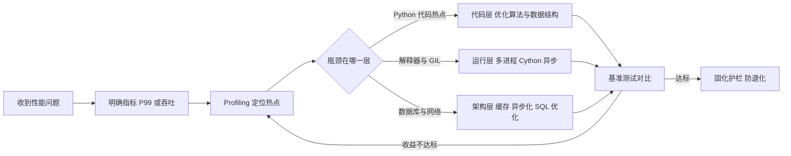
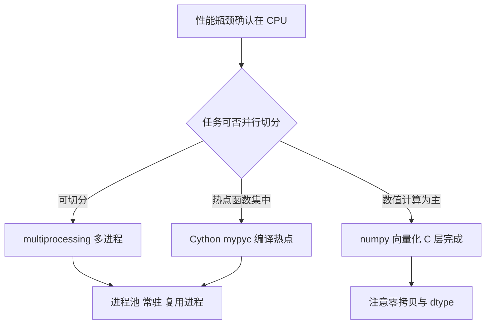
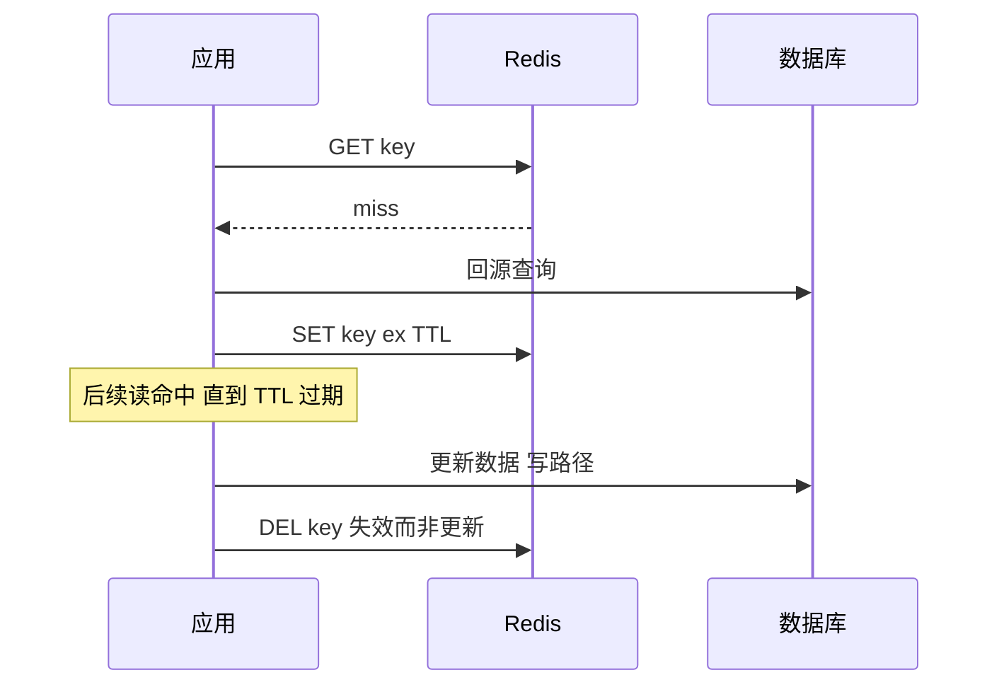
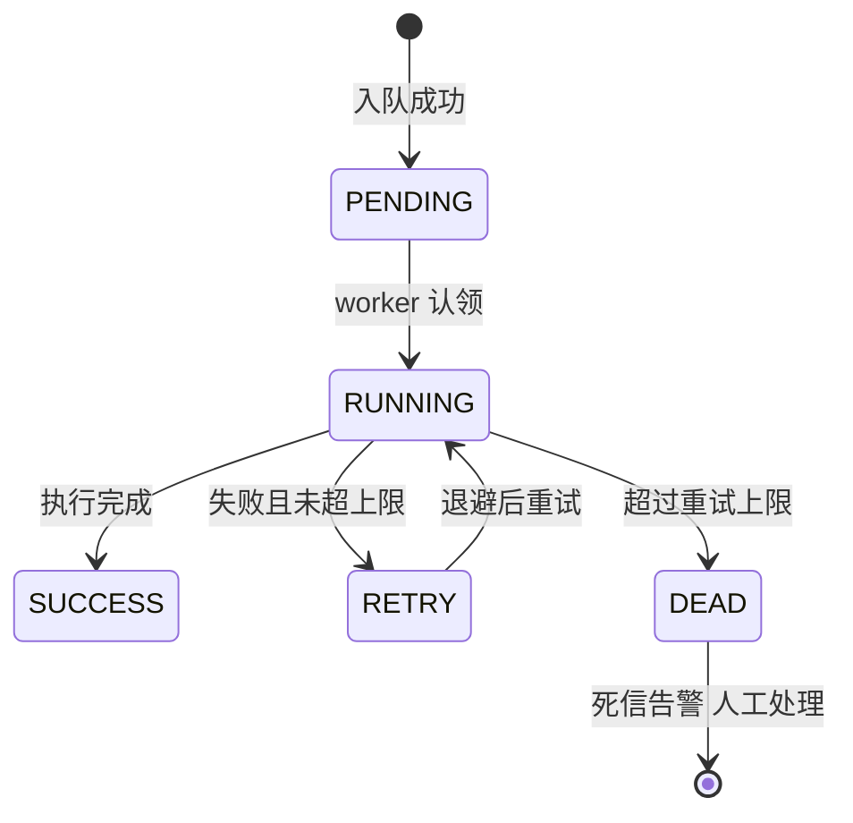

# Python 性能优化与工程化实践

## 一句话摘要

Python 性能优化 = 代码层 + 运行层 + 架构层的三层体系：先用 Profiling 定位瓶颈，再按「约束在哪一层」选武器——本文讲透三层优化机制、工程化护栏与事故复盘，反对一切无数据支撑的玄学调优。

## 🎯 本文核心

**核心机制一句话**：性能优化的本质是找到「当前约束资源」（CPU/内存/I/O/锁）并把它让给最关键的路径——三层优化只是约束所在的三个位置，优化的第一步永远是测量而不是猜测。

**机制链**：Profiling 定位（cProfile/py-spy 找热点）→ 代码层（算法复杂度 + 数据结构哈希机制）→ 运行层（绕开 GIL 的多进程 / Cython 编译 / 事件循环）→ 架构层（缓存换 I/O、异步化削峰、SQL 减少往返）→ 工程化护栏（基准测试防退化、Profiling 常态化）。

**失效边界**：没有测量就优化 = 用猜测驱动开发；瓶颈不在 Python 层（在数据库/网络）时，一切语言级优化都是徒劳——先分清「语言慢」还是「系统慢」，这是所有优化的前置判断。

## 一、方法论：先 Profiling 后优化

反方案分析：为什么「看起来慢就加缓存/换语言」是反方案？线上排查的真实案例里，「感觉慢」的原因分布极其分散：N+1 查询、锁竞争、GC 停顿、序列化开销、DNS 解析……凭直觉优化命中率极低，还常常优化了不慢的地方（过早优化）。另一种做法是先测量：Profiling 数据会直接指出热点，一次只优化最大的那一块。

```python
import cProfile, pstats

def run():
    profile = cProfile.Profile()
    profile.enable()
    main()                      # 被测入口
    profile.disable()
    stats = pstats.Stats(profile)
    stats.sort_stats("cumulative").print_stats(20)
```

工具演进（跨周期）：cProfile 是进程内确定性统计（函数级调用计数与耗时）；py-spy 是采样式 profiler，**attach 到运行中的进程不重启服务**——线上排查的首选；火焰图把调用栈按耗时宽度可视化，一眼看出「宽条」在哪。演变结论：工具从「离线复现」走到「在线采样」，性能排查从实验室走进了生产环境。



💡 **实战提示**：优化前先写下基线数字（P99/QPS/内存），优化后同一环境复测。没有前后对比的优化无法证明有效——「感觉快了」在性能评审里等于零分。

## 二、代码层：算法、数据结构与解释器机制

### 2.1 复杂度优先于微优化

```python
# 坏：O(n*m) 每次成员判断线性扫描
result = [x for x in list1 if x in list2]

# 好：O(n+m) set 哈希查找
set2 = set(list2)
result = [x for x in list1 if x in set2]
```

机制穿透：为什么 `in set` 是 O(1)？dict/set 底层是开放寻址哈希表——哈希函数把元素映射到槽位，查找只算一次哈希加常数次探测。list 的 `in` 是逐元素比较。十万元素找一万次，前者是「十万次哈希」，后者是「十亿次比较」——量级差距不是一个常数系数。

### 2.2 解释器层面的微观机制

- **列表推导 vs 循环 append**：推导式在字节码层走专用指令（LIST_APPEND），省掉属性查找与函数调用开销，常规快 20%-50%（业内认知）。
- **局部变量快于全局变量**：CPython 用数组下标访问局部变量，全局变量要查字典——热循环里把全局函数赋值给局部变量是老牌技巧。
- **字符串拼接**：循环里 `+=` 每次都新建字符串对象（不可变机制），累计 O(n²)；`"".join(parts)` 一次分配。

```python
# 慢：每次循环创建新字符串对象
out = ""
for p in parts:
    out += p

# 快：一次分配
out = "".join(parts)
```

反方案分析：为什么不用 PyPy 替代 CPython 拿十倍 JIT 加速？JIT 确实对纯计算代码有量级收益（公开口径），但生产生态里 numpy/pandas/各大 SDK 的 C 扩展兼容性是长期软肋；运维团队还要多养一条运行时。取舍结论：PyPy 适合纯 Python 计算型场景，Web 服务生态留在 CPython 更稳。

## 三、运行层：GIL 与三条绕行通道

GIL（全局解释器锁）的底层机制：CPython 的内存管理靠引用计数，计数变量的并发修改需要互斥保护——同一时刻只允许一个线程执行 Python 字节码。理解这层设计思想就明白：GIL 不是「Python 偷懒」，而是「用引用计数换 GC 停顿可控」这一取舍的直接后果——每一种内存管理设计都在跟某类代价做交换。于是多线程对 CPU 密集代码无效（甚至更慢，线程切换带额外开销），但对 I/O 密集代码有效（等待时释放 GIL）。



三条通道的机制边界：

1. **multiprocessing**：每进程独立解释器与 GIL，真正并行。代价是进程间通信要序列化（pickle），大对象传输会把收益吃掉——进程池要**常驻复用**（`Pool` 而不是反复 `Process`），进程创建成本毫秒级。
2. **Cython/mypyc**：把热点函数编译成 C 扩展，收益来自绕开字节码解释。只编译 Profiling 出来的头部热点（通常 5% 的代码占 80% 时间，业内认知）——全量编译的维护成本不划算。
3. **numpy 向量化**：把 Python 循环下推到 C 层的批量运算。反方案分析：为什么不手写 Cython 重写数值循环？numpy 的向量化原语（广播/聚合）已覆盖大多数场景，且是经过十年验证的 C 代码——自写扩展只在向量化表达不了的控制流密集逻辑时才考虑。

**追问一：asyncio 算运行层优化吗？**
不算计算加速——事件循环只是把 I/O 等待调度得更省（单线程调度协程），每个请求的计算耗时一分不减。事故叙事三里那个「CPU 密集误用 asyncio」就是混淆了这两件事：把计算塞进事件循环，不但没有并行，还把 I/O 调度也堵死了。

## 四、架构层：缓存、异步任务与数据库

### 4.1 缓存：读路径的时序与一致性



为什么「删缓存」而不是「改缓存」？机制上是并发写问题：两个写请求乱序到达时，「改缓存」可能把旧值写回去（先更新 DB 的旧值后到缓存）；删除则让下一次读重新回源，最多短暂 miss。「Cache Aside + 删除失效 + TTL 兜底」是可解释、可复盘的标准姿势——任何更复杂的一致性方案（延迟双删/订阅 binlog 同步）都要先问「能否接受这一档的复杂度」。

### 4.2 异步任务：把慢操作移出请求链路

```python
from celery import Celery

app = Celery("tasks", broker="redis://redis:6379/1")

@app.task(bind=True, max_retries=3, retry_backoff=True)
def generate_report(self, report_id: int):
    ...  # 耗时任务 队列消费执行
```

请求链路只做「受理 + 入队」，重活由 worker 消费——响应时间从「任务时长」变成「入队时长」。任务状态机：pending → running → success / retry → dead-letter；达到重试上限进死信队列人工介入，这是任务不静默丢失的关键。



### 4.3 数据库：往返次数优先于单条 SQL

**事故叙事一：N+1 查询打挂数据库。** 线上页面一次列表请求带出 200 条订单，ORM 懒加载机制让每条订单再发一条 profile 查询——单请求 201 条 SQL，QPS 上来后数据库连接池瞬间排队，P99 从 200ms 涨到 6 秒。排查：慢查询日志里同一模板 SQL 每秒几百次，参数不同。修复：`selectinload` 预加载（两条 SQL：主表一条、关联表 IN 一条）。复盘教训：**ORM 的「方便」藏起了往返次数**——性能评审要看 SQL 条数，不只看单条耗时。

```python
# 坏：懒加载 N+1
for order in orders:
    print(order.profile.name)

# 好：预加载 两次查询
orders = session.execute(
    select(Order).options(selectinload(Order.profile))
).scalars().all()
```

💡 **实战提示**：架构层的优化优先级永远是「减少往返 > 减少单次成本」：一次网络往返的开销通常是毫秒级，一次哈希查找是纳秒级——这就是为什么「合并 201 条 SQL 为 2 条」的收益远大于任何代码层微优化。

## 五、更多事故复盘

**事故叙事二：缓存与数据库双写不一致的资损复盘。** 线上促销期间，改价的写请求「先更新 DB 再更新缓存」，但缓存更新因网络抖动失败且未重试——缓存里停留着旧价，用户按旧价下单，资损复盘持续了一整天。排查：对账任务发现 DB 与缓存价格差异记录。修复：写路径改成「更新 DB + 删缓存」，缓存更新失败不再致命（下次读回源）；价格类读走「短 TTL（5s）+ 关键交易强制回源」。教训：缓存一致性方案的正确性必须论证并发时序，不能只看单线程视角。

**事故叙事三：CPU 密集误用 asyncio，越优化越慢。** 团队把图片压缩任务从同步接口改写为异步接口「提升并发」，结果吞吐不升反降：压缩是纯 CPU 计算，协程在事件循环里串行执行，还阻塞了其他 I/O 协程的调度。排查：py-spy 火焰图显示事件循环线程单核打满。修复：压缩下放 Celery worker（独立进程池），接口只回任务 ID。复盘教训：异步是 I/O 调度技术，不是并行计算技术——工具名里的「async」不天然等于「快」。

**事故叙事四：连接池耗尽的连锁反应。** 性能优化后单请求变快、QPS 翻倍，但连接池参数没跟着调——pool_size 5 个连接被瞬间借空，请求在池上排队，P99 反而劣化。排查：池等待耗时占比 70%。修复：按「QPS × 平均持有时间」估算并发连接数重配池参数。教训：优化会移动瓶颈——性能工作是一个「测量 → 优化 → 复测」的循环，不是一次性动作。

## 六、参数级配置清单

| 配置项 | 默认值 | 分档推荐 | 为什么 |
|---|---|---|---|
| 进程池常驻数 | CPU 核数 | 核数 或 核数-1（留系统余量） | CPU 密集并行上限即核数 |
| Celery max_retries | 无限 | 3-5 + 退避 | 无限重试会毒化队列 |
| Celery retry_backoff | False | True（指数退避） | 防失败风暴打下游 |
| Redis 缓存 TTL | 永久 | 热点 300-3600s | TTL 是一致性的兜底保险 |
| 回源熔断阈值 | 无 | miss 打满时熔断回源 | 防缓存雪崩打死数据库 |
| SQLAlchemy pool_size | 5 | 按 QPS×持有时间估 | 优化后必须重估 |
| py-spy 采样率 | 100Hz | 默认 | 过高影响被测进程 |
| GC 阈值 (gen0) | 700 | 大对象服务可调高 | 降低 GC 触发频率 |
| 批处理 batch size | 无 | 500-1000/批 | 平衡往返与内存 |

## 七、步骤级操作：一次完整的性能优化流程

**前置条件**：已建立基准（压测环境 + 固定数据集）；生产可观测数据可导出；py-spy 可部署。

1. **定指标**：明确优化对象是 P99 还是吞吐，写成一句话（例：订单列表 P99 从 6s 降到 500ms 内）。
2. **采数据**：`py-spy dump --pid <pid>` 看瞬时栈；`py-spy record -o profile.svg --pid <pid> -d 60` 采一分钟火焰图。
   - 验证：火焰图能读出最宽调用路径；找不到热点则怀疑瓶颈在下游，转数据库/网络侧排查。
3. **选层**：按第一节决策图选代码层/运行层/架构层，一次只改一处。
4. **复测**：同一压测脚本重跑，对比基线。
   - 验证：指标改善且无新指标劣化（内存/CPU/错误率都在观察列）。
5. **固化护栏**：把关键路径的基准测试（pytest-benchmark）放进 CI，阈值超 20% 即失败（业内认知档位）。
6. **回退**：每次优化单独成 commit/分支，性能回退或正确性问题直接 revert；缓存类改动回退时先双写观察再切流，防止命中率跳水。

## 八、不同量级的思考：架构约束驱动解法

- **十万级（日请求十万，峰值 QPS 几十）**：代码层就够——算法复杂度与数据结构收益最直接， Profiling 半天解决战斗。约束来源是单机解释器执行效率；思考方式是「热点测量驱动」。这一档的核心问题是「热点找没找准」，而不是「要不要上缓存」
- **百万级（日请求百万，峰值 QPS 数百）**：架构层进场——缓存把读 I/O 换成内存、任务队列把慢操作移出请求链路、SQL 往返合并。约束来源是数据库 IOPS 与网络往返；思考方式是「往返削减驱动」。这一档的核心问题是「往返次数减了没有」，而不是「循环写法优不优雅」
- **千万级（峰值 QPS 数千）**：运行层与容量规划合流——多进程部署打满多核、热点函数 Cython 化、读写分离与多级缓存。约束来源是多核利用率与缓存容量；思考方式是「分层承接驱动」——每一级缓存/每一档算力各接多少流量要算账。这一档的核心问题是「多核吃满了没有」，而不是「代码再抠多少纳秒」
- **亿级（日请求过亿，峰值 QPS 万级）**：优化对象从「单服务」升格为「全链路」——全链路压测、容量水位、跨机房流量调度；单点优化的边际收益趋零。约束来源是集群整体容量与故障半径；思考方式是「水位治理驱动」。这一档的核心问题是「整条链路的水位平衡吗」，而不是「某个服务快不快」

**自下而上与触发升级**：先测档位再选优化层——P99 基线、QPS、CPU/连接水位三个实测值决定站在哪一档，不预支下一档的架构复杂度（小流量上多级缓存是负债），也不滞留在上一档的代码侥幸（大流量抠循环是徒劳）。触发升级的信号：代码层已无可削热点、数据库水位持续七成以上、单机扩展不再带来线性收益——任一信号出现就升级思考层（热点测量 → 往返削减 → 分层承接 → 水位治理）。锚点始终是约束来源：解释器/数据库/多核/集群的物理约束变了，优化手段才跟着变——「Python 慢」这个笼统判断从来不是有效约束。

## 九、什么时候用 / 什么时候不用

**明确推荐**：先 Profiling 后动手（无条件推荐，一切优化的前置）；读多写少 + 可容忍陈旧 → 缓存；耗时任务（报表/推送/文件处理）→ 任务队列异步化；数值循环 → numpy 向量化；确认的头部热点 → Cython。

**不推荐 / 不适用**：

1. **无测量直接优化**：过早优化是万恶之源（公开口径的经典论断），直觉命中率太低。
2. **CPU 密集用 asyncio**：事件循环不加速计算，见事故叙事三。
3. **为不到 5% 的请求优化 99% 的代码**：先确认请求分布，长尾问题长尾处理。
4. **缓存一切**：写多读少、强一致数据（余额/库存）上缓存是把一致性问题换成资损问题。

## 十、Trade-off：每一档优化都有对价

优化的设计哲学只有一句：**性能是拿别的资源换来的**——缓存拿一致性换吞吐，多进程拿复杂度换并行，编译拿可维护性换速度。下面把每笔交换的对价摆上台面：

- **缓存 vs 一致性**：缓存买性能，付的是陈旧窗口与一致性论证成本；越接近钱的路径，TTL 越短、回源越强制。
- **多进程 vs 复杂度**：进程并行绕开 GIL，付的是序列化开销与进程管理复杂度；任务可切分才值得。
- **Cython vs 可维护性**：编译热点买一个量级，付的是构建链路与调试成本——只对 5% 的头部热点值得。
- **异步化 vs 心智负担**：任务队列解耦买响应时间，付的是最终一致与任务监控建设；交互式「立即要结果」的场景不能异步化。
- **工程化护栏 vs 迭代速度**：基准测试与性能门禁买「不退化」，付的是 CI 时间与阈值维护——性能敏感服务必须付，内部工具可豁免。

## 十一、追问链：再深一层

- **再问一层：为什么引用计数需要 GIL，而 JIT 语言不需要？** 引用计数是「每条指令都可能修改共享计数器」的细粒度写入，锁粒度只能全局；JVM 等用可中断的分代 GC，回收线程与工作线程的同步点更少——这是实现历史的取舍，不是语言的宿命（free-threading 方案正在演进，公开口径）。
- **再问一层：火焰图为什么比耗时排序列表更有效？** 列表只有函数自耗时，看不出「谁的调用路径上」；火焰图的宽度天然聚合了调用栈上下文，宽条 = 「这条路径上的所有调用」总耗时——瓶颈是路径不是孤点。
- **再问一层：缓存的 TTL 定长好还是随机抖动好？** 同批写入的 key 用同一定长 TTL 会在同一时刻集体过期，回源洪峰打死数据库（雪崩机制）；TTL 加随机抖动把过期时间打散——一行代码防一类事故。

## 你们可能会问

**Q1：Python 写高性能服务是不是先天不行？**
要分清「语言慢」与「系统慢」：Web 服务耗时的大头通常在数据库与网络 I/O，语言执行占比很小——架构层优化与异步 I/O 之后，Python 服务完全可以扛住相当可观的流量（大量生产系统已验证，业内认知）。真正吃语言的 CPU 密集段，用编译扩展或下放其他运行时解决。

**Q2：优化到什么程度算够？**
看指标不看感觉：业务 SLO 达标（比如 P99 < 500ms）即停，继续优化是投入无产出。性能是成本项不是炫技项——达标后的时间应该花在护栏上防止退化。

**Q3：py-spy 会不会影响线上服务？**
采样式 profiler 每秒读百次寄存器快照，开销在个位数百分比（业内认知），生产短时间采样是业界常规操作；对比之下 cProfile 的确定性插桩开销大，只适合离线复现。

**Q4：GC 调优值得做吗？**
多数服务不值得——CPython 分代 GC 对常规对象分布已经够用。例外是大对象常驻服务（缓存千级大列表），对象追踪开销可见时，用 `gc.freeze()` 隔离常驻对象或调阈值才有感。

## 5W 速记卡

| 维度 | 内容 |
|---|---|
| What | 测量驱动的三层优化体系：代码层算法、运行层并行、架构层往返削减 |
| Why | Python 执行模型（GIL/解释器）决定了不同约束要用不同武器 |
| When | 有指标劣化或容量预警时；无测量不优化 |
| Who | 业务开发做代码与架构层，平台团队提供 Profiling 与压测设施 |
| How | py-spy 定位 → 决策图选层 → 单点修改 → 基准复测 → CI 护栏固化 |

## 自测三问

1. 为什么 `x in set2` 比 `x in list2` 快一个量级？（答案：set 是哈希表 O(1) 查找，list 是线性扫描 O(n)，元素量大时是数量级差距）
2. 为什么缓存更新用「删除」而不是「更新」？（答案：并发写乱序可把旧值写回缓存；删除让下次读回源，最多短暂 miss，时序上可论证正确）
3. 「接口改成 async」为什么没有让图片压缩变快？（答案：压缩是 CPU 密集，事件循环只是 I/O 调度器；计算仍串行还阻塞调度，正确解法是下放进程池）

## 开放问题

- free-threading CPython（去 GIL）普及后，多进程与多线程的选型边界会怎么重划？单线程性能损失与生态兼容是当前悬念（公开口径的演进方向）。
- 性能门禁阈值如何随业务增长自适应，而不是人工定期修——CI 基准的「漂移」问题尚无公认解法。

## 🎯 核心带走

**30 秒复述**：性能优化 = 测量驱动 + 按约束选层。机制链：py-spy 定位热点 → 代码层（复杂度/数据结构/字节码机制）→ 运行层（多进程绕 GIL/编译热点/向量化）→ 架构层（缓存换 I/O、队列移慢操作、合并 SQL 往返）→ CI 基准防退化。**失效点**：瓶颈不在 Python 层时语言级优化无效；CPU 密集误用 asyncio 反而更慢；优化会移动瓶颈，必须复测。**三条铁律**：无测量不优化；减少往返优先于减少单次成本；每次优化必须留下护栏。

## 📌 数据与事实声明

- 本文机制描述基于 CPython 官方文档、cProfile/py-spy/Celery/SQLAlchemy/numpy 官方文档与源码行为。
- 百分比与量级表述（推导式快 20%-50%、5% 代码占 80% 时间、采样开销个位数百分比等）为业内认知与公开口径，随环境不同而变化，以实测为准。
- 四次事故叙事为生产环境常见案例的抽象化重构，不含任何真实公司、系统与个人信息。
- 「过早优化」论断出自公开出版的经典工程文献。

## 📚 参考资料

| 资料 | 说明 |
|---|---|
| CPython 官方文档 https://docs.python.org/3/ | GIL、gc、timeit 等语言机制 |
| cProfile 文档 https://docs.python.org/3/library/profile.html | 确定性 Profiling 机制 |
| py-spy https://github.com/benfred/py-spy | 生产环境采样式 profiler |
| Celery 文档 https://docs.celeryq.dev/ | 任务队列、重试与退避配置 |
| SQLAlchemy 文档 https://docs.sqlalchemy.org/ | 预加载与连接池参数 |
| numpy 文档 https://numpy.org/doc/ | 向量化计算 |
| pytest-benchmark https://pytest-benchmark.readthedocs.io/ | 基准测试与 CI 护栏 |
