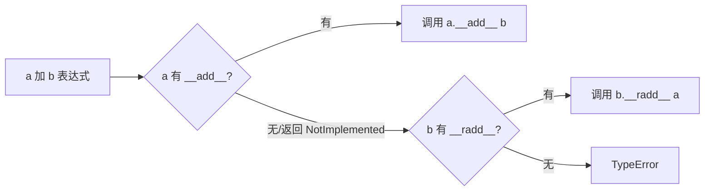
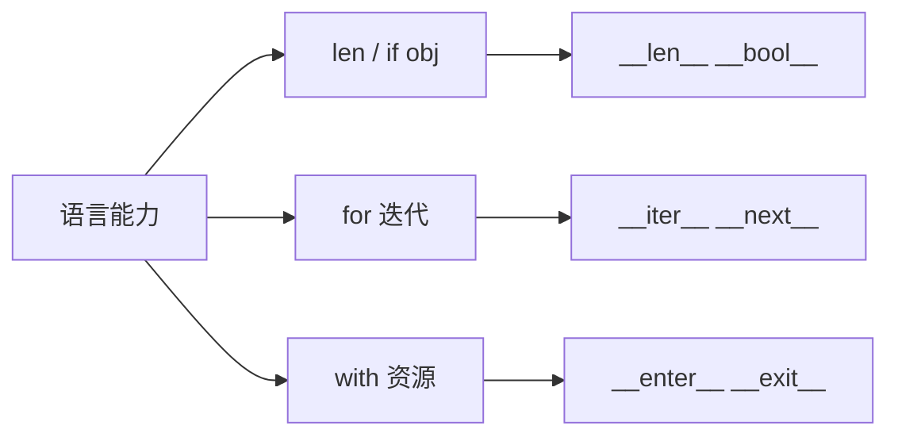

# 魔法方法与鸭子类型：Python 的协议思维

> 为什么 `len(obj)`、`for x in obj`、`a + b` 能作用在千百种不同的对象上？答案不是继承某个「父类接口」，而是**协议**：实现约定的双下方法（dunder），对象就获得了语言级能力。「看起来像鸭子、叫起来像鸭子，那它就是鸭子」——这篇讲 Python 抽象的真正底层。

## 一句话摘要

**魔法方法（`__xxx__`）是语言运算符与内建函数的钩子**：`len()` 调 `__len__`、`+` 调 `__add__`、`for` 调 `__iter__/__next__`、`print` 调 `__str__`。**鸭子类型**是这个机制的哲学面：类型检查不问「你是谁」（类继承），只问「你会什么」（有没有实现协议）——这让任何自定义类都能无缝接入语言内建能力。

## 🎯 本文核心

**核心机制一句话**：双下方法是语言运算符的钩子——`len()` 分发到 `__len__`、`+` 分发到 `__add__`；鸭子类型 = 只看形状不看出身。

**机制链**：运算符/内建 → 协议分发 → 魔法方法 → （类型不合）反射版 `__rxxx__`。协议思维是 Python 抽象架构的上下游总线：任何自定义类实现了协议，就接入了语言级能力——模块边界由「你实现了什么」划出，不由「你继承谁」划出。



## 典型使用场景

```python
class Playlist:
    def __init__(self, songs):
        self._songs = list(songs)

    def __len__(self):              # len(pl) 可用
        return len(self._songs)

    def __getitem__(self, i):       # pl[i] 切片/遍历全通
        return self._songs[i]

    def __repr__(self):             # 交互式显示（开发者向）
        return f"Playlist({self._songs!r})"

    def __contains__(self, song):   # in 运算
        return song in self._songs

pl = Playlist(["a", "b"])
len(pl), pl[0], "a" in pl           # 全部开箱即用
```

**只实现 `__getitem__` 就能被 for 遍历**——旧式迭代协议的存在让最小实现也立即接入语言（演进：`__iter__/__next__` 是现代标准，`__getitem__` 是兼容后门）。`__repr__` vs `__str__` 的分工：repr 给开发者（应无歧义，最好能重建对象）、str 给用户（可读性优先）——只实现一个时实现 repr（str 会回退到它）。

## 机制：协议如何被语言消费

`a + b` 的执行顺序：先试 `a.__add__(b)` → 类型不合再试 `b.__radd__(a)`（反射版）→ 都没有才 TypeError。**为什么要有 radd**——让自定义类型能参与「自定义对象在右」的运算（`3 * vector`）。这套「运算符即方法」的机制直接来自 C++ 运算符重载的演进反思：Python 把重载范围限定在双下方法、语义必须合理（不要用 `+` 做删除），在表达力与可读性之间取了平衡。

**鸭子类型与显式协议的分界**：纯鸭子类型零声明、零依赖，但「实现没对齐」只在运行时爆炸；`collections.abc` 的抽象基类（`isinstance(x, Iterable)`、继承 `Registerable`）提供**形式化验证 + register 注册**的中间态——现代 Python 的惯例：**运行时鸭子 + 静态注解（typing.Protocol，3.8+，结构化类型）双轨**，Protocol 让类型检查器也按「形状」判断（演进方向：鸭子类型正在被静态化，与 TS 之于 JS 的行业趋势同构）。

## 与其他语言的区别（跨语言视角）

Java 的 interface 是「先声明契约再实现」；Go 的 interface 是「实现即满足」（编译期鸭子类型）；Python 是「实现即满足（运行时）+ Protocol（静态检查）」——三种语言代表了**契约时点的三个阶段：编译前 / 编译期 / 运行时**。理解这个光谱，看任何语言的抽象机制都有了坐标系。



## 常见误区

- ❌ 「双下方法要手动调用」——`obj.__len__()` 直接调是反模式；用 `len(obj)`，让语言走协议分发；
- ❌ 「实现魔法方法越多越好」——只实现**语义真实成立**的方法：没有顺序概念的对象实现 `__lt__` 就是埋雷；
- ❌ 「`__str__` 随便返回格式」——调试输出全靠它，惯例格式 `<ClassName(字段=值)>`；
- ❌ 「鸭子类型 = 不用写类型注解」——注解描述期望形状（`def process(items: Iterable[Item])`），鸭子照飞，检查器护航。

## 代价与边界

协议松散的代价：错误延迟到运行时（调 `__len__` 时才发现没实现）——ABC/Protocol/类型注解是补偿链。运算符重载被滥用的代价：语义诡异的代码（`user + order`？）——**重载前问一句：这个运算符在业务里有没有自然的数学隐喻**。

## 上手机会（今天就能试）

```python
class Money:
    def __init__(self, cents): self.cents = cents
    def __add__(self, other): return Money(self.cents + other.cents)
    def __repr__(self): return f"¥{self.cents / 100:.2f}"

print(Money(1050) + Money(250))    # ¥13.00 —— 运算符为业务语义服务
```

## 💡 实战提示

- 只实现 __getitem__ 就能被 for 遍历、能切片——最小协议撬动最大语言能力，试一次就懂鸭子类型。
- repr 给开发者（无歧义）、str 给用户（可读）——只写一个时写 repr。

## 你们可能会问

**鸭子类型和接口的区别？**
契约时点不同：interface 编译期声明、鸭子类型运行时看形状——typing.Protocol（3.8+）把静态检查补给了鸭子。

**运算符重载会被滥用吗？**
会——纪律是只重载有自然数学隐喻的运算符，user + order 这种没有隐喻的别写。

## 自测三问

1. `len(x)` 背后发生了什么？（协议分发到 `x.__len__`）
2. 鸭子类型与 interface 的契约时点差异？（运行时形状 vs 编译期声明）
3. repr 和 str 各给谁看？（开发者无歧义 / 用户可读；只写一个写 repr）

## 5W 速记卡

| 问题 | 答案 |
|---|---|
| What | 双下方法 = 语言能力钩子；鸭子类型 = 形状判断 |
| Why 协议 | 任意类无缝接入 len/for/+ /in 等语言机制 |
| 常用 | `__init__/__repr__/__len__/__getitem__/__iter__/__add__/__enter__/__exit__` |
| 静态化 | typing.Protocol（3.8+）给鸭子类型补类型检查 |
| 纪律 | 只重载语义自然的运算符 |

## 开放问题

- Protocol 静态化鸭子类型后，「运行时形状检查」（isinstance 与 hasattr）的使用边界该怎么重划？

**核心带走**：魔法方法 = 运算符钩子、鸭子类型 = 形状判断、Protocol = 静态补偿。失效点——语义不成立的运算符重载、直接手调双下方法。金句：**看起来像鸭子就是鸭子——Python 的抽象不问出身，只问能力。**

**决策**：何时实现魔法方法——业务对象确有对应语义（容器/运算/上下文）；何时不用——只为「看起来高级」的重载。取舍：协议实现越多，与语言内建的耦合越深，语义错误的面越大。

## 📌 数据与事实声明

- 双下方法协议、`__radd__` 反射运算、typing.Protocol（PEP 544）为公开语言规范；三语言契约时点对比为语言规范层面的公开事实。

## 📚 参考资料

- Python 官方文档：Data Model（魔法方法全景的唯一权威）
- PEP 544——Protocol：结构化子类型
- 《流畅的 Python》第 1、11、14 章
