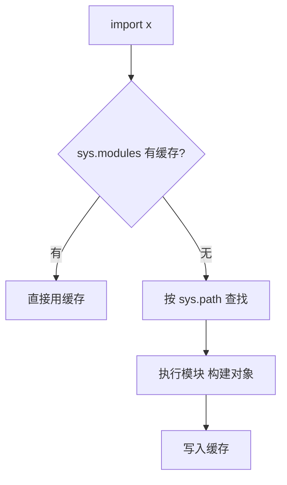
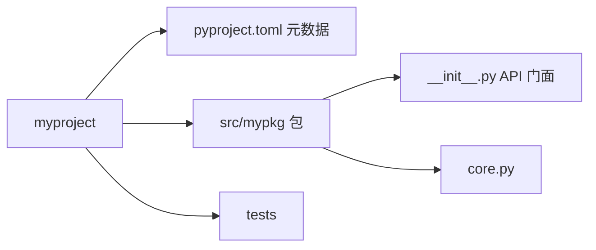

# 模块与包：import 背后的机制

> 「ModuleNotFoundError」和「循环导入」是 Python 工程化路上的两座大山——它们都不是运气问题，是 import 机制没吃透。这一篇讲清：模块是什么、包怎么组织、import 的查找顺序、以及项目目录怎么摆才不坑自己。

## 一句话摘要

**模块 = 一个 .py 文件**（一个独立的命名空间，模块级变量天然是单例），**包 = 带 `__init__.py` 的目录**（组织多个模块）。import 的机制是「**查找 → 执行 → 缓存**」：按 `sys.path` 找到文件，**执行一遍**模块代码，把模块对象放进 `sys.modules` 缓存——第二次 import 直接拿缓存，这就是「模块级代码只跑一次」的机制根源。

## 🎯 本文核心

**核心机制一句话**：import = 查 sys.modules 缓存 → 按 sys.path 查找 → 执行模块并缓存——模块代码只执行一次，模块级变量天然单例。

**机制链**：import 语句 → 缓存命中？→ 路径查找 → 执行构建模块对象。这条链解释了两大经典坑的架构根源：循环导入（执行中途依赖未完成的模块）与名字遮蔽（本地目录在查找链上游）——模块系统是工程代码的骨架，上下游依赖方向就是模块边界的画法。



## 典型使用场景

```python
import json                     # 标准库
import numpy as np              # 三方库 + 别名惯例
from pathlib import Path        # 从模块取名字（直接绑定）
from .models import User        # 相对导入（包内使用）
from mypkg import utils         # 绝对导入（工程首选）
```

**项目布局惯例**（src 布局，现代工程主流）：

```
myproject/
├── pyproject.toml              # 项目元数据与依赖声明（演进：取代 setup.py）
├── src/
│   └── mypkg/
│       ├── __init__.py         # 包标识 + 可做公共 API 出口
│       ├── core.py
│       └── cli.py
└── tests/
```

## 机制：import 的三步与两个经典坑

**三步**：① 查 `sys.modules` 缓存（命中直接用——**模块代码只执行一次**，模块级变量天然单例）② 按 `sys.path` 顺序查找（脚本所在目录 → PYTHONPATH → site-packages；`python -m pkg` 的当前目录语义差异是「本地包遮蔽标准库名」事故的来源）③ 找到后**执行文件**构建模块对象并缓存。

**坑一：循环导入**。a.py imports b，b.py imports a——第一次执行 a 时去执行 b，b 又要 a（此时 a 还没执行完、属性不全）→ ImportError。**机制解法**：循环依赖说明分层有问题，正解是**抽出第三模块**（把公共依赖下沉）；工程手段有「函数内延迟 import」（用到才导入，能救急不治本）。

**坑二：名字遮蔽**。自己写了 `json.py`，`import json` 导入的是自己的文件（脚本目录在 sys.path 最前）——**永远不要用标准库名命名自己的模块**，这是经典自坑。

**`__init__.py` 的两个作用**：标记目录为包（命名空间包的例外情形不展开）；**作为包的 API 门面**——`from mypkg import User` 之所以能用，是因为 `__init__.py` 里 `from .core import User`（把内部结构包装成干净出口，内部重构不破坏调用方）。

## 与其他语言的区别（跨语言视角）

Java 的 import 是「声明全限定名」（类路径由 classloader 管），Python 的 import 是「执行文件并缓存模块对象」——**Python 的模块是运行时对象**（可以 inspect、可以动态改），Java 的类是静态编译单元；JS 的 ESM 与 Python 最接近（模块即对象/文件执行一次）。理解「执行一次 + 缓存」这个共同点，三语言的模块行为就都通了。



## 常见误区

- ❌ 「import 会重复执行模块」——有 sys.modules 缓存，只执行一次；重复执行是 reload 的特殊场景；
- ❌ 「`from x import *` 方便」——污染当前命名空间、掩盖名字来源、工具失明；工程代码明令禁止；
- ❌ 「相对导入随便用」——`from .x import y` 只在包内合法，脚本直接运行会报「attempted relative import」；应用代码首选绝对导入；
- ❌ 「`__init__.py` 必须为空」——它正是做 API 出口和包级初始化的地方，空着只是默认选择。

## 代价与边界

模块级单例的代价：模块级可变状态是隐藏的全局变量（测试互相污染的常见根源）——**模块只放常量与定义，可变状态装进类/函数**。缓存机制的代价：改了模块代码 REPL 里不生效（要 importlib.reload）——「改了没反应」先怀疑缓存再怀疑人生。

从 setup.py 到 pyproject.toml、从隐式命名空间到 PEP 420——Python 打包体系十年间的演进全部指向「声明式、标准化」。

## 上手机会（今天就能试）

```bash
mkdir -p demo/pkg && cd demo
echo "VALUE = 42" > demo_pkg_dir.py 2>/dev/null
cat > pkg/__init__.py <<'EOF'
from .core import greet
EOF
cat > pkg/core.py <<'EOF'
def greet(name): return f"hi {name}"
EOF
python3 -c "from pkg import greet; print(greet('world'))"
```

## 💡 实战提示

- 永远不要用标准库名命名自己的模块——脚本目录在 sys.path 最前，json.py 会遮蔽真 json。
- 循环导入的正解是下沉公共依赖到第三模块——函数内延迟 import 只能救急。

## 你们可能会问

**__init__.py 里该写什么？**
包的 API 门面（from .core import User）与包级初始化——外部只见干净出口，内部随便重构。

**import * 为什么被禁止？**
污染命名空间、掩盖名字来源、静态工具失明——工程代码的明令禁区。

## 自测三问

1. import 的三步是什么？（查缓存 → 按 sys.path 找 → 执行并缓存）
2. 循环导入的机制根源与正解？（执行中途再依赖对方未完成的模块；下沉公共依赖）
3. `__init__.py` 的工程价值？（包标识 + API 门面）

## 5W 速记卡

| 问题 | 答案 |
|---|---|
| What | 模块=文件（命名空间单例）；包=目录（API 门面） |
| Why 缓存 | 模块代码只执行一次（sys.modules） |
| 布局 | src 布局 + pyproject.toml（现代惯例） |
| 坑 | 循环导入（下沉解）/ 名字遮蔽（避标准库名） |
| 纪律 | 禁 import *；可变状态不进模块级 |

## 开放问题

- 命名空间包（无 __init__.py）在大型 monorepo 里的实践成熟度如何？值得在工程化专题里验证。

**核心带走**：import 三步（缓存/查找/执行缓存）、模块即单例、包即 API 门面。失效点——循环导入、名字遮蔽、import * 污染。金句：**模块系统是工程的地基——依赖方向画对，一半的架构问题就不存在。**

**决策**：何时用相对导入——包内部模块互引；何时用绝对导入——跨包引用与应用代码（默认选择）。怎么选：公开 API 走 __init__ 门面，内部细节不外泄。

## 📌 数据与事实声明

- import 三步机制、sys.modules、名称遮蔽为 Python 语言参考公开语义；src 布局与 pyproject.toml（PEP 517/518/621）为公开工程规范。

## 📚 参考资料

- Python 官方文档：The import system（最详尽的机制章节）
- Python 打包权威指南（packaging.python.org）
