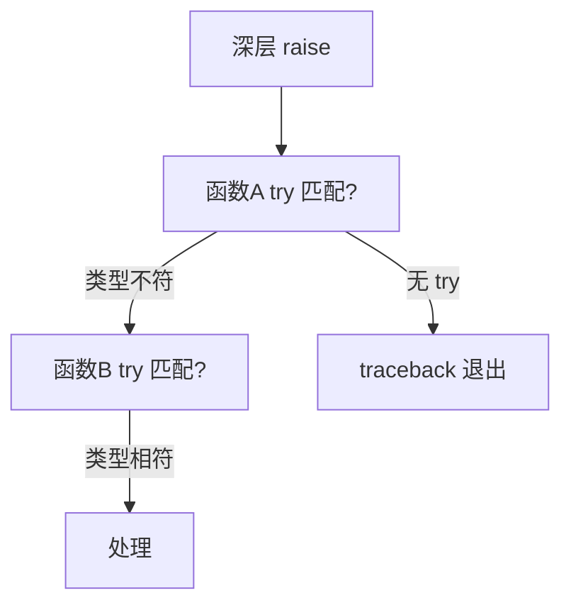
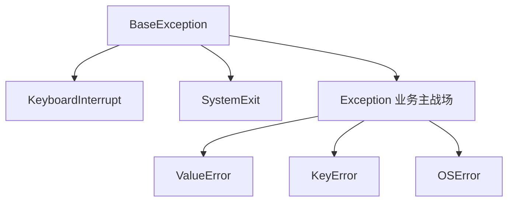

# 异常处理：EAFP 风格与异常的层次

> 「先检查再使用」还是「先干再接错」？Python 用整个语言设计投了后者一票（EAFP：Easier to Ask Forgiveness than Permission）。这一篇讲异常的层次结构、try 的正确姿势、以及「捕获 Exception 到底错在哪」。

## 一句话摘要

Python 的异常是**带类层次的错误对象**：所有异常继承 `BaseException`（业务层关心的是其下的 `Exception` 分支）。惯例是 **EAFP 风格**——直接尝试操作、捕获具体异常类型，而不是预先层层 if 检查；try 的粒度纪律是「**只包可能出错的那一句，只捕会发生的类型**」。

## 🎯 本文核心

**核心机制一句话**：异常沿调用栈向上冒泡、逐层 except 按类层次匹配——没人接住则 traceback 终止程序。

**机制链**：raise → 逐层栈帧匹配 except → 未捕获 → 解释器打印 traceback 退出。异常的架构角色是「错误传播的专用通道」：它把错误处理从正常流程的上下游里剥离出来——EAFP 风格（直接试、接住具体异常）就是这个通道的正确用法。



## 典型使用场景

```python
# EAFP：直接试，接住具体错误
try:
    config = json.loads(raw)
except json.JSONDecodeError as e:      # 捕具体类型（好）
    print("配置非法:", e)
    raise                              # 处理不了就重抛——吞掉才是事故源头

# 自定义异常：表达业务语义
class InsufficientBalance(Exception):
    """余额不足"""

def withdraw(account, amount):
    if amount > account.balance:
        raise InsufficientBalance(f"余额 {account.balance} < {amount}")
    account.balance -= amount

# 资源清理：finally 与 with（篇 14 展开）
try:
    risky()
except (ValueError, KeyError):        # 元组捕多类
    handle()
finally:
    cleanup()                         # 无论成败必跑
```

## 机制：异常层次与传播

**层次**：`BaseException` → `Exception`（业务捕获的主战场）→ 具体异常（ValueError/KeyError/OSError…）。**为什么业务代码不该捕 BaseException**——`KeyboardInterrupt`（Ctrl+C）与 `SystemExit` 也在其下，捕掉它们 = 程序杀不死；`except Exception` 也只应出现在「日志后重抛」的边界层。

**传播机制**：异常沿调用栈向上冒泡，每一层 try 都有机会接手；没人接则解释器打印 traceback 退出。**traceback 是伙伴不是敌人**——它从底（出错点）到顶（入口）完整回放传播路径，读 traceback 的顺序是「从最后往第一行读」：最后一行是异常类型与信息，往上是每一层调用现场。

**raise 的三种形态**：`raise E("msg")`（新抛）、`raise`（裸重抛——保留原 traceback，**处理不了时的正确姿势**）、`raise NewError(...) from e`（异常链——把底层原因显式挂在新异常上，`__cause__` 可追溯；「转换异常类型时永远用 from 保留因果」是调试友好性的关键惯例）。

## 与其他语言的区别（跨语言视角）

Java 受检异常（必须声明/捕获）在业界争议中败退（Kotlin 干脆移除），Go 用返回值 error 走「显式检查」路线，Python/JS/Rust(panic 之外) 走异常/Result——**错误处理的两大流派（异常 vs 返回值）各有胜场**：异常让主流程干净（EAFP），返回值让错误显式（Go 风格 if err != nil）。Python 社区的共识纪律：**异常用于「异常情况」，可预期的分支（如键可能不存在）用返回 None/默认值**——异常当控制流是性能与可读性的双输。



## 常见误区

- ❌ `except:` 裸捕——连 SystemExit/KeyboardInterrupt 都吞，生产程序「杀不死」的经典原因；
- ❌ `except Exception: pass` 静默吞——错误消失于无形，排查时无从下手；至少记日志，处理不了就 raise；
- ❌ 「try 包一大段」——粒度越大，越说不清谁抛的、越容易误捕；只包最可能炸的那一句；
- ❌ 「自造异常继承 BaseException」——业务异常继承 Exception（或更贴近的子类）；
- ❌ 「finally 里 return」——会吞掉未处理的异常（finally 的返回值覆盖一切），finally 只做清理。

## 代价与边界

异常的代价：抛接比正常返回慢（构造 traceback 有成本）——**高频路径的可预期分支不要用异常做控制流**（如循环里逐元素 try/except 转换，正解先校验或用 dict.get）。语义边界：EAFP 不是「不检查」，而是「检查交给异常机制」——`d["k"]` 的 KeyError 就是「检查」本身。

受检异常（Java）被社区放弃、Go 坚持返回值、Rust 用 Result 类型——错误处理的三种演进路线里，Python 的异常 + EAFP 是「主流程干净」路线的代表。 异常传播路径就是调用栈的架构倒影：边界层（入口/任务队列）捕宽、核心层捕窄并重抛——层次即策略。 异常 vs 返回值的权衡本质是「控制流谁来写」：异常让主流程干净但错误路径隐式，返回值相反——按调用频率选。

## 上手机会（今天就能试）

```python
def parse_int(s):
    try:
        return int(s)
    except ValueError as e:
        raise ValueError(f"不是合法整数: {s!r}") from e   # 异常链

try:
    parse_int("abc")
except ValueError as e:
    print(e.__cause__)           # 看到被链住的原始原因
```

## 💡 实战提示

- 处理不了的异常裸 `raise` 重抛——保留完整 traceback，吞掉才是事故的源头。
- 转换异常类型时用 `raise NewError(...) from e`——异常链保留因果，排查时能追到底。

## 你们可能会问

**为什么业务层禁止 except 裸捕？**
裸 except 连 KeyboardInterrupt/SystemExit 都吞——程序「杀不死」的经典原因；至少捕 Exception。

**try 块应该多大？**
只包可能出错的那一句——粒度大则说不清谁抛的，还会误捕不相关的异常。

## 自测三问

1. 为什么业务层不该捕 BaseException？（会吞 KeyboardInterrupt/SystemExit）
2. 裸 raise 的价值？（保留原 traceback 重抛——处理不了时的正确姿势）
3. 异常链怎么建？（`raise New(...) from old`——保留因果可追溯）

## 5W 速记卡

| 问题 | 答案 |
|---|---|
| What | 类层次的错误对象 + EAFP 风格 |
| Why EAFP | 主流程干净；「直接试」是 Python 设计哲学 |
| 纪律 | 捕具体类型 / try 最小粒度 / 处理不了就 raise |
| 异常链 | raise ... from ...（因果保留） |
| 边界 | 异常不做高频控制流（慢且可读性差） |

## 开放问题

- Go 的显式 error 返回与 Python 的异常路线，在 AI 生成代码时代哪种更不易被模型写错？值得观察。

**核心带走**：冒泡传播 + 类层次匹配 + EAFP 风格。失效点——裸 except、静默吞、try 包全段、finally 里 return。金句：**异常是错误的专用通道——通道塞满正常逻辑，错误就再也传不出去了。**

**决策**：何时抛异常——调用方无法通过返回值合理表达的失败；何时用返回值——可预期的常态分支（查无此键返回 None）。取舍：异常的代价（栈展开）决定它只属于「异常」。

## 📌 数据与事实声明

- 异常层次（BaseException/Exception）、`from` 语法（PEP 3134）、裸 raise 语义为公开语言规范；Go/Kotlin 的错误处理演进为公开语言史实。

## 📚 参考资料

- Python 官方文档：Errors and Exceptions / 内建异常层次图
- PEP 3134——异常链
