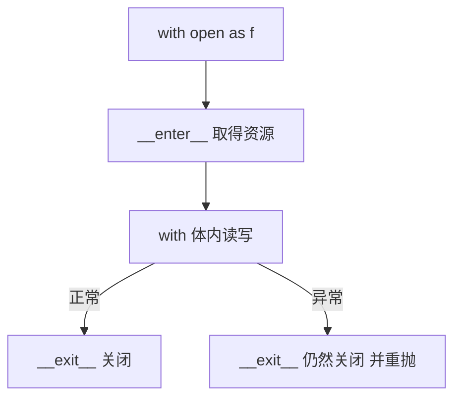
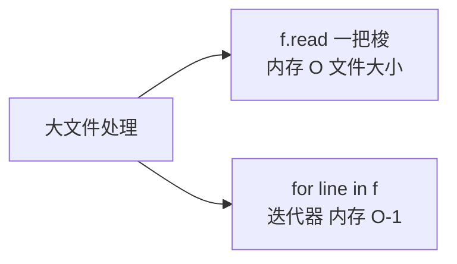

# 文件与 IO：with 上下文管理器的日常

> 读文件只需要一行 `open(path).read()`，但写对文件处理需要理解三件事：**文本模式与二进制模式的分界**、**with 的资源保证机制**、以及**路径处理为什么该用 pathlib**。这一篇是文件 IO 的机制课，不是函数清单。

## 一句话摘要

Python 文件操作的核心纪律：**用 `with open(...)` 管资源**（上下文管理器保证异常时也关闭——机制是 `__enter__/__exit__` 钩子），**文本模式永远显式 encoding**（篇 4 的规矩在文件上的落点），**路径用 pathlib 的 Path 对象**（跨平台分隔符 + 面向对象 API，演进取代 os.path 字符串拼接）。

## 🎯 本文核心

**核心机制一句话**：with 通过 `__enter__/__exit__` 协议保证资源无论成败必被释放；文件对象本身是迭代器，逐行读内存 O(1)。

**机制链**：open → 文件对象（文本模式带编解码层 / 二进制模式原始字节）→ with 的 `__exit__` 兜底关闭。文件 IO 在程序架构里是「内存世界与磁盘世界的上下游口岸」——所有读写都要过这条边界，with 与显式 encoding 就是边界的两条海关纪律。



## 典型使用场景

```python
from pathlib import Path

# 文本读（显式编码是纪律不是建议）
text = Path("data.txt").read_text(encoding="utf-8")

# 大文件逐行（迭代器式，内存 O(1)——不会把 10GB 装进内存）
with open("big.log", encoding="utf-8") as f:
    for line in f:                    # 文件对象本身是迭代器
        process(line)

# 写
with open("out.txt", "w", encoding="utf-8") as f:
    f.write("hello\n")

# 二进制（图片/网络载荷——字节世界，没有编码概念）
raw = Path("logo.png").read_bytes()

# pathlib 路径操作
cfg = Path.home() / "configs" / "app.yaml"   # 用 / 拼路径，跨平台
cfg.exists(), cfg.suffix, cfg.parent
```

## 机制：with 与文件迭代

**with 的机制**（链回篇 10 的协议思维）：`open(...)` 返回的文件对象实现 `__enter__`（返回自己）与 `__exit__`（关闭文件）；with 语句保证**无论 try 成功还是异常，`__exit__` 必被调用**——所以「忘记 close 导致句柄泄漏」在 with 下结构性消失。为什么不用手动 close——人一定会忘，异常路径更会忘；**资源安全要靠语言机制，不能靠自觉**（这是 try/finally 的语法糖化演进：with = 自动化的 try-finally）。

**文件对象是迭代器**（篇 7 迭代协议的落地案例）：`for line in f` 逐行惰性读——内存占用与文件大小无关。这是「处理 10GB 日志」的正确姿势；`f.read()` 一把梭才是内存事故。

**文本 vs 二进制的分界**：文本模式（默认）＝ 字节流 + 编解码层（读写的是 str，自动按 encoding 转换）；二进制模式（`"rb"`）＝ 原始 bytes 原样进出。**判断口诀：内容给人看的用文本模式（要 encoding），给机器处理的用二进制模式（自己管编码）**。

## 与其他语言的区别（跨语言视角）

Java 的 try-with-resources、C# 的 using、Go 的 defer close——**「作用域绑定资源生命周期」是全行业的演进共识**，Python 的 with 是其中语法最轻的（没有 try 噪音、没有 defer 的远距离绑定）。pathlib 之于 os.path，等价于语言层「字符串路径 → 路径对象」的行业性演进（Node 的 path → URL、Rust 的 PathBuf 同向）。



## 常见误区

- ❌ 「`open()` 不关也没事，GC 会收」——CPython 引用计数会提前回收，但这只是实现细节不是承诺（换解释器/延迟回收就漏句柄）；with 是唯一正确姿势；
- ❌ 「读写模式记不清就加 +」——`"w"` 是**清空重建**（一打开就截断！）、`"a"` 追加、`"r+"` 读写不改长度——`"w"` 误用是「文件打开就空了」事故的来源；
- ❌ 「字符串拼路径 + 反斜杠」——Windows/Linux 分隔符与转义双坑；pathlib 的 `/` 运算符一了百了；
- ❌ 「逐行读大文件用 readlines()」——`readlines()` 全量载入内存（与 read 同级事故）；迭代器式 for line in f 才是流式。

## 代价与边界

文件 IO 是系统调用，成本数量级远高于内存操作——**高频小文件读写是性能反模式**（批量合并、缓冲）。文本模式的换行处理（universal newlines 把 `\r\n` 归一成 `\n`）在处理 Windows 产出的原始文件时要留意（二进制模式可看到真实字节）。并发写同一文件没有原子性保证——多进程写日志用 logging 模块的队列方案而不是裸 open。

with 上下文管理器是资源生命周期的架构约定：打开（__enter__）→ 使用 → 必然清理（__exit__）——上下游只有一条通道，句柄泄漏在结构上不可能。 缓冲带来的性能与「数据何时落盘」的确定性之间有权衡——关键数据显式 flush/close，日志类交给缓冲。

## 上手机会（今天就能试）

```python
from pathlib import Path
p = Path("demo.txt")
p.write_text("第一行\n第二行\n", encoding="utf-8")   # pathlib 的一把梭 API
for i, line in enumerate(p.open(encoding="utf-8"), 1):
    print(i, line.strip())
```

## 💡 实战提示

- readlines() 会把整个文件载入内存——大文件一律 `for line in f` 迭代器式流式处理。
- open('x', 'w') 打开的一瞬间就清空文件——误用 'w' 是「文件打开就空了」事故的全部来源。

## 你们可能会问

**为什么必须 with 而不是手动 close？**
异常路径下手动 close 会漏；with 的 __exit__ 由语言保证必调——资源安全靠机制不靠自觉。

**文本模式和二进制模式怎么选？**
内容给人看的用文本（自动编解码，显式 encoding）；给机器处理的用二进制（bytes 原样进出）。

## 自测三问

1. with 的资源保证机制是什么？（`__enter__/__exit__` 协议，异常路径也必关）
2. `"w"` 模式打开的一瞬间发生了什么？（清空截断——误用事故源头）
3. 10GB 日志怎么处理？（文件对象迭代器逐行读，绝不 read/readlines）

## 5W 速记卡

| 问题 | 答案 |
|---|---|
| What | with open + pathlib 的文件处理组合 |
| Why with | 语言机制保证关闭，异常路径不漏句柄 |
| 模式口诀 | 文本（str+encoding）给人类；二进制（bytes）给机器 |
| 路径 | Path 对象 + / 拼接，告别字符串拼接 |
| 大文件 | for line in f 流式，readlines 是内存事故 |

## 开放问题

- 多进程并发写同一文件没有原子性保证——logging 队列方案之外，社区还会演化出什么标准答案？

**核心带走**：with 保证关闭、文件对象即迭代器、pathlib 管路径。失效点——w 模式误清空、readlines 大文件、字符串拼路径。金句：**资源安全靠语言机制——with 不是语法糖，是 try-finally 的制度化。**

**决策**：何时用文本模式——内容最终给人看（配 encoding）；何时用二进制——图片/网络载荷/自己管编码。取舍：文本模式省心但受编码层行为（换行归一）影响。

## 📌 数据与事实声明

- 上下文管理协议（`__enter__/__exit__`）、universal newlines、文件模式语义为公开语言规范；pathlib（PEP 428）为公开标准库规范。

## 📚 参考资料

- Python 官方文档：Reading and Writing Files / pathlib
- PEP 343——with 语句的机制正源
