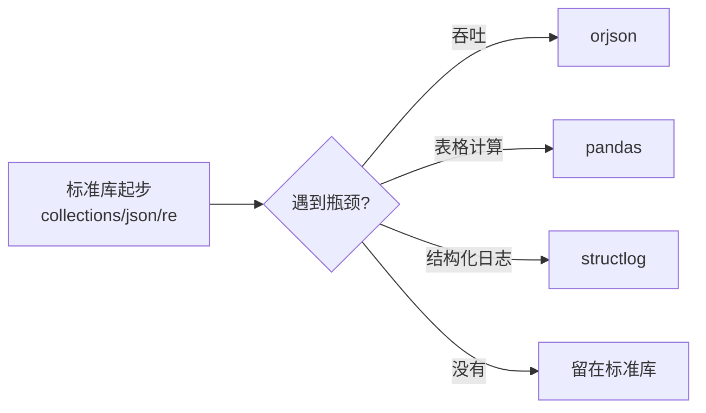
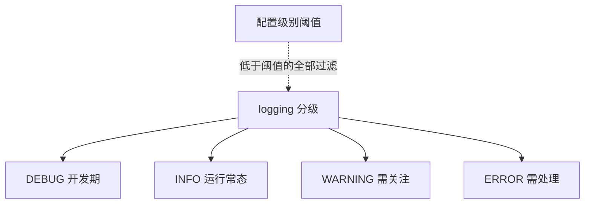

# 常用标准库：内置电池的精选装备

> 「batteries included」是 Python 的设计承诺——但标准库 200+ 个模块，新手该先装哪几节电池？这一篇选日常出现率最高的七个模块，每个讲「解决什么问题 + 最小用法 + 什么时候升级到三方库」，当工具书用。

## 一句话摘要

标准库的精选七件套：**collections**（高级容器）、**itertools**（迭代器 algebra）、**json**（数据交换）、**datetime**（时间）、**pathlib**（路径，篇 13 已讲）、**re**（正则）、**logging**（日志）。共同点：**它们解决的都是「每天都会遇到」的问题，且是各自领域经过了二十年演进的稳定答案**——新代码从标准库起步，性能或功能不够再升级三方库。

## 🎯 本文核心

**核心机制一句话**：标准库七件套（collections/itertools/json/datetime/re/logging/pathlib）是各领域的「下限保证」——零依赖、API 二十年稳定。

**机制链**：标准库解决每日高频问题 → 性能或专业深度不够时升级三方（依赖即负债）。选型架构上，标准库与三方生态是上下游关系：先标准库起步，出现明确瓶颈再换专业库——这条升级路径本身就是 Python 技术栈的模块边界。



## 典型使用场景（每件 30 秒）

```python
# collections：计数与分组的官方答案
from collections import Counter, defaultdict
Counter("banana").most_common(2)        # [('a', 3), ('n', 2)]
groups = defaultdict(list)              # 键不存在自动建默认值
groups["even"].append(2)                # 免去「先判断键在不在」

# itertools：组合迭代的积木（惰性、零中间列表）
from itertools import chain, groupby, islice
list(islice(chain([1, 2], [3, 4]), 3))  # [1, 2, 3]

# json：与 Web 世界对话
import json
json.dumps({"a": 1}, ensure_ascii=False)   # '{"a": 1}'（中文不转义）
json.loads('{"a": 1}')

# datetime：时间的第一课是「分清两类」
from datetime import datetime, timezone
naive = datetime(2026, 9, 10)                 # 无时区（naive）
aware = datetime(2026, 9, 10, tzinfo=timezone.utc)  # 有时区（aware）
now = datetime.now(timezone.utc)              # 服务端时间一律 UTC + aware

# re：正则先编译
import re
pat = re.compile(r"\d{4}-\d{2}-\d{2}")        # 复用场景先 compile
pat.findall("due 2026-09-10, ok 2026-01-01")

# logging：print 的成年形态
import logging
logging.basicConfig(level=logging.INFO, format="%(asctime)s %(levelname)s %(message)s")
logging.info("服务启动")                       # 分级/时间戳/可输出到文件
```

## 机制：两个值得记住的设计

**defaultdict 为什么快**——它把「键不存在」的处理从「业务代码 if 判断」下沉到「容器自己的工厂函数」（`defaultdict(list)` 缺键自动 `[]`）——机制上是 `__missing__` 魔法方法（篇 10）的应用。Counter 同理（dict 子类 + 计数特化）。

**logging vs print 的分界**：print 是「写给此刻的我自己看」（REPL/脚本），logging 是「写给运行中的系统看」（分级过滤、时间戳、输出通道可切换、多模块共享一个配置）。**演进纪律：从练习到工程的第一步，就是删掉 print 换 logging**——它把「日志」从语句升级为可管理的子系统（分级 INFO/WARNING/ERROR 让「全量输出」变成「按需过滤」）。

## 升级路线：什么时候换三方库（量级/场景演进视角）

| 标准库 | 升级触发点 | 去处 |
|---|---|---|
| json | 高吞吐序列化/二进制需求 | orjson / msgpack / protobuf |
| datetime | 复杂时区规则/人性化 API | zoneinfo（3.9 已入标准库）/ arrow |
| re | 超复杂文本解析 | 正则可读性崩塌时 → parsel/专用解析器 |
| collections | 表格计算 | pandas |
| logging | 分布式结构化日志 | structlog / 接入采集体系 |

**为什么先标准库**——零依赖（装包即风险：供应链、版本冲突，篇 2）、API 稳定（二十年向后兼容承诺）、文档与社区答案密度最高。**依赖是负债**，每引一个包都要有「标准库为什么不够」的理由。



## 常见误区

- ❌ 「datetime.now() 拿到的就是当前时间」——不带时区的 naive 时间，跨时区部署即错；服务端一律 `datetime.now(timezone.utc)`，展示时再转本地；
- ❌ 「json.dumps 中文变 \uXXXX 是 bug」——默认 ensure_ascii=True 的转义行为，传 `ensure_ascii=False` 即可（文件则注意 encoding）；
- ❌ 「正则能解析 HTML/JSON」——正则不适合递归结构；HTML 用解析器（BeautifulSoup），JSON 用 json 模块；
- ❌ 「log 输出用字符串拼接」——`logging.info("x=%s", x)` 惰性格式化（级别不够时拼接不发生），比 f-string 直接拼更省。

## 代价与边界

标准库的边界是「通用」：专精场景（数值计算/表格/异步 HTTP）必然让位给三方生态——标准库的价值是**下限保证**（不用装任何东西就能干活）与**API 稳定**，性能上限与专业深度是三方库的领地。

标准库的稳定（二十年 API 兼容）与三方库的快演进是一对结构性权衡——标准库选「不犯错」，三方选「走得快」。

## 上手机会（今天就能试）

```python
from collections import Counter
import json, logging
logging.basicConfig(level=logging.INFO)
words = "apple banana apple cherry banana apple".split()
logging.info("词频 top2: %s", Counter(words).most_common(2))
print(json.dumps(dict(Counter(words)), ensure_ascii=False, indent=2))
```

## 💡 实战提示

- 服务端时间一律 `datetime.now(timezone.utc)`——naive 时间跨时区部署必错，存储用 UTC 展示再转本地。
- logging 用惰性格式化 `logging.info('x=%s', x)`——级别不够时拼接不发生，比 f-string 省。

## 你们可能会问

**json.dumps 的中文变 \uXXXX 是 bug 吗？**
不是——默认 ensure_ascii=True 的转义行为；传 ensure_ascii=False 即输出中文。

**为什么先标准库后三方？**
依赖是负债（供应链/版本冲突/升级成本）——每个包都要有「标准库为什么不够」的理由。

## 自测三问

1. defaultdict 的机制是什么？（`__missing__` 钩子，缺键自动工厂建值）
2. naive 与 aware datetime 的区别与纪律？（无时区/有时区；服务端一律 UTC + aware）
3. print 换 logging 的时机与理由？（从练习到工程；分级/时间戳/通道可管理）

## 5W 速记卡

| 问题 | 答案 |
|---|---|
| What | collections/itertools/json/datetime/re/logging 七件套 |
| Why 标准库优先 | 零依赖负债 + API 二十年稳定 |
| 时间纪律 | UTC + aware 存储，展示层转本地 |
| 升级路线 | 性能/功能不够再上三方（依赖即负债） |
| 日志纪律 | logging 惰性格式化 + 分级 |

## 开放问题

- 标准库的「慢节奏稳定」与三方生态的「快演进」如何互补？zoneinfo 入库（3.9）的路径会被更多三方反向复制吗？

**核心带走**：七件套是下限保证，升级路线是架构决策的一部分。失效点——naive datetime、json 中文转义误解、正则解析结构化文本。金句：**依赖是负债——标准库是你不用付利息的那部分。**

**决策**：何时留在标准库——通用场景、依赖敏感项目；何时升级三方——有量级化的性能/功能缺口。怎么选：升级必须有「标准库为什么不够」的具体答案。

## 📌 数据与事实声明

- 各模块行为基于 Python 官方文档；zoneinfo（PEP 615，3.9+）为公开规范；三方库为公开生态信息（非推荐背书）。

## 📚 参考资料

- Python 官方文档：The Python Standard Library（ modules 索引）
- 《Python 标准库》——模块级速查的社区经典
